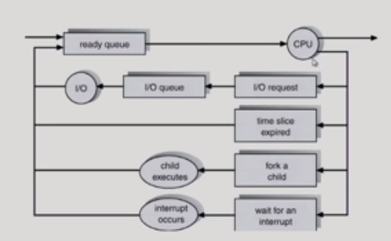
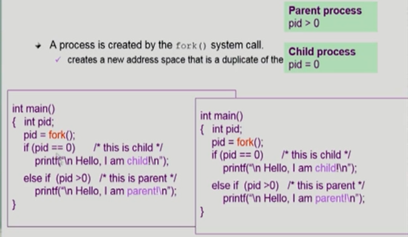

# 03ProcessManagement

## 1. process란?

- 실행중인 프로그램

- #### 프로세스의 문맥(context)?

  - 살아있는 생명체와 비교 ㅋㅋ

  - 현재 프로세스가 어떤 상태에 있느냐? 라는 것

  - cpu를 얼마나 썼는가? 함수 어떤 실행을 했는가? 등등

  - ##### 하드웨어 문맥

    - Program Counter
    - 각종 register

  - ##### 프로세스의 주소 공간

    - code, data, stack(몇개 함수 호출?)

  - ##### 프로세스 관련 커널 자료구조

    - PCB(Process Control Block)
    - kernel stack

## 2. 프로세스의 상태

- ##### Running: 

  - cpu를 잡고 있는 상태

- ##### ready : 

  - cpu를 쓰겠다고 기다리고 있는 프로세스

- ##### blocked(wait, sleep)

  - 오래걸리는 작업때문에 cpu를 얻어봐야 불필요한 상태

  - ex) 디스크에서 file을 읽어와야한는 경우
  - 오래걸리는 작업?
    - 하드웨어
    - 프로세스끼리 같이 쓰는 데이터 = 공유데이터

- ##### Suspended(stopped)

  - 외부적인 이유로 프로세스의 수행이 정지된 상태
  - 메모리가 너무 많이 사용됨 ==> swap out즉 쫒겨난 경우
  - 사람이 돌아가던 프로세스를 정지 시킴

- blocked 와 Suspended와 다른점은 ==> blocked는 실행중인 것이지만 Suspended는 일시정지가 되어있는 것

#### Process Control Block (PCB)

- ##### OS가 관리상 사용하는 정보

  - 프로세스 상태
  - 프로세스 ID
  - 우선 순위에 대한 정보(무조건 순서대로 하는 것이 아니다) => 중요도가 높은 것을 먼저 처리하게 된다.

- ##### CPU 수행 관련 하드웨어 값

  - PC, register
  - Process각각이 PCB가 있는 이유
    - OS가 프로세스의 cpu 권한을 뺏을 때가 있다
    - 즉 뺏기고 다시 돌아왔을 때 어디까지 수행했는지에 대한 정보가 필요하다 
    - 따라서 각각의 Process에 PCB가 존재하게 된다.

- ##### 메모리 관련

  - code, data, stack의 위치 정보

- ##### 파일 관련

## 3. 문맥교환( context switch)

- cpu를 한 프로세스에서 다른 프로세스로 넘겨주는 과정
- 즉 뺏고 뺏기는 것
- 뺏길때는 지금까지 상태를 저장
- 그리고 다음 process를 load해줌
- 본인 차례가 왔을 때 그때 저장했을 때 상태에서 작업 시작

##### 문맥교환과 문맥교환이 일어나지 않을 때

- 문맥 교환이 아닐떄

  - 프로세스 A가 실행중 => interrupt(이건 그냥 wait=> ready상태) or sys call 발생() ==> kernel에서 잠시동안 본인할 일 하고 옴(interrpt 때문) ==> 다시 프로세스 A로 가서 하던 일 마저 함 ==> Context Swift아님

- 문맥 교환일 때(프로세스A => B)

  - 프로세스 A가 실행중 ==> 개 많이 씀 ==> timer 발동 ==> 프로세스 B로 넘어감 ==> 문맥 교환

  - 프로세스 A가 실행중 ==>  IO요청을 받음 ==> 이건 어차피 시간이 겁나 오래걸리는 작업임 ==> 그래서 프로세스에게 권한을 넘김

- 문맥 교환이 있을떄 overhead가 훨씬 크다 (cache memory flush)등등 때문에

## 4. 스케줄러

- 스케줄링을 하는 코드를 그냥 스케줄러라고 한다

#### Long-term scheduler(장기, 메모리 스케줄러)

- 메모리를 어떻게 줄지?
- new가 ready로 될때 바로 되는 것이 아니라 admitted가 되어야 한다
- 이 admitted를 해주는 즉 허락을 해주는 것이 장기 스케줄러가 하게 된다. 
- 하지만 time sharing sys에는 장기 스케줄러가 없음 ==> 그냥 곧바로 ready상태로 넘어가게 된다.
- 즉 현재는 별로....?

- 그럼 메모리 관리를 어떻게 하지??
  - 중기 스케줄러를 이용해서 사용한다.

#### Short-term scheduler(단기, cpu스케줄러)

- cpu를 누구한테 줄지
- 빨라야한다. 

#### Medium-term scheduler(중기 or Swapper)

- 메모리가 굉장히 많이 질 수 있음
- 그래서 아예 메모리에서 쫒아내게 된다.
- 그럼 여유공간을 확보할 수 있음
- degree of Mulitprogrammin을 제어한다. 

- suspended가 추가된 프로세스 상태도

- 외부에서 뺴앗긴 값들은 외부에서 다시 active한 상태로 만들어줘야한다.
- 어떤 프로세스가 자기 코드를 수행 중이면 user mode
- 본인이 할 수 없을 때 system call ==> monitor mode
- 인터럽트
  - 소프트웨어=> system call (trap)
  - 하드웨어 => interrupt
  - 인터럽트는 2개다 이다.

## 5. Thread

- ##### Thread란?

  - A thread is us a basic unit of CPU utilization
  - 즉 CPU 수행 단위를 쓰레드라고 한다.
  - 공유하는 부분 (=task)
    - code
    - data
    - OS resource

- ##### Thread를 쓰는 이유

  - 웹브라우저를 여러개 띄우더라도 어차피 copy일 가능성이기 때문에 각각 프로세스를 해주지 말고 조금더 효율적이게 할 수 있지 않을까?
  - 그래서 thread라는 것을 놓는 것
  - 즉 프로세스를 하나로 만들고 대신에 code는 다를 수 있으니 그것을 각각에 stack에 넣자
  - 그리고 pcb에는 각각의 code에 어느 부분을 수행하고 있는가를 알려준다.

- ##### 장점

  - 응답성이 빠름
  - 자원을 공유할 수 있다.
  - overhead를 줄일수 있음 ==> 경제성이 좋음

  - context switch가 나올때 ==> thread1 => thread2로 넘어갈때 context switch를 할 필요가 없음
  - 따라서 overhead가 일어나지 않는다.
  - cpu가 많을 경우 병렬성이 가능하다
  - 웹브라우져 같은 경우
    - 완전히 완성된 상태(이미지 url, html등등)로 보여주면 cpu는 효율적으로 쓸 수 있음==> block상태에 두고 완성 되면 보여주면 되기 때문에
    - 하지만 user 입장에서는 답답함 ==> block이 풀릴때까지 아무것도 창에 안뜰 것이기 때문에
    - 그래서 그렇게 하지 않고 html왔으면 먼저 보여주고 그다음에 image url 요청 받으면 그거 보여주고 등등 이런 식으로 빠르게 보여 줄 수 있음
    - 이때 사용하는 것이 thread를 이용한다. 
    - 쓰레드가 여러가지가 있으면 비동기식 입출력이 가능해진다. 
    - 즉 병렬식으로 가능
  - ex) 크롬일 경우에는 이렇게 하지 않고 그냥 독립적인 프로세스로 진행한다. 보안 때문에

## 6. 프로세스 생성(Process Creation)

- ##### 특징1

  - 부모 프로세스가 자식 프로세스을 생성
    - 똑같은 복사본인 프로세스가 생성된다는 뜻이다
    - 부모 프로세스가 직접 만드는 것이 아님 ==> system call을 해서 만들게 된다
      - fork( ) 라고 한다

  - 트리(계층 구조) 형성

  - 프로세스는 자원을 필요로 함
    - 운영체제로부터 자원을 받는다
      - 그 자원을 위해 자식과 부모는 싸운다

  - 수행
    - 부모와 자식은 공존하며 수행되는 모델
    - 자식이 종료될 때 까지 부모가 기다리는 모델(blocked)

- ##### 특징 2

  - 주소 공간(Address space)
    - 자식은 부모의 공간을 복사함
    - 자식은 그 공간에 새로운 프로그램을 올림
  - 그럼 다 같은 일을 하는거임??
    - fork를 통해 복제 생성함
    - 새로운 프로 그램을 덮어씌운다 ==> exec()이라고 한다.
  - exit() ==> 종료하겠다 ==> 자원을 다 반납을 하게된다.
    - 그럼 부모 프로세스에 통보함
  - 부모가 강제로 abort하는 경우가 있음(부모가 자식을 없앨 때)
    - ex) 자식이 할당 자원의 한계치를 넘어섬
    - 자식에게 더이상 시킬일이 없을 때
    - 부모가 종료하는 경우
      - 부모가 죽기 전에 자식을 먼저 다 죽임
      - 그리고나서 부모가 종료하게 됨
      - ex) 창을 띄워 놓은 것 = 부모
      - ex) 창 안에 여러 웹페이지가 있는 것 = 자식

### fork() 시스템 콜

- fork( )를 하게 되면 ==> 자기 함수가 그대로 똑같이 복사가 된다

- 그럼 누가 부모???
  - return value가 양수 ==> 부모
  - return value가 0 ==> 자식

### exec( ) 시스템 콜

- 새로운 프로그램으로 덮어 씌워지게 된다. 
- 즉 execlp를 해주면 그 밑에 있는 값은 실행이 안됨
  - 왜??
  - 새로운 프로그램으로 바꿨기 때문이다.
  - fork( )랑 같이 사용됨
  - 어떻게???
    - 자식을 하나 만들어서 다른 프로그램을 돌리고 싶기 때문에
    - 즉 복사 하나 하고 거기에 새로운 프로그램을 돌리게 된다.

