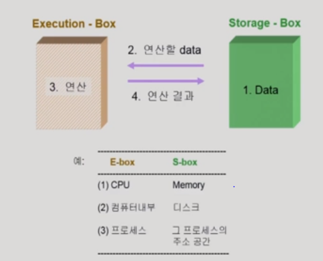
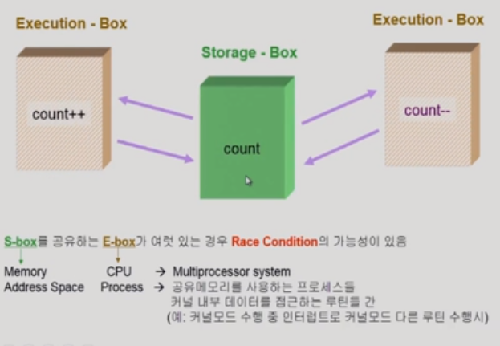
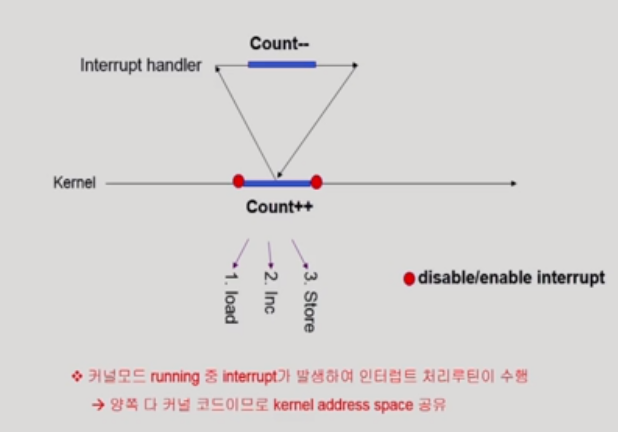
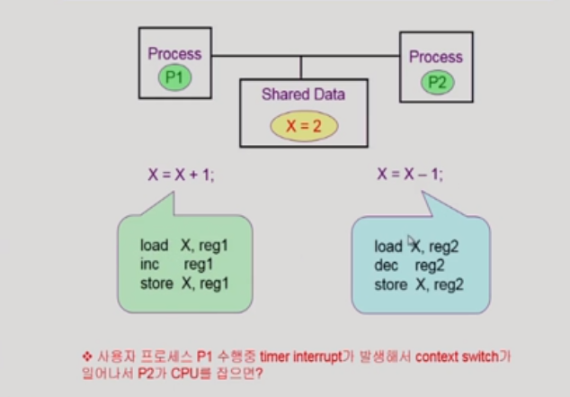
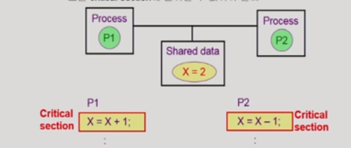
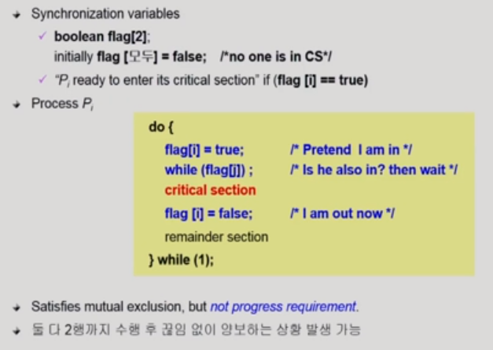

# 05_Process_Synchronization

## 1. 데이터 접근

- 연산을 할때는 뭔가를 읽어와서 함
- 그리고 연산 결과를 내보냄
- 이거 자체만으로는 괜찮음

#### os에서의 race condition

- 하지만 E박스(CPU Process)가 여러게 있을 경우에는
- Race Condition의 가능성이 있음
  - 왼쪽은 +을 함
  - 오른쪽은 - 를 함
  - 한번에 읽어가게 된다면
  - +의 결과를 내기전에 -계산을 하게됨.....?
  - 그럼 꼬이게 된다. 

- ##### 문제가 안생긴다 관점

  - 서로 다른 프로세스끼리는 본인 영역(주소)에 있는 데이터만 접근할 수 있다!!

- ##### 문제가 생긴다 관점 ==> Race Condition

  - 운영체제가 끼어들었을때
  - a 프로그램 실행 중 ==> 본인이 할 수 없는 일을 요청 (시스템 콜)
  - 자신의 할당시간 끝남
  - 이제 프로세스 b로 넘어감 ==> 본인이 할수 없는 일을 요청(시스템콜)
  - b의 요청을 받아들임 
  - 어?? 근데 a의 요청으로 받아들인 데이터를 b의 요청으로 또 주게 됨 (즉 a의 결과를 받기전에 b에게 데이터를 주게 됨)
  - 그럼 어쩌다가 위에처럼 똑같은 문제가 생기게 된다 ==> 꼬이게 됨
  - 즉 운영체제 때문에 이런 문제가 생기게 된다!

- 위에 내용을 다른 그림으로 만들어 놓은 것

- 이것을 어떻게 해결??
  - 커널모드에 CPU가 수행중일때는 CPU를 빼앗기 않음
  - 유저모드로 돌아갈 때! 그때 돌려주자!!

#### os에서 race condition (interrupt)

- 이렇게 되면 똑같이 count -의 값이 반영이 안되게 된다
- 어떻게 해결?
  - ++ 건드리기는 동안에는 interrupt를 받기 않겠다고 선언함
  - 즉 ++를 건드리기 전에 interrupt를 diable시킴

#### os에서의 race condition(multiprocessor)

- 이것은 맨처음 이야기 했던 것 ==> 운영체제에 동시에 접근할 수 있음
- 해결방법
  - 한번에 하나의 CPU만이 커널에 들어갈수 있게 만든다
    - (운영체제 전체를 막는다는 뜻)
    - 이렇게 되면 굉장히 비효율적이 상황이 일어나게 된다.
  - 커널 내부에 있는 각 공유데이터에 접근할 때마다 그 데이터에 대한 lock을 걸어버린다
    - 각각을 lock을 건다는 뜻이다.
    - lock을 어떻게 거는지를 배울 것

#### 

## Process Synchronization

- ##### 공유데이터의 동시 접근으로 생기는 문제 ==> inconsistency (한쪽이 반영 안됨!)

- 이것을 해결하기 위해선
  - 실행 순서를 정해주는 메커니즘이 필요하다

- 고급 언어같은 경우 실행을 시킴
- 그럼 여러개의 기계어로 쪼개져서 계산을 하게 된다.
- 이때 위에 race condition과 같은 문제가 발생할 수 있게 된다.
- 즉 위 그림 빨간글씨처럼
  - 프로세스 P1(왼쪽) 수행중에 timer interrupt가 발생함
  - 그럼 context switch가 일어서 P2가 CPU를 잡음
  - 어? 근데 똑같은 공유데이터를 사용하고 싶어함
  - 그리고 다시 P1으로 돌아갔을 때 P2가 반영이 안되는 상태가 일어날 수 있음

####  The Critical-Section Problem

- N개의 프로세스가 공유데이터를 동시에 사용하기 원하는 경우

- 위 그림에서는 노랑색 박스가 Critical Section이라고 할 수 있음

- 해결??
  - P1이 코드에 들어간다?
  - 그럼 CPU에게 뺏기더라도
  - P2가 Critical section코드에 들어가지 못하게 한다
  - 즉 P1이 Critical section코드에 들어가고 나서 CPU에게 뺏기기 전에 lock을 걸어놓는다

### Algorithm 1

- while ( 나를 가르키는 숫자)
- turn = (상대를 가르치는 숫자)
- critical section에 들어가기 전에 turn을 체크
  - turn은 이번차례는 누구냐?? 를 알려주는 변수이다
  - turn이 0이다 ==> 그럼 위 그림에서는 내 차례
  - 그럼 turn은 누구에 의해서 바뀌냐?
    - 상대방에 의해서 바뀌게 되어 있다
  - 내차례가 아니면 기다림
  - 내차례가 되면 critical  section 수행 후
  - 상대방 turn으로 숫자를 바꿔굼
- 그래서 이게 작동을 함??
  - 동시에 들어가지는 않음
  - 근데 문제가 있음
  - ??
    - 상대방이 내차례를 주기 전까지는 critical section에 들어가지 못한다.
    - 그럼 불공평함
    - 차례를 주면 상대방이 critical에 들어가지 않더라도 내가 못들어갈 수 있음

그래서 조건이 있음

#### 충족 조건

- ##### Mutual Exclusion(상호배제)

  - 동시에 들어가면 안된다는 뜻

- ##### Process

  - 아무도 critical section에 없는데 나는 들어가고 싶음
  - 그럼 들어가게 해준다

- ##### Bounded Waiting

  - 기다리는 시간이 유한해야한다. 
  - starvation을 막아야 한다.

### Algorithm 2

- 모두 각각 깃발을 두게 된다.
- critical section에 들어가고 싶다?
  - 그럼 깃발을 들게 된다. (flag[i]=true)
  - 이제 상대방에 깃발을 들고 있는지 확인을 하게 된다. (while(flag[j]))
    - 상대방에 flag가 있으면 기다린다
  - 상대방의 flag가 내려지면 critical section에 들어가게 된다.
  - 그리고 나올때 flag를 내리게 된다.
- 문제점이 있을까?
  - Mutual Exclusion문제는 해결
  - 하지만 Process 문제 발생
    - 왜?
    - 깃발만 들고 critical section에 안들어 가고 있을 수 있다?
    - 깃발을 들었는데 cpu를 빼앗김
    - 어?? 그럼 아무도 못들어감 ㅋㅋㅋㅋㅋㅋㅋㅋ

### Algorithm 3(Peterson's Algorithm)

- 깃발을 이용

- 만약 둘이 동시에 깃발을 들었을 때

  - turn을 이용함
  - 즉 깃발을 든 친구들 한해서 turn을 하게 된다.

- ##### 순서(i의 입장)

  - 일단 깃발을 든다
  - turn을 상대방 turn으로 만들어 놓는다
  - 그다음에 상대방이 깃발을 들고 있는지 + 이번 차례가 상대방 차례인지
    - 이때만 기다림
    - 즉 상대방이 깃발을 들고 있지 않거나
    - 차례가 내 차례야?
    - 그럼 들어감
  - 들어감
  - 그리도 나올때 깃발 내림

- ##### 문제점

  - 작동은 제대로함 하지만 비효율적임
  - 뭔가?
  - while문을 계속돌면서 기다리기 때문이다
  - busy waiting(spin lock) ==> CPU와 메모리를 쓰면서 계속 wait

### Synchronization Hardware

- 왜 알고리즘들이 복잡해졌나??
  - 데이터를 읽어가서 연산하고 저장하는 것이 한번에 일어나지 않음
  - 그래서 중간에 뺴앗기기 때문에 이런 문제가 생긴것이다.
  - 도와주는 애들이 없어서
- 그래서 하드웨어적으로 지원이 있으면 이 문제는 쉽게 풀린다. 
  - 하드웨어적으로 test and modify를 atomic(중간에 데이터를 쪼개는 것 없이 반드시 한번에 실행)하게 실행을 하면 문제가 해결된다.

- 

