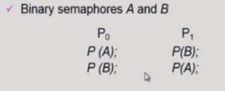
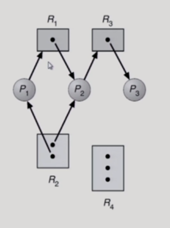
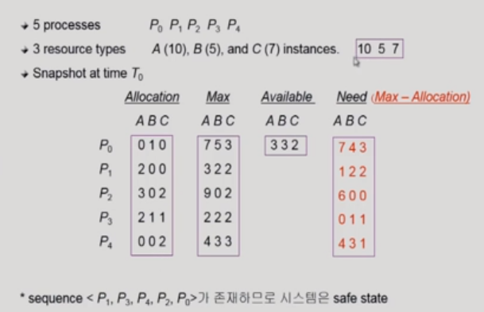

# 06_Deadlocks

## Deadlock이란?

- 서로 막혀서 아무도 지나가지 못하는 상태
- 시스템 안에서
  - 자원이 있는데 자기가 자원을 가지고 있으면서 다른 친구의 자원을 기다리는 상황
  - 즉 쓸수 있는 자원이 없는 상태 그러면서 진행도 못하는 상황

### deadlock

- 프로세스들이 서로가 가진 자원을 기다리면서 block된 상태
- Process
  - 자원 요청 : request
  - 할당 :
  - 사용
  - 내놓고

- ex1)

- deadlock이 생기는 이유
  - 자원을 동시 충족을 못할때
  - 즉 자원이 2개 필요한데 하나밖에 못얻으면서 본인것은 안내놓을때

### deadlock 발생의 4가지 조건

옛날 이야기

##### 4가지가 모두 있으면 deadlock이 생기게 된다.

- ##### Mutual exclusion

  - 매 순간 하나의 프로세스만이 자원을 사용할 때

- ##### No preemption

  - 강제로 빼앗기지 않을 때

- ##### Hold and wait

  - 자원이 여러개 필요하면서 이미 가진 자원을 놓지 않을 때
  - 필요없을때 내놓아야 하는데 잡고 있을 때

- ##### Cricular wait

  - 꼬리의 꼬리를 무는 경우
  - 즉 위에 교통문제 같을 때

### 자원할당 그래프

- ##### 각 그래프의 의미

  - R2 => P1
    - P1이 R2를 점유하고 있다
  - P1 => R1
    - P1이 R1을 원하고 있다
  - R2에서 점 2개의 의미
    - 자원의 인스탄스 갯수를 의미한다.

- 그래프를 보고 deadlock이 걸린지 보는 방법
  - 화살표를 따라다서 cycle이 없으면 deadlock이 아님
  - cycle이 있으면
    - 자원의 instance가 하나이면 deadlock
    - 여러개면 deadlock일 가능성이 있음
    - 왼쪽은 deadlock이다 자원이 2개이지만 사이클도 2개
    - 오른쪽은 deadlock이 아니다

## Deadlock의 처리 방법

위 두가지: 방지

4가지 처리 방법

- Deadlock Prevention
- Deadlock Avoidance
- Dealock Detection and recovery
- Deadlock Ignorance

### Deadlock Prevention

- ##### hold and wait

  - 자원을 요청할때는 다른 자원을 쥐고 있으면서 요청을 할 수 없게 만들면 된다,
  - 즉 자원이 필요할 경우 가지고 있는 자원을 모두 내놓고 요청해야한다.

- ##### No Preemption

  - 빼앗기게 만들면 된다.
  - 자원 중에는 빼앗을 수 있는 자원이 있고 없는 자원이 있음
  - CPU같은 경우 빼앗을 수 있음(이유: 빼앗겨도 그 이후 시점부터 일을 할 수 있기 때문이다) => 따라서 deadlock이 생기지 않는다
  - 하다가 자원을 빼앗기면 저장이 안되는 경우 = 빼앗을 수 없음
    왜냐하면 하던일이 엉망이 되거나, 일을 처음부터 해야할 수 있기 때문이다
  - 따라서 항상 쓸 수 있는 것이 아니다

- ##### Circular wait

  - 사이클이 생기지 않게 만들어 주면 된다.
  - 자원의 번호를 매겨서 1번 자원을 얻어야 2번 자원을 얻을 수 있게 끔
  - 즉 철학자 문제처럼 자원을 얻는 순서를 정해버린다
  - 그럼 사이클이 만들어지지 않기 때문에 deadlock이 걸리지 않음

- ##### 문제점

  - Starvation이 일어날 수 있음
  - 가용자원이 있는데도 자원을 얻지 못하는 문제가 발생할 수 있음
  - 따라서 비효율적임

### Deadlock Avoidance

- 프로세스가 태어날때 자원을 평생 자원을 최대로 얼마나 쓸 수 있을지 미리 계산이 되어 있다 (최대 사용량을 미리 선언한다는 뜻임)

- 그러면 데드락으로 부터 피할 수 있음

- safe sequence

- 2가지 알고리즘

  - Single instance

    - 자원할당그래프 알고리즘 사용

    - ##### Resource Allovation Graph algorithm

  - Multiple instance

    - ##### Banker's Algorithm 사용

#### Resource Allovation Graph algorithm

- 점선이 추가됨
  - 프로세스가 언젠가 그 자원을 사용할 수 있다는 것을 의미 해 놓은 것임
  - 진짜로 요청함
  - 그럼 실선으로 바뀌게 되었다
- 이게 데드락은 아니다
  - 왜냐하면 점선은 실제로 사용하고 있는 것이 아니기 때문에
  - 하지만 데드락의 위험이 있기 때문에 P2에게 R2 자원을 주지 않는다
  - 그럼 언제 주냐?
    - P1이 지금 R1에 자원을 다 쓰고 끝났을 때 P1의 화살표가 사라짐
    - 그럼 그때 P2에게 R1자원과 R2자원을 주게 된다

#### Banker's Algorithm

- ABC는 자원 => 숫자는 instance

- Allocation
  - 지금 각각의 프로세스에게 할당되어 있는 자원수
- Max(평생)
  - 최대로 사용할 수 있는 자원의 수(즉 지원 할당 그래프 알고리즘처럼 최대 얼마나 쓸 가능성이 있는지를 미리 계산해놓음)
- Available
  - 현재 남아있는 자원
- Need(Max-Allocation)
  - 추가로 요청 할 수 있는 자원의 양

- ex)
  - P0이 C자원 하나를 원함
  - 안줌
  - 왜? 평생동안 최대로 필요한 양이 3개임
  - 그런데 C가 현재 2개 밖에 없음
  - 지금 빌려줄 자원이 있기는 한데 나중에 1개를 더 원할 수 있음
  - 그래서 안빌려줌
- 굉장히 보수적임
- 항상 최악의 경우를 본다
- 따라서 자원 낭비가 심함

### Deadlock Detection and recovery

- deadlock이 생기든 말든 그냥 요청을 준다
  - 왜? 어차피 deadlock이 잘 안생기기 때문
- 그럼 deadlock이 생기면 그때 어떻게 할 것임??
  - deadlock인지 아닌지를 판단을 하고 deadlock발생했을 때 그때 해결해준다

#### Deadlock Detection

##### instance가 하나일때 그래프로 만든다

- 왼쪽 그림에서 cycle이 생겼기 때문에 Deadlock이다
- 오른쪽 그림은 자원을 때고 Process만 그린 그림이다
  - 그것만 봐도 cycle을 확인할 수 있음 = wait for graph라고 함
  - 그래서 

##### instance가 여러개일 때

- ABC자원
  - 여유자원이 있으면 그냥 무조건 준다
- Allocation
  - 할당된 것
- Request
  - 실제 지금 요청한 자원
- Available
  - 현재 사용할 수 있는 자원이 없음
- ex) 어떻게 데드락이 걸릴지 계산 할 것임?
  - 아무것도 요청하지 않은 (P0)같은 프로세스들 봄
  - 할당 된 것들이 있음
  - 그것을 나중에 내 놓을 것이라고 생각함
  - 그래서 그것들을 모아서 계산함 (P0,P2같은 것들)
  - 만약 줄 수 있으면 데드락 상태가 아니라고 판단
- ex) P2가 C를 요청하면??
  - P0만 request 0임 그래서
  - P0가 B를 내어 놓는다고 해도 자원이 부족하게 된다
  - 따라서 deadlock

#### Deadlock Recovery

- 데드락이 발견된다면 어떻게 하지??
  - 죽인다, 자원을 뺴앗는다

- Process termination
  - 데드락과 연류된 모든 process를 다 죽인다
  - 데드락과 연류된 process를 하나씩 죽여본다
- Resource Preemption
  - 데드락과 연류된 process의 자원을 빼앗아 본다.
  - 그럼 누구껄 빼앗음??
    - 비용이 적게 드는 Process를 골라서 그 친구의 자원을 빼앗음
    - 동일한 프로세스가 계속 victim으로 선정되는 경우
      - Starvation발생
    - 그래서 또 희생이 되었을 때 다른 프로세스를 빼앗는다
      - Rollback횟수도 같이 고려(cost factor에)

### Deadlock Ignorance

- 방법도 아니다

- 왜냐하면 그냥 무시하는 방법이기 때문에

- 데드락은 드물게 발생하는 일이다

- 그래서 운영체제가 이것때문에 코스트를 쓰는게 너무 비효율적임

- #### 현대 대부분의 범용 OS가 이 방법을 채택하고 있음

  - 그럼 이거 왜 배움??

- 아무일도 안해주면 어떻게 됨??

  - 그럼 사람이 알아서 처리함
  - 전원을 껐다가 키거나 등등

