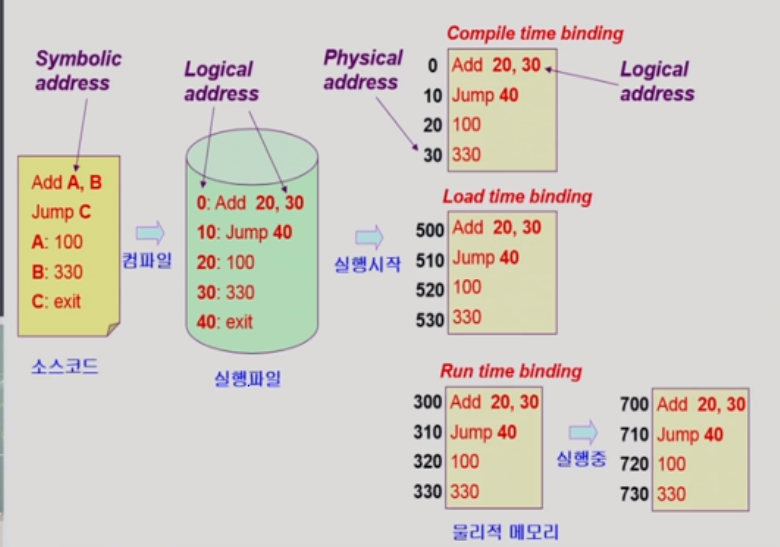
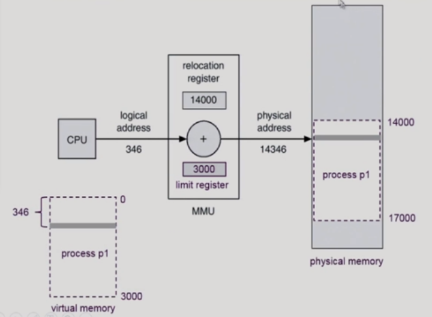
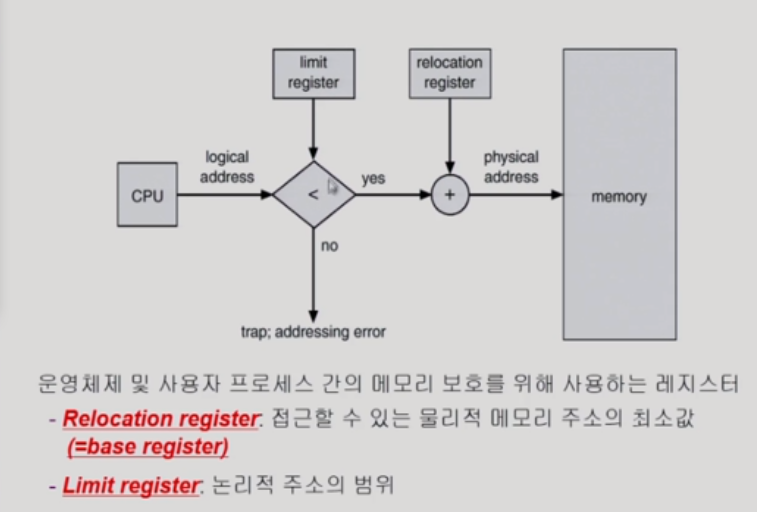
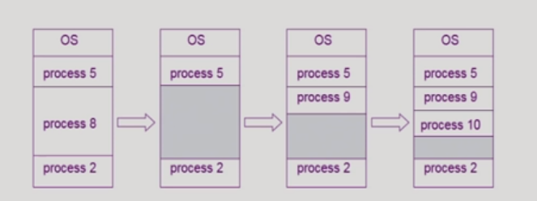
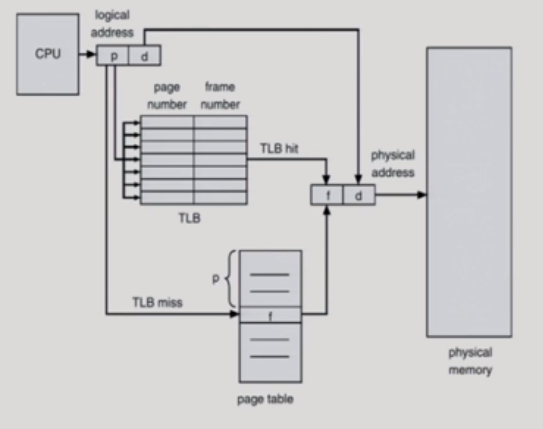
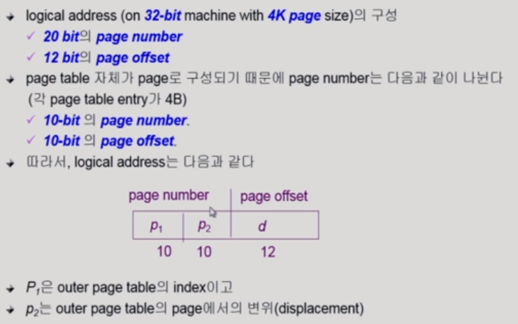
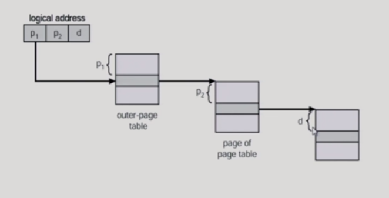
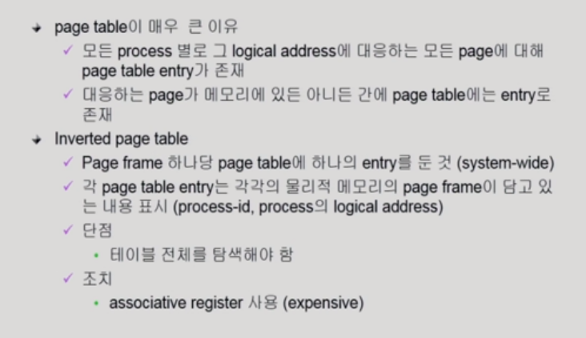
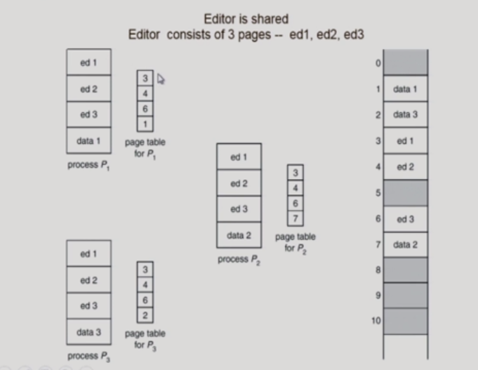
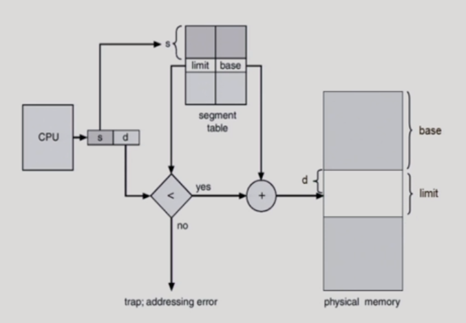

# 07_Memory_Management

메모리: 주소를 통해서 접근하는 장치

주소의 종류

- Logical address(=Virtual address)

  - 프로그램만의 독자적인 메모리 공간

  - ##### cpu가 보는 주소는 logical address이다

- Physical address
  - 메모리에 실제 올라가는 위치

- Symbolic Address
  - 프로스래머가 변수로 이름을 짓는 그런 것

## 주소 바인딩(주소 변환)

- Physical address에서 Logical address로 바뀌는 시점이 언제인가??

#### Compile time binding

- 컴파일 나는 시점에 이미 물리적인 주소까지 저장이되는 것
- 0은 OS가 들어가는 자리이기 때문에 현대에서는 사용하지 않는다

#### Load time binding

- 이 프로그램을 실행시키는 시점

#### Execution time binding(Runtime binding)

- 로드와 둘의 차이점
- 실행중에 주소가 바뀔 수 있음
- 수행이 시작된 이후에도 프로세스의 메모리상 위치를 옮길 수 있음
- cpu가 주소를 참조할 때마다 binding을 수시로 점검해야한다.
  - (가상메모리 주소가 물리적인 주소에서는 어디인지 봐야한다)라는 뜻
- 하드웨어적인 지원이 필요하다
  - 매번 주소변환이 필요하기 때문에

과정

- 주소변환을 왜 해줘야 할까?
  - 실제위치는 물리적 주소로 바뀐다
  - 하지만 안에 있는 주소는 가상메모리 주소이다
  - 컴파일에서 만들어진 주소이기 때문
  - 그래서 물리적인 메모리에서 40이 어디인지 찾아줘야한다
    - 예를 들어서 jump를 하고 싶음 그게 주소 40임
    - 어? 그럼 주소 40은 물리적인 메모리에서는 어디지??
    - 항상 변환을 해줘야한다.

### Memory-management Unit(MMU)

- 간단하게 설명
  - 현대에는 조금더 복잡하게 되어 있음
  - 가상 메모리 안에서 여러개로 쪼개져서 필요한 것들만 올라감
  - 하지만 이것은 간단한 스캠
- 사용자 프로그램
  - 논리적인 주소만 다룬다
  - 실제 물리적 주소를 볼 수 없음

- 레지스터 2개 있으면 된다

  - ##### relocation register

    - 시작 위치를 알고 있음
    - 가상 주소가 들어오면 거기다가 relocation에서 알려주는 값을 더해주면 물리메모리

  - ##### limit register

    - 논리적인 주소의 범위를 알려줌
    - 3000을 가지고 있으면
    - 14000에서 17000까지 주소의 범위를 제한한다.

- 똑같은 뜻

용어

- #### Dynamic Loading

  - Load는 메모리를 올린다는 뜻이다
  - 프로세스 전체를 메모리에 미리 다 올린는  것이 아님
  - 해당 루틴이 불려징 때 메모리에 load하는 것
  - 누가 해줌?
    - 운영체제 지원 프로그램 자체에서 구현 가능하다
    - 현대에는 조금 다르다
    - 하지만 지금은 운영체제가 하고 있음
  - 장점
    - memory utilization의 향상
    - 메모리의 낭비가 없어지기 때문에

- #### Overlay

  - 다이나믹 로딩이랑 똑같음
  - 옛날에는 메모리가 작았음 => 프로그래머가 수작업으로 했음
  - 그래서 이런 용어를 사용했음

- #### Swapping

  - 메모리에서 쫒아내는 것을 의미함

  - 디스크에 쫒아냄 (Backing store) = Swap area

  - 현대에는 부분부분 쫒아내게 된다. => 다른 용어가 있음 뒤에 할 것

  - ##### swap in/swap out

    - 중기 스케줄러에 의해 swap out시킬 프로세스 선정
    - 타켓을 우선순위로 정함
    - swap out은 메모리가 통째로 쫒겨난 것을 의미 한다
      - 그래서 현대에서 부분이 쫒아내면
      - page가 swap되었다라고 부르기도 한다
    - swapping이 지원 되려면 Run time binding으로 해줘야한다
      - 이유?
      - 쫒겨났다가 들어올때 비어있는 곳으로 들어오면 좋기 때문에
      - 즉 메모리 주소가 바뀌는 것이 낫기 때문이다
      - 메모리 주소 바뀌는 것 ? => Run time binding

- #### Dynamic Linking

  - 라이브러리를 연결하는 작동을 linking이라고 한다

  - ##### static linking (static library)

    - 라이브러리가 프로그램의 실행 파일 코드에 포함되어 있음

  - ##### Dynamic linking(shared library)

    - 라이브러리가 실행시 연결이 된다.
    - 실행파일에 포함되어있지 않음
    - 그래서 호출을 했을 때 그 때 그 라이브러리를 호출을 함
    - 그것을 찾기 위한 코드= **stub**이라고 함 
    - 만약 또 그 라이브러리를 부르게 된다??
      - 그럼 또 파일에 있는게 올라가는 것이 아님
      - 이미 올라가 있는거 가져다가 쓴다
      - 메모리를 아낄 수 있음

### Allocation of Physical Memory

- 사용자 프로세스 영역을 어떻게 관리 할 것인가?

#### Contiguous allocation

##### 현재 사용하지 않음

- 고정 분할 방식
  - 여러개 분할을 미리 나누어 놓음
  - 내부 조각이 생기기 때문에 비효율적임(낭비하는 메모리가 생김)
- 가변분할 방식
  - 그냥 올림
  - 문제점
    - 프로그램이 끝남
    - 그럼 그 공간이 빔
    - 근데 나중에 들어가는  프로그램의 크기가 작음
    - 외부공간이 생기게 됨
    - 그럼 메모리 낭비

- Hole
  - 이러한 조각들이 여러가지로 흩어지게 된다
  - 할당공간과 가용공간(hole)의 정보를 유지해야한다.
    - 왜?
    - 어디 어떤 홀에 메모리를 넣어야 효율적일지 생각을 해줘야 하기 때문에

- 홀 넣는 방법 3가지
  - First-fit
    - 최초로 찾아지는 곳에 넣음 빠름
  - Best-fit
    - 사이즈에 가장 적합한 곳을 찾음
    - 메모리 낭비가 낮음
    - 근데 다 탐색해야함
  - Worst-fit
    - 제일 큰 곳에 넣음 ==> 낭비가 큼

- compaction
  - 빈 공간을 모아서 큰 홀로 만들어주는 작업
  - 굉장한 비용이 든다
  - 따라서 최소한 메모리 이동으로 compaction을 하면됨
  - 하지만 너무 복잡함

## 02. Noncontiguous allocation

- 방법 3가지

  - Paging

  - Segmentation

  - paged Segmentation

#### Paging

- #### paging이란?

  - 프로세스의 각각의 가상메모리를 동일한 사이즈로 Page단위로 나눔
  - 당장 필요한 부분은 올려놓는다
  - 그리고 일부는 backing storage에 놓는다
  - 프로그램을 자른거임

- #### 물리적인 메모리

  - page와 동일한 크기의 Frame으로 나눔
  - 가상도 page로 나눔

- #### Page table

  - 이것을 통해서 주소변환을 한다.
  - 배열에서 각각의 번호를 인덱스 번호라고 한다.
  - table에서는 그것의 각각을 엔트리라고 한다.
  - 위 그림은 0번 엔트리, 1번 엔트리 ......이라고 한다.
  - 엔트리 번호외에도 vaild한지 안한지에 대한 정보고 가지고 있음
    - 비트가 valid하다 ? ==> 정말 올라가 있구나?
    - 비트가 invalid하다? ==> 메모리가 실제로 올라가있진 않구나

- #### 장점

  - 외부조각이란?
    - 프로그램이 커서 맞지않는 크기에 들어가지 못함
  - 외부조각이 발생하지 않음
  - 하지만 내부조각이 발생 할 수 있음
    - 이유
    - 동일한 크기의 page단위로 자르다 보면 마지막에 남은 짜투리가 있음 이것을 내부조각이 있다라고 하는 것임

Page table

- p = page번호
- d는 p번호로 부터 얼마나 떨어져 있는지
  - f는 d만큼 떨어져 있는 번호
  - 상대적인 위치는 같다
- 32비트를 기준으로
  - p + d ==> 32비트
  - 1비트당 2바이트를 구분할 수 있다
  - 2비트는 4바이트 // 3비트는 8바이트  . . . . . .
  - 32비트는 2의 32승 바이트가 메모리의 최대 공간치이다
  - 2의 32승은 4기가 바이트
  - 페이지 하나당 4키로바이트
  - 그럼 페이지 수가 ==> 1메가 = 100만개가 넘음
- 따라서 페이지 테이블에서 엔트리가 필요한 수?
  - 페이지 개수만큼 엔트리가 필요하다

- 페이지 번호(p)
  - 4k개의 정보를 구분하고 싶음
  - 

- ex) 서울에 있는 학교를 그대로 제주도에 세움
  - 그럼 주소변환을 하더라도 순서와 위치가 같게 됨
  - 즉 상대적인 위치는 같게 된다.

### Implementation of Page Table

- page테이블 자체가 main memory에 상주
  - 생기는 문제
  - 메모리를 접근하려면 두번 접근해야함
  - pate table접근 1번 + data/instruction 접근 1번
  - 따라서 속도 향상을 위해
  - 캐쉬메모리를 둔다
    - translation look-aside buffer(TLB)
       ==> 주소변환을 빠르게 하기 위한 캐쉬메모리다
    - 다른 캐쉬메모리가 있는데 그건 데이터를 위한 캐쉬메모리다
    - 캐쉬는 일부 메모리만 저장한다.
- 그럼 register 2개 어디에다가 쓸것음?
  - page-table base register ==> Page table을 가르킨다
  - page-table length register ==> 테이블 크기를 보관

### Paging Hardware with TLB

- 전체적인 정리와 순서

- Page table
  - cpu 요청
  - 주소변환을 해달라고 말한다
  - page table에서 p만큼 떨어져 있는 아이의 값 = Frame번호을 준다
  - 그럼 주소변환이 끝난 것임
  - 그럼 실제 메모리가서 Frame번호에서 d만큼 떨어져 있는 아이를 얻을 수 있다
- 근데 문제가 뭐라고?
  - page table은 실제 메모리에 들어 있다고
  - 그럼 왜 안좋아??
  - 보다싶히 메모리를 두번 접근하게 됨
  - 그럼 느림
  - 그래서 나온게 뭐다??
    - 캐쉬
- TLB
  - page table일부가 TLB에 있음
  - cpu 요청
  - 주소변환을 해달라고 말한다
  - 페이지 테이블 가기전에 TLB를 확인
    - p가 있으면 바로 메모리를 접근할 수 있음
      - 그럼 한번만 접근
    - 없으면
      - 페이지 테이블로 가서 주소변환을 한다. 
  - TLB는 어떻게 p만으로 주소를 찾을 수 있지?
    - 논리적인 page번호와 Frame번호를 둘다 알고 있어야함
    - 이유
      - page table의 일부만 가지고 있기 때문
    - page table처럼 바로 가서 찾을 수 있는 것이 아님
    - 즉 전부다 그 값이 있는지 없는지 확인을 해야함
    - 그럼?? 느린거 아냐?
    - 그래서 직렬적으로 계산하지 않고 병렬적으로 계산한다
    - 그럼 그런 계산할 수 있는 하드웨어가 필요
      - Associative register라고 한다.
  - TLB의 단점
    - context switch가 날 때 모든 엔트리가 다 지워져야 한다.
      - 왜?
      - 현재 cpu가 잡고있는 그 프로그램의 page table의 page number와 frame number가 잡고 있기 때문에 다른 것이 들어오면 다시 지우고 새로 받아줘야한다.
    - 그래서 context switch가 많은 overhead를 일으킨다고 하는 이유중에 하나이다

### Two-level Page Table

- 페이지마다 엔트리가 100만개가 넘고 등등
- 많은 메모리 공간이 주소변환을 위해서 쓰이고 있다
- 즉 많은 낭비가 있음
- 따라서 이단계 페이지 테이블이 나옴

- page가 2단계로 되어 있음
  - outer
  - inner
- 이렇게 하면 메모리에 한번 더 접근해야함
- 즉 메모리에 이득을 보기 위해서 속도를 포기한 것
- 어떻게 메모리 이득을 보는거지?
  - 100만개의 페이지 중에서 정작 사용되는 페이지는 몇개 안된다.
  - 사용이 안되는 영역에서는 Null이라고 되어 있음
- 안쪽 페이지 하나의 크기 =
  -  4kb = 2의 10승개의 엔트리

- outer
  - 시작위치 처음 base register가 가지고 있음
  - 만약 null이다 그럼 끝
  - 있다
    - 그럼 계산

P2는 1024개를 구분하기 위한 것

- 다단계 페이지 ==> 시간이 오래걸림
- 이렇게 하면 

- 왠만하면 TLB에서 해결이 된다.==> 대부분 성공을 했기 때문에

#### inverted page table

- 원래 테이블
  - 논리주소를 받으면 물리 주소를 얻는 과정
  - 근데 페이지 테이블에 대한 공간낭비가 너무 심함
- inverted page table
  - 물리적인 메모리 각 프레임 하나하나 당 페이지 테이블에 엔트리가 존재함
  - f번째 프레임에서 봤을 떄 p가 나왔다
  - 그럼 그 p는 local address가 어디니?
  - 이런식으로 구성 됨

#### Shared pages(Re-entrant code, Pure code)

- 프로세스는 3개 그리고 동일한 프로그램이라고 가정
  - 코드부분은 똑같음 => 데이터부분만 다르다
  - 동일한 코드가 여러 카피가 올라가게 된다
  - 그래서 Shared pages가  나옴
- 조건
  - read-only로 되어 있어야 한다. 
    - 위와 아래 프로세스의 1,2,3엔트리의 주소가 같음 (shared)
    - 이때 그것들이 다 read-only로 되어 있어야 한다는 뜻이다
  - 동일한 logical address space에 있어야 한다.
    - 가상주소도 동일해야한다고?
    - 페이지번호가 같아야 한다는 뜻이다
    - 이미 컴파일이 끝났으면 기계어 자체를 바꿀수는 없다
    - 그때 그 안에있는 논리적인 주소도 바뀔 수 없다
    - 바꾸려면 컴파일 다시해야함
    - 따라서 기계어 자체가 다 동일하다고 하면 그 주소체계도 다 같아야 하기 때문에 동일한 가상 주소를 가지고있어야 한다.
    - 즉 기계어가 동일하다 == 동일한 프로그램을 실행한다? 랑 비슷한 의미인듯?

## Segmentation

- 동일한 크기가 아님
- 의미 단위로 주소공간을 자르게 된다.
  - 따라서 크기가 다 다르다
  - 그럼 물리메모리도 미리 다 잘라 놓을 수 없다

#### Segmetation이란

- 일반적으로 code, data, stack부분이 하나씩의 세그먼트로 정의 된다.

주소번호

- segment-number와 offset 으로 구성

- ##### 과정

  - cpu가 요청

  - s 번호와 d 거리

  - table로 가서 몇번째 세스먼트인지 보고

  - 그 세그먼트에서 얼만큼 떨어져 있는지 본다

  - ##### 여기엔 limit이라는 것이 있다

    - paging에서는 limit이 필요 없음 왜? 다 똑같은 크기라서
    - 하지만 segment에는 필요함 다 크기가 달라서
    - 만약 d가 limit보다 벗어난 위치를 시도 하려함
    - 그럼 안되기 때문에 limit값이 필요하다
    - 그때 trap을 걸어주고 막아준다

- ##### register를 어떻게 사용할 것인가?

  - Segment table base register
    - 물리적 메모리에서 테이블의 위치를 담고 있음
  - segment table length register
    - segment의 수를 담고 있음
    - 즉 세그먼트 테이블의 길이를 담고 있음
    - 왜 테이블의 길이를 가지고 있어야 함?
    - 세그먼트의 길이가 limit보다 큰게 나올때 막아 줘야하기 때문에 테이블의 길이을  알고 있어야함 그래서 가지고 있음

- page와 차이점
  - 물리적인 위치에서 몇번째 이냐? 이걸로 주소를 알 수 없음
    - 세그먼트 단위가 다 다르기 때문에
  - 그래서 바이트 단위 주소로 가르키고 있어야 한다. 
  - 각각의 크기다 다르기 때문에 밑에 그림처럼 홀이 생긴다는 단점을 가지고 있음

- 보는 것과 같이 limit값과 base(시작 위치, 바이트 값)값을 가지고 있어서 그 주소를 가르키게 됨
- 중간중간 프로세스를 마치고 나온 빈 자리들이 생기게 된다.

### Segmentation Architecture

#### 장단점

- ##### protection

  - 의미단위로 해야하는 일들은 segementation이 더 좋음
  - read/write을 모두 가능하게 해야 할떄
  - 어떤 것은 read-only로 세팅
  - 권한을 주고 안주고 등등
  - 즉 의미 단위로 쓰기 때문에 이렇게 다 잘 나눠줄 수 있음
  - 반면 page같은 경우 애매하게 잘라 놓았을때 권한이나 등등을 주기 애매해짐

- ##### sharing

  - 의미단위로 해야하는 일들은 segementation이 더 좋음
  - 공유와 보안에 있어 훨씬 효과적이다

- ##### Allocation

  - 즉 비어있는 홀들을 어떻게 효율적으로 채워 넣을 것인가에 대한 문제가 새로 생기게 됨
  - first fit, best fit

### sharing of Segments

- page랑 비슷하게 함

#### 현실로 봤을 때(현실적인 문제)

- 현실 세계에서의 문제점(구현 할때)
  - 세그먼트는 만들어 봤자 많지 않음( 엔트리 수가 몇개 안됨 )
  - page는 100만개 막 이럼(엔트리 수가 겁나 많음  )
  - 현실세계에서 봤을 때 paging 기법은 메모리 소모가 훨씬 심하다
- 따라서 segmentation이 훨씬 좋아보인다
- 하지만 실제 현실에서는 사용하지 않는다
- 왜?
  - 메모리공간 가변크기고 올라가고 뭐 이런 여러가지 문제들이 발생하기 때문이다
  - 그래서 현실에서는 paging 기법을 근간으로 사용한다

만약에 segementation을 사용한다면?? paging과 함께 사용

#### Segmentation with paging

특징 ==> 이런것이 실제로 사용되는 것들이다( 복습 해야할 듯 .... ) 다시 보든가

- 세그먼트가 여러개의 페이지로 구성이 된다.
- 뭐.. 1번 세그먼트는 페이지 3개로 구성되고 등등
- 단위는 이게 페이지 단위로 물리적인 메모리에 올라가게 된다.
- 의미 단위로 관리하는 것들은 세그먼트 테이블로 관리한다
- 각각의 세그먼트마다 페이지 테이블이 존재한다.

