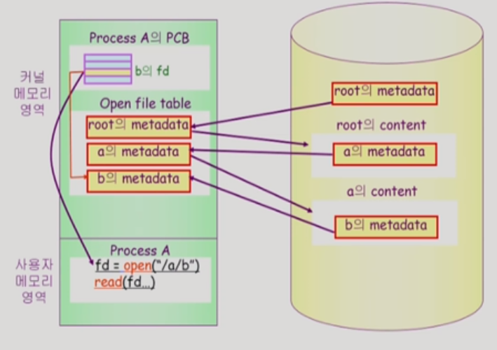
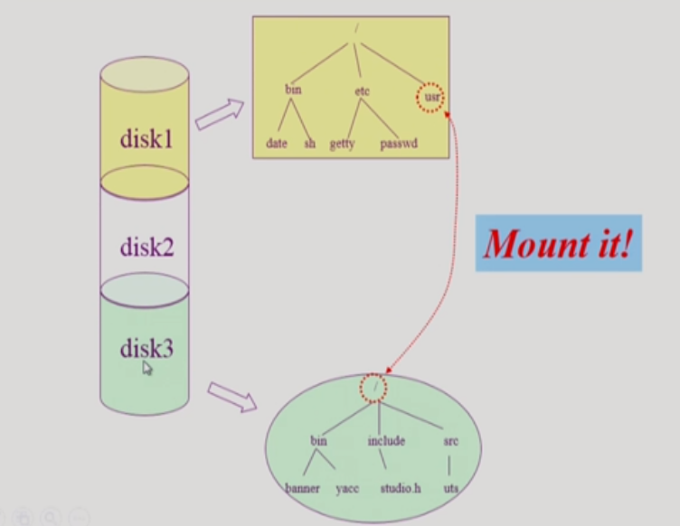
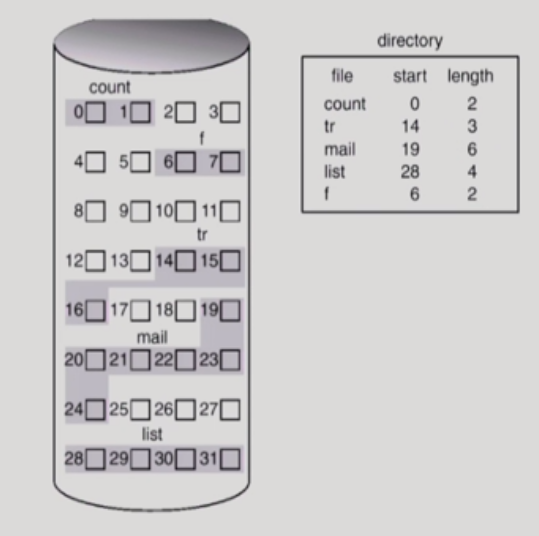
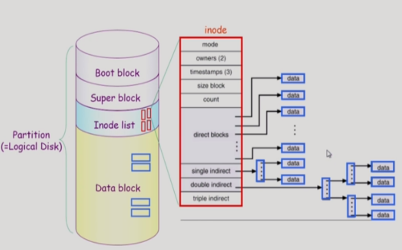

# 09_File_Systems

- ##### File

  - 비휘발성의 보조기억장치에 저장
  - 운영체제는 다양한 저장장치를 file이라는 동일한 논리적 단위로 볼 수 있게 해줌
  - 연산
    - create, read, write, reposition(위치를 수정해주는 포인트), delete,open, close

- ##### File attribute( meta data )

  - 파일을 관리하기 위한 정보들
    - 파일이름, 유형, 위치, 사이즈 등등
    - 시간, 소유자, 접근권한 등등

- ##### File system

  - 운영체제에서 파일을 관리하는 부분
  - 파일을 어떻게 저장 저장할지
  - 어떻게 보호할지
  - 파일 및 파일의 메타데이터, 디렉토리 정보 등을 관리하낟.

### Directory and Logical Disk

- ##### Directory 

  - 파일의 일부 메타데이터를 디렉토리에 저장
  - 연산
    - 탐색, 생성, 삭제
    - 리스트, 이름 수전, 시스템 순회

- ##### Partition(=Logical Disk)

  - 운영체제가 보는 디스트 = Logical Disk
    - C드라이브 D드라이브 등등으로 나누는 것
  - File system을 깔거나 swapping등으로 여러 용도로 사용할 수 있다.

#### Open

- File에 있는 meta data가 메모리로 올리는 과정

- open도 system call이다

  - system call이니깐 cpu가 운영체제로 넘어감
  - 루트의 meta data를 열어봄
  - 위치를 찾음 => a파일을 찾고 거기서 b파일을 찾고 계속 해서 찾고 메모리에 올려놓는다
  - 그리고 b파일의 몇번째 인덱스인지 반환받게 된다.

- read를 하게 되면

  - read를 하게 되면 직접 주는 것이 아니고

  - 운영체제가 그것을 읽어 놓음

  - 그리고 copy를 해서 전달함

  - 왜? ()

    - ##### 버퍼 캐쉬

    - 저장을 해놓으면 필요할 때 다시 디스크까지 갈 필요가 없음

    - 즉 저장해 놓은 것을 바로 전달해주면 된다.

      

- Per process file descriptor table

- open file table

  - 글로벌 하게 하나로 되어 있음
  - 한꺼번에 관리가 된다.

- 오프셋이 다르다 그래서 프로세스마다 별도로 가지고 있어야한다

### File Protection

- 2가지 경우하 필요

  - 누구에게
  - 어떤 연산(read/write/execution)

- 방법

  - Access control Matrix

    - 행렬을 다 만들면 공간 낭비
    - 그래서 리스트로 만들어 놓음
      - 누구에게 어떤 접근 권한이 있는지 표시
    - 단점
      - 너무 부가적인 오버해드가 크다

    

  - ##### Grouping (일반적으로 사용 )

    - 각각의 파일을 3가지 경우로 나눈다
      - owner(본인)
      - group(일부)
      - public(전체)
    - 총 9개 비트만 있어도 접근권한을 표시할 수 있다(각각 3비트)

  - Password

    - 모든 파일마다 password를 둔다
    - 관리 문제와 암기 문제가 생기게 된다. 

### File System의 Mounting

- 서로 다른 파티션에 존재하는 파일시스템을 접근할 수 있게 하는 것

### Access Method

- ##### 순차 접근

  - 카세트 테이프와 같이 앞에부터 접근해야하는 것
  - 읽거나 쓰면 offset은 자동적으로 증가

- ##### 직접 접근(임의 접근)

  - 바로 접근할 수 있는 방법

## Allocation of File Data in Disk

- contiguous Allocation
- Linked Allocation
- Indexed Allocation

#### contiguous Allocation(연속 할당)

- 임의의 크기 파일을 나눠서 할당하는 것

- start = 14 , length = 3
  - 14번째에 시작해서 3개를 할당하겠다
- 단점
  - 빈 공간이 생긴다
  - 공간 낭비
  - 파일의 크기가 커질수도 있는데 커지는데 제한된다.
  - 내부조각도 생길 수 있음(할당이 되었는데 사용되지 않음) = 미리 공간을 할당시켜줄 때 이야기
- 장점
  - Fast I/O가 가능
  - 대부분 헤드가 이동하는 시간이 대부분의 시간을 차지함
  - 이때 한번의 seek로 많은 양의 데이터를 가져올 수 있음 
  - 즉 한번의 헤드 이동으로 많은 데이터의 양을 가져올 수 있음
  - 직접 접근이 가능하다?
    - 23을 구하고 싶다??
    - 19에서 4를 더하면 된다

#### Linked Allocation

- 특징
  - 파일의 데이터를 그냥 빈 위치에 넣음
  - start 값과 end으로 Linked List 처럼 만들어서 비어있는 위치에 다 넣는것

- 장점
  - 외부조각이 발생하지 않는다
- 단점
  - 직접 접근 불가능 ==> 시간이 많이 든다
  - Reliability
    - 한 sector가 고장나 pointer가 유실되면 많은 부분을 잃는다
  - 효율성이 떨어짐
    - 512바이트 단위로 맞춰져 있음(내부외부)
    - 근데 포인터 저장으로 4 bytes를 써버리면 맞춰놓은게 무너져버림

- 변형된 시스템
  - File-allocation table (FAT) 파일 시스템

#### Indexed Allocation

- 특징
  - 블럭하나에다가 인덱스 정보를 모두 저장해놓음
- 장점
  - 그럼 직접접근이 가능하다
  - 그리고 홀이 생기지 않는다
- 단점
  - 아무리 작은 파일이더라도 블럭이 2개 필요하다
    - 인덱스를 위한 공간
    - 정보를 저장하는 공간
  - 파일이 크면 인덱스를 다 저장하지 못함
    - 해결방안
      - 마지막 인덱스는 다른 파일의 인덱스를 저장한다 =  linked처럼
      - multi-level index

## 실제 파일시스템은 어떻게 사용하는가??

### UNIX 파일시스템의 구조

#### 논리적 디스크(원통)

#### boot block

- 모든 파일 시스템이 boot block이 있음 (UNIX만 있는 것이 아님)
- 부팅에 필요한 정보

#### super block

- 파일 시스템의 어디가 빈블록이고, 파일이 저장되고, 사용중인지, 어디까지 Inode list가 있는지 등등
- 총체적인 시스템을 

#### Inode list

- 인덱스 노드
- 파일 하나당 Inode하나가 부여된다
- 그리고 그 Inode는 파일의 meta data를 가지고 있음
- 위치정보, 사이즈, 타임 등등// 파일이름 , Inode번호 를 안가지고 있음
  하지만 
  디렉토리 : 파일이름 , Inode번호 를 가지고 있음
- Inode는 크기가 고정되어 있음

#### 위치 정보

효휼적인 이유: 대부분은 작은 파일이기 때문에

- ##### direct block

  - 파일 크기가 작음 => direct인덱스만으로 표현이 가능함

- ##### single indirect

  - 큰 파일일 경우 => 한번 따라가면 인덱스가 있음 => 거기에 포인터가 있고 => 따라가면 파일 데이터가 있음

- ##### double indirect

  - 더 큰 파일일 경우 ==> 두번 따라가면 위치 나옴

- Data block

