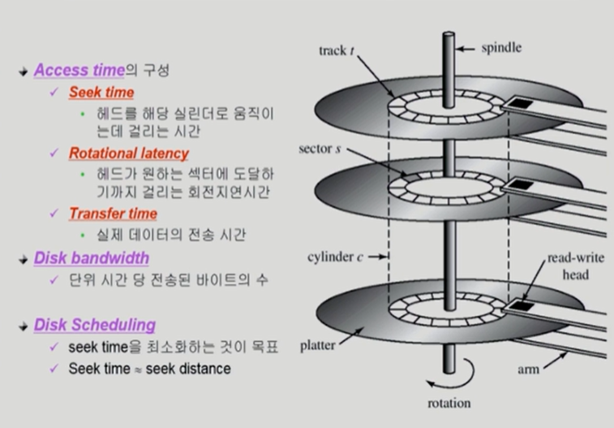

# 10_Disk_Management_and_Scheduling

##### Disk Structure

- cylinder
  - track에서 여러 디스크를 모아둔 모습
- track
  - 디스크 내부에 하나의 길
- sector
  - track안에 나눠져 있는 부분
- head
  - 모든 head들은 동일한 track 위치를 읽고 쓸 수 있음
  - 즉 다같이 움직임

- logical block
  - 디스크의 외부(호스트)에서 보는 디스크의 단위 정보 저장 공간들 
  - 정보를 전송하는 최소단위

디스크 내부

- disk controller가 sector에다가 데이터를 저장하거나 꺼내거나 한다
- 데이터를 꺼낼떄 장확한 sector의 번호등등을 알아야 어디있는지 찾을 수 있다. 
- 디스크 외부 (컴퓨터)에서 logical block번호를 받으면 그때 sector 번호등등으로 그 정보를 찾고 보내준다(controller가 함)

디스크 외부

- 디스크외부(컴퓨터)가 디스크를 읽고 쓰라고 요청할 때
- 그 요청을 sector에다가 내리는 것이 아니고 logical block에다가 한다.
- 외부에서는 데이터를 요청할때 logical block번호를 말해준다

