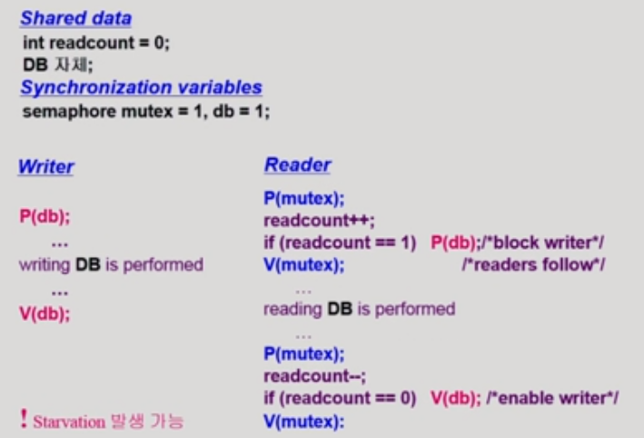
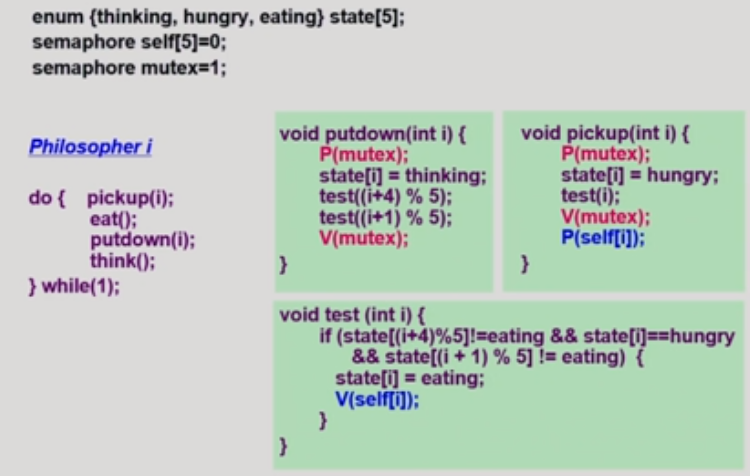

# 추가

#### synchronization variables

- mutual exclusion
  - 락을 걸기위한 변수
- resource count
  - 남은 full과 emtpy 버퍼를 세기위한 변수

- Producer
  - 빈거를 봄
  - 락을 검
  - 데이터 처리
  - 락 품
  - full로 만듦
- Consumer
  - 차있는 것을 확인
  - 락을 검
  - 데이터 처리를 함
  - 락을 풀고
  - 비었다고 함

### Readers-Writerproblem

- 읽고 쓰는 것을 DB에 많이 사용함 

- 그래서 여기서 DB를 공유데이터라고 할 것임

- 한 프로세스가 DB에 write중일 때 다른 process가 접근하면 안됨

- ##### read는 DB에 동시에 여럿이 해도 됨

- 해결

- 공유 데이터
  - DB자체
  - readcount
    - 만약 0이라면 다른 readcounter가 접근하지 않다는 것
    - 현재 DB에 접근 중인 Reader의 수이다

- 변수
  - mutex : 
    - readcount를 접근하는 코드의 락을 거는 것
    - 
  - db : 
    - reader와 write가 공유 DB자체를 올바르게 접근하게 하는 역할
    - 즉 DB자체에 락을 거는 변수
    - write가 락을 걸었으면 아무도 못들어옴
    - 하지만 reader가 락을 걸었으면 readcount를 보고 이미 다른 reader가 읽고 있으면 같이 읽을 수 있게 한다

- 코드

- #### writer

  - DB에 락을 걸고
  - 처리하고
  - DB에 락을 푼다

- #### reader

  - P(mutex)readcount를 건들이기 전에 readcount에 대해서 락을 검
  - 그리고 readcount +=1 을 해줌
  - if readcount ==1 ==> 0이었던 것을 1로 바꿨다는 뜻 ==> 내가 DB를 읽으러 최초로 들어왔다는 뜻
  - 그럼 lock을 걸어준다
  - 왜? wirte가 들어올 수도 있기 때문
    - 그럼 1이 아니면 왜 락을 안걸어줌??
    - 이미 그 전에 다른애들이 락을 걸었을테니깐 안걸어줌
    - 그냥 접근만 하면 됨
  - 나왔더니 readcount = 0이다 (뜻: read를 아무도 사용하지 않음)
  - 그럼 db락을 풀어준다
    - 왜??
    - write가 써야하니깐

##### 문제점

- Starvation이 발생할 수 있다
- reader들이 계속 들어와 = 약간 꼬리 물기 같이
- 그럼 write언제 써?? 그래서 문제가 생김

##### 해결방법

- 신호등 같은 것을 만들어 준다.
- 일정시간까지 도착한 reader들만 처리를 하고 늦게 온 애들은 못들어오게 끔 한다. 

 

### Dining-Philosophers Problem

- 철학자가 하는 것
  - 생각하는 것
  - 밥먹는 것

- 배고파지는 주기가 다 다르다
- 젓가락이 공유데이터
- 그니깐 옆에 있는 애가 밥을 먹으면 내가 밥을 못먹음
- 철학자가 굶어죽으면 안됨
- 문제점
  - 모든 철학자가 동시에 왼쪽 젓가락을 잡음
  - 무한루프
  - 즉 데드락이 걸리게 된다.
- 해결
  - 4명의 철학자만 테이블에 앉을 수 있도록 한다. 
  - 젓가락 두개를 모두 잡을 수 있을때만 젓가락을 잡을 수 있게 한다.
  - 짝수 => 왼쪽 먼저
  - 홀수 => 오른쪽 먼저 잡을 수 있게 한다
  - 즉 자원을 얻는 순서를 만들어서 해결

- 젓가락 두개를 모두 잡을 수 있을 떄 ==> 이것의 코드

- 젓가락 두짝이 다 availble한지 확인하는 것
  - semaphore self[5] = 0
  - mutex = 1 ==> 5명의 철학자에 대해서 상태를 만드는 변수를 만들어준다
- 전체 흐름
  - 젓가락 잡고
  - 먹고
  - 놓고
  - 생각
- 젓가락 잡을 때
  - 상태 hungry로 바꿈
  - 젓가락을 잡을 수 있는 상태인지 테스트함
- 테스트
  - 왼쪽과 오른쪽이 모두 available한지 확인해야함
  - if
    - 왼쪽 철학자도 밥을 먹고 있지 않고
    - 오른쪽도 안먹고 있고
    - 그리고 내가 배고플 때
  - 그러면 eating으로 바꿔줌
  - 그럼 V연산을 해서 self값을 1로 바꿔준다
  - 그럼 P연산에서 연산을 할 수 있음
    - 그럼 만약에 못얻었다면??
    - 그럼 self값이 0이기 때문에 P연산을 할 수 없게 된다.
    - 그럼 언제 밥을 먹을 수 있음?
    - 양쪽에 젓가락을 내려놓을때까지 확인을 계속 해준다
    - 내려놓으면 그때 잡게 됨