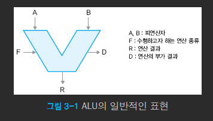
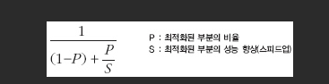

# 멀티코어 CPU 이야기

페이지: https://minjang.github.io/about/

## 1. 프로그래머가 프로세서도 알아야 하나?

- CPU는 하나의 집적회로로 만들어진 마이크로프로세서로 표현하는 것이 더 바람직하다

##### 프로세서를 공부하는 이유

- 프로그램을 더 빠르고 안전하게 만드는 데 쓸 수 있는 여러 기발한 알고리즘으로 가득 차 있음
- 더 빠르고 좋은 프로그램을 만들려면 최신 병렬 프로세서를 보다 적극적으로 활용해야한다.
  즉 프로그래머는 이러한 변화에 적극적으로 대응해야 한다.

- 프로세서는 실제 구현만 하드웨어에서 이루어지는 것 뿐 완벽하게 프로그래밍을 하는 것과 같다
  수많은 명령을 어떻게 하면 빠르게 처리할 수 있을까 라는 문제를 프로그래밍하는 것과 완전히 같다

## 2. 프로세서의 언어: 명령어 집합 구조

#### 컴파일러

- 프로그래머가 이해하는 언어를 포로세서가 쓰는 기계어로 번역해주는 장치
- 프로그래머가 길고 장황하게 말을 늘어 놓으면 요점만 간추려 프로세서에 전달
- 어법에 어긋난 말을 하면 컴파일러는 정확하게 가려준다

### 프로그래머가 보는 프로세서

디버거 상태

#### 용어

- 레지스터: 계산을 하기 위해 필수적으로 필요한 작은 용량이지만 매우 빠른 임시 기억 장치. 현대 컴퓨터는 모든 계산을 메모리에서 레지스터로 값을 옮겨온 후 해야한다. 

- 컴푸터 구조적 상태(architerctureral state)
  현재 프로세서(cpu)가 수행 중인 프로세스의 상태를 지닌 각종 레지스터(임기 기억 장치)의 값들을 가르키는 것

### 프로세서의 언어: 명령어 집합 구조

##### Instruction Set Architecture(ISA): 명령어 집합 구조

- 컴파일러가 없다면 프로그래머는 프로세서가 이해하는 **기계어 혹은 어셈블리어**를 이용해야 컴퓨터에 작업을 지시할 수 있음 ==> 이 기계어를 ISA라고 한다.

- 프로그래머와 프로세서(cpu)가 직접적으로 소통할 수 있는 언어

- 특징

  - 프로그래밍 방법론을 정의할 뿐만 아니라 프로세서 구현의 많은 부분도 결정

  - 프로세서의 내부구조 달라도 x86 ==> 문제없이 프로그램 작동

  - ISA가 다른 프로세서, x86 ==> 바로 작동 할 수 없음 ==> .NET프레임워크 등은 이 문제를 해결하려고 하고 있음

##### instruction: 인스트럭션

- 명령어
- 프로세서가 이해하는 명령어 하나하나를 인스트럭션이라고 부름

- 명령어의 종류
  - 기본적인 사칙 연산과 논리 연산
  - 메모리를 쓰고(store) 읽는(load) 명령
  - 프로그램의 실행 흐름을 제어하는 분기 및 호출 명령(if/goto, call/return)
  - 시스템 내부를 제어하거나 상태를 관찰하는 명령등

ex) A += 7을 x86의 언어로 표현해보자

add dword ptr [A], 0x07

0x83 0x45 0xF8 0x07

- add 와 0x07 쉬움
- dword ptr [A] 
  - A는 변수 A의 주소 값
  - dword ptr 은 주소 값을 4바이트 정수형으로 해석하라 라는 뜻
- 요약: ptrA가 A의 주소를 감고 있다고 할때, ptrA = ptrA +7로 이해한다
- 0x83 0x45로 시작하는 16진수는 이 덧셈 명령이 실제로 프로세서로 전달될 때 표현되는 값

### RISC와 CISC로 알아보는 명령어 집합 구조

- 옛날에 메모리가 매우 비쌈 ==> 짧은 길이의 명령어에 많은 뜻을 함축 ==> 복잡

#### RISC

- 탄생 이유
  - CISC명령어 집합이 지워하는 모든 명령어와 주소 모드를 사용하지 않음
  - 일부만 사용
  - CISC는 가변길이므로 16비트 혹은 32비트 상수 피연산자를 쉽게 명령어에 표현
  - 조사해보니 13비트면 충분히 상수들 표현 가능 (-1, 10과 같은 작은 정수들이 자주나옴)

컴퓨터 구조 설계의 첫번째 원칙

- make common case fast ==> 자주있는 케이스를 빠르게 하라 ==> RISC 탄생

#### 대표적인 RISC, MIPS구조

- MIPS: 모든 명령어는 R(register), I(inmmedate)상수, J(jump) 타입 중 하나로 표현된다.

## 3. 프로세서의 기본 부품과 개념들

### 마이크로아키텍처

- 마이크로세서 하나를 만드는데 필요한 알고리즘 및 회로 수준의 구조 

#### 마이크로 프로세서 설계 2단계

- 마이크로 아카텍처 설계
  - 성능을 하능케  하는 알고리즘과 테크닉(시뮬레이터를 이용)
- 로직 설계

RTL(Register Transfer Language) :  마이크로아키텍처 알고리즘

HDL(Hardware Description Language): 

- 실제 하드웨어 구현에 적합한지 가다듬어 최종적인 언어인 hdl언어로 바꾼다
- 전자공학의 영역: 효율적인 회로로 만드는 기술 필요

### 산술 논리 장치(ALU): 프로세서 속의 계산기

- 산술논리를 연산하는데 쓰이는 장치

- 부동소수점은 계산하기 힘듦
- 정수 곱셈과 나눗셈은 (+ - ) 보다 월씬 복잡함
- 벡터로 표현하는 것들 ==> 이부분은 특별히 처리하여  성능을 높이는
  Make common case fast의 원리와 맞아 떨어지짐
  이런 연산은 바로 그래픽 연산장치 = GPU와 벡터연산에서 흔히 찾을 수 있음 = story11

### 클록, 1사이클이 가지는 의미

##### 클록: 

-  클록은 시스템 클록, 시분할 클록, 통신 클록, 실시간 클록 등으로 분류된다.
- 시스템 클록은 중앙 처리 장치(CPU) 클록 또는 마이크로프로세서 클록이라고도 하는데, 수정 발진기의 정확하고 규칙적인 진동에 의해 발생하는 일정한 간격을 갖는 전자적 펄스를 클록 펄스 또는 타이밍 신호로 사용하여 시스템 내 각 구성 요소의 모든 동작을 동기화한다.
- 시스템 클록의 펄스 발생 주기를 클록 속도라고 한다

- 명령어 하나가 연주할 내용
- 클록은 지휘자
- 2GHz의 프로세서는 1초에 20억번 클록신호를 발생시킨다
- 즉 이론적으로 1초마다 20억개의 연산이 완료

### 메모리 계층

(2010)

- 현재 메인 메모리는 DRAM(Dynamic Random Access Memory)으로 구현된다
  - 데이터를 가져오는데 100사이클이 넘는다
  - 프로세서와의 속도 차이도 점점 생긴다
  - 따라서 캐시메모리가 필요하다 

##### 메모리 계층

- 레지스터가 가장 비싸다

- 구조 레지스터, 논리 레지스터

  - 외부로 노출되는 인터페이스
  - 범용 목적 레지스터 (general purpose register, GPR)
    - 임시 저장소 (계산시)
  - PC register(program counter)
    - 현재 수행중인 명령어의 주소를 갖고 있음
    - 디버거에서 break point를 걸고 그 지점에 프로그램이 멈추었을 때 그 중단점이 있는 위치가 PC
    - x86에서는 IP라고 불리 

  - CR(control register)
    - 시스템 내부 산태를 관리하는 레지스터

- 물리레지스터(physical register)
  - 내부에서 쓰이는. 즉 외부로 노출되지 않는 레지스터

==> 구조 + 물리 사이를 관리하는 알고리즘과 테이블 = 비순차 실행(stroy8에서 설명)

- 레지스터 파일
  - 레지스터의 배열에 읽기, 쓰기 함수가 제공되는 형태
  - 프로세서 내에서 가장 빠른 메모리 장치
  - 따라서 컴파일러는 최대한 레지스터를 효율적으로 쓰도록 최적화 한다.
  - 불필요한 변수를 실제 메모리에 할당하지 않고 레지스터로 대체하는 최적화는 컴파일러의 기본적인 의무

- 캐시
  - 필요이유
    - 메인 메모리와 프로세서 레지스터 사이의 속도 차이가 점점 벌어져서 이 간극을 극복하기 위해서다

### 가상 메모리(virtual memory)

==> 프로세서마다 연속적이고 충분히 큰 가상 메모리가 있게 끔 함

==>  물리 메모리보다 더 큰 메모리를 카능케 함

==> 운영체제의 안정성을 크게 높인다

따라서 운영체제에서 가장 중요한 개념중 하나이다.

- 운영체제에서 안전성을 높이는 이유
  - 가상 메모리는 프로세스마다 각자의 주소공간을 할당
  - 따라서 다른 프로세서의 데이터를 함부로 엿보거나 조작할 수 없음
  - 데이터의 주소를 알더라도 실제 어느 물리 메모리에 있는지 모름

- 프로세서 구현은 가상메모리와 관련있음
- 가상 메모리를 실제 물리 메모리로 변환하는 작업은 매우 빈번하다
  ==> 하드웨어가 이부분을 직접 다루어 처리 속도를 높인다

- 32비트 운영체제
  1. 각 프로세스는 232=4GB만큼 가상 메모리를 가진다 = 주소공간(address space)
  2. 이 4GB의 주소 공간이 다시 나뉜다
     - 커널 영역
     - 텍스트(프로그램 코드가 위치함)
     - 데이터(전역 변수가 저장)
     - 힙(동적 메모리 용으로 쓰임)
     - 스택(함수 호출 및 지역 변수)

##### 가상메모리 >> 물리 메모리 변환 어떻게?

1. 가상 주소를 줌 => 물리 주소로 변환하는 함수를 만듦
2. 그 변환 내역을 기억

- Page
  - 가상주소의 범위 = 232 or 264
  - 바이트 단위로 가상주소를 물리 주소로 기억하는 것이 불가능
  - 그래서 고정된 크기의 덩어리로 나누어 가상 메모리를 관리 == Page
  - 그리고 각 프로세스마다 페이지를 테이블을 이용해 물리 메모리로 변환한다
  - 하드웨어도 이부분의 가속을 위해 메모리 변환자이와 TLB(Translation Lookaside Buffer)라는 캐시를 지원한다.

## 4. 암달의 법칙과 프로세서의 성능 지표

- 암달의 법칙

