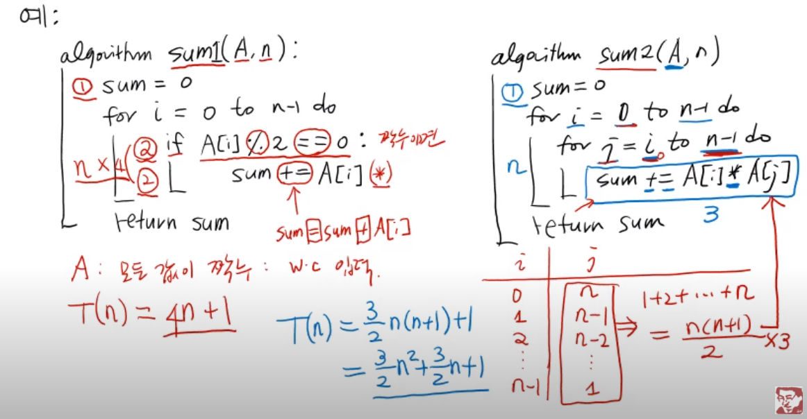
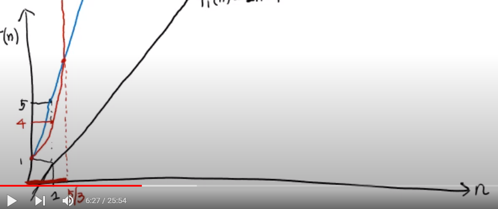

# 알고리즘 시간복잡도

자료구조와 알고리즘 성능1

- 가상컴퓨터( virtual machine) + 가상언어(Pseudo language) +가상코드(Psuedo code)
- 하드웨어 소프트웨어에 대해 독립적이게 된다
- 따라서 동일한 환경에서 알고리즘 성능을 계산 할 수 있음


### 가상컴퓨터

- 튜링모신 => 폰노이만( RAM(random access machine))
- RAM = CPU + memory + 기본 연산

- 기본연산: ==> 1단위 시간에 연산할 수 있는 연산
  - 개정, 대입, 복사연산 :
    - a = b ==> b의 값을 읽아서 a에 쓰기
  - 산술연산: 사칙 (나머지, 버림, 올림, 반올림등은 실제로 기본연산이 아님 but, 그냥 단위시간 내에 된다고 가정 할 것임)
  - 비교연산
    - a < b ===> a - b < 0 결국 뺄셈을 한번 한다는 뜻이기 때문에 단위시간내에 된다고 함
  - 논리연산
    - and, or, not 
  -  비트연산: bit and, or, not


### 가상언어(Pseudo language)

밑에와 같은 연산이 가능해야한다 ==> 이런 것들을 제공할 수 있다면 가상언어로 하면 된다

- 배정, 산술, 비교, 논리, 비트 논리 : 기본연산 표현가능하면 된다!
- 비교: if, else, elif
- 반복: for, while 
- 함수: 정의 호출, return


### 가상코드(Pseudo code)

 가상언어로 만들어진 코드를 말한다.

```python
def mx(A, n):
    c = A[0]
    for i in range(1,n):
        if c < A[i]:
            c = A[i]   *****   n-1번의 연산 + x2(두번 연산)  
    return c
# 이렇게 되면 기본연산 7회를 하게 된다.

```

A = [] 에서 n : input size

A의 리스트 개수에 마다 계산이 달라지게 된다

1. 모든 입력에 대해 기본연산 횟수를 더한 후 평균을 낸다. ==> 현실적으로 불가능하다
2. 가장 안 좋은 입력(worstcase input)에 대한 기본연산 횟수를 측정한다:
   Worstcase time complexity
   ==> 어떤 입력에 대해서도 wtc보다 수행시간이 크지 않다 !! 


#### 알고리즘 수행시간의 정의

= 최악의 입력에 대한 기본연산 횟수로 정의한다

ex) 함수 mx를 확인해보자

- if문 밑에 있는 문장은 조건이 맞아야만 수행되게 된다
- 따라서  \*\*\*** 에 있는 값까지 수행을 하게 만들때 worst case이다

T(n) = 2n -1


ex) for문이 하나일 때와 두개일때의 차이



출처: https://www.youtube.com/watch?v=ysn9dLDNLEU&list=PLsMufJgu5933ZkBCHS7bQTx0bncjwi4PK&index=4


## Big-O 표기법

알고리즘의 수행시간 = 최악의 경우의 입력에 대한 기본연산 횟수

최고차항만으로 간단하게 표기하자!

 

알고리즘1 : T1(n) =2n -1   ==> Big-O 표기법 : T1(n) = O(n)

알고리즘2 : T2(n) =4n -1  ==>  Big-O 표기법 : T2(n) = O(n)

알고리즘3 : T3(n) =3/2n**2 -1  ==>  Big-O 표기법 : T3(n) = O(n\*\*)

1. 알고리즘 2가 알고리즘1보다 2배느리다
2. 알고리즘3 n < 5/3(알2와 알3가 만나는 지점) 이면 알고리즘 2보다 빠르다
3. 모든 n에 대해서 알고리즘 3는 알고리즘 1보다 느리다
4. 알고리즘3 n > 5/3 이면 항상 알고리즘 2보다 느리다




- 알1, 알2는 선형적으로 증가
  - 최고차항 n // 증가율에 관점에서 봤을 때 알1과 알2는 같다고 볼 수 있음

- 알3는 제곱으로 증가
  - 최고차항 n**

**최고차항 n은 함수의 증가률을 결정한다**


ex) number of bits(n)

```python
def number_of_bits(n):
    cnt = 0
    while n > 0:
        n = n//2
        cnt == 1
    return cnt

#  n = 8 => 4 => 2 => 1 => 0
# 즉 n/2 => n/2*2 => n/2*2*2
# n/2**count = 1
# n = 2**count
#log2의 n = count 
# 이 기본연산은 log2의 n만큼의 연산을 하게 된다. 

# O(log2의n)


```


