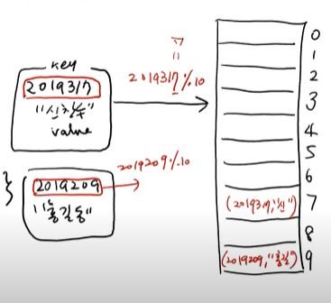
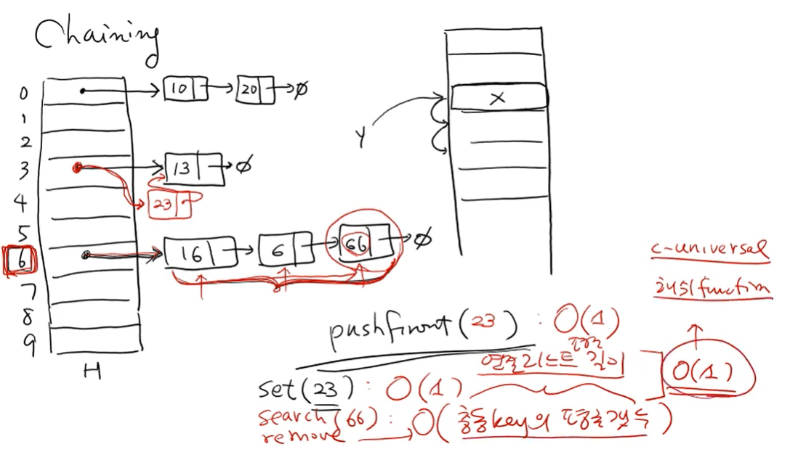
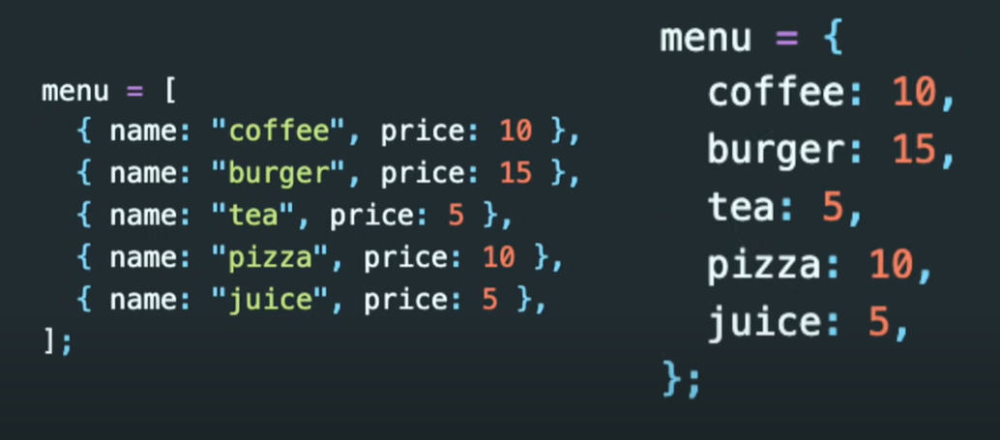
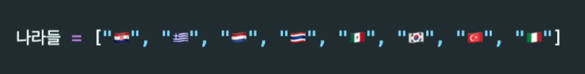
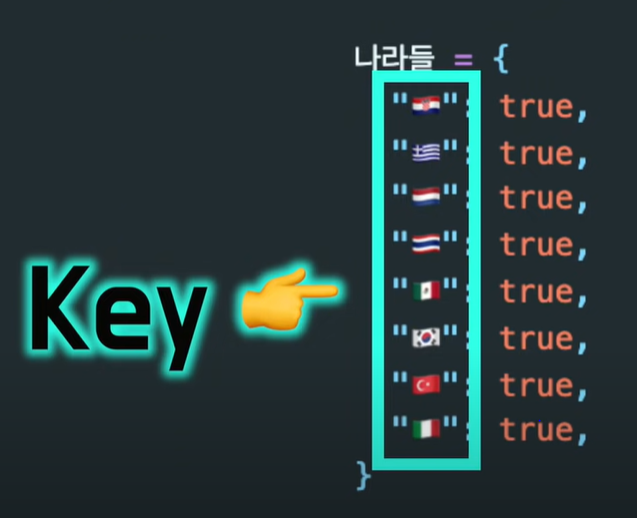

# Hash Table

- 실제로 많이 사용된다.

- 매우 빠른 평균 삽입, 삭제, 탐색 연산 제공

- 10으로 나눈 나머지의 그에 해당하는 인덱스에 집어 넣는다

- 서랍에서 원하는 물건을 찾는 것과 비슷한 원리이다.

- key 값 ==> index로 mapping
  - 나머지 함수 f(key)
  - f(key) = key % m    ==> 이것을 해쉬함수라고 한다
    - 다양한 해쉬함수들이 있다.

- 2019417 신찬수와 2018107 톰크루즈는 뒤에 같은 수가 있음
  - 즉 신찬수가 이미 들어가 있음
  - 이것을 collision이라고 함
  - 이것을 해결 ==> collision resolution method를 써야함

- 해쉬테이블의 중요한 것들

  - table 은 list로 관리 됨

  - hash function

  - collision resolution metod

### 해쉬 함수(hash Function)

- 각각 저장공간 : slot
- m slot ==> m개의 slot이 있다는 것

##### Division hash function 

- 나머지로 해쉬 함수로 보는 것

- f(k) = k % m
- f(k) = (k % p) % m  ==> 보통 이렇게 한다
  - p는 소수
- 단순하기는 하지만 충돌이 많이 일어난다
- 그래서 조금더 분산시키는 것이 좋다

##### perfect h f

- 하나도 충돌이 일어나지 않는 비현실 적인 해쉬 함수

##### universal h f

- Pr (f(x) == f(y)) = 1/m
  - f(x) == f(y)은 충돌이 일어난다는 뜻
  - Pr은 충돌이 일어날 확률
  - 즉 충돌이 일어날 확률은 slot의 개수와 반비례한다는 뜻
- Pr (f(x) == f(y)) = 1/m   ==> c - universal h f

##### multi, folding, mid-squares, extraction 여러가지 hash function 이 있다

additive(아스키 넘버 그담에 나눔), rotating, universal 

==> 실제로 사용되고 있다

#### 좋은 해쉬 펑션

- less collision
- fast computation ==> 가능하면 계산이 빨리 되어야한다.

## 충돌회피 방법

- collision resolution method

### Open addressing

- 주위에 빈칸을 찾아서 넣는 것
  - linear
  - chaining

- #### chaining

- 해쉬 테이블에서 링크 리스트를 해주는 것 (충돌시)
- set함수 => O(1)
- remove => O(충돌 키의 평균 개수)
- search => O(충돌 키의 평균 개수)
  - 하지만 hash function을 잘 사용했을 시 O(1) 가능
  - 그 hash function 중 하나는  c-universal

- 해쉬테이블을 사용하지 않았을때
  - 있는지 없는지 하나하나 봐야하기 때문에 시간이 오래걸림

- 사용했을 때
  - 이렇게 사용했을 땐 사용시간이 상수로 변함
  - 값이 있는지 찾아보기 위해서 단지 1번에 스탭만 필요하게 된다

해결 방법

- collision이 일어나면 그것을 하나의 배열을 더 만들어 준다
- 따라서 항상 시간복잡도가 상수인것은 아니다 왜냐하면 충돌이 일어날 때 배열을 만들었어서

