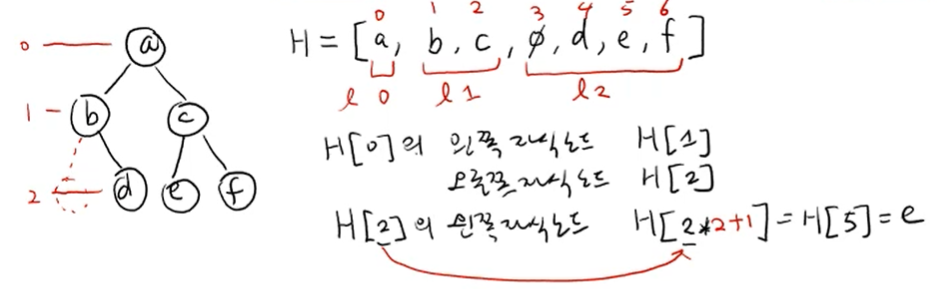
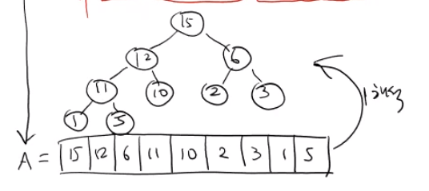
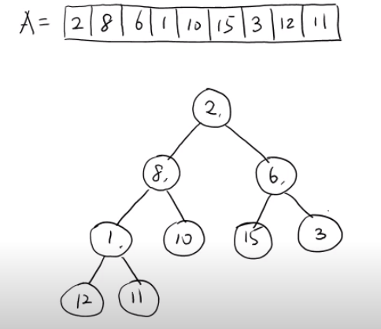
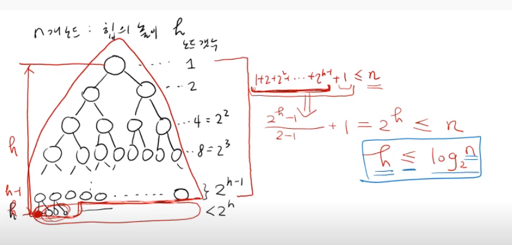
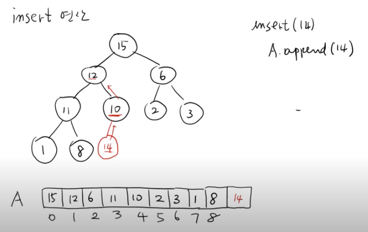

# Tree

## 1. 소개

연결리스트: 자식이 하나 밖에 없는 Tree이다  (일직선으로 되어 있기 때문에)

- Tree: 자식과 부모가 있는 무언가

- 이진트리: 하나의 부모가 2개의 자식까지 있는 모양(가장 간단하면서 많이 쓰이는 구조)


- 높이: 
  - 가장 높은 노드부터 leaf node까지 몇개의 링크가 있는지
  - 높이 = 레벨

- 경로(path): ex) 3 => 2 => 7 => 8 => 12
  - 어떤 노드에서 원하는 노드까지의 길

- 경로 길이(path length):  ===> 4
  - 엣지의 개수


### 표현법


- 표현법1: 리스트:  => level0 =>  level1=> level2 => .....  
  - 비어있으면 빈값으로 냅둔다 (None)
  - A = [a, b, c, None, d, e, f, None, None, h, i , g]


- 표현법2: 리스트 (재귀적으로 표현)
  - [a,[a의 왼쪽 부트리], [a의 오른쪽 부트리]]
  - a의 왼쪽=>[b , [  ] , [ d , [  ] , [  ]  ] ]     ///  a의 오른쪽=> [c, [ e , [  ]  ,[  ] ] , [ f ,  [  ] , [  ] ] ]
  - 위에 것을 다 합치면 된다.


- 표현법 3: 노드 class: 직접 노드 정의
  - key에서 두개의 멤버를 표현할 수 있도
  - 거기다가 parants를 또 만들수 있음
  - 총 key 값, parents. left, right 이렇게 기본 4개가 필요함


## heap

- 힙성질(heap property)을 만족하는 이진트리
- 힙은 max값과 min값을 구하는데 특화된 트리다
- None으로 쓸데없는 메모리가 차지되어 있는 트리를 이쁜 모양으로 만들어주는 것




- H[0] = a
  - 왼쪽 자식 노드 H[1]
  - 오늘쪽 H[2]


- H[2] = c
  - 매 레벨마다 자식이 두배씩 늘어나는 것을 이용
  - 왼쪽 자식 노드   H[2 * 2 + 1] = H[5] = e // H[2번 * 2배씩 증가 + 1]
  - 오른쪽 자식 노드  H[2 *2 + 2] = H[6] = f


- H[k] 
  ==> 즉 자기 인덱스에서 x2가 딱 자식노드 전에 있는 곳까지임 거기서 왼쪽 +1 , 오른쪽 + 2

  ==> 이게 가능 한 이유는 2배씩 값이 늘어나기 때문에 x2하면 딱 자식 전까지 가는 것임

  - 왼쪽 ==> H[2* k + 1]
  - 오른쪽 => H[2*k + 2]

  ==> 의의

  - 상수시간으로 자식노드와 부모노드의 위치를 찾을 수 있다


- H[k]의 부모 노드
  - H[( k - 1 ) // 2] 하면 부모노드를 찾을 수 있다


단점:

- 비어 있으면 다 None을 넣어줘야 한다. 
- 각 레벨마다 None을 사용해야하기 때문에 사용하지 않는 값이라도 차지하고 있음
- 즉 쓸모없는 메모리를 사용하고 있다는 단점이 있다. 


### 힙 성질

- 모든 부모노드의 키 값은 자식노드의 키 값보다 작지 않다

- ##### 부모노드의 key값 > 자식노드의 key값

- 이것을 힙이라고 한다



##### heap의 조건

- 모양
- heap성질을 만족


##### heap의 특징

- 루트 노드 : 가장 큰값 ==> A[ 0 ]

- 제공연산
  1. insert ==> heap성질에 맞게 잘 넣어주어야 한다. (logN)
  2. find-max => return A[ 0 ]  (O(1))
     - 즉 max값을 빨리 알기 위한 문제나 상황에서 힙을 사용하면 된다
     - 왜냐하면 A[0] 만으로 알수 있기 때문에
  3.  delete - (max O(logn))
     - 지우더라도 힙성질을 만족하면서 제거해주어야 한다.


### Make Heap

- 

- 힙성질을 만족하기 전



- 이것을 make heap을 해주어야한다 
- ==> heapify - down이라는 개념이 필요하다

####  heapify - down

- 최종 힙성질을 만족하는 값


- 1값의 make heap

  1. leaf node는 처음에 볼 필요가 없음 ==> 뒤에부터 탐색(11)

  2. 자식노드를 가지고 있는 곳까지 탐색한다

  3. 처음 나오는 부모노드는 1이다 A[3]

  4. A[ 3 ]의 자식노드 = A[3*2 + 1], A[3\* 2 +2 ] == A[ 7 ], A [ 8 ]

  5. 둘다 1보다 크다

  6.  그래서 누구랑 바꿔야해?? 둘중에 더 큰 값이랑 바꿔야함 ==> 1과 12를 바꿔야함

  7. 이렇게 되면 작은 heap이 만들어지게 된다. 

- 6값의 make heap
  1.  6의 왼쪽 자식(15)이 나보다 크다
  2.  6과 15의 자리를 바꿔준다
- 8값
  1. 8과 12를 바꿈
  2. 8이 왔는데 다시 나보다 큰 값이 자식노드에 있음
  3. 그럼 다시 11노드와 바꿔줘야한다.

- 2 값
  1. 2와 15 교환
  2. 2와 6 교환


```python
def make_heap(A):
    n = len(A)
    for k in range(n-1, -1, -1):
        # A[k] ==> heap성질 만족하는 곳으로
        heapify_down(k, n) # A[k]를 밑으로 내려 보내라/ 현재 힙에는 N개가 있다
        
def heapify_down(k,n):
    # A[k], n개의 값
    while A[k] != leafnode: #leaf에 가거나 자식노드의 값이 더 작을 경우까지
        L,R = 2*k+1, 2*k+2
        m = max(A[k], A[L], A[R]) # 3개중에 (자식2개, 부모 1개 중 가장 큰거)
        
        if A[k] != m: #즉 부모노드의 값이 가장크지 않으면
            A[k] <=> m #아마 이렇게 하는게 맞을듯 위치를 바꿔줘한다
            k = m            
        else:
            break
# wrst  ==> h는 높이
# O(h)
# 이유: 최악의 경우 leaf까지 내려가야하기 때문에


```



- 요점

  - N개의 노드를 가지고 있는 heap의 높이는 logN을 넘지 않는다

  - heapify_down : O(h) = O(logN) 
  - make_heap : O(nh) = O(nlogN)
    - 사실은 실제로 O(n)로 증명할 수 있다. O(n)으로 가능하다


### heap insert 연산



1. 리스트의 맨 마지막에 넣어준다
2. 힙성질을 만족 안함
3. 힙성질을 만족할때 까지 조정해줘야 한다.
4. 14를 위로 올려보내면서 자기자리를 찾도록 한다

5. 14와 10이 자리를 바꿈 , 14와 12를 또 바꿔줌


- 이 과정을 heapify_up이라고 한다
  - insert(14)
  - a.append(14)
  - a.heapify_up(9)  # 이때 9는 index번호이다 9번째
    - A[k]를 root 방향으로 이동하면서 heap성질을 만족하도록 하는 것

```python
def insert(n, idx): # O(logN)
    A.append(n)
    A.heapify_up(idx)
    
def heapify_up(k):  # A[k]를 heapify 해주면 된다.
    while k > 0 and A[(k - 1)//2 ] < A[k]:
        # k가 0이 됐다는 뜻 = 루트노드에 도달
        # and 부모값이 자신보다 작으면
        A[k], A[(k - 1)//2] = A[(k - 1)//2], A[k] # 값을 바꾸고
        k = (k-1)//2 # 현재 위치를 저장시켜주어야 한다
        
```


- find-max
- delete_max 구현하기

```python
def find_max:
    return A[0]

def delete_max:
    # 가장 큰값을 없애도
    # 가장 마지막 값인 leaf노드를 root로 넣어준다
    # 다시 heap성질에 맞도록 재배치해준다.
    # heapify_down을 해준다
    if lenn(A) == 0:
        return None
    
    key = A[0]
    A[0], A[len(A)-1] = A[len(A)-1, A[0]]
    A. pop()
    heapify_down(0, len(A)) # 0번째 인덱스를 내려줘라는 뜻, 뒤에 len은 개수
    return key
    
    
    
```

- 시간복잡도

  - make_heap: O(logN)
  - insert: O(logN)
  - find_max: O(1)
  - delete_max: O(logN)
  - heapity_down : O(logN)
  - heapify_up: O(logN)

- 여기는 search함수가 존재하지 않는다

  - 왜냐하면 정렬이 되어있지 않기 때문에 비효율적이다

- find_min, delete_min을 구하고 싶다??

  - root에 가장 작은값이 오도록 정의를 하고 정의하면 된다.

  - hea_sort

  - ```python
    for k in range(n):
        delete_max 
        # 여기서 값을 제거하지말고 그대로 두기만 하면 된다.
        # 그러면 제일작은 수가 위로 가고 큰수가 아래로 오게 된다.
    ```

  - 


