# Binary Tree

- 표현법 1
  - 배열, 리스트에 저장 ==> heap
  - 메모리상에 비효율적
- 표현법 3
  - 노드와 링크 직접 연결
  - Node class
  - BT class

- 특징
  - 루트노드 빼고 다 부모를 가지고 있음

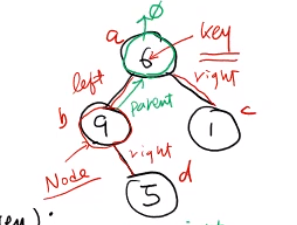

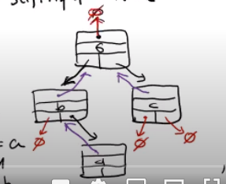

1. Node를 이용해서 위 그림과 같이 표현할 수 있다

```python
class Node:
    def __init__(self, key):
        self.key = key
        self.parent = self.left = self.right = None
        # 부모, 왼쪽, 오른쪽을 None으로 초기화 시킨다.

    def __str__(self):
        return str(self.key)

a = Node(6)
b = Node(9)
c = Node(1)
d = Node(5)

a.left = b
a.right = c
b.parent = c.parent = a
b.right = d
d.parent = b

# 하지만 이건 그냥 Node로 트리를 표현할 수 있다는 말이다
# 즉 insert하고 등등은 BT 클라스를 만들어서 생성 할 것이다
```


### 순회(traversal)

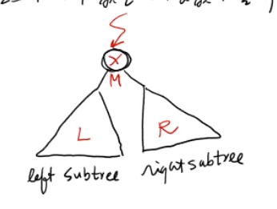

- 이진트리 노드의 key 값을 빠짐없이 출력하는 방법

  - 어느 쪽 먼저 방문할지를 정하는 것
  - preorder: M을 기준 M->L->R

  - inorder: L->M->R

  - postorder: L->R->M


####  preorder

- M->L->R
- F => B => A => D => C => E => G => I => H

#### inorder

-  L->M->R
- A => B => C => D => E => F => H => I

#### postorder

- L->R->M
- A =>  C =>  E =>  D =>  B => H =>  I => G => F

```python
class Node:
    def __init__(self, key):
        self.key = key
        self.parent = self.left = self.right = None
        # 부모, 왼쪽, 오른쪽을 None으로 초기화 시킨다.

    def preorder(self):  # 현재 방문중인 노드 = self  (MLR)
        if self != None:
            print(self.key)
            if self.left:
                self.left.preorder()
            
            if self.right:
                self.right.preorder()

    def inorder(self):  # 현재 방문중인 노드 = self 
        if self != None:
            
            if self.left:
                self.left.inorder()
            print(self.key)
            if self.right:
                self.right.inorder()


    def postorder(self):  # 현재 방문중인 노드 = self  
        if self != None:
            
            if self.left:
                self.left.postorder()
            
            if self.right:
                self.right.postorder()

            print(self.key)

    def __str__(self):
        return str(self.key)
```


#### re_construction

#### 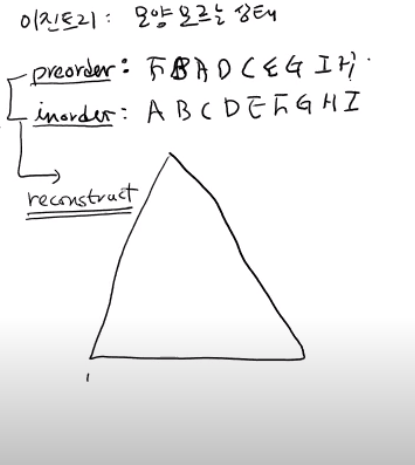

- 프리오더와 인오더를 확인하면서 모양을 추리해낼 수 있다 ??? 확이해 볼 것


### 이진탐색트리 (Binary search Tree) (BST)

- search하는데 특화된 트리구조이다
- 상당히 중요한 내용

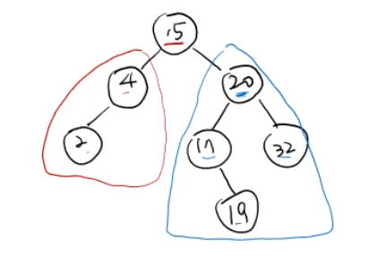

- 정의: (규칙)
  - 각 노드의 왼쪽 subtree의 key 값은 노드의 key값보다 작거나 같아야한다
  - 각 노드의 오른쪽 subtree의 key 값은 노드의 key값보다 커야 같아야한다
  - 왼쪽 자기보다 작
  - 오른 자기보다 큼

- 만약에 search(19) 를 한다면 15보다 크기때문에 무조건 오른쪽에 있음
- 약간 이진 탐색하는 방법과 비슷하다고 볼 수 있다.

- h(높이)만큼만 비교하면 찾을 수 있다 ==> h를 작게 할 수록 좋다
- O(h)라고 할 수 있다.


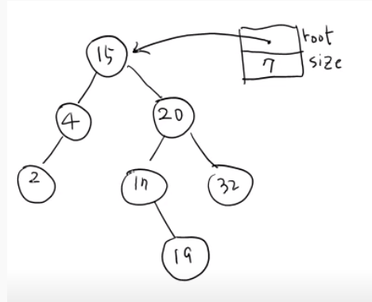

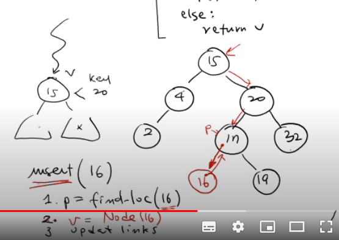


```python
class Node:
    def __init__(self, key):
        self.key = key
        self.parent = self.left = self.right = None
        # 부모, 왼쪽, 오른쪽을 None으로 초기화 시킨다.

    def __str__(self):
        return str(self.key)


class BST:
    def __init__(self):
        self.root = None
        self.size = 0

    def __len__(self):
        return self.size

    def __iterator__(self):
        return self.root.__iterator__() 
        # 무슨 소리인지 확인// iterator, generator 부분을 공부해보기

    def find_loc(self, key): 
        # key값의 노드가 있다면 그 해당노드를 return 해준다
        # 없다면 그 노드가 삽입될 부모나드를 리턴한다

        # 비었다
        if self.size == 0:
            return None
        p = None #부모노드 ==> root의 부모노드는 없기때문에 None임
        v = self.root # 처음 값
        while v != None:
            if v.key == key:
                return v

            elif v.key < key:
                p = v
                v = v.right

            else:
                p = v
                v = v.left

        # while문을 빠져나왔다는 뜻은 찾지 못했다는 뜻 ==> 부모 노드 리턴
        return p


    # 이부분 이해하고 다시
    # def search(self, key):
    #     v = self.find_loc(key)
    #     if v == None:
    #         return None
    #     else:
    #         return v

    #insert
    # 계속해서 찾다가 None이 나오거나 작은 값이 나오면 거기를 들어가면 된다.
    # 1. p = find_loc(16)
    # 2. v = Node(16)
    # 3. update links
    # 4. size증가
    def insert(self, key):  # O(h) 시간이 든다
        p = self.find_loc(key)
        # 
        if p == None or p.key != key:
            # 여기서 p.key != key의 의미는 key값들이 
            #중복이 되어 있지 않을 때라는 뜻

            v = Node(key)
            if p == None: 
                # 애초에 root Node라는 뜻이다
                # 왜냐하면 부모가 None인 노드는 root노드 밖에 없다

                self.root = v # root노드를 v로 바꿔줘

            else:  
                #p != , p.key != key
                # 뜻: p.key == key는 뜻은 중복이 되어 있다는 뜻다.
                # 왼쪽으로 가야할지 오른쪽으로 가야하는지 모른다
                v.parent = p
                if p.key >= key:
                    p.left = v
                else:
                    p.right = v

            self.size += 1

            return v
        else:
            print('key is already in tree')
            return None


        

# t = BST()
# print(t.root)
```


### 삭제 연산

- deleteByMerging

- deleteByCopy


- deleteByMerging

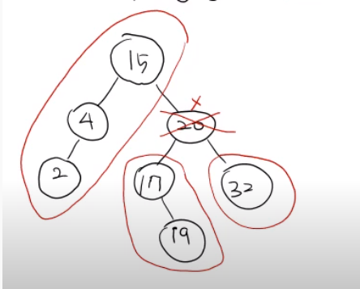

- 20을 그냥 삭제 할 수 없음
- 다른 노드들이 와서 link가 재구성을 해주어야함
- 왼쪽노드 = a, 오른쪽 노드 = b , 
- 왼쪽= L          오른쪽+R

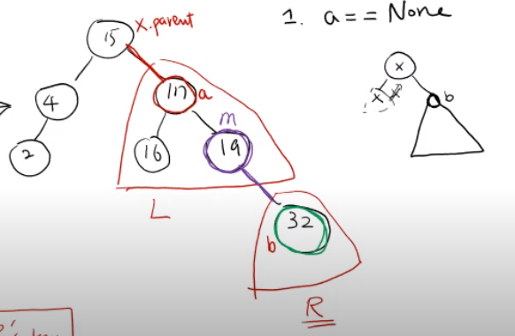

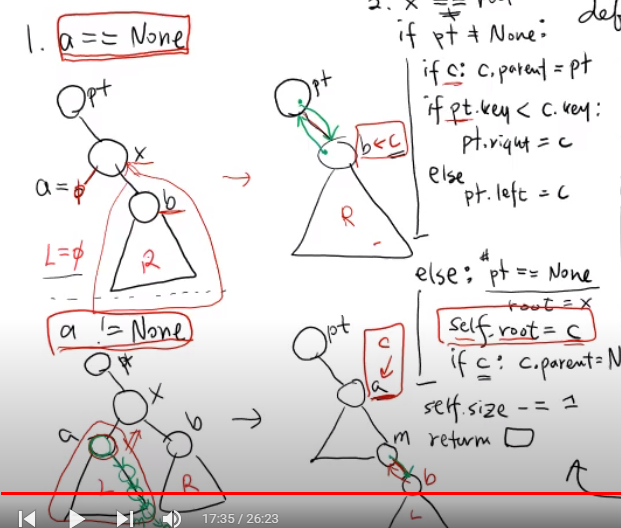


child

- 20의 위치에 L을 넣는다
- 오른쪽에 있는 32가 19에 붙게 된다

- L에 들어있는 key값은 R에 있는 key 값보다 커야 한다.
- 즉 L에 있는 노드중에서 가장 큰 key값의 오른쪽 child로 R값을 가져야 한다.

parent

- 17의 부모노드와 15의 자식노드도 수정이되어야한다
- 서로 연결을 시켜줘야한다.


경우들

- a == None일때 
  - b가 x자리를 대체하면 된다
- x == root일때 (지우려고 하는 것이 루트일때)
  - 따로 생각해줘야한다

```python
def deleteByMerging(self, x):
        a = x.left # 왼쪽 노드
        b = x.right # 오른쪽 노드
        p = x.parent # parents

        # c는 x자리를 대체할 노드
        # m = L 에서 가장큰 노드

        if a != None: #왼쪽 노드가 존재 할때

            c = a # 대체할 것임
            m = a # m은 a부터 시작

            while m.right:  # L에서 가장 큰 노드를 찾는 중
                m = m.right
                # --> m이 L에서 제일 큼 

            # m의 오른쪽 자식노드로 b를 연결한다

            if b != None: # R이 존재 할때
                b.parent = m

            m.right = b 
            # b가 None이어도 상관이 없는게
            # m right가 none이면 되기 때문

        else: # a == none일때
            c = b

        # parant와의 관계를 update해주어야 한다.
        if p != None:
            if c:
                c.parent = p

            if p.key < c.key:
                p.right = c

            else:
                p.left = c

        else: # p == None: ==> root ==> root를 지워달라는 뜻
            self.root = c
            if c:
                c.parent = None
            
        self.size -= -1
```


### delete by copying

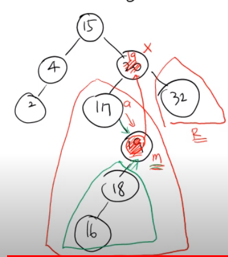

- 왼쪽에 가장 큰 값을 찾아서 자신하테 보내준다
- 직접 구현해보기

- 19값을 카피해서 x에 오도록 한다
- 그리고 18을 17로 옮기도록 한다
- 둘다 O(h) 시간이 든다


균형을 맞춰주어야 한다

그래야 높이를 작게 만들수 있다

그것을 ==> 균형 이진탐색 트리라고 한다.

다음 시간에 계속


