# Balanced BST

- 균형이 생겨진 이유는 이진트리의 h를 줄이기 위함이다

- 이진트리가 굉장히 비효율적일수 있기 때문이다

- O(logN)을 최대한 맞춰주는 즉 h를 logN으로 맞춰주려고 노력해야한다


- 종류
  -  AVL트리
  - Red-Black Tree
  - (2,3,4) Tree
  - Splay Tree


트리의 일부를 회전시켜서 h값을 줄이는 방법


- 오른쪽으로 회전?
  - z를 기준으로 오른쪽으로 회전한다
  - x가 z로 간다
  - A <= x < B <= z < c 
    - (이 표가 필요한 이유는 회전시에 편하게 하기 위해서)
    - 따라서 이 부호를 먼저 그려놓고 하자
  - 원래 z의 부모는 x의 부모가 되어야하고
  - 왼쪽에 있는 서브 트리가 한단계 올라가고
  - 오른쪽은 한단계 내려간다
  - 즉 균형을 맞춰준다 
  - ==> 한 level 줄어들게 된다.

- 약간 약간 한쪽으로 치우쳐져있는 추를 당겨서 균형을 맞춰주는 느낌이다

- A <= x < B <= z < c 
  - 중심이 되는거 기준으로 두칸씩 떨어져서 각각의 부모를 맡으면 트리가 완성된다.
  - 즉 오른쪽 rot을 하면 두칸 띄어져있는 원소가 root를 맡으면 된다.

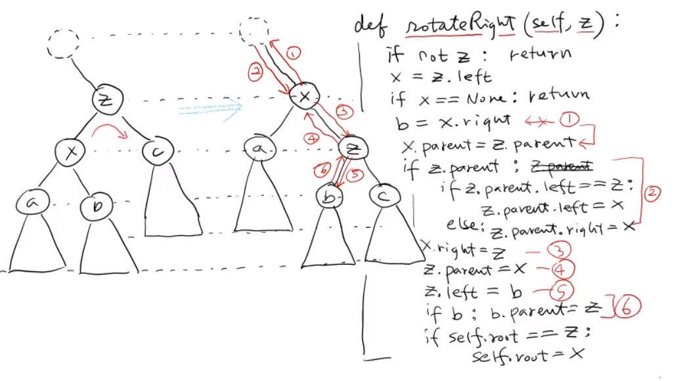

```python
def rotateRight(self, z):

    if z == None:
        return
    x = z.left
    if x == None:
        return
    
    b = x.right
    
    # 1
    x.parent = z.parent
    
    #2
    if z.parent != None:
        if z.parent.left == z:
            z.parent.left = x
        else:
            z.parent.right = x
    #3
    x.right = z
    #4
    z.parent = x
    z.left = b
    if b != None:
        b.parent = z

    if self.root == z:
        self.root = x
```


## AVL트리 (Adelson-velsky, Landis)

- 1964년도 꺼, 가장 오래된 트리
- 높이가 2logN을 넘지 않는다는 것을 증명할 것이다. 

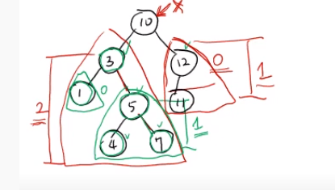

- 정의
  - 모든 노드에 대해서 노드의 왼쪽 부트리와 오른쪽 부트리의 높이차가 1이하인 BST 

- h = 0


- h = 1인 AVL트리


- h = 2인 AVL트리

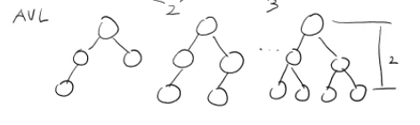

- Nh = 높이가 h이고 AVL 트리중에서 최소 노드 갯수
  - N0 = 1 
  - N1 = 2  
  - N2 = 4   
  - N3 = 7
  - Nh = Nh-1 + Nh-2 + 1
    - 왼쪽: Nh-1 루트노드를 뺐기때문에 높이가 1준다
    - 오른쪽: 루트노드 하나 뺴고, 왼쪽보다 1만큼  높이가 낮아야하기 때문에 h-2가 된다 
    - 그리고 +1을 하는 이유는 본인 루트노드를 더해주면 되기 때문에 +1하는것
    - 이렇게 최소의 노드갯수를 계산할 수 있다.

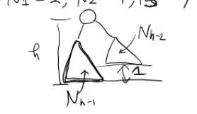

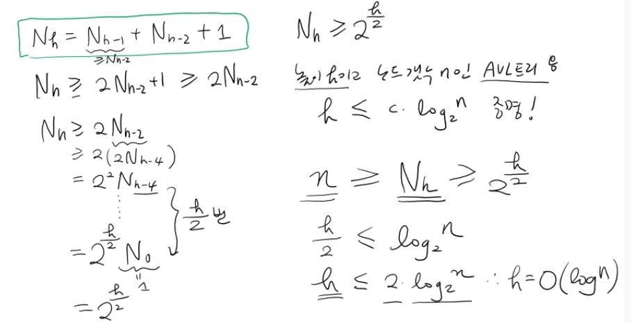

- (최소노드) Nh = Nh-1 + Nh-2 + 1
- Nh >=  2\*Nh-2 + 1 >=2*Nh-2
  - 이유
    - Nh-1은 Nh-2보다 항상 크거나 같기 때문이다.  따라서 2배로 곱해준것
    - 즉 Nh-1을  Nh-2로 치환시키고 부등호를 준것이다
- Nh >=2*Nh-2 이것을 반복하다보면
- Nh >=2*( 2 Nh-4)  .. .. . . .. . .
- 즉  Nh >= 2 **(h/2) 
  - 최소 이만큼의 노드개수를 가지고 있어야 한다
- 높이가 h이고 노드갯수 n인 AVL트리
  - h <= c logN 증명!
  - n > Nh >=   2 **(h/2) 
- 즉 h를 O(logN)만큼의 시간복잡도를 유지할 수 있다는 뜻이다

- h는 최악의 경우 2logN만큼의 높이를 갖는다는 뜻이다
- 즉 시간 복잡도로 표현할 경우 O(logN)를 갖는다는 뜻이다
  - 왜냐하면 이진트리의 시간복잡도는 O(h)를 가지고 있기 때문이라고 할 수 있다. 


#### AVL 삽입 연산

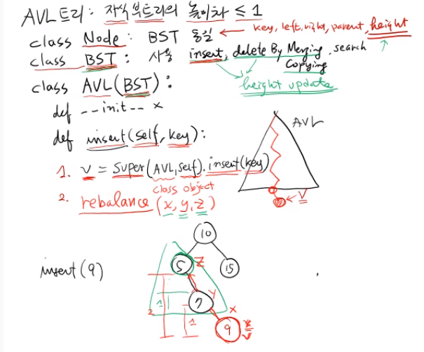

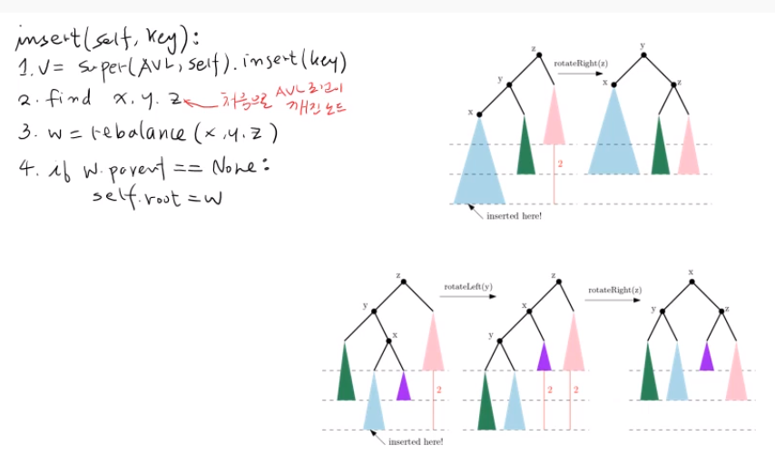

- AVL트리의 장점
  - rotation 1~2회로 전체의 균형을 항상 잡을 수 있다.
- 복잡도
  - insert => O(h) = O(logN)
  - find     =>  O(h)
  - w => O(1)
  - parent root O(1)
    - 총수행시간 O(logN)

```python
class AVL(BST):
    # 상속을 받아온다
    # 노드에는 각각의 left right parant등등이 있었다
    # 하지만 AVL트리에서는 hieght라는 정보가 필요하다
    # 왜냐하면 정의자체가 왼쪽 부트리와 오른쪽 부트리의 h의 차가 1이하인 트리이기 떄문
    # 즉 서로의 높이차가 1이하인지 따져줘야한다.

    # insert, delete등등은 높이가 달라지게 된다
    # 따라서 height의 정보가 업데이트를 해줘야한다. 

    def insert(self, key):
        '''
        순서:
        # xyz가 일자인 경우 ==> 그림 1과같이 진행 ==> rotation1회로 가능
        # xyz가 지그재그인 경우 ==> 그림 2와같이 진행 ==> rotation 2회를 해주어야 한다.
        # 두가지 경우를 따져줘야한다

        1. v = super(AVL,self).insert(key)
        2. find xyz 
            (위에서부터 z는 처음으로 AVL조겅이 꺠진 노드)
            (y는 z의 자식노드)
            (x는 y의 자식노드 사진 참조)
        3. w = rebalence (x,y,z)
        4. if w.parent == None:
            self.root = w
        '''
        # 1
        v = super(AVL,self).insert(key) # 현재 클래스의 이름과 객체를 말해주면 된다.

        # 2. 
        # rebalance를 해주어한다.
        # z를 찾아줘야한다 (균형이 맞지 않는 부모노드)
        # z가 존재할때와 아닐때를 나눠줘야한다

```


#### AVL 삭제연산

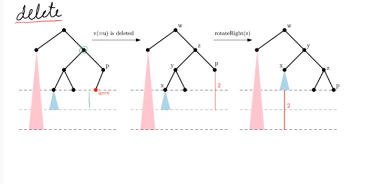

- x, y, z를 찾는 것이 insert와는 조금 다른다

  - insert같은 경우에는 삽입될 곳에서 올라가면서 찾게 된다

  - 하지만 delete 경우 더 무거운 쪽에서 x, y, z를 찾아야한다
  - 즉 없어진 곳은 p부분이지만 왼쪽 부트리 부분이 더 무겁기 때문에 그쪽에서 x,yz를 찾아주게 되는 것이다.
    - (무거운 쪽 ): 그림에서 파랑색 부분
    - 이유는 무거운 쪽에서 가벼운 쪽으로 rotation을 잡아줄 것이기 떄문이고
    - 가지를 뻈다가 붙일 일이 있는 곳이 무거운 쪽이기 때문이다
    - 가벼운 쪽은 그냥 단지 가만히 내려가기만 하면 된다.


- 여기만 맞춰줬다고 해서 균형이 맞는 것이 아니다
  - 즉 분홍색부분과 파랑색 부분이 h가 2차이가 난다
  - 따라서 계속 깨져있는지 봐야하는건가??
  - 그렇다 계속 올라가면서 균형이 맞는지를 계속 확인을 해줘야한다
  - rotation이 여러번 일어날 수 있다 (최악의 경우)
    - O(logN)번 rotation이 일어날 수 있다


```python
    def delete(self, u):
        v = super(AVL, self).deleteByMerging(u)
        # v는 u라는 노드를 지워서 균형이 깨질수 있는 가장 깊은 노드를 반환해주게 된다
        # 즉 그림에서는 p가 된다
        # 따라서 return해줘야하는 값이 parent라고 delete함수에서 정의해준것이다.
        while v != None:
            if v is not balanced: # 수도 코드임
                z = v
                if z.left.height >= z.tight.height:
                    y = z.left
                else:
                    y = z.right

                if y.left.height >= y.right.height:
                    x = y.left

                else:
                    x = y.right
            v = rebalence(x,y,z)

            w = v
            v = v.parent
        # while문에서 빠져나왔을 떄는 v == None상태가 된다
        # v가 None이라는 뜻은 root노드의 부모가 되었다는 뜻이고
        # w가 root가 되었다는 뜻이다
        # 즉 끝까지 올라갔다는 뜻이 된다.
        # rotation은 돌리지 않더라도 부모노드에서 균형이 맞는지 아닌지를
        # 계속해서 봐줘야하기 때문에 그렇게 되는 것이다.
        # w == root가 된다
        self.root = w
```

- 정리
  - 높이: <= 2logN
  - insert
    - rebalence 1회/2회 회전
  - delete
    - rebalence 매 level에서 회전


## Red-Blck Tree

- 가장 유명하고 많이 사용되는 균형이진 탐색 트리
- 장점: AVL보다 좋은 것은 delete부분에서 회전수가 3번만 들어감 그래서 빠르게 delete를 빠르게 할 수 있다
- 단점: 코딩하기가 복잡하다

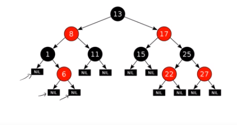

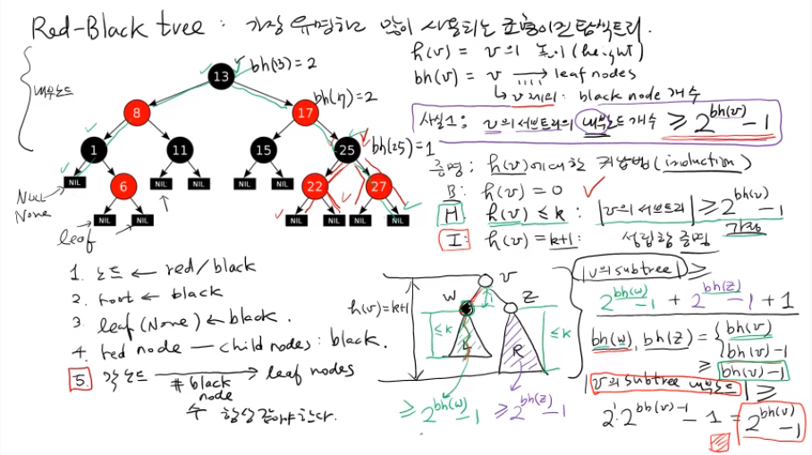

- 여기서는 None노드를 독립된 노드로 둘 것
- 그리고 None이 leaf노드로 볼 것이다
- 그리고 나머지를 내부 노드라고 불린다.

- 규칙

  - 노드 ==> red/balck
  - root ==> black
  - leaf(None) ==> black
  - red node ==> child node모두 색이 블랙이어야 한다. 
  - 각 노드에서 leaf nodes로가는데 이때 거치는 black node의 수가 항상 같아야한다.

  - 모든 노드가 이런 조건을 맞아야한다.

- 이진탐색트리이기 떄문에 O(logN)을 만족해야한다.

- bh(v) :  v에서 leaf node에서 블랙은 같아야한다
  - 이때 v를 제외한 black node 개수를 의미한다.

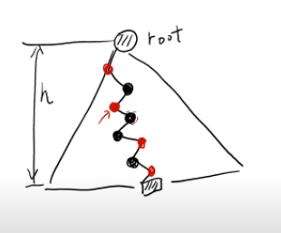

- 사실1

  - ##### v의 서브트리의 내부노드의 개수는 최소한 >= 2**bh(v)   -   1

- 사실 2

  - ##### black 노드의 수 >= h/2이다

  - ##### 즉 bh(root) >= h/2

    - 이유: 
      레드의 자식은 항상 블랙이어야 하지만 블랙노드의 자식은 레드블랙 상관없기 떄문이다

  - ##### red-black tree의 노드의 갯수 >=  2**bh(v)   -   1

  - ##### red-black tree의 노드의 갯수 >=  2**h/2 -   1

  - ##### h <= 2log(n+1) 아무리 커봐야 이것이다

  - 따라서 h= O(logN)이 된다.


#### Red-Black: 삽입연산 O(logN)

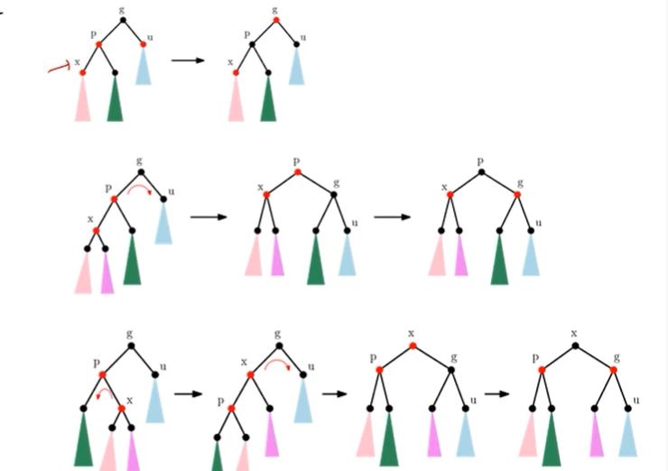


1. bst의 insert연산을 호출해서 새로운 노드 삽입

2. x.color = red

3. 4가지 경우로 나뉜다.

   - x = T.root 일 경우 => 아무것도 없는데 넣은것

     - 색깔은 black으로 바꿔줘야한다. x.color = black

   - x.parent.color == black이면 아무것도 안한다

   - x.parent.color == red 이면

     - 인접한 노드는 무조건 black이었을 것

     1. x.uncle.color == red 인 경우 ==> 그림 1번
        - grand를 red로, parent를 black으로 바꾼다
        - 또하나 주의해줘야 하는점: leaf노드까지 black의 개수가 항상 같아야 한다. 
        - grand의 balck을 양쪽 child node 즉 parent와 uncle에게 나누어 주었기 때문에 전체 black의 색깔은 바뀌지 않는다.
     2. x.uncle.color == black인 경우 ==> 그림 2,3
        1. x, x.parent, x.grand : linear ==> 그림 2
           - right rotation 하고 ==> 색깔을 바꿔준다
        2. x, x.parent, x.grand : triangle==> 그림 3
           - 두번의 회전을 시키고 색을 그림과 같이 재배치 한다


## 234 Tree

- 이진트리가 아니다 즉, 자식노드가 2,3,4가 될 수 있다.
- 조건:
  - 자식노드 개수 = 2,3,4
  - 모든 리프노드가 같은 level에 존재
  - 왼쪽 노드는 부모노드보다 작음
  - 오른쪽은 부모노드보다 큼
  - 중간은 부모노드의 사이에 있음

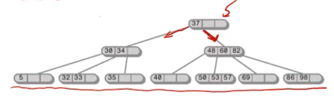


#### insert  개념 O(logN)

- 항상 leaf노드에만 insert가 된다. 


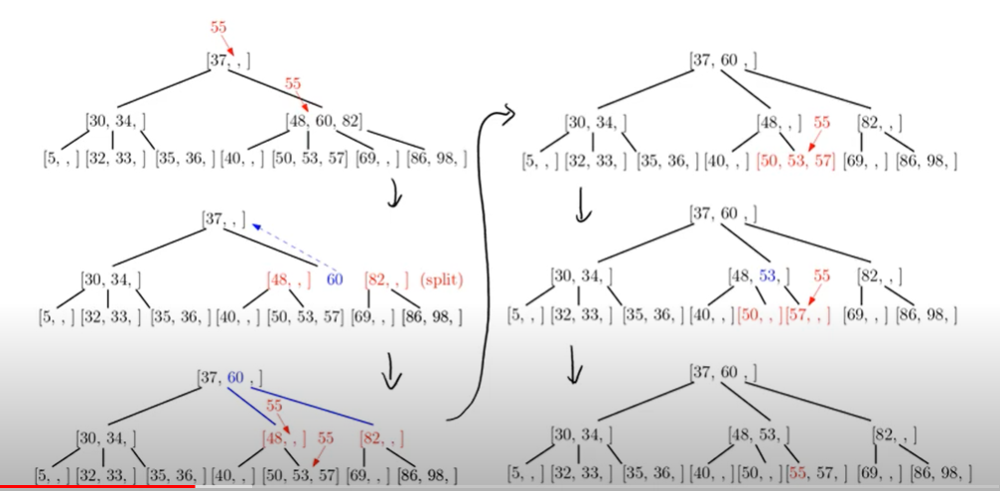

- 위 경우는 isnert를 했는데 그곳에 3개의 값이 모두 저장이 되었을 때를 의미한다
  - 즉 삽입할 공간이 없을 때
- 4노드를 만나면 split하면서 leaf노드까지 내려감!
  - 새로운 공간을 만들면서 간다는 소리임
  - how? 
    - 가운데 값을 부모로 올린다.
    - 그럼 왼쪽값과 오른쪽값으로 나눈다 
    - 또 3개로 가득 차있을 경우 ==> 하지만 4개 노드가 아님 그치만 위에는 공간이 있음
    - 가운데를 올리고 오른쪽 왼쪽으로 노드가 나뉜다
    - 위에 부모 노드가 없다면 하나 만들어 주어야한다.


#### delete(x) ==> O(logN)


- 지우고 싶은 값이 leaf노드에 없다면 
  - 만약 20을 지우고 싶다면 다음수를 찾는다 ==> 22
  - 그리고 그 값을 바꾼다 20과 22를 교환함
  - 그리고 리프노드에 있는 20을 지운다
    - 즉 지우고 싶은 값이 있으면 leaf까지 내려다 줘야한다.
  - 서세스는 항상 리프노드에 있다

- 234 노드는 적어도 자식이 2개는 가지고 있어야 한다
  - 2 노드를 만나면 ==> 3노드로 바꿀 것이다
  - 왼쪽이나 오른쪽의 형제 노드를 본다
  - 둘중에서 왼쪽 = 3노드 오늘쪽 2노드
  - 옆 형제에서 꼬을수 있는지를 확인한다
  - 약간 로테이션 처럼 가져온다
  - 15를 위로 보내고
  - 30을 밑으로 보낸다
  - 18을 중앙의 왼쪽 노드로 만들어 준다
- 오른쪽 그림
  - 왼쪽 오른쪽 모두 2노드이다
  - 위에 부모의 20노드와 왼쪽 오늘쪽을 합친다
  - 그럼 2노드 2노드가 ==> 4노드 하나짜리로 바뀐다
- 아래 그림
  - 루트노드가 2노드이다
  - 루트노드가 2노드면 바로 4노드로 바로 바꾸지 않는다
  - 그리고 자식노드로 내려간다
  - 자식노드 두개 다 2노드를 가지고 있다면
  - 아예 다 합쳐버린다


#### 2,3,4트리와 red-black tree의 관계

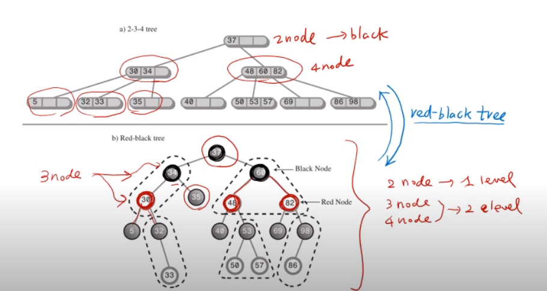

- 2노드는 ==> black으로 바꾼다
- 블랙을 중심으로 양쪽 red와 합친다
- 


