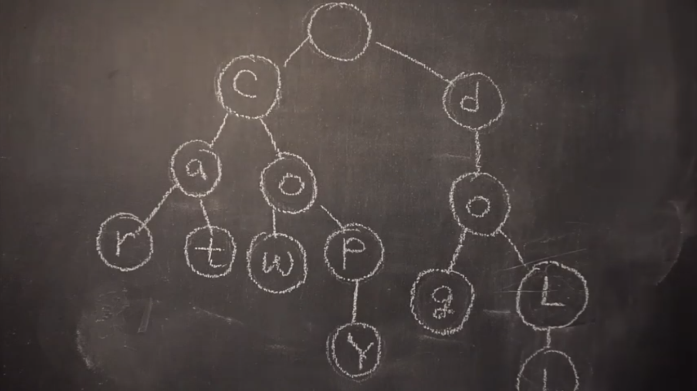

# 11.Trie

## 01 Trie란?

- **문자열**을 검색하기 위한 검색 트리
- **자동완성 기능** 등 문자열을 탐색하는데 특화되어 있는 자료

## 02 Trie 구조

- 문자하나에 **하나의 알파벳**이 저장, 
- **links(자식 노드들)**가 저장되어 있음
- **isEnd** : 문자의 끝을 표시
  - car, card를 구분하기 위함
- add, search 구현

## 03 Trie의 장단점

#### 장점

- **O(M), <M : 문자의 길이>**
  - 문자열을 사용할 때 빠르게 찾을 수 있다

#### 단점

- 메모리의 크기가 너무 크다
  - **O(포인터 크기 \* 포인터 배열 개수 \* 총노드의 개수)**
  - 1000자리의 문자열이 1000개만 들어온다 하더라도 100만개의 노드가 필요
  - 포인터의 크기가 8byte라고 하면 => 200MB의 메모리가 필요
- 해결?
  - map, vector를 이용하여 필요한 노드만 메모리를 할당하는 방식들을 이용한다.
  - 하지만 최적화가 꽤나 까다롭다고 한다.

