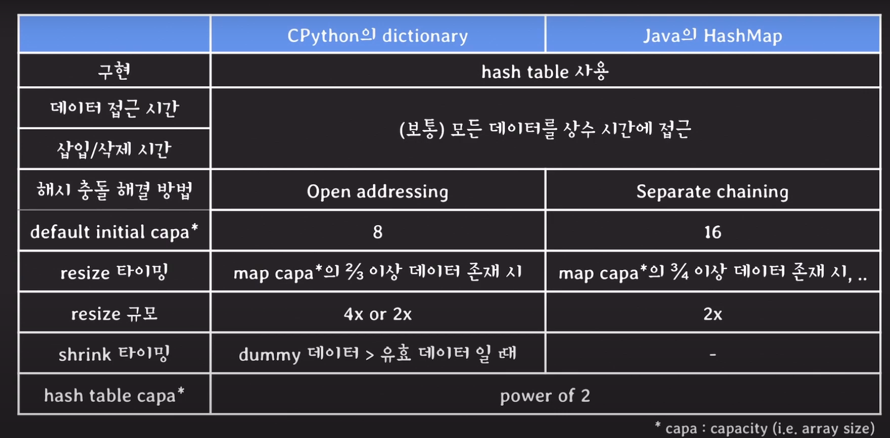

# cs_01_set

## 01_Hash Table

### 1-1 ) Map

- key value pair 들을 저장하는 ADT
- 같은 key를 가지는 pair 는 최대 한개만 존재
- associative array, dictionary라고 불리기도 함

### 1-2 ) Map의 구현체

- hash table
- tree-based

### 1-3) hash table이란?

- **배열과 해시 함수**를 사용하여 map을 구현한 자료구조

- 상수시간으로 데이터에 접근 ==> 빠름

  

### 1-4 ) Hash function

- 임의의 데이터를 정수로 변환하는 함수
- output이 균등하게 나누게 하는 function이 중요하다.

### 1-5 ) Hash collision 해결방법

- open addressing : 비어있는 버킷에 저장 ==> 자바: 75%가 차면 2배로 늘림
- separate chaining : 링크드 리스트로 저장

자바와 파이썬

"파이썬 3.2.x 까지는 dictionary의 유효한 데이터 수가 5만개 이상이면 유효 데이터 수의 두 배를, 그렇지 않다면 네 배를 새로운 capacity 크기로 결정하구요, **현재 파이썬 3.10.x 기준으로는 일반적으로 (dictionary의 유효 데이터 수 x 3)과 같거나 큰 수 중에서 가장 작은 2의 배수를 새로운 capacity 크기로 결정합니다"**

"shrink 타이밍이 독립적으로 있는 것은 아니구요, resizing을 수행할 때 만약 dictionary에 더미 데이터가 많고 유효한 데이터는 적은 상태라면, 유효한 데이터 수를 기준으로 새로운 capacity가 정해지기 때문에, 자연스럽게 새로운 capacity는 이전보다  작게 잡힐 수 있습니다" 

## Set이란?

- 데이터를 저장하는 추상자료형
- 순서를 보장하지 않음
- 데이터 중복을 허용하지 않음
- 데이터 조회가 List보다 빠름

## Set의 구현체

- Hash set
- linked hash set (java)
- tree set(java)

## Hash set

- Hash table을 사용하여 구현한다.

