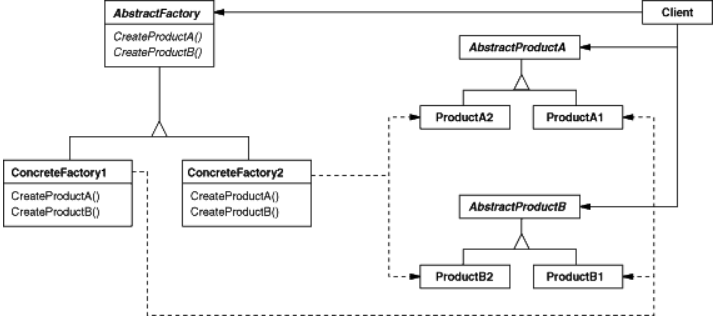

# 02_Abstract Factory

https://robin00q.tistory.com/84?category=984980


### 사용이유

- **화이트모드와 다크모드의 경우**에 달라지는 화면을 요구받았을 때
- 즉 서로 관련성이 있거나, 독립적인 여러 객체를 생성하기 위한 인터페이스를 제공


**요구사항**

- 화이트 모드 : 배경 **흰색**, 폰트는 **볼드**, 크기 **10**
- 다크 모드 : 배경 **검은색**, 폰트는 **ITALIC**, 크기 **12**


## 변경전

```java
public class Window{
    private Font font;
    private Color color;
    
    public void setFont(Font font){
        this.font = font;
    }

    public void setColor(Color color){
        this.color = color;
    }
}
```

```java
public class WindowCreate{
    public Window createWindow(Mode mode){
	    Window window = new Window();
        
        switch (mode){
            case DARK:
                Font font = new Font();
                font.setSize(10);
                font.setType(Type.BOLD);
                window.setFont(font);
                
                Background background = new Background();
                background.setColor(Color.WHITE);
                window.setBackground(background);
                
            case WHITE:
                Font font = new Font();
                font.setSize(12);
                font.setType(Type.ITALIC);
                window.setFont(font2);
                
                Background background = new Background();
                background.setColor(Color.BLACK);
                window.setBackground(background2)
        }
        
    }

}
```

- 이렇게 구현을 했을 때 업데이트를 통해 **기획서가 변경**

  - 화이트 모드 : 배경 **흰색**, 폰트는 **볼드=>ITALIC **, 크기 **10**

  - 다크 모드 : 배경 **흰색**, 폰트는 **ITALIC=>볼드**, 크기 **12**

    

- 단점

  - Creator쪽의 코드가 복잡해진다.

    - 모드가 출시될 때마다 코드가 증가함

      

  - 모드가 변경되는 경우 Creator측의 코드가 수정되어야 한다.

    - 즉 변경에 유연하지 못하다.




- 추상 팩토리로 변경


배경

```java
public abstract class Background {
    public abstract Color getColor();
}

public class BlackBackground extends Background {
    @Override
    public Color getColor() {
        return Color.BLACK;
    }
}

public class WhiteBackground extends Background {
    @Override
    public Color getColor() {
        return Color.WHITE;
    }
}
```


폰트

```java
public abstract class Font {
    public abstract int getSize();
    public abstract Type getType();
}
```

```java
public class BlackFont extends Font {
    @Override
    public int getSize() {
        return 10;
    }

    @Override
    public Type getType() {
        return Type.BOLD;
    }
}
```

```java
public class WhiteFont extends Font {
    @Override
    public int getSize() {
        return 12;
    }

    @Override
    public Type getType() {
        return Type.ITALIC;
    }
}
```


팩토리

```java
public abstract class WindowFactory {
    public abstract Background createBackground();
    public abstract Font createFont();
}

public class BlackWindowFactory extends WindowFactory {
    @Override
    public Background createBackground() {
        return new BlackBackground();
    }

    @Override
    public Font createFont() {
        return new BlackFont();
    }
}

public class WhiteWindowFactory extends WindowFactory {
    @Override
    public Background createBackground() {
        return new WhiteBackground();
    }

    @Override
    public Font createFont() {
        return new WhiteFont();
    }
}
```


생성

```java
public class WindowCreator {
    public Window createWindow(WindowFactory windowFactory) {
        final Window window = new Window();
        final Background background = windowFactory.createBackground();
        final Font font = windowFactory.createFont();

        window.setBackground(background);
        window.setFont(font);

        return window;
    }
}
```

- 이런 경우에는 Creator부분을 전혀 변경되지 않는다.
- 따라서 화이트모드가 변경이 필요하면 화이트 모드 부분만 만지면 된다.


### 장점

- 책임이 분리된다.
- creator에는 font사이즈가 몇인지 몰라도 된다. (캡슐화)
- 변경에 유연하다.


