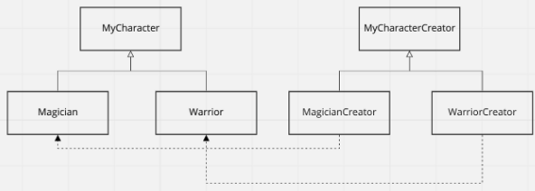

# 03_Factory Method


## 사용 이유

- 객체생성의 인터페이스를 제공하며, 객체의 생성은 서브클래스가 수행하도록 한다.


## 장점

- **객체 생성에 관련된 코드**와 **동작 코드를 분리**할 수 있습니다.


## 전사/ 마법사 캐릭터 생성

- 전사

  - 시작 체력 및 마력 100

  - 레벨업시 증가하는 체력 마력 20/10

    

- 마법사

  - 시작 체력 및 마력 100
  - 레벨업시 증가하는 체력 마력 20/10





```java
public abstract class MyCharacterCreator {

    public MyCharacter createNewCharacter() {
        
        // 이 부분에서 factory 메소드가 사용됨
        final MyCharacter character = createCharacter(); 
        character.setHp(100);
        character.setMp(100);
        return character;
    }
    
    // Factory Method
    protected abstract MyCharacter createCharacter();
}

public class WarriorCreator extends MyCharacterCreator {
    
    // Factory Method ==> 를 사용하는 것
    @Override
    protected MyCharacter createCharacter() {
        return new Warrior();
    }
}
public class MagicianCreator extends MyCharacterCreator {
    @Override
    protected MyCharacter createCharacter() {
        return new Magician();
    }
}
```


```java
@Getter
@Setter
public abstract class MyCharacter {

    protected int hp;
    protected int mp;

    public abstract void levelUp();
}
 
```

```java
public class Warrior extends MyCharacter {
    @Override
    public void levelUp() {
        this.mp += 10;
        this.hp += 20;
    }
}
public class Magician extends MyCharacter {
    @Override
    public void levelUp() {
        this.hp += 10;
        this.mp += 20;
    }
}
```


**호출**

```java
// 마법사를 생성할 때
public static void main(String[] args) {
    final MagicianCreator magicianCreator = new MagicianCreator();

    final MyCharacter character = magicianCreator.createNewCharacter();

    character.levelUp();
}

// 전사를 생성할 때
public static void main(String[] args) {
    final WarriorCreator warriorCreator = new WarriorCreator();

    final MyCharacter character = warriorCreator.createNewCharacter();

    character.levelUp();
}
```
