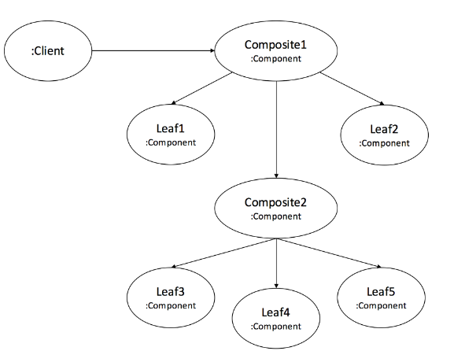
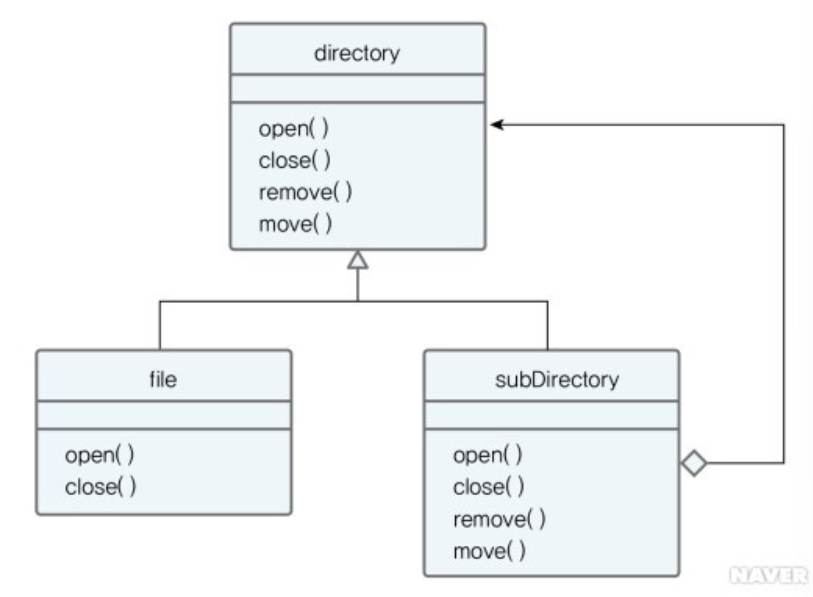
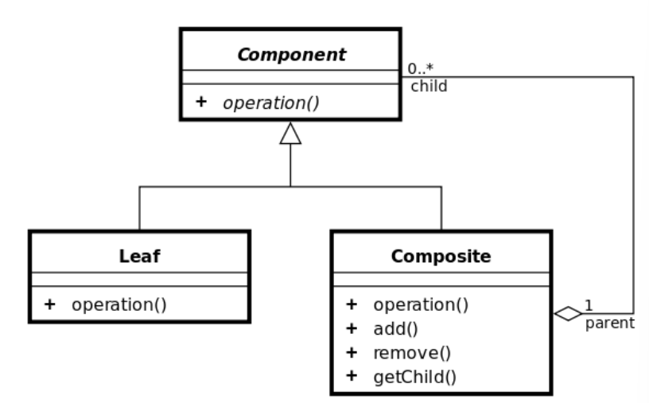

# 05_Composite


## Composite 패턴이란?

- 객체들을 **트리 구조**로 구성하여 **부분과 전체를 나타내는 계층 구조**로 표현하는 것
- 복합객체나 단일 객체를 동일하게 취급하기 위해서 사용
- 즉 **전체-부분 관계**를 트리 구조로 표현하고 싶을 경우 


**Point**

- 부모와 자식이 같은 **최상위 객체**로 설정


## 구조



- **Component (interface)**

  - 복합 객체내에 들어있는 모든 객체들에 대한 인터페이스 제공

  - 복합노드, 리프노드에 대한 메소드를 정의

  - = Composite + Leaf 즉 재귀적인 요소를 가지고 있음

    

- **Leaf**

  - 그 안에 들어있는 원소에 대한 행동을 정의

    

- **Composite(복합객체)**

  - 자식이 있는 구성요소의 행동을 정의

  - 자식 구성요소를 저장하는 역할

    

- **Client**

  - Component 인터페이스를 사용해 복합 객체 내의 객체들을 조작


## 코드(원, 삼각형, 사각형)


**Graphic**

```java
// Component ==> Tree에서 Node같은 느낌
interface Graphic{
    public void print();
}
```


**Elipse**

```java
// Leaf
class Elipse implements Graphic{
    public void print(){
        System.out.println("Ellipse");
    }
}
```

- Graphic에 있는 출력메소드를 오버라이딩 했다.


**CompositeGraphic**

```java
class CompositeGraphic implements Graphic{
    
    private List<Graphic> childGraphics = new ArrayList<Graphic>();
    
    public void print(){
        for (Graphic graphic : childGraphics){
            graphic.print();
        }
    }
    
    //Adds the graphic to the composition.
    public void add(Graphic graphic) {
        childGraphics.add(graphic);
    }

    //Removes the graphic from the composition.
    public void remove(Graphic graphic) {
        childGraphics.remove(graphic);
    }
}
```

- print()는 위에서 언급한 Composite가 일반적으로 작성되는 형태로, 자식들에게 요청을 위임하는 처리를 한다.


```java
/** Client */
public class Program {

    public static void main(String[] args) {
        //Initialize four ellipses
        Ellipse ellipse1 = new Ellipse();
        Ellipse ellipse2 = new Ellipse();
        Ellipse ellipse3 = new Ellipse();
        Ellipse ellipse4 = new Ellipse();

        //Initialize three composite graphics
        CompositeGraphic graphic = new CompositeGraphic();
        CompositeGraphic graphic1 = new CompositeGraphic();
        CompositeGraphic graphic2 = new CompositeGraphic();

        //Composes the graphics
        graphic1.add(ellipse1); // children - leaf
        graphic1.add(ellipse2); // children - leaf
        graphic1.add(ellipse3); // children - leaf

        graphic2.add(ellipse4); // children - leaf

        graphic.add(graphic1); // children - composite
        graphic.add(graphic2); // children - composite

        //Prints the complete graphic (Four times the string "Ellipse").
        graphic.print();
    }
}
```

- 이렇게 함으로써 트리 구조가 만들어지면서, print()와 같이 **단일 객체와 복합객체가 같은 방법으로 처리되는 형태**가 만들어진다.


## 예제2





**File**

```java
@Getter @Setter
public class File {
    private String name;
}
```


**Directory**

```java
@Getter @Setter
public class Directory {
    
    private String name;
    private List<File> files;
    
    public void addFile(File file) {
        if(!files.contains(file)) files.add(file);
        else System.out.println("동일한 파일이 존재합니다.");
    }
}
```


- 위와 같이 구현한다면 괜찮은가?
  - 만약 디렉토리 밑에 디렉토리를 넣고 싶다면? 어떻게 해야할까?
  - **파일하나 = 단수 객체**
  - **디렉토리 = 복수 객체**
  -  **단수 혹은 복수**를 동일한 인터페이스로 다룰 수 있게 하는 **전체-부분관계를 구현할때 가장 유용한 것이 컴포지트 패턴**이다. 


### \+ 컴포지트 패턴 

**Node**

```java
@Getter @Setter
public abstract class Node {
    
    private String name;
    private int depth=0;
    
    public Node(String name) {
        this.name=name;
    }
    
    public abstract int getSize();
    public abstract void print();
}
```


**File**

```java
public class File extends Node{
    
    private int size;
    
    public File(String name, int size) {
        super(name);
        this.size=size;
    }
 
    @Override
    public int getSize() {
        return this.size;
    }
 
    @Override
    public void print() {
        System.out.println("File - "+getName());
    }
    
}
```

- 파일 => 사이즈와 print


**Directory**

```java
public class Directory extends Node{
    
    private List<Node> nodes = new ArrayList<>();
    
    public Directory(String name) {
        super(name);
    }
    
    public void addNode(Node node) {
        nodes.add(node);
    }
    
    public void removeNode(Node node) {
        nodes.remove(node);
    }
    
    public int getSize() {
        int size = nodes.size();
        System.out.println("Directory size - "+size);
        return size;
    }
    
    public void print() {
        for(Node node : nodes) {
            node.print();
        }
    }
}
```

- 디렉토리 => List안에 Node를 추가할 수 있음
  - **즉 파일과 디렉토리 둘다 넣을 수 있음**


