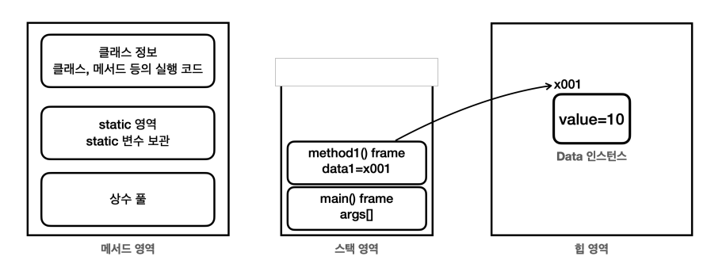
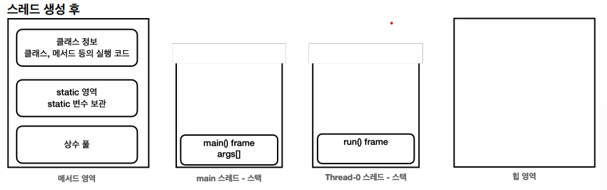
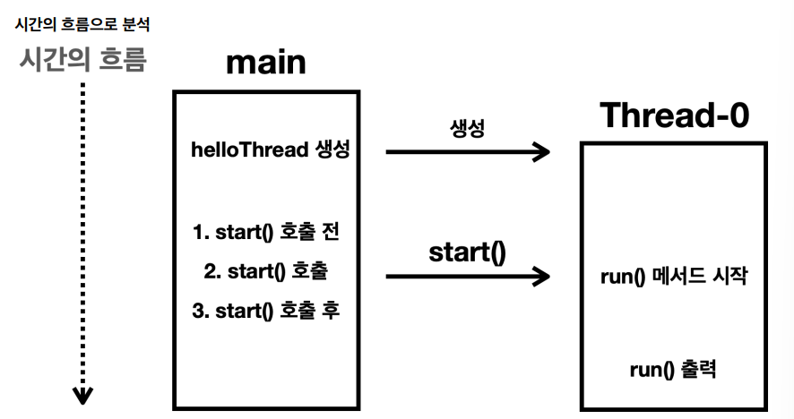

# 02_ThreadCreateAndRun

## java  memory



- 메서드 영역

  - 프로그램을 실행하는데 필요한 공통데이터 관리 => 모든 영역에서 공유한다.

    - 클래스 정보 : 클래스의 실행코드, 필드, 메서드, 생성자 코드등 모든 실행 코드가 존재

    - static 

    - 런타임 상수 풀 : 프로그램을 실행하는데 필요한 공통 리터럴 상수 보관

      - GC 대상이 되지 않는다. 

        

- 스택 영역

  - 하나의 실행 스택이 생성된다..
  - 각 스택 프레임은 지역변수, 중간 연산 결과, 메서드 호출  정보 등을 포함
    - 스택 프레임 : 
      - 스택 영역에 쌓이는 네모박스 하나의 스택 프레임이다.
      - 메서드 하나 호출 > 하나의 스택 프레임 쌓음
  - **스택 영역은 각 스레드 별로 하나의 실행 스택이 생성**
    - 즉 스레드 수만큼 스택이 생성된다.
    - 스레드를 추가하면 스택도 스레드 수만큼 증가한다.

  

- 힙 영역

  - GC가 이뤄지는 영역 => 더이상 참조되지 않는 객체는 GC에 의해 제거된다.


## Thread 생성

> - Thread class 상속 받는 방법
> - Runnable 인터페이스 구현 방법

```java
package thread.start;

public class HelloTread extends Thread{

    @Override
    public void run(){
        System.out.println(Thread.currentThread().getName() + ": run()");
    }

}
```

```java
public static void main(String[] args){
    System.out.println(Thread.currentThread().getName() + ": main() start");

    HelloTread helloTread = new HelloTread(); // 별도로 Thread를 만든 것

    // helloTread.run(); run을 호출하면 안된다.
    System.out.println(Thread.currentThread().getName() + ": start 호출 전");
    helloTread.start(); // start를 진행해야한다.
    System.out.println(Thread.currentThread().getName() + ": start 호출 후");

    System.out.println(Thread.currentThread().getName() + ": main() end");
}

-- 결과 -- 
main: main() start
main: start 호출 전
main: start 호출 후
main: main() end
Thread-0: run()
```

- 앞서 만든 HelloThread 스레드 객체를 생성 => start() 메서드를 호출
- start() 호출 => HelloThread가 run() 메서드를 실행한다.
  - 주의 : helloTread.run();을 실행하게 되면 별도의 스레드에서 run을 실행하지 않는다.
             따라서 start로 실행해야한다.
- 결과 
  - 실행 순서에 따라 약간 바뀔 수 있다.
  - cpu가 스케줄링을 진행할 때 계산하는 순서에 따라 변할 수 있기 때문이다.


- Main Tread만 실행된다. Java는 실행 시점에 main이라는 이름의 스레드를 만들고 프로그램의 시작점인 main() 메서드를 실행한다.




- HelloThread 스레드 객체를 생성한 다음에 start() 메서드를 호출 

  => 별도의 스택 공간을 할당 (Thread - 0 이라는 stack 공간을 할당 받음)

- Thread - 0 스레드는 run() 메서드의 스택 프레임을 스택에 올리면서 run() 메서드를 시작




1. main 스레드가 HelloThread 인스턴스 생성 
2. start() 메소드 호출 => Thread-0 스레드 시작 => Thread-0가 run() 메소드 호출
   - 중요 : 
     - Thread-0 은 run() 메서드 실행
     - **main 스레드는 단지 start()를 통해서 Thread-0에게 실행을 지시할 뿐이다.**
     - **즉 main thread는 run을 실행하는게 아님**
3. main 스레드와 Thread-0스레드는 동시에 실행

**멀티스레드는 순서와 실행 기간을 모두 보장하지 않는다!**


- **만약 Main Thread가 run을 실행하게 된다면?**


- 다른 Thread가 아닌 Main에서 run함수를 실행하게 된다.


## Daemon Thread

- 스레드의 종류

  - **user thread**

    - 프로그램의 주요작업을 수행하는 것

    - 작업이 완료될 때까지 실행

    - 모든 user 스레드가 종료되면 JVM도 종료

      - 즉 Main 스레드만 끝나면 되는게 아니라 모든 Thread가 종료되어야한다.

      

  - **daemon thread**

    - **백그라운드에서 보조적인 작업**을 수행
    - 모든 user 스레드가 종료되면 데몬 스레드는 자동으로 종료
    - 사용자 스레드가 종료되면 작동되어있었더라도 그냥 꺼짐


## Runnable

- 실무에서 이 방법을 많이 사용한다.
- 쓰레드 생성 방법
  1. Thread  클래스 상속 받기
     - 단점 
       - 상속의 제한 : 자바는 단일 상속만 허용, 이미 다른 클래스 상속 받고 있으면 Thread class 상속 x
       - 유연성 부족
  2. Runnable 인터페이스 구현하기
     - 장점 
       - 인터페이스라 상속에 자유로움
       - 코드 분리 가능
       - 여러 스레드가 동일한 Runnable 객체를 공유할 수 있음

```java
public class HelloRunnable implements Runnable{ // 상속
    @Override
    public void run() {
        System.out.println(Thread.currentThread().getName() + ": run()");
    }
}
```

- 이 방법을 쓰면 **스레드와 작업을 분리**할 수 있다.


```java
// 중첩 클래스
public class InnerRunnableMainV1 {
    
    public static void main(String[] args) {

        log("main() start");

        Runnable runnable = new MyRunnable();
        Thread thread = new Thread(runnable);
        thread.start();

        log("main() end");
    }
    
    // 중첩 클래스 : 여러 군데에서 안쓸거 같고 이 class 안에서만 사용할거 같을 때 사용
    static class MyRunnable implements Runnable{
        @Override
        public void run() {
            log(": run()");
        }
    }
}


// 익명 클래스
public class InnerRunnableMainV2 {
    public static void main(String[] args) {

        log("main() start");

        // 익명 class : 특정 method 안에서 간단하게 쓸 때
        Runnable runnable = new Runnable() {
            @Override
            public void run() {
                log("run()");
            }
        };
        Thread thread = new Thread(runnable);
        thread.start();

        log("main() end");
    }
}

// 람다
public class InnerRunnableMainV3 {
    public static void main(String[] args) {

        log("main() start");

        // lambda 로 가능
        Thread thread = new Thread(() -> log("run()"));
        thread.start();

        log("main() end");
    }
}


```


