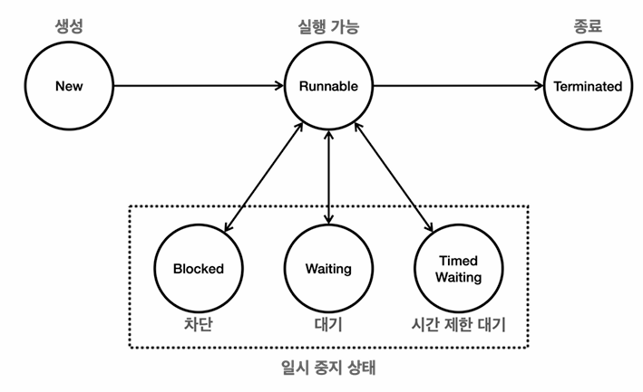
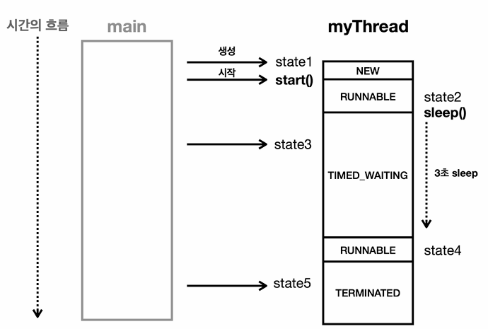
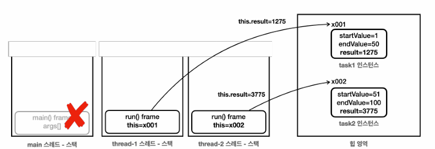
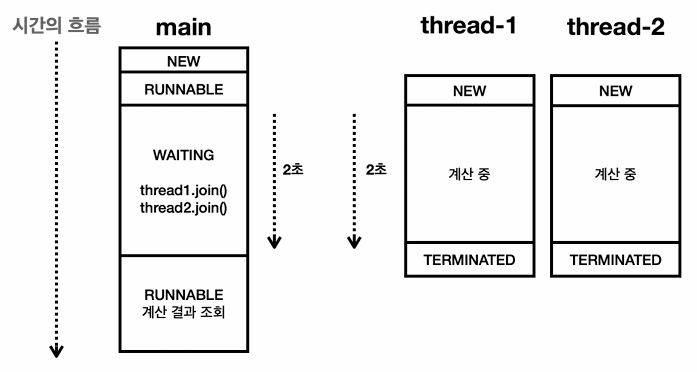
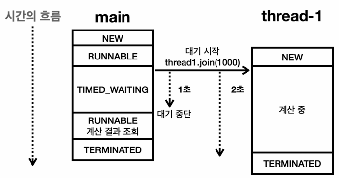

# 04_ThreadControlAndLifeCycle


```java
// thread 출력
log("mainThread = " + mainThread);
Thread[#21,myThread,5,main] : thread id, name, thread group.

// thread id => 중복 x
log("mainThread.threadId() = " + mainThread.threadId()); // 

// thread name => 중복 될 수 있음
log("mainThread.getName() = " + mainThread.getName()); 

// thread priority
log("mainThread.getPriority() = " + mainThread.getPriority()); // default = 5
/*
 default = 5;
 우선 순위가 높다고 무조건 빨리실행되는건 아님. 약간 hint 같은 거
*/


// thread state : 하기 참조
log("mainThread.getState() = " + mainThread.getState()); // runnable thread가 실행 될 수 있는 상태

```




-  **NEW** : 쓰레드가 아직 시작되지 않은 상태
- **RUNAABLE** : 스레드가 실행 중이거나 실행될 준비가 된 상태 => 이 상태여야 THREAD 가 시작할 수 있음
- 일시 중지 상태들
  - **BLOCKED** : 스레드가 동기화 락을 기다리는 상태
  - **WAITING** : 스레드가 다른 스레드의 특정 작업이 완료되기를 기다리는 상태
  - **TIMED_WAITING** : 일정 시간동안 기다리는 상태 (thread.sleep())
- **TERMINATED** : 스레드가 실행을 마친 상태

### 1. New 

- start() method가 아직 호출되지 않은 상태

### 2. Runnable

- 실행 가능 상태
- thread.start() 호출 => runnable 상태로 변함
- CPU core 하나가 하나만 실행 가능 
  - => 하나 thread 실행중이면 다른 thread는 기다리는 상태임
  - => 따라서 runnable 상태라고 볼 수 있음

### 3. blocked

- 스레드가 다른 스레드에 의해 동기화 락을 얻기 위해 기다리는 상태
- synchronized 블록에 진입하기 위해 락을 얻어야하는 경우

### 4. waiting

- 스레드가 다른 스레드의 **특정 작업이 완료**되기 까지 무기한 기다린다.
- wait(), join() 메서드가 호출될 때 이 상태가 된다.
- 스레드는 다른 스레드가 notify() 또는 notifyAll() 메서드를 호출하거나, join()이 완료될 때까지 기다린다.

### 5. Timed Wait

- 스레드가 **특정  시간동안** 다른 스레드의 작업이 완료되기를 기다리는 상태
- sleep(long millis), wait(long millis), join(long millis) 호출될 때 이 상태가 된다.

### 6. Terminated

- 스레드의 실행이 완료된 상태 
  - 정상종료, 예외
- 스레드는 한 번 종료되면 다시 시작할 수 없다.




```java
public static void main(String[] args) throws InterruptedException {

    Thread thread = new Thread(
        () -> {
            try {
                log("start");
                log("myThread.state2 = " + Thread.currentThread().getState()); // RUNNABLE
                log("sleep start");
                Thread.sleep(3000);
                log("sleep end");
                log("myThread.state4 = " + Thread.currentThread().getState()); // RUNNABLE
                log("end");
            } catch (InterruptedException e) {
                throw new RuntimeException(e);
            }
        });

    log("myThread.state1 = " + thread.getState()); // NEW
    log("myThread.start()");
    thread.start();
    Thread.sleep(1000);
    log("myThread.state3 = " + thread.getState()); // TIMED_WAITING
    Thread.sleep(4000);
    log("myThread.state5 = " + thread.getState()); // TERMINATED

}
```


## 체크 예외 재정의

> - 체크 예외는 RuntimeException 클래스를 상속받지 않은 예외 클래스들이다.
> - 복구 가능성이 있는 예외이므로 반드시 예외를 처리하는 코드를 함께 작성해야 한다
> - ex_IOException, SQLException 
>   - 참고 : (언체크 => 복구가능성 없는 애들 RuntimeException )

- Runnable 인터페이스

```java
public interface Runnable{
    void run();
}
```

- **체크 예외**
  - 부모 메서드가 체크 예외를 던지지 않음 => 재정의된 자식 메서드도 체크 예외 던질 수 없음
    - 즉 interface Runnable이 체크예외를 던지지 않아서 implemet 로 사용하는 class 모두 예외를 던질 수 없음
  - 자식메서드는 부모 메서드가 던질 수 있는 체크 예외의 하위 타입만 던질 수 있다.
    
- **언체크(런타임) 예외**
  - 예외 처리를 강제하지 않으므로 상관럾이 던질 수 있다.

```java
public class CheckedExceptionMain {
    
     public static void main(String[] args) throws Exception {
        throw new Exception();
     }

     static class CheckedRunnable implements Runnable {
            @Override
            public void run() /*throws Exception*/ { // 주석 풀면 예외 발생
                //throw new Exception(); // 주석 풀면 예외 발생
            }
        }
 }
```


- 안전한 예외 처리
  - 예외를 던지지 못하도록 강제함
  - thread를 생성하는 것이기 때문에 던지면.....비정상 종료가 될 수 있음
  - 따라서 try catch를 사용함으로써 강제로 예외를 catch할 수 있도록 하기 위함
  - 하지만 옛날 얘기임... 요즘은 언체크드를 선호


## Join

### Join이 필요한 상황

```java
public class JoinMainV1 {

    public static void main(String[] args) {
        log("Start");
		
        SumTask sumTask1 = new SumTask(1,50);
        SumTask sumTask2 = new SumTask(51, 100);

        Thread thread1 = new Thread(sumTask1);
        Thread thread2 = new Thread(sumTask2);

        thread1.start();
        thread2.start();

        log("1: " + sumTask1.result);
        log("2: " + sumTask2.result);

        int resultAll = sumTask1.result + sumTask2.result;
        log("all : " + resultAll);

        log("End");
    }


    static class SumTask implements Runnable{

        int startValue;
        int endValue;
        int result = -1;

        public SumTask(int startValue, int endValue){
            this.startValue = startValue;
            this.endValue = endValue;
        }

        @Override
        public void run() {
            sleep(2000);
            int sum = 0;
            for (int i = startValue; i<=endValue; i++){
                sum += i;
            }
            result = sum;
            log(result);
            log("Run End");
        }
    }

}
/*
결과
22:25:56.093 [     main] Start
22:25:56.111 [     main] 1: -1
22:25:56.112 [     main] 2: -1
22:25:56.112 [     main] all : -2
22:25:56.112 [     main] End
22:25:58.116 [ Thread-0] 1275
22:25:58.116 [ Thread-1] 3775
22:25:58.116 [ Thread-0] Run End
22:25:58.116 [ Thread-1] Run End
*/

```

22:25:56.111 [     main] 1: -1
22:25:56.112 [     main] 2: -1
22:25:56.112 [     main] all : -2



- 위와 같은 이유
  1. instance 생성으로 task1, task2의 result가 -1로 초기화 => 그리고 그 인스턴스 주소 참조 (힙에)
  2. SumTask이 계산하는데 시간이 2초 걸림
  3. 그전에 int resultAll = sumTask1.result + sumTask2.result; 실행
     - 즉 task1,2가 계산이 완료되기 전에 result 계산
  4. 결과 -2가 나옴


### 참고 - this 의 비밀

- 어떤 메서드를 호출하는 것은, 정확히는 특정 스레드가 어떤 메서드를 호출하는 것 (thread stack에 들어감)
- thread stack에 들어갈 때 **this는 해당 인스턴스의 참조값을 스택 프레임 내부에 저장**한다.
- 즉 필드 위의 변수값 등을 구별하기 위한 값이라고 보면된다.
  - this => 이 필드 값들은 이 함수꺼야! 라고 알려주는 느낌

## 

## Join 사용하기



```java
// thread 가 종료될 떄 까지 대기 -> 1번 2번이 종료될 때 까지 대기하게 된다.
// 완료가 되자마자 바로 깨어남
log("join() start");
thread1.join();
thread2.join();
log("join() end");
```

- thread 1, 2가 종료될 때 까지 기다린다. (main thread = waiting 상태 = cpu 사용 x )
- 만약 thread 2가 종료가 아직 안됐다면?
  - 어차피 thread 1 이 종료가 안됐기 떄문에 기다린다. 
- 단점
  - 무기한 기다림이 존재


## Join 특정시간 waiting



```java
thread1.join(1000);
```

- 1초까지만 기다리고 대기가 빠져나감


