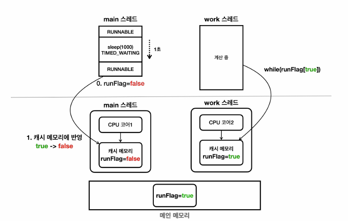
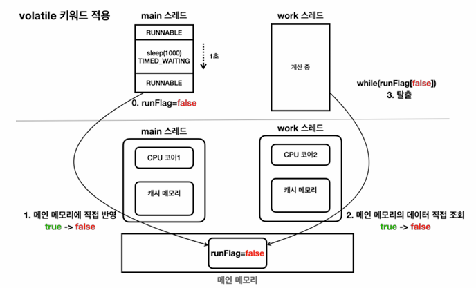

# 06_volatile

## Volatile 사용 X

```java
    public static void main(String[] args) {

        MyTask myTask = new MyTask();
        Thread t = new Thread(myTask);
        t.start();

        sleep(1000);
        myTask.runFlag = false;
        log("run flag : " + myTask.runFlag);
        log("main end");

    }

    static class MyTask implements Runnable{
        boolean runFlag = true;

        // volatile boolean runFlag = true;

        @Override
        public void run() {
            log("task start");
            while (runFlag){
                // runFlag가 false로 변하지 않음
            }
            log("task end"); // 이부분이 log가 찍히지 않음
        }
    }
```

```
00:43:39.147 [ Thread-0] task start
00:43:40.135 [     main] run flag : false
00:43:40.135 [     main] main end
```

- run flag : false 로 변경 했음에도 불구하고 task end가 되지 않음
- 이로 인해 프로그램이 꺼지지 않고 계속 실행되는 현상이 발생
- 왜?

## CPU의 캐시 메모리 사용

- 실제 메모리 접근 방식 : **캐시 메모리 사용**



- Main Thread에서 runFlag = false로 바꿈

- 메인 메모리에 값을 바꾼 것이 아니라 **캐시 메모리 값을 바꾼 것**

- 이로 인해 **Work Thread 에선 runFalg 가 false로 바뀐지 모르기** 때문에 프로그램이 꺼지지 않고 계속 실행되는 현상이 발생

  

- 그럼 언제 Main Thread에선 Main Memory 에 값을 변경하고 Work Thread 에선 값을 가져가는가?

  - **알 수 없다. 하지만 높은 확률로 Context Switching을 진행할 때 변경한다.**


## Memory Visibility : 메모리 가시성 (Volatile)

> - 멀티스레드 환경에서 한 스레드가 변경한 값이 다른 스레드에서 보이지 않는 문제, 언제보이는지에 대한 문제
> - 성능을 약간 포기하는 대신에, 값을 접근할 때 모두 메인 메모리에 직접 접근하도록 한다.
>   - 자바에선 volatile 사용

```java
    static class MyTask implements Runnable{
        //boolean runFlag = true;

        volatile boolean runFlag = true; // 변경된 부분

        @Override
        public void run() {
            log("task start");
            while (runFlag){
                // runFlag가 false로 변하지 않음
            }
            log("task end");
        }
    }
```

```
01:05:59.346 [ Thread-0] task start
01:06:00.331 [ Thread-0] task end
01:06:00.336 [     main] run flag : false
01:06:00.336 [     main] main end
```

- main end가 뜨는 걸 확인 할 수 있음. 프로그램도 종료 됨



- Volatile를 사용하면 Main Memory에서 값을 관리하게 된다.
- 따라서 메모리 가시성 문제를 해결할 수 있음
- 단 캐시메모리를 사용할 때 보다 성능이 느려지는 단점이 있기 때문에 꼭 필요한 곳에서 사용해야 한다.


## 예제

```java
public static void main(String[] args) {
    MyTask myTask = new MyTask();
    Thread t = new Thread(myTask);
    t.start();
    sleep(1000);

    myTask.flag = false;

    log("flag : " + myTask.flag + ", count : " + myTask.count + " in main");

}

static class MyTask implements Runnable{
    volatile boolean flag = true;
    volatile long count;
    //        long count;
    //        boolean flag = true;

    @Override
    public void run() {
        while (flag){
            count++;
            if (count % 100_000_000 == 0){
                log("flag = " + flag + ", count = " + count + " in while()");
            }
        }
        log("flag = " + flag + ", count = "+ count + " end");
    }
}
```

- 1억번 마다 출력하는 예제

**Volatile 사용 안할 경우 결과**

```
01:27:52.898 [ Thread-0] flag = true, count = 100000000 in while()
01:27:53.017 [ Thread-0] flag = true, count = 200000000 in while()
01:27:53.129 [ Thread-0] flag = true, count = 300000000 in while()
01:27:53.240 [ Thread-0] flag = true, count = 400000000 in while()
01:27:53.351 [ Thread-0] flag = true, count = 500000000 in while()
01:27:53.461 [ Thread-0] flag = true, count = 600000000 in while()
01:27:53.570 [ Thread-0] flag = true, count = 700000000 in while()
01:27:53.678 [ Thread-0] flag = true, count = 800000000 in while()
01:27:53.775 [     main] flag : false, count : 888994027 in main
01:27:53.787 [ Thread-0] flag = true, count = 900000000 in while()
01:27:53.787 [ Thread-0] flag = false, count = 900000000 end
```


**Volatile을 사용 할 경우**

```
01:28:42.307 [ Thread-0] flag = true, count = 100000000 in while()
01:28:42.488 [ Thread-0] flag = true, count = 200000000 in while()
01:28:42.661 [ Thread-0] flag = true, count = 300000000 in while()
01:28:42.835 [ Thread-0] flag = true, count = 400000000 in while()
01:28:43.021 [ Thread-0] flag = true, count = 500000000 in while()
01:28:43.127 [ Thread-0] flag = false, count = 562169809 end
01:28:43.127 [     main] flag : false, count : 562169809 in main
```

- volatile을 사용
  - 562169809 으로 main과 값이 정확한 걸 확인 할 수 있다.
  - 값이 조금만 찍힌다. => 느리다 => main memory를 직접 접근하기 떄문
  - 현재 약 2배 정도 성능차이가 나는 것을 확인 할 수 있다
- volatile x
  - 900000000 에서 멈추는 것을 확인 할 수 있다. main thread와 값이 다르게 동작한다는 것임
  - 그럼 왜 900000000에서 멈췄을까? 
    - 이때 출력 (I/O) 를 사용했기 때문에 CPU context swtiching을 했을 것이다.


## Java Memory Mode

### Java Memory Mode

- JMM은 자바 프로그램이 어떻게 메모리에 접근할고 수정할 수 있는지를 규정
- 핵심 : 여러 스레드들의 작업 순서를 보장하는 happens-before 관계에 대한 정의


### happens-before

- A 작업이 B 작업 보다 happens-before 관계에 있다. = A 작업 변경사항? B에서 다 볼 수 있음
  - **A 변경 값들이 B 작업 전에 모두 메모리에 반영**

### happens-before 관계가 발생하는 경우

- **프로그램 순서 규칙**

  - 프로그램의 순서대로 작성 된 명령문은 happens-before 순서로 실행

    

- **Volatile 변수 규칙**

  - 한 스레드에서 volatile 변수에 대한 쓰기 작업은 해당 변수를 읽은 모든 스레드에 보이도록 한다.

  - 즉 volatile 쓰기 작업은 그 변수를 읽는 작업보다 happens-before(이전에 쓰기가 되어야함) 관계를 형성

    

- **스레드 시작 규칙**

  - Thread.start() 를 호출하면, 해당 스레드 내의 모든 작업은 start() 호출 이후에 실행된 작업보다 happens-before 관계가 성립

  - 즉 start() 호출 하면 이전에 값 저장이 다 되어야함

    

- **스러드 종료 규칙**

  - 한 스레드에서 Thread.join()을 호출하면, join 대상 스레드의 모든 작업은 join()이 반환된 후의 작업보다 happens-before관계를 가진다.

  - 예를 들어, Thread.join() 호출전에 thread의 모든 작업이 완료되어야함

  - 1~100 더할 때 result값이 0, -1이 아니라 다 더 한 값으로 되어있어야함

    

- **인터럽트 규칙**

  - 한 스레드에서 Thread.interrupt() 를 호출하는 작업이, interrupt된 스레드가 interrupt를 감지하는 시점의 작업보다 happens-before 관계가 성립한다.

    - 즉 다른 스레드에서  interrupt 시키면 해당 스레드는 interrupt 바로 되어있어야함

    - interrupt 호출 후, 해당 스레드의 인터럽트 상태를 확인하는 작업이 happens-before관계에 있다.

    - 만약 이런 규칙이 없다면 interrupt 걸어도, 한참 나중에 interrupt가 발생할 수 있다.

      

- **객체 생성 규칙**

  - 객체의 생성자는 객체가 완전히 생성된 후에만 다른 스레드에 의해 참조될 수 있도록 보장한다. 

  - 즉, 객체의 생성자에서  초기화된 필드는 생성자가 완료된 후 다른 스레드에서 참조될 때 happens-before 관계가 성립한다.

    

- **모니터 락 규칙**

  - 한 스레드에서 synchronized 블록을 종료한 후, 그 모니터 락을 얻는 모든 스레드는 해당 블록 내의 모든 작업을 볼 수 있다.

  - 즉 synchronized 종료후 모든 값이 업데이트 되어있어야함 (다른 스레드들도 볼 수 있도록)

    - synchronized 나가는 시점에 happens-before 관계

    

- **전이 규칙 (Transitivity Rule)**

  - A 가 B보다 happens-before 관계, B가 C 보다 happens-before관계 ? A는 C 보다 happens-before
  - 즉 A 작업이 완료 됐으면 C 는 무조건 A 변경 값을 알 수 있어야함

- 정리
  - volatile 또는 동기화 기법을 사용하면 메모리 가시성 문제가 발생하지 않는다.


