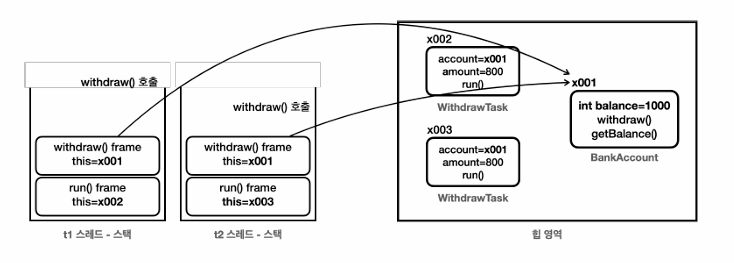

# 07_synchronized

```java
public class BankMain {

    public static void main(String[] args) throws InterruptedException {

        BankAccount account = new BankAccountV1((1000));

        Thread t1 = new Thread(new WithdrawTask(account, 800), "t1");
        Thread t2 = new Thread(new WithdrawTask(account, 800), "t2");

        t1.start();
        t2.start();

        sleep(500); // 검증 완료까지 잠시 대기
        log("t1 state : " + t1.getState());
        log("t2 state : " + t2.getState());

        t1.join();
        t2.join();

        log("최종 잔액: " + account.getBalance());
    }
}


public class BankAccountV1 implements BankAccount{

    private int balance;

    public BankAccountV1(int initialBalance){
        this.balance = initialBalance;
    }

    @Override
    public boolean withdraw(int amount) {

        log("거래 시작 : " + getClass().getSimpleName());

        // 검증 단계
        log("[검증 시작] 출금액 : " + amount + " , 잔액 : " + balance);
        if(balance < amount){
            log("[검증 실패]");
            return false;
        }

        // 완료
        log("[검증 완료] 출금액 : " + amount + " , 잔액 : " + balance);
        sleep(1000);
        balance = balance - amount;
        log("[출금 완료] 출금액 : " + amount + " , 잔액 : " + balance);


        log("거래 종료 : " + getClass().getSimpleName());
        return true;
    }

    @Override
    public int getBalance() {
        return balance;
    }
}

public class WithdrawTask implements Runnable{

    private BankAccount account;
    private int amount;

    public WithdrawTask(BankAccount account, int amount){
        this.account = account;
        this.amount = amount;
    }

    @Override
    public void run() {

        account.withdraw(amount);

    }
}
```


**결과**

```
16:37:39.484 [       t2] 거래 시작 : BankAccountV1
16:37:39.484 [       t1] 거래 시작 : BankAccountV1
16:37:39.493 [       t1] [검증 시작] 출금액 : 800 , 잔액 : 1000
16:37:39.493 [       t2] [검증 시작] 출금액 : 800 , 잔액 : 1000
16:37:39.493 [       t1] [검증 완료] 출금액 : 800 , 잔액 : 1000
16:37:39.494 [       t2] [검증 완료] 출금액 : 800 , 잔액 : 1000
16:37:39.980 [     main] t1 state : TIMED_WAITING
16:37:39.980 [     main] t2 state : TIMED_WAITING
16:37:40.494 [       t1] [출금 완료] 출금액 : 800 , 잔액 : -600
16:37:40.494 [       t2] [출금 완료] 출금액 : 800 , 잔액 : 200
16:37:40.495 [       t1] 거래 종료 : BankAccountV1
16:37:40.495 [       t2] 거래 종료 : BankAccountV1
16:37:40.499 [     main] 최종 잔액: -600 ?????? 이부분 왜 -600원이지? 왜 검증로직에서 안막았지?
```

- 문제 발생
  - 최종 잔액이 : -600 현상 발생

- 문제 발생 원인



- BankAccount account = new BankAccountV1((1000)); 객체 생성은 이와같이 하나로 진행되며 thread 2개가 동시에 접근하게 된다.
  - 즉 **계산시 같은 참조 값(x001)을 보고 있음**
  - 이로 인하여 **동시에 검증 단계로 진입**하게 되면 초기 balance : 1000으로 진행되게 되는것
  - 따라서 검증단계에서 둘다 통과가 되며 값이 계산되는 것을 볼 수 있다.
  - 따라서 -600 값이 나오게 된다.
- 그럼 어떻게 해야할까?
  - 동시에 검증단계를 진행하지 못하게 막아야한다. => 동시성 문제 해결해야 함
  - 값이 update 되기 전까지 검증 로직을 접근하면 안된다.


## 임계 영역

### 근본 원인

- 여러 스레드가 함께 사용하는 공유 자원을 여러 단계로 나누어 사용하기 때문이다.

```
출금(){
	1. 검증 단계 : 잔액 확인
	2. 출금 단계 : 잔액 감소
}
```

- **사용하는 값이 중간에 변경되지 않아야 한다.**


### Critical Section (임계 영역)

- 여러 스레드가 **동시에 접근해서는 안 되는 공유 자원**을  접근, 수정하는 부분을 뜻한다.
- 자바는 `synchronized` 를 사용해서 이 문제를 해결한다.


### Synchronized Method

- 한 번에 하나의 스레드만 실행할 수 있는 코드구간을 만드는 방법

```java
public synchronized boolean withdraw(int amount) {
    // 임계 영역 (검증, 출금 로직)
}

public synchronized int getBalance() {
    return balance;
}

```

- 이렇게 사용하면 withdraw는 한번에 하나만 실행되게 된다.

```
-- 결과
17:56:26.709 [       t1] 거래 시작 : BankAccountV1
17:56:26.717 [       t1] [검증 시작] 출금액 : 800 , 잔액 : 1000
17:56:26.718 [       t1] [검증 완료] 출금액 : 800 , 잔액 : 1000
17:56:27.193 [     main] t1 state : TIMED_WAITING
17:56:27.193 [     main] t2 state : BLOCKED

17:56:27.719 [       t1] [출금 완료] 출금액 : 800 , 잔액 : 200
17:56:27.720 [       t1] 거래 종료 : BankAccountV1

17:56:27.720 [       t2] 거래 시작 : BankAccountV1
17:56:27.720 [       t2] [검증 시작] 출금액 : 800 , 잔액 : 200
17:56:27.721 [       t2] [검증 실패]
17:56:27.723 [     main] 최종 잔액: 200
```

- t1이 종료가 되고 t2가 실행되는 모습을 볼 수 있다.


- 모든 객체(인스턴스)는 내부에 자신만의 락(lock)을 가지고 있다.
  - **이것을 모니터 락(monitor lock)이라고 부른다**
- 스레드가 synchronized 키워드가 있는 메서드에 진입하려면 반드시 해당 인스터스의 락이 있어야 한다.


- **t1 이 락을 획득!** => t2 기 락을 획득 하려고 하는 락이 존재하지 않음
- t2 는 락을 대기하게 됨 **((`BLOCKED`) 상태)**
- t1 이 다 사용하고 반납하게 되면 t2 는 자동으로 락을 획득하게 된다.
- **Lock 을 획득하는 순서는 보장되지 않음**
  - 어떤 순서로 락을 획득하는지는 자바 표준에 정의되어있지 않음
  - 따라서 환경에 따라 순서가 달라질 수 있다.

- 참고!
  - `volatile` 를 사용하지 않아도 `synchronized` 안에서 접근하는 변수의 메모리 가시성 문제는 해결된다.
  - 한 스레드에서 `synchronized` 블록을 종료한 후, 그 모니터 락을 얻는 모든 스레드는 해당 블록 내의 모든 작업을 볼 수 있다. => 메모리 가시성 문제 해결 가능


### Synchronized 코드 블럭

- `synchronized ` 의 가장 큰 장점이자 단점 : 한 번에 하나의 스레드만 실행 가능... => 성능이 떨어질 수 있다.
- `synchronized ` 를 통해 동시에 실행 할 수 없는 코드 구간은 꼭! 필요한 곳으로 한정해서 설정


## Synchronized 의 장단점

### 장점

- 단순함

### 단점

- **무한 대기**
  - BLOCK 상태의 스레드는 락이 풀릴 때 까지 무한 대기한다.
  - 특정시간까지만 대기하는 타임아웃이 없음
  - 중간에 인터럽트 x
- **공정성**
  - 락이 돌아 왔을 때 BLOCK 상태의 여러 스레드 중 어떤 스레드가 락을 획득할 지 알 수 없음

**자바 1.5 = java.util.concurrent 라는 동시성 문제 해결을 위한 패키지가 추가**


