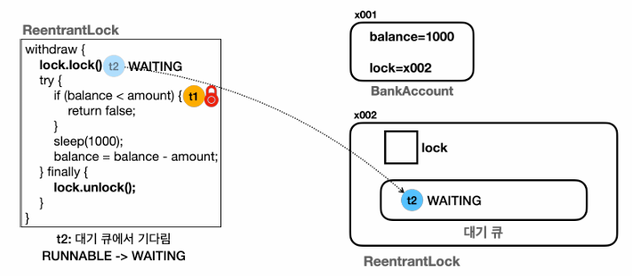

# 08_concurrentLock

- synchronized의 무한 대기 현상을 막기 위한 기능들


## LockSupport 기능

> - LockSupport 는 스레드를 **WATING** 상태로 변경한다.
> - WATING 상태는 누가 꺠워주기 전까지는 계속 대기. 하지만 CPU 실행 스케줄링에 들어가지 않는다

### LockSupport 의 대표적인 기능

- **park()**
  - 스레드를 WAITING 상태로 변경
- **parkNanos(nano)**
  - 스레드를 나노초 동안만 TIMED_WAITING 상태로 변경한다.
  - 지정한 나노초가 지나면 RUNNABLE 상태로 변경된다.
- **unpark(thread)**
  - WAITING 상태의 대상 스레드를 RUNNABLE 상태로 변경한다.


### park, unpark

 ```java
 public static void main(String[] args) {
     Thread thread1 = new Thread(new ParkTest(), "Thread 1");
     thread1.start();
     sleep(100);
     
     log("Thread 1 state : " + thread1.getState());
     log("main -> unpark");
     
     LockSupport.unpark(thread1); // 1. unpark 사용 => interrupt 상태 : false 로 종료
     //thread1.interrupt(); // 2. interrupt() 사용 => interrupt 상태 : true 로 종료
 }
 
 static class ParkTest implements Runnable{
 
     @Override
     public void run() {
         log("park 시작");
         LockSupport.park();
         log("park 종료, state : " + Thread.currentThread().getState());
         log("interrupt 상태 : " + Thread.currentThread().isInterrupted());
     }
 }
 ```

- 각각의 스레드에서 park () => waiting
- main에서 원하는 스레드를 unpark() 시키면 => runnable로 변한
- unpark 와 interrupt 의 차이점
  - **unpark 사용 => interrupt 상태 : false 로 종료(정상)**
  - **interrupt() 사용 => interrupt 상태 : true 로 종료** 이므로 false로 바꿔줘야함


### parkNanos

```java
LockSupport.parkNanos(2000_000000); // parkNanos 2초
```

```
21:06:57.789 [ Thread 1] park 시작
21:06:57.889 [     main] Thread 1 state : TIMED_WAITING
21:06:59.802 [ Thread 1] park 종료, state : RUNNABLE
21:06:59.806 [ Thread 1] interrupt 상태 : false
```


### BLOCKED vs WAITING

- BLOCKED : 무한 대기 가능성 있음
  - 이유 : interrupt와 같은 기능으로 깨울 수 없기 때문이다. 즉 lock을 얻을 때 까지 무한 대기
- WAITING :  
  - interrupt로 깨울 수 있는 상태이기 때문에 무한대기 현상을 막아줄 수 있음


## ReentranctLock

- `void lock()`

  - lock을 획득한다.

  - 락을 획득했다면, 락이 풀릴 때까지 스레드는 WAITING 상태

  - 이 메서드는 interrupt에 응답하지 않는다.

    

- `void lockInterruptibly`

  - 락 획득을 시도하되, 다른 스레드가 자신에게 인터럽트 할 수 있도록 한다.

  - 만약 다른 스레드가 이미 락을 획득했다면, 현재 스레드는 락을 획득할 떄까지 대기

  - 대기 중에 인터럽트가 발생하면 InterruptedException 이 발생하며 락 획득을 포기

    

- `boolean tryLock()`

  - 락 획득을 시도하고, 즉시 성공 여부를 반환

  - 만약 다른 스레드가 이미 락을 획득했다면 `false` , 그렇지 않으면 `true`

    

- `boolean tryLock(long time, TimeUnit unit)`

  - \+ 특정 시간 동안 대기

    

- `void unlock`

  - 락을 해제한다.

  - 락을 해제하면 락 획득을 대기중인 스레드 중 하나가 락을 획득할 있게 된다.

  - 락을 가지고 있는 스레드가 호출해야한다.

  - 그렇지 않으면 `IllealMonitorStateExceprtion` 이 발생

    

- `Condition newCondition()`

  - Condition 객체를 생성하여 반환한다.

  - 락과 결합되어 사용되며, 스레드가 특정 조건을 기다리거나 신호를 받을 수 있도록 한다.

    


### 공정성

### Non-fair mode 

- 성능 우선
- 선검 가능
- 기아 현상 가능성 

### Fair mode

- 공정성 보장
- 기아현상 방지
- 성능 저하


## 예제



```java
@Override
public boolean withdraw(int amount) {

    log("거래 시작 : " + getClass().getSimpleName());

    lock.lock(); // lock을 걸면 try finally를 통해 unlock을 해준다. // 변경 된 부분
    try{
        log("[검증 시작] 출금액 : " + amount + " , 잔액 : " + balance);
        if(balance < amount){
            log("[검증 실패]");
            return false;
        }
        log("[검증 완료] 출금액 : " + amount + " , 잔액 : " + balance);
        sleep(1000);
        balance = balance - amount;
        log("[출금 완료] 출금액 : " + amount + " , 잔액 : " + balance);
    }finally {
        lock.unlock(); // lock 해제 // 변경 된 부분
    }
    log("거래 종료 : " + getClass().getSimpleName());
    return true;
}
```

- **주의**
  - lock을 걸면 unlock을 무조건 해줘야한다.
  - 따라서 예기치 못하게 종료될 때를 대비해 **finally로 unlock을 진행해 줘야한다.**


