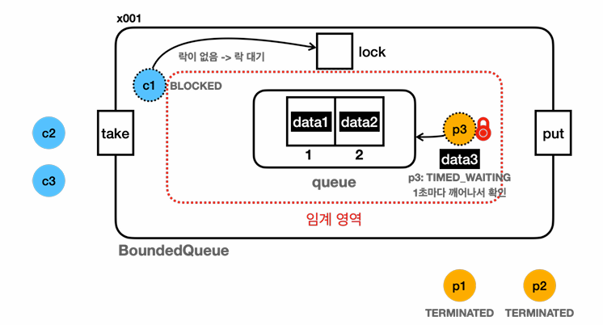
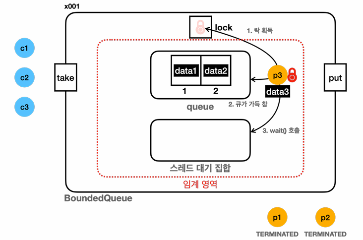
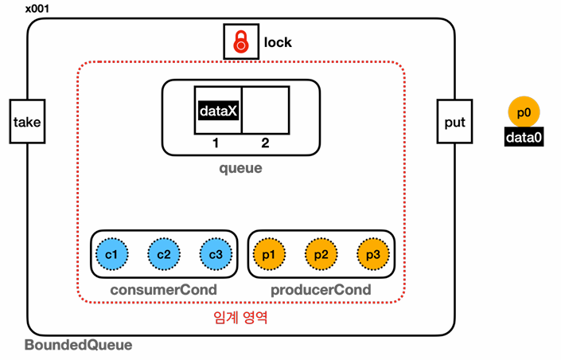

# 09_ProducerAndCustomer


## basic 

- **생산자**

  - 데이터를 생성하는 역할

  - ex_ 파일 read, network 데이터 등

    

- **소비자**

  - 생성된 데이터를 사용하는 역할

  - ex_ 데이터 처리, 저장

    

- **버퍼**

  - 생산자가 생성한 데이터를 일시적으로 저장하는 공간
  - 한정된 크기
  - 생산자와 소비자가 이 버퍼를 통해 주고 받음

- 문제 상황

  - **생산자가 너무 빠를 때**

    - 버퍼가 가득 차서 더 이상 데이터를 넣을 수 없을 때까지 생산자가 데이터를 생성

    - 버퍼가 가득 찬 경우 **생산자는 버퍼에 빈 공간이 생길 때까지 기다려야 한다**.

      

  - **소비자가 너무 빠를 때**

    - 버퍼가 비어서 더 이상 소비할 데이터가 없을 떄까지 소비자가 데이터를 처리
    - 버퍼가 비어있을 때 **소비자는 새로운 데이터가 들어올 떄까지 기다려야한다.**


**임계 영역**

- 핵심 공유 자원 : queue(ArrayDeque)
- `synchronized`  를 사용해서 한 번에 하나의 스레드만 put() 또는 take()를 할 수 있도록 설계

```java
// BoundedQueueV1
public class BoundedQueueV1 implements BoundedQueue{

    private final Queue<String> queue = new ArrayDeque<>();
    public final int max;

    public BoundedQueueV1(int max) {
        this.max = max;
    }

    @Override
    public synchronized void put(String data) {
        if (queue.size() == max){
            log("[put] 큐가 가득 참, 버림 : " + data);
        }
        queue.offer(data);
    }

    @Override
    public synchronized String take() {
        if(queue.isEmpty()){
            return null;
        }
        return queue.poll();
    }

    @Override
    public String toString() {
        return queue.toString();
    }
}

// ConsumerTask
@Override
public void run() {
    log("[소비 시도] ?  <-  " + queue);
    String data = queue.take();
    log("[소비 시도] ? "+ data + " <-  " + queue);
}

// ProducerTask
@Override
public void run() {
    log("[생산 시도] " + request + " -> " + queue);
    queue.put(request);
    log("[생산 완료] " + request + " -> " + queue);
}


// main
public static void main(String[] args) {

    BoundedQueue queue = new BoundedQueueV1(2);

    //producerFirst(queue);
    consumerFirst(queue);

}

private static void consumerFirst(BoundedQueue queue) {
    log("== [소비자 먼저 실행] 시작, "+ queue.getClass().getSimpleName() + "==");
    ArrayList<Thread> threads = new ArrayList<>();
    startConsumer(queue, threads);
    printAllState(queue, threads);
    startProducer(queue, threads);
    printAllState(queue, threads);
    log("== [소비자 먼저 실행] 종료, "+ queue.getClass().getSimpleName() + "==");
}

private static void producerFirst(BoundedQueue queue){
    log("== [생산자 먼저 실행] 시작, "+ queue.getClass().getSimpleName() + "==");
    ArrayList<Thread> threads = new ArrayList<>();
    startProducer(queue, threads);
    printAllState(queue, threads);
    startConsumer(queue, threads);
    printAllState(queue, threads);
    log("== [생산자 먼저 실행] 종료, "+ queue.getClass().getSimpleName() + "==");

}

private static void startConsumer(BoundedQueue queue, ArrayList<Thread> threads) {

    System.out.println();

    log("소비자 시작");
    for (int i =0; i<=3; i++){
        Thread consumer = new Thread(new ConsumerTask(queue), "consumer" + i);
        threads.add(consumer);
        consumer.start();
        sleep(100);
    }
}

private static void printAllState(BoundedQueue queue, ArrayList<Thread> threads) {

    System.out.println();
    log("현재 상태 출력, Q 데이터 : " + queue);
    for (Thread thread : threads){
        log(thread.getName() + ": " + thread.getState());
    }
}

private static void startProducer(BoundedQueue queue, ArrayList<Thread> threads) {
    System.out.println();
    log("생산자 시작");
    for (int i = 0; i< 3; i++){
        Thread producer = new Thread(new ProducerTask(queue, "data" + i), "producer"+i);
        threads.add(producer);
        producer.start();
        sleep(100);
    }
}

```

```
00:33:03.520 [     main] == [소비자 먼저 실행] 시작, BoundedQueueV1==

00:33:03.523 [     main] 소비자 시작
00:33:03.527 [consumer0] [소비 시도] ?  <-  []
00:33:03.531 [consumer0] [소비 시도] ? null <-  []
00:33:03.636 [consumer1] [소비 시도] ?  <-  []
00:33:03.636 [consumer1] [소비 시도] ? null <-  []
00:33:03.745 [consumer2] [소비 시도] ?  <-  []
00:33:03.745 [consumer2] [소비 시도] ? null <-  []
00:33:03.855 [consumer3] [소비 시도] ?  <-  []
00:33:03.855 [consumer3] [소비 시도] ? null <-  []

00:33:03.965 [     main] 현재 상태 출력, Q 데이터 : []
00:33:03.966 [     main] consumer0: TERMINATED
00:33:03.966 [     main] consumer1: TERMINATED
00:33:03.966 [     main] consumer2: TERMINATED
00:33:03.968 [     main] consumer3: TERMINATED

00:33:03.968 [     main] 생산자 시작
00:33:03.969 [producer0] [생산 시도] data0 -> []
00:33:03.970 [producer0] [생산 완료] data0 -> [data0]
00:33:04.075 [producer1] [생산 시도] data1 -> [data0]
00:33:04.075 [producer1] [생산 완료] data1 -> [data0, data1]
00:33:04.183 [producer2] [생산 시도] data2 -> [data0, data1]
00:33:04.185 [producer2] [put] 큐가 가득 참, 버림 : data2
00:33:04.185 [producer2] [생산 완료] data2 -> [data0, data1, data2]

00:33:04.291 [     main] 현재 상태 출력, Q 데이터 : [data0, data1, data2]
00:33:04.291 [     main] consumer0: TERMINATED
00:33:04.291 [     main] consumer1: TERMINATED
00:33:04.292 [     main] consumer2: TERMINATED
00:33:04.292 [     main] consumer3: TERMINATED
00:33:04.292 [     main] producer0: TERMINATED
00:33:04.292 [     main] producer1: TERMINATED
00:33:04.292 [     main] producer2: TERMINATED
00:33:04.293 [     main] == [소비자 먼저 실행] 종료, BoundedQueueV1==

Process finished with exit code 0
```

- 결국 결론은 데이터가 버려지게 된다는 것이다.
  - 생산자가 먼저 시작하든 소비자가 먼저 시작하든 기다리다가 받으면 된다.
- 이 데이터들을 기다리다가 깨어나서 큐에 들어가거나 받는 방법은 없을까?
- 코드를 수정해보자


## 예제2 : Lock을 가지고 있는 상태에서 대기하는 경우 => 무한 대기

```java
@Override
public synchronized void put(String data) {
    while (queue.size() == max){
        log("[put] 큐가 가득 참, 생산자 대기");
        sleep(1000);
    }
    queue.offer(data);
}

@Override
public synchronized String take() {
    while(queue.isEmpty()){
        log("[poll] 큐가 비어있음, 소비자 대기");
    }
    return queue.poll();
}
```




- 위와 같이 P3는 1초마다 깨어나서 Queue가 비어있는지 확인하게 된다.
- 하나밖에 없는 락을 가지고 자다 깨어나니 당연히 data가 빌 수 없는 상태가 된다.
- 따라서 c1은 락을 가질 수 없고, Block 상태로 무한정 대기하게 된다.

- 주의!!
  - **임계 영역 안에서 락을 들고 대기하는 것은 문제!**
  - 즉 마치 열쇠를 가진 사람이 안에서 문을 잠궈버린 것과 같음
  - 락을 양도 하면 어떨까?


## 예제 3코드 : Object - wait, notify

```java
@Override
public synchronized void put(String data) {
    while (queue.size() == max){
        log("[put] 큐가 가득 참, 생산자 대기");
        try {
            wait(); // RUNNABLE -> WAITING 락 반납
            log("[put] 생산자 깨어남");
        } catch (InterruptedException e) {
            throw new RuntimeException(e);
        }
    }
    queue.offer(data);
    log("[put] 생산자 데이터 저장, notify() 호출");
    notify(); // 대기 스레드, WAIT -> BLOCKED
}

@Override
public synchronized String take() {
    while(queue.isEmpty()){
        log("[take] 큐가 비어있음, 소비자 대기");
        try {
            wait();
            log("[take] 소비자 꺠어남");
        } catch (InterruptedException e) {
            throw new RuntimeException(e);
        }
    }
    String data = queue.poll();
    log("[take] 소비자 데이터 획득, notify()호출");
    notify();
    return data;
}

```




- **put()**

  - Queue 가 가득 찼는지 확인

  - 가득 찼으면 wait 실행 (RUNNABLE -> WAITING 락 반납)

  - wait set으로 대기

  - queue.offer(data); 실행 후 notify 해줌으로써 wait set에 값이 있으면 깨운다. ( 대기 스레드, WAIT -> BLOCKED)

    

- **take()**

  - Queue 가 가득 비어있는지 확인
  - 비어있으면 wait 실행 (RUNNABLE -> WAITING 락 반납)
  - wait set으로 대기
  - queue.poll(); 실행 후 notify 해줌으로써 wait set에 값이 있으면 꺠운다. ( 대기 스레드, WAIT -> BLOCKED)


### Wait Set (스레드 대기 집합)

- **모든 객체는 각자의 락(모니터 락) 과 대기 집합**을 가지고 있다.
  - 둘(락, 대기 집합)은 한 쌍으로 사용된다.
  - 락을 획득한 객체의 대기 집합을 사용해야한다. 
    => 만약 다른곳에서의 객체의 락을 가져왔으면 그 객체의 대기집합을 사용해야한다.
  - interface를 사용했으면 그 **구현체(참조 값)의 Lock 과 Wait Set 을 사용하게 된다.**
- synchronized 임계 영역 안에서 Object.wait()를 호출하면 스레드는 대기(WAITING) 상태에 들어간다.
- **notify를 통해 어떤 thread가 깨어 날지 모른다.**
  - **wait set(대기 집합) 에서 나간다고 lock을 획득했다는 뜻은 아니다.**
  - `BLOCKED` 상태로 변경되며, lock을 획득하기 위해 기다린다.


### Wait Set의 한계

- `notify()` 를 통해 **어떤 thread가 깨어 날지 모른다.**
  - 큐에 데이터가 없는데 소비자를 깨워! => 그럼 락을 획득해도 다시 wait set으로 가야함
    - 왜냐하면 data가 없으니까!
    - 그렇게 때문에 비효율적임 : **같은 종류의 스레드를 깨울 때 비효율이 발생**
- **누구를 깨울 수 있을지 정할 수 있다면?**


### BLOCKED 상태?

- lock 대기 : lock을 얻기 위해 대기하는 곳
- `BLOCKED` 상태는 락 대기 집합에서 대기한다고 보면된다.


## Lock Condidion

> - Lock, ReentrantLock, Condition으로 다시 구현

### Condition

- `Condidion condition = lock.newCondition()`
- Condition은 ReentrantLock을 사용하는 스레드가 대기하는 스레드 대기 공간이다.

- **condition.await()**

  - Object.wait() 과 유사한 기능

  - 지정한 condition에 현재 스레드를 대기(WAITING) 상태로 보관한다.

  - **`ReentrantLock`에서 획득한 락**을 반납하고 대기 상태로 condition에 보관된다.

    

- **condition.signal()**

  - Object.notify() 와 유사한 기능
  - **지정한 `condition`**에서 대기중인 스레드를 하나 깨운다. 깨어난 스레드는 condition에서 빠져나온다.


## Condition 분리



- consumerCond : 소비자 전용Condition 대기 공간
- producerCond : 생산자 전용Condition 대기 공간

- 규칙
  - 생산자가 queue에 도달하고 일을 마치면(data 생성) consumer에 있는 소비자를 깨워준다.
  - 소비자가 queue에 도달하고 일을 마치면(data 소비) producer에 있는 생산자를 깨워준다.

```java
public class BoundedQueueV5 implements BoundedQueue{

    private final Lock lock = new ReentrantLock();
    
    // 락은 묶여서 돌아가는 것
    private final Condition producerCond = lock.newCondition();
    
    // 락은 묶여서 돌아가는 것 = 즉 lock 은 1개 대기 공간은 2개
    private final Condition consumerCond = lock.newCondition(); 
    private final Queue<String> queue = new ArrayDeque<>();
    public final int max;

    public BoundedQueueV5(int max) {
        this.max = max;
    }

    @Override
    public void put(String data) {

        lock.lock();
        try{
            while (queue.size() == max){
                log("[put] 큐가 가득 참, producerCond.await();");
                try {
                    producerCond.await(); // 변경점
                    log("[put] 생산자 깨어남");
                } catch (InterruptedException e) {
                    throw new RuntimeException(e);
                }
            }
            queue.offer(data);
            log("[put] 생산자 데이터 저장, consumerCond.signal()");
            consumerCond.signal(); // put() : 생산자가 사용 => 소비자를 깨워준다.
        }
        finally {
            lock.unlock();
        }
    }

    @Override
    public String take() {

        lock.lock();
        try{
            while(queue.isEmpty()){
                log("[take] 큐가 비어있음, consumerCond.await()");
                try {
                    consumerCond.await(); // 변경점
                    log("[take] 소비자 꺠어남");
                } catch (InterruptedException e) {
                    throw new RuntimeException(e);
                }
            }
            String data = queue.poll();
            log("[take] 소비자 데이터 획득, producerCond.signal() 호출");
            producerCond.signal(); // take() : 소비자가 사용(일 끝내고) => 생산자를 깨워준다.
            return data;
        }finally {
            lock.unlock();
        }
    }
}
```


