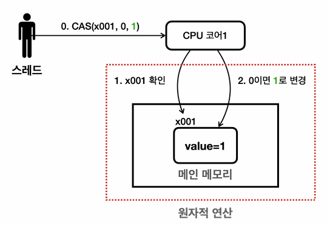

# 11_AtomicOperation

> - 해당 연산이 더 이상 나눌 수 없는 단위로 수행된다는 것을 의미
> - 멀티스레드 상황에서 다른 스레드의 간섭 없이 안전하게 처리되는 연산이라는 뜻

```java
volatile cnt = 0;

cnt = 1; // 원자적 연산
cnt++; // 원자적 연산 X
cnt = cnt+1; // 원자적 연산 X
```


## 성능 비교

```
BasicInteger: ms = 38
VolatileInteger: ms = 143
SyncInteger: ms = 507
MyAtomicInteger: ms = 214 // AtomicInteger사용
```

- `BasicInteger`

  - 캐시를 사용해서 가장 빠르다

  - 멀티 스레드 상황에서는 사용할 수 없다.

  - 단일 스레드일 경우에 가장 효율적이다.

    

- `VolatileInteger`

  - 멀티스레드에서 사용할 수 없다.

  - volatile은 메모리 가시성에 대한 해결방안이지 동시성 문제를 해결하기 위한게 아니다.

  - 원자적 연산일 때 사용가능 : ex) flag = false

    

- `SyncInteger`

  - 멀티스레드 환경에서 사용가능하다.

  - MyAtomicInteger 보다 성능이 느리다.

    

- `MyAtomicInteger `

  - lock을 사용하는 방법 보다 1.5~2배정도 빠르다.
  - 내부에 lock을 사용하지 않기 떄문이다.


## CAS(Compare-And-Swap) 연산 1

- **락 방식의 문제점**
  - 락을 획득하기 까지 일련의 과정이 필요하다. 
    1. 락이 있는지 확인
    2. 락을 획득하고 임계영역에 들어감
    3. 작업 수행
    4. 락을 반납
- **특별한 경우에 CAS를 적용시킬 수 있다.**


### CAS 는 원자적 연산이다??



```
CPU가 원자적 연산으로 처리한다. [하드웨어 차원에서 지원]
1. x001의 값을 확인
2. 읽은 값이 0이면 1로 변경한다.

위 두 과정을 CPU에서 하나의 원자적 명령으로 만들어버린다 ==> 다른 스레드가 중간에 개입할 수 없음

- CPU에게 성능적 영향이 끼치지 않는다.

```

- 


