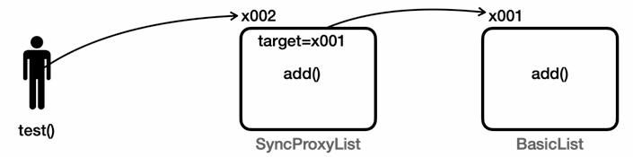

# 12_Collection


## 동시성 컬렉션 필요 이유

### 동시성 문제

- Thread Safe란
  - 여러 스레드가 동시에 접근해도 괜찮은 경우
- ArrayList는 Thread Safe한가? 
  - **대부분의 Collection은 원자적 연산이 아니다.**

```java
@Override
public void add(Object e) {
    elementData[size] = e;
    sleep(100); // 멀티스레드 문제를 쉽게 확인하는 위함
    size++;
}
```

- add 를 할 때 값을 추가하고 size를 증가시킨다.
- 원자적 연산이 아니기 떄문에 **실제 들어 있는 값과 size가 다를 수 있다**
- 또는 **A 에 값을 넣었는데 B가 덮어쓰기**가 될 수 있다.


### 동기화

```java
public class SyncList implements SimpleList{

    private static final int DEFAULT_CAPACITY = 5;

    private Object[] elementData;
    private int size = 0;

    public SyncList(){
        elementData = new Object[DEFAULT_CAPACITY];
    }

    @Override
    public synchronized int size() {
        return size;
    }

    @Override
    public synchronized void add(Object e) {
        elementData[size] = e;
        sleep(100); // 멀티스레드 문제를 쉽게 확인하는 위함
        size++;
    }

    @Override
    public synchronized Object get(int index) {
        return elementData[index];
    }

    @Override
    public String toString(){
        return Arrays.toString(Arrays.copyOf(elementData, size)) + " size = " + size
                + ", capacity = " + elementData.length;
    }

}
```


### 프록시 도입

- 기존 컬렉션을 유지하면서 사용할 순 없을까
- 기존 코드를 그대로 사용하면서 `synchronized` 기능만 살짝 추가하고 싶다면?
- **프록시** : 대신 처리해주는 자라는 뜻




```java
public class SyncProxyList implements SimpleList{

    private SimpleList target;

    public SyncProxyList(SimpleList target){
        this.target = target;
    }

    @Override
    public synchronized int size() {
        return target.size();
    }

    @Override
    public synchronized void add(Object e) {
        target.add(e);
    }

    @Override
    public synchronized Object get(int index) {
        return target.get(index);
    }

    @Override
    public synchronized String toString() {
        return target.toString() + " by " + this.getClass().getSimpleName();
    }
}
```

- 프록시 패턴 적용
  - **원본 Collection에 변경점 없이 동기화 기능을 추가한 것**


### 프록시 패턴

- 어떤 객체에 대한 접근을 제어하기 위해 대리인 또는 인터페이스 역할을 하는 객체를 제공하는 패턴이다.
- 프록시 객체는 실제 객체에 대한 참조를 유지하면서, 그 객체에 접근하거나 행동을 수행하기 전에 추가적인 처리를 할 수 있도록 한다.

- **주요 목적**
  - **접근 제어** : 실제 객체에 대한 접근을 제한하거나 통제할 수 있음
  - **성능 향상** : 실제 객체의 생성을 지연시키거나 캐싱하여 성능 최적화
  - **부가 기능 제공** : 실제 객체에 추가적인 기능(로깅, 인증, 동기화 등)을 투명하게 제공할 수 있다.

- AOP가 프록시 패턴을 극한으로 사용한 예시


