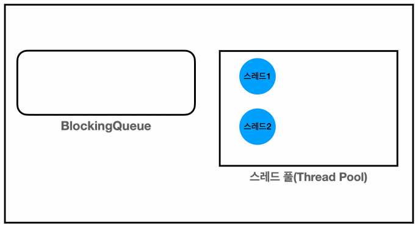

# 13_ThreadPool


## 스레드를 직접 사용할 때 문제점

> 1. 스레드 생성 시간으로 인한 성능 문제
> 2. 스레드 관리 문제
> 3. Runnable 인터페이스의 불편함

### 1. 스레드 생성 비용으로 인한 성능 문제

- **메모리 할당**
  - 스택을 위한 call stack 메모리를 할당해야한다.
- **운영체제 자원 사용**
  - 스레드 생성은 운영체제 커널 수준에서 이뤄진다.
  - 시스템 콜을 통해 처리된다. 이는 CPU와 메모리 리소스를 소모하는 작업이다.
- **운영체제 스케줄러 설정**
  - 스레드 하나는 보통 1MB 이상의 메모리를 사용한다.


### 2. 스레드 관리 문제

- 최대 스레드의 수까지만 스레드를 생성할 수 있게 관리해야함


###  3. Runnable 인터페이스의 불편함

- run() 메서드는 반환 값을 가지지 않는다. 따라서 사용하기 불편함


### => Thread Pool 사용

- 스레드를 관리하는 Pool에 스레드를 미리 만들어 놓음
- Executor Framework 보통 사용함


## Executor 프레임워크

### Code

- **main**

```java
public class ExecutorBasicMain {

    public static void main(String[] args) {
        ExecutorService es = new ThreadPoolExecutor(
            						2, 2, 0, TimeUnit.MILLISECONDS, new LinkedBlockingQueue<>());
        log("== 초기 상태 ==");
        printState(es);
        es.execute(new RunnableTask("taskA"));
        es.execute(new RunnableTask("taskB"));
        es.execute(new RunnableTask("taskC")); // 2개까진 만들고 있는걸 재사용해서 사용한다.
        es.execute(new RunnableTask("taskD"));

        log("== 작업 수행 중 ==");
        printState(es);

        sleep(3000);

        log("== 작업 수행 완료 ==");
        printState(es);

        es.shutdown();
        log("== shutdown ==");
        printState(es);
    }

}
```

**ThreadPoolExecutor 생성자**

- `corePoolSize` : 스레드 풀에서 관리되는 기본 스레드의 수
- `maximumPoolSize` : 스레드 풀에서 관리되는 최대 스레드 수
- `keepAliveTime, TimeUnit unit` 
  - 기본 스레드 수를 초과해서 만들어진 스레드가 생존할 수 있는 대기 시간. 대기시간 동안 작업이 없다면 초과 스레드는 제거
- `BlockingQueue workQueue` : 작업을 보관할 블로킹 큐

- `new ThreadPoolExecutor(2, 2, 0, TimeUnit.MILLISECONDS, new LinkedBlockingQueue<>());`
  - `corePoolSize, maximumPoolSize, keepAliveTime, BlockingQueue`


### 동작 과정

```
20:11:02.324 [     main] == 초기 상태 ==
20:11:02.337 [     main] [pool=0, active=0, queueTasks=0, completedTask0
20:11:02.339 [     main] == 작업 수행 중 ==
20:11:02.339 [     main] [pool=2, active=2, queueTasks=2, completedTask0
20:11:02.340 [pool-1-thread-1] taskA 시작
20:11:02.340 [pool-1-thread-2] taskB 시작
20:11:03.342 [pool-1-thread-1] taskA 완료
20:11:03.342 [pool-1-thread-1] taskC 시작
20:11:03.355 [pool-1-thread-2] taskB 완료
20:11:03.355 [pool-1-thread-2] taskD 시작
20:11:04.354 [pool-1-thread-1] taskC 완료
20:11:04.370 [pool-1-thread-2] taskD 완료
20:11:05.341 [     main] == 작업 수행 완료 ==
20:11:05.341 [     main] [pool=2, active=0, queueTasks=0, completedTask4
20:11:05.341 [     main] == shutdown ==
20:11:05.342 [     main] [pool=1, active=0, queueTasks=0, completedTask4

```


#### 초기 상태

- 스레드를 미리 생성해 두지는 않는다.


```
20:11:02.324 [     main] == 초기 상태 ==
20:11:02.337 [     main] [pool=0, active=0, queueTasks=0, completedTask0
```


#### 초기 상태 2

- 작업이 들어올 때 마다 corePoolSize 의 크기까지 스레드를 만든다.
  - TaskA가 들어올 때 Thread 1 생성, Task 2가 들어올 때 2생성


#### 작업 수행

- pool = 2 : 스레드 풀에 관리되는 스레드
- active = 2 : 작업 중인 스레드 
- queudTasks = 2 : 큐에 대기중인 작업
- completedTasks = 0 : 완료된 작업
- **Waiting 상태에서 Runnable 상태로 변경 됐다고 보면 된다. 즉 Pool 안에 계속 있지만 Thread 상태가 바뀐 것을 꺼내 쓴다고 표현**
  - 따라서 pool은 여전히 2라는 것을 알 수 있다.


```
20:11:02.339 [     main] == 작업 수행 중 ==
20:11:02.339 [     main] [pool=2, active=2, queueTasks=2, completedTask0]
20:11:02.340 [pool-1-thread-1] taskA 시작
20:11:02.340 [pool-1-thread-2] taskB 시작
20:11:03.342 [pool-1-thread-1] taskA 완료
20:11:03.342 [pool-1-thread-1] taskC 시작
20:11:03.355 [pool-1-thread-2] taskB 완료
20:11:03.355 [pool-1-thread-2] taskD 시작
20:11:04.354 [pool-1-thread-1] taskC 완료
20:11:04.370 [pool-1-thread-2] taskD 완료
```


#### 작업 수행 완료



```
20:11:05.341 [     main] == 작업 수행 완료 ==
20:11:05.341 [     main] [pool=2, active=0, queueTasks=0, completedTask4

```


#### Shutdown


```
20:11:05.341 [     main] == shutdown ==
20:11:05.342 [     main] [pool=1, active=0, queueTasks=0, completedTask4
```


