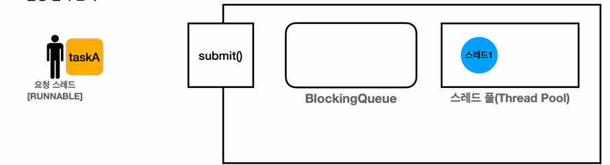
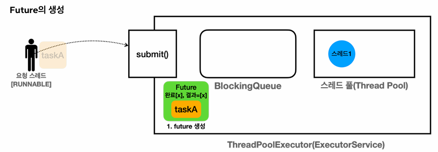
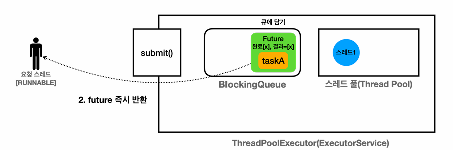
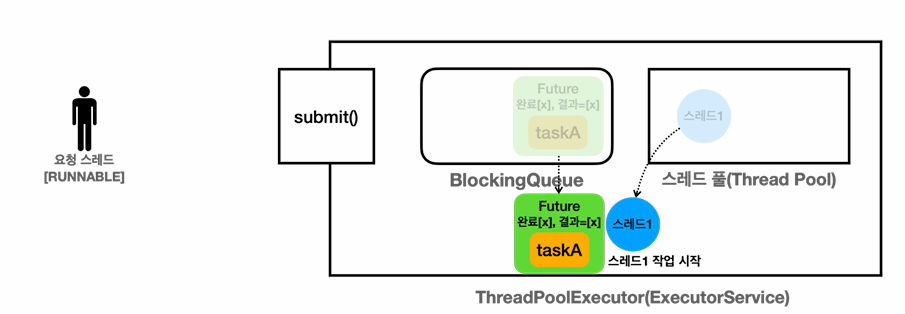
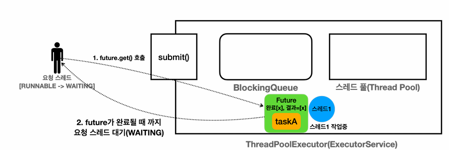
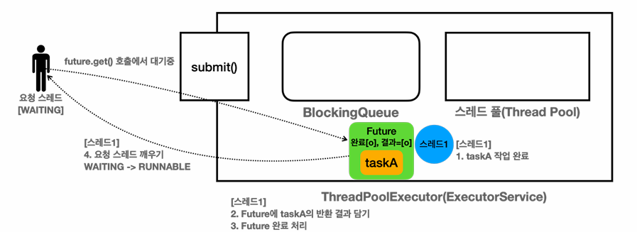
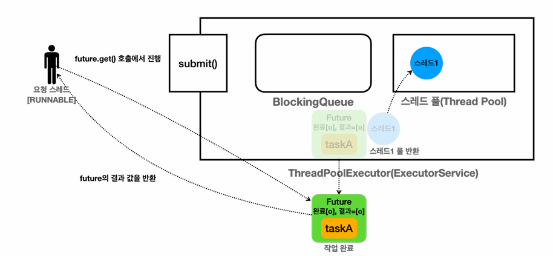

# 14_Future

## Runnable 과 Callable 

```java
public interface Runnable(){
    void run();
}
```

- return 값이 없음
- 자식은 부모의 예외 범위를 넘을 수 없음 (check 예외)
  - run time 예외는 제외


```java
public interface Callable<V>{
    V call() throws Exception;
}
```

- java.util.concurrent 에서 제공되는 기능이다.
- Callable 의 call() 은 반환 타입이 제네릭 V이다. 즉 값을 반환할 수 있음


```java
public class CallableMainV1 {
    public static void main(String[] args) throws ExecutionException, InterruptedException {
        // Pool 하나만 있는 Util
        ExecutorService es = Executors.newFixedThreadPool(1);
        Future<Integer> future = es.submit(new MyCallable());
        Integer res = future.get();
        log("res : " + res);
        es.shutdown();
    }

    static class MyCallable implements Callable<Integer>{
		
        // 결과를 field에 저장하지 않아도 된다.
        
        @Override
        public Integer call() throws Exception {
            log("Callable 시작 ");
            sleep(2000);
            int value = new Random().nextInt(10);
            log("value : " + value);
            log("Callable 완료 ");
            return value;
        }
    }
}
```

- 결과를 field에 저장하지 않아도 된다.

### submit()

```java
<T> Future<T> submit(Callable<T> task); // interface 정의

// 사용
Future<Integer> future = es.submit(new MyCallable());
```

- MyCollable 인스턴스가 블로킹 큐(ExecutorService 생성함)에 전달되고, 스레드 풀의 스레드 중 하나가 이 작업을 실행
- 이때 작업의 처리 결과는 직접 반환되는 것이 아니라  `Future` 라는 인스턴스를 통해 반환 

- **의문점**
  - future.get()을 스레드 풀의 스레드가 작업을 완료했다면 반환 결과가 있을 것. 하지만 **작업을 처리하고 있는 도중에 반환하라고 하면 어떻게 될까?**
  - 결과를 바로 반환하지 않고, **왜 Future를 사용하여 반환할까?**


## Future

```java
Future<Integer> future = es.submit(new MyCallable());
```

- Future는 전달한 작업의 미래 결과를 담고 있다고 생각할 수 있다.
- 이유
  - submit을 실행함
  - Main thread가 아닌 다른 (Thread Pool 에 있는)  thread가 MyCallable 객체를 받아서 실행하게 된다.
  - 만약 pool에 thread가 없다면?? 기다렸다가 실행해야함
  - 따라서 바로 값을 반환 할 수 없기 떄문에 Future객체로 대신 반환하는 것이다.


- 로그

```
18:25:19.693 [     main] submit() 호출
18:25:19.702 [pool-1-thread-1] Callable 시작 
18:25:19.706 [     main] submit() 반환, futurejava.util.concurrent.FutureTask@3941a79c[Not completed, task = thread.executor.future.CallableMainV2$MyCallable@27bc2616]
18:25:19.706 [     main] future.get() [blocking] 메서드 호출 시작 -> main 스레드 waiting
18:25:21.715 [pool-1-thread-1] value : 8
18:25:21.716 [pool-1-thread-1] Callable 완료 
18:25:21.716 [     main] future.get() [blocking] 메서드 호출 완료 -> main 스레드 runnable
18:25:21.717 [     main] res : 8
18:25:21.718 [     main] future 완료, futurejava.util.concurrent.FutureTask@3941a79c[Completed normally]

```


#### 초기 실행



```java
// Pool 하나만 있는 Util
ExecutorService es = Executors.newFixedThreadPool(1);
```

- task, Thread-1 생성 됐다고 가정


### submit() 실행





```java
log("submit() 호출");
Future<Integer> future = es.submit(new MyCallable());
log("submit() 반환, future" + future);
```

```
18:25:19.706 [     main] submit() 반환, futurejava.util.concurrent.FutureTask@3941a79c[Not completed, task = thread.executor.future.CallableMainV2$MyCallable@27bc2616]
```

- Future
  - 내부에 작업 완료 여부, 결과 값을 가짐
  - 작업이 완료되지 않았으면 결과값이 없이 future를 반환한다.
  - `[Not completed, task = thread.executor.future.CallableMainV2$MyCallable@27bc2616]`
    - 결과값 + MyCallable 객체 존재
- Future의 구현체 = `FutureTask`


#### Callable 시작 



```
18:25:19.702 [pool-1-thread-1] Callable 시작 
```

- 큐에 있는 **Future[taskA]**를 꺼내서 스레드 풀의 **스레드1**이 작업을 시작
  - FutureTask는 Runnable 인터페이스도 함께 구현하고 있음 
- 스레드1은 FutureTask의 run() 메서드를 수행
- taskA의 call() 메서드를 호출하고 그 결과를 받아서 처리
  - FutureTask.run() => MyCallable.call()


#### get()



```java
log("future.get() [blocking] 메서드 호출 시작 -> main 스레드 waiting");
Integer res = future.get();
```

```
18:25:19.706 [     main] future.get() [blocking] 메서드 호출 시작 -> main 스레드 waiting
```

- future.get()을 호출하면 Future 가 완료 상태가 될 때 까지 대기한다.
- 이때 요청 스레드의 상태는 `RUNNABLE => WAITING`
- **Future 완료**
  - Future에 결과가 포함 되어서 반환. 즉시 반환 가능
- **Future 완료 x**
  - taskA가 아직 수행되지 않았거나 수행 중
  - 요청 스레드는 어쩔 수 없이 반환 값을 대기해야함
  - 즉 락을 얻을 때 처럼 blocking되어야 한다.

**blocking method**

- Thread.join(), Future.get() 과 같은 메서드를 blocking method라고 한다. 


#### 결과 값 반환





```java
log("future.get() [blocking] 메서드 호출 완료 -> main 스레드 runnable");
log("res : " + res);
log("future 완료, future" + future);

es.shutdown();
```

```
18:25:21.716 [pool-1-thread-1] Callable 완료 
18:25:21.716 [     main] future.get() [blocking] 메서드 호출 완료 -> main 스레드 runnable
18:25:21.717 [     main] res : 8
18:25:21.718 [     main] future 완료, futurejava.util.concurrent.FutureTask@3941a79c[Completed normally]
```

- taskA 작업을 완료
- Future에 taskA 반환 결과 담고, Future의 상태를 완료로 변경
- 요청 스레드를 깨움 :  `WAITING => RUNNABLE`


## Future 활용


