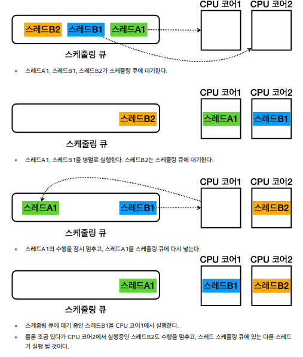

# Process And Thread

## 멀티태스킹과 멀티프로세싱

- **Multi Tasking :**

  -  하나의 CPU가 동시에 **여러 작업을 수행**하는 것 처럼 보이게 하는 능력  => **소프트웨어 기반**

  - 동시 => 짧은 시간에 짧게 수행한다는 뜻 

    

- **Multi Processing**

  - CPU 코어 하나가 하나의 프로그램을 처리할 수 있다.

  - 여러 CPU(코어)를 사용하여 동시에 여러 작업 수행 => **하드웨어 기반**

## Process

- **Process란**

  - 운영체제 안에서 **실행중인 프로그램을 프로세스**라고 한다.

    - 프로그램 => 실제 실행하기 전까지는 단순한 파일에 불과

    - 프로세스 => 실행 중인 프로그램의 인스턴스

      

- **Process 메모리 구성**

  - 코드 섹션 : 실행할 프로그램의 코드가 저장되는 부분
  - 데이터 섹션 : **전역 변수 및 정적 변수**가 저장되는 부분
  - 힙 : 동적으로 할당되는 메모리 영역
  - 스택 : **메서드 호출 시** 생성되는 **지역 변수와 반환 주소**가 저정되는 부분 (스레드 포함)

- **스레드**
  - 프로세스(실행중인 프로그램)의 코드를 실행하는 흐름 
  - 프로세스는 하나 이상의 스레드를 반드시 포함한다.
  - 스레드은  프로세스가 제공하는 동일한 메모리 공간을 공유한다.
  - **메모리 구성**
    - 공유 메모리 : 같은 프로세스의 코드 섹션, 데이터 섹션, 힙은 프로세스 안의 모든 스레드가 공유
    - 개별 스택 : 각 스레드는 자신의 스택을 갖고 있음

- 프로그램이 실행된다는 것의 의미는?
  - 프로세스 안에 있는 코드가 한 줄씩 실행되는 것

## 스레드와  스케줄링

### 멀티 코어

- 

## Context Switching

- 멀티 태스킹을 할 시에 Thread A에서 실행할 때 어디서 끝났는지와 메모리에 다시 올리는 과정이 필요하다
  - 이때 약간의 비용이 들게 된다.

## 실무

- CPU와 스레드의 관계

  - CPU 4 / Thread 100

    - 컨텍스트 스위칭 비용이 늘어난다.

  - CPU 4 / Thread 100

    - CPU를 100프로 활용할 수 있다.

    - 컨텍스트 스위칭 비용도 자주 발생하지 않는다.

    - 이상 : CPU 코어 수 + 1개 정도로 스레드를 맞추면 특정 스레드가 잠시 대기 할 때 스레드를 활요앟활용할 수 있음

      

- CPU 바운드 작업 vs I/O 바운드 작업

  - CPU 바운드 작업 (CPU - bound tasks)

    - CPU의 연산 능력을 많이 요구하는 작업

    - 계산, 데이터 처리, 알고리즘 실행 등 CPU의 처리 속도가 작업 완료 시간을 경정하는 경우

    - ex) 복잡한 수학 연산, 데이터 분석, 비디오 인코딩, 시뮬레이션 등

      

  - I/O 바운드 작업 (I/O-cound tasks)

    - 디스크, 네트워크, 파일시스템 등과 같은 IO 작업을 요구하는 작업
    - 대기 시간이 많이 발생하기 떄문에  스레드가 CPU를 사용하지 않는다.
    - ex) 데이터베이스 쿼리 처리, 파일 읽기/ 쓰기, 네트워크 통신

- 웹
  - I/O 바운드 작업이 많음
  - 사용자의 입력을 기다리거나, DB를 호출하고 결과를 기다리는 작업을 많이 한다.
  - 사용자의 요청 하나를 처리하는데 1개의 스레드가 필요하다.
    - 즉 4명이 요청 => 스레드 4개
  - **스레드하나당 CPU를 얼마나 쓰는지를 확인해봐야한다.**
    - **성능테스트를 통해서 최적의 스레드 숫자를 찾는 것이 이상적이다.**
  - **CPU 사용량을 확인하는 것이 필요**

- CPU 바운드 : CPU 코어수 + 1개
- I/O 바운드 : 성능 테스트 필요

