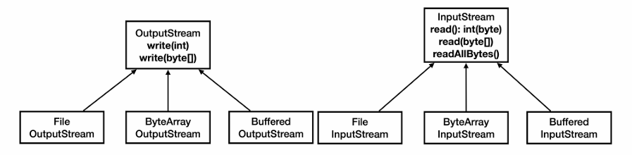

# 01_encoding & IO


**모든 데이터는 byte 단위(숫자)로 저장된다.**


## 컴퓨터와 데이터

- 모든 문자를 byte로 변경할 때는 문자 집합 (ex_ UTF-8 등)이 필요하다. 
- 자바의 byte는 첫번째 비트가 0 이면 양수, 1이면 음수로 간주된다.
  - 즉 256가지를 표현가능하다.
    - 0~127 / -128 ~ -1 이렇게 256가지


## Stream

- read() 가 byte가 아니라 int를 반환하는 이유
  - EOF(파일의 끝) 표시를 위해서 byte 대신 int를 사용한다.
  - 자바 byte는 부호 있는 8비트(-128~127) 값이다.
  - 따라서 0~255 종류의 값만 가질 수 있다.  즉 EOF를 위한 특별한 값 (-1) 을 가질 수 없기 때문


## 부분 나눠 읽기 vs 전체 읽기

- **부분 나눠 읽기**
  - 메모리 사용량을 제어할 수 있다.
  - 스트림에서 일정한 크기의 데이터를 반복적으로 읽어야 할때 유용한다.
    - 대용량 파일을 처리할 때

- 전체 읽기 (readAllBytes())
  - 작은 파일이나 메모리에 모든 내용을 올려서 처리해야할 경우
  - 즉 파일이 작을 경우


## InputStream, OutputStream


### PrintStream

```java
public static void main(String[] args) throws IOException {
    System.out.println("hello");
    PrintStream printStream = System.out;
    byte[] bytes = "Hello!\n".getBytes(StandardCharsets.UTF_8);
    printStream.write(bytes);
    printStream.println("Hello");

}
```


### Read, Write

- **wirte() read() 호출 시 오래 걸리는 이유**

  - write() 나 read()를 호출할 때마다 OS의 시스템 콜을 통해 파일을 읽거나 쓰는 명령어를 전달

  - HDD, SDD 같은 장치들도 하나의 데이터를 읽고 쓸 때마다 필요한 시간이 있다.

  - 이러한 무거운 작업을 1byte당 한번씩 반복하는 것

  - 10MB 쓰기 : 10초...?

    

- **한번에 모아서 보낸다면?**

  - Buffer size에 맞춰서 보내면 10MB에 54ms정도 걸린다.
  - Buffer Size 가 커질 수록 빨라진다.
    - 하지만 점점 빨라지는 속도가 느려지고 일정 수준에서 느려진다. 


- **디스크나 파일 시스템에서 데이터를 읽고 쓰는 기본단위가 보통 4KB 또는 8KB이기 때문이다.**
  - 따라서 최근에는 8KB정도로 잡는 것이 효율이 좋다. 


### BufferedOutStream

- 직접 버퍼를 만들어서 진행하지 않아도 된다.
- FileoutputStream 객체를 생성자에 전달한다. 
- 하지만 직접 buffer를 만드는 것보다 느리다.
  - 동기화 기법이 들어가 있기 때문이다. 
  - Bufferxxx는 멀티 스레드를 고려한 클래스이다.
  - 따라서 멀티로 돌릴 수 있음
  - 하지만 single thread에서는 성능이 떨어진다.
  - lock이 없는 bufferxx 클래스는 없기 때문에 직접 구현해야한다.

```java
public static void main(String[] args) throws IOException {
    FileOutputStream fos = new FileOutputStream(FILE_NAME);
    BufferedOutputStream bos = new BufferedOutputStream(fos, BUFFER_SIZE);
    long startTime = System.currentTimeMillis();

    for (int i = 0; i<FILE_SIZE; i++){
    bos.write(1);
    }
    bos.close();

    long endTime = System.currentTimeMillis();
    System.out.println("file created : " + FILE_NAME);
    System.out.println("file created : " + FILE_SIZE / 1024/1024);
    System.out.println("Time : " + (endTime - startTime) + "ms");
}
```


## Reader Writer

**Byte를 다루는 클래스**




**문자를 다루는 클래스**


