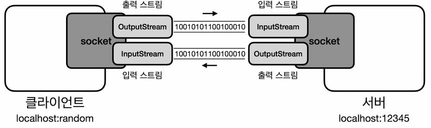
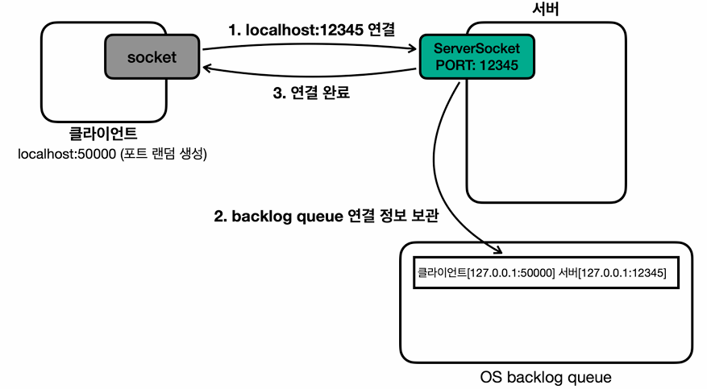
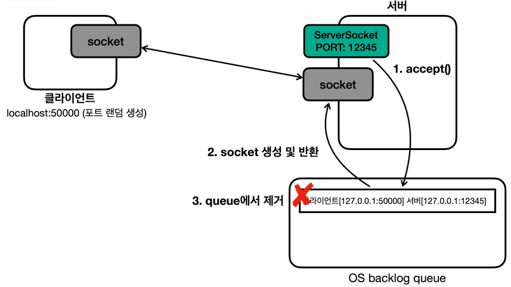
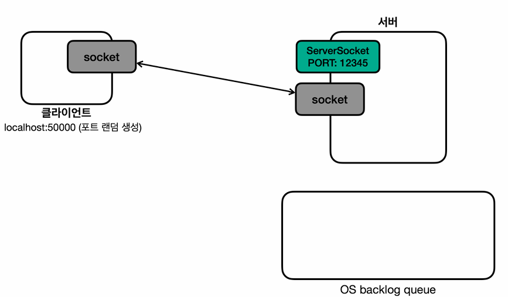
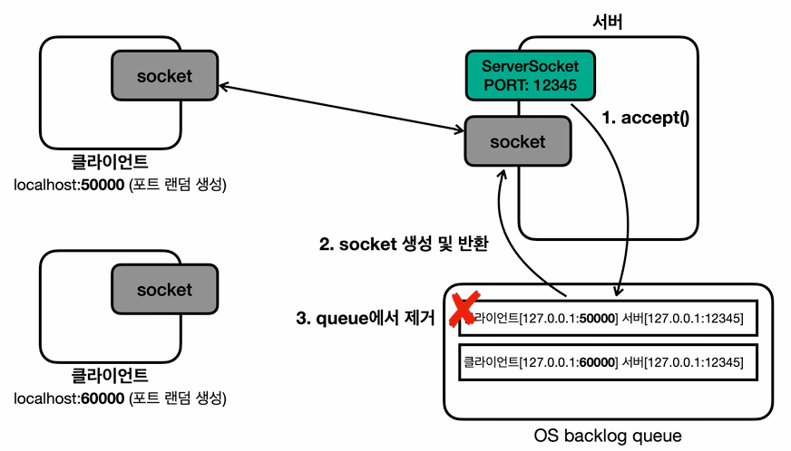

# 02_network


### localhost

- 127.0.0.1
- loopback address : 네트워크 인터페이스를 통해 외부로 나가지 않는다.
- 자신에게 직접 네트워크 패킷을 보낼 수 있다. 

- 만약 localhost가 잘 되지 않는다면, localhost가 127.0.0.1로 매핑되어있지 않은 것


### BindException

- Port를 이미 사용하고 있다는 뜻이다. 


### InetAddress

**호스트 파일**

```
# localhost name resolution is handled within DNS itself.
#	127.0.0.1       localhost
#	::1             localhost
# Added by Docker Desktop
172.30.1.95 host.docker.internal
172.30.1.95 gateway.docker.internal
# To allow the same kube context to work on the host and the container:
127.0.0.1 kubernetes.docker.internal
# End of section
```

- 자바는 InetAddress.getByName("호스트명") 메서드를 사용하면 IP주소를 조회한다.
- 이 과정에서 시스템 호스트 파일을 먼저 확인한다.
  - `C:\Windows\System32\drivers\etc\hosts`
- 호스트 파일에 정의되지 않은 주소는, DNS 서버에 요청해서 IP주소를 얻는다.


## Network Connection

### Client

```java
Socket socket = new Socket("localhost", PORT);
```

- localhost는 IP가 아니기 떄문에 IP를 먼저 찾는다.
- 내부에서 `InetAddress` 를 사용해서 IP에 Mapping되어있는지 찾고, 없으면 DNS서버를 거친다.
- 연결이 성공적으로 완료되면, Socket 객체를 반환한다. 



```java
DataInputStream input = new DataInputStream(socket.getInputStream());
DataOutputStream input = new DataOutputStream(socket.getOutputStream());
```

- 데이터를 주고 받을 때 Stream을 사용한다.
- InputStream, OutputStream을 직접사용하게 되면 모든 데이터를 byte로 변환해서 전달해야한다.
- 따라서 DataInputStream이라는 보조 스트림을 사용해서 자바 타입의 메시지를 편리하게 주고 받을 수 있도록 한다.
  - 내부에는 각 타입별로 byte의 크기가 정해져있어서 type별로 각 크기를 byte로 읽는다.

```java
// ex) DataInputStream에서 int를 읽는 함수
public final int readInt() throws IOException {
    readFully(readBuffer, 0, 4); // 4byte
    return ByteArray.getInt(readBuffer, 0);
}
```


### Server



```java
// 서버 소켓은 TCP 연결을 확인하는 역할만 한다.
ServerSocket serverSocket = new ServerSocket(PORT);
```

- 서버가 12345 Port로 서버 소켓을 열어둔다.
- 이때 OS 계층에서 TCP 3way handshake가 발생하고, TCP 연결이 완료된다.
- TCP 연결이 완료되면 OS backlog queue라는 곳에 클라이언트와 서버의 TCP 연결정보를 보관한다.




```java
Socket socket = serverSocket.accept();
```

- accept()를 호출하면 backlog queue에서 TCP 연결 정보를 조회한다. 
  - 만약 TCP 연결정보가 없다면, 연결 정보가 생성될 때 까지 대기한다. (blocking)
- 해당 정보를 기반으로 Socket 객체를 생성한다. 
- 사용한 TCP 연결 정보는 backlog queue에서 제거된다.




```java
DataInputStream input = new DataInputStream(socket.getInputStream());
DataOutputStream output = new DataOutputStream(socket.getOutputStream());
```

- Socket은 클라이언트와 서버가 데이터를 주고 받기 위한 스트림을 제공


### Accept

- accept를 관리하는 스레드를 별도로 관리해야하는 이유
  - 예시) 여러 client가 server에 접근한다고 가정

```java
public static void main(String[] args) throws IOException {
    log("server start");
    ServerSocket serverSocket = new ServerSocket(PORT);
    log("socket start : " + PORT);

    // 소켓에 누군가 접근하면 그것을 열어주게 된다.
    Socket socket = serverSocket.accept();
    DataInputStream input = new DataInputStream(socket.getInputStream());
    DataOutputStream output = new DataOutputStream(socket.getOutputStream());


    while(true){
        String received = input.readUTF();
        log("server from client : " + received);

        if (received.equals("exit")){
            break;
        }

        String toSend = received + "World!";
        output.writeUTF(toSend);
        log("client <- server : " + toSend);
    }

    input.close();
    output.close();
    socket.close();
    serverSocket.close();
}
```

- 위 코드를 보면 `Socket socket = serverSocket.accept();` 가 한번밖에 작동하지 않는다.
- 따라서 첫번째 스레드가 TCP 연결을 완료하고 socket을 생성하게 된다면, 두번째 스레드는 서버와 TCP 연결까지는 완료되지만 socket을 생성할 수는 없다




- 서버는 12345 서버 소켓을 열어둔 뒤에 50000번과 TCP 연결 후 server에서 socket을 생성했다.
- client 60000번과도 TCP 연결은 완료되어 연결은 완료되었다.

- 클라이언트가 "Hello, world" 라는 메시지를 서버에 전송하는 경우
  - **클라이언트**
    - 애플리케이션 => OS TCP 송신 버퍼 => 클라이언트 네트워크 카드(LAN)
  - **서버** 
    - 서버 네트워크 카드(LAN) => OS TCP 수신 버퍼 => 애플리케이션

- **핵심 내용**
  - 소켓 객체 없이 serverSocket만으로도 TCP 연결은 완료된다. 
  - 즉 OS backlog queue에 값이 존재한다는 뜻이지만, Socket을 생성해줘야 메시지를 주고받을 수 있다. 
  - 하지만 accept() 메서드는 backlog큐에 새로운 연결 정보가 도착할 때까지 블로킹 상태로 대기한다.
  - 새로운 정보가 오지 않으면 계속 대기하는 블로킹 메서드이다.
  
- **해결 방안 **
  - 2개의 블로킹 작업 : accept, readUTF=> 2개의 스레드가 필요하다.
  - accept() : 클라이언트와 서버의 연결을 처리하기 위한 대기
  - readXxx() : 클라이언트의 메시지를 받아서 처리하기 위한 대기
    - accept 기다리느라 read도 대기할 수는 없기 때문에 둘이 다른 스레드로 별도 관리가 필요하다.


### 해결 한 코드

- client : 요청
- server : TCP 연결 + Session 생성(별도 Thread로) 및 Start
- session : Stream으로 로직 수행

**Client** : 위와 동일하기 때문에 생략

**Server**

```java
public class ServerV3 {

    private static final int PORT = 12345;

    public static void main(String[] args) throws IOException {

        log("server start");
        ServerSocket serverSocket = new ServerSocket(PORT);
        log("socket start : " + PORT);

        // 소켓에 누군가 접근하면 그것을 열어주게 된다.
        while (true){
            // 요청이 올 때마다 연결을 진행
            Socket socket = serverSocket.accept();
            log("소켓 연결 : " + socket);

            SessionV3 session = new SessionV3(socket);
            Thread thread = new Thread(session);
            thread.start();
        }
    }
}

```

- 서버는 listener 역할을 한다.
- 새로운 client가 들어오면 TCP 연결을 한 뒤에 accept로 socket을 message를 주고 받을 수 있는 socket을 생성해준다.
- 그러고 난 뒤에 session을 생성해서 return 받은 socket을 넘겨주면서 새로운 Thread에서 session이 실행될 수 있도록 한다.

**Session**

```java
public class SessionV3 implements Runnable{

    private final Socket socket;

    public SessionV3(Socket socket) {
        this.socket = socket;
    }

    @Override
    public void run() {

        try {
            // stream init
            DataInputStream input = new DataInputStream(socket.getInputStream());
            DataOutputStream output = new DataOutputStream(socket.getOutputStream());
		
            // logic
            while(true){
                String received = input.readUTF();
                log("server from client : " + received);

                if (received.equals("exit")){
                    break;
                }

                String toSend = received + "World!";
                output.writeUTF(toSend);
                log("client <- server : " + toSend);
            }

            log("연결 종료");
            input.close();
            output.close();
            socket.close();

        } catch (IOException e) {
            throw new RuntimeException(e);
        }
    }
}
```

- Session은 각 client마다 생성되며, 로직을 수행하게 된다.
- 따라서 여러 client들은 각각 메세지를 주고 받을 수 있게 된다.


