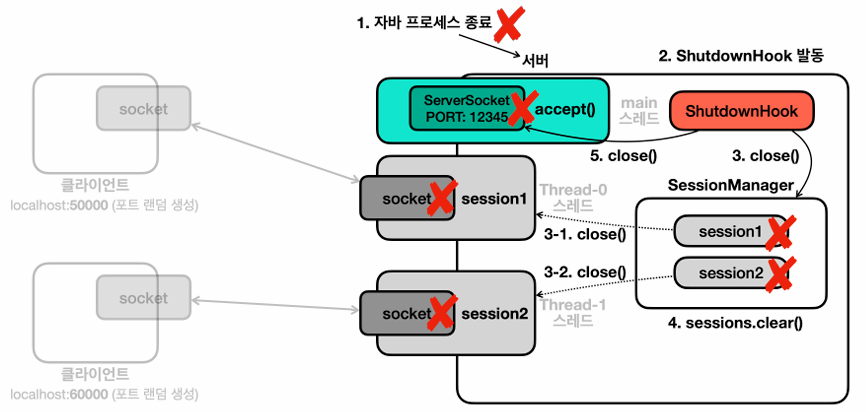
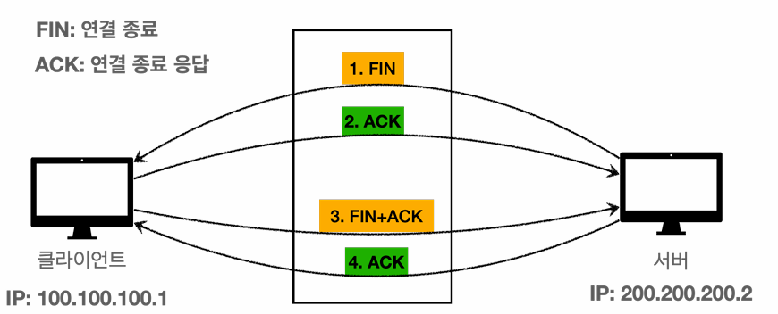
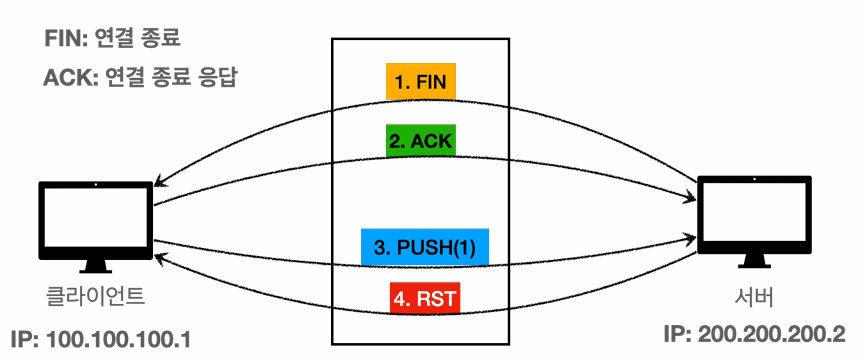

# 03_resource


## Close 순서

```java
private static void logic() throws CallException, CloseException {

    ResourceV1 resource1 = new ResourceV1("resource1");
    ResourceV1 resource2 = new ResourceV1("resource2");

    resource1.call();
    resource2.callEx(); // CallException

    System.out.println("자원 정리"); // 호출 안됨
    resource2.closeEx(); //
    resource1.closeEx();
}
```

- resource1을 먼저 생성하고, resource1의 정보를 활용해서 resource2를 생성했다면?
  - **resource2를 먼저 닫고, resource1을 나중에 닫아야한다.**
  - 왜냐하면 resource2의 입장에서 resource1의 정보를 참조하고 있을 수 있기 때문
- **위 코드의 문제점**
  - `resource2.callEx(); // CallException` 에서 예외가 발생하면 자원정리가 호출되지 않는 문제가 있음


## try-with-resources

```java
// AutoCloseable 사용해서 Resource 사용
public class ResourceV2 implements AutoCloseable{

    private String name;

    public ResourceV2(String name) {
        this.name = name;
    }

    public void call(){
        System.out.println(name + " call");
    }

    public void callEx() throws CallException {
        System.out.println(name + " callEx");
        throw new CallException(name + " ex");
    }

    @Override
    public void close() throws CloseException {
        System.out.println(name + " close");
        throw new CloseException(name + " ex");
    }
}
```


```java
private static void logic() throws CallException, CloseException {

    // resource를 다 쓰고나면 resource2.close, resource1.close를 자동으로 close해주는 것
    try (ResourceV2 resource1 = new ResourceV2("resource1");
         ResourceV2 resource2 = new ResourceV2("resource2");) {

        resource1.call();
        resource2.callEx(); // CallException

    }catch (CallException e){
        System.out.println("ex : " + e);
        throw e;
    }
}
```

- 이렇게 try-with-resources를 사용하면
  - **리소스 누수방지**
    - 모든 리소스가 제대로 닫히도록 보장한다. 
      실수로 ` finally` 블록을 적지 않거나, ` finally`  블럭 안에서 자원 해제 코드를 누락하는 문제들을 예방할 수 있다.
  - **코드 간결성 및 가독성 향상**
    - 명시적인 ` close()` 호출이 필요 없어 코드가 더 간결하고 읽기 쉬워진다.
    
  - **스코프 범위 한정**
    -  리소스로 사용되는 ` resource1,2` 변수의 스코프가 ` try` 블럭 안으로 한정된다.  따라서 코드 유지보수가 더 쉬워진다
    
  - **조금 더 빠른 자원 해제**
    - 기존에는 try  catch  finally로 catch 이후에 자원을 반납했다. Try with resources  구분은 ` try` 블럭이 끝나면 즉시 ` close()` 를 호출한다.
    
  - **자원 정리 순서** 
    - 먼저 선언한 자원을 나중에 정리한다.
    
  - **부가 예외 포함**
    - try-with-resource는 핵심예외를 반환한다.
    - 부가 예외는 핵심 예외안에 Suppressed로 담아서 반환
    - 개발자는 e.getSuppressed()를 통해 활용할 수 있다.


### try-with-resource를 활용해서 예제 적용하기

```java
public class ClientV5 {

    private static final int PORT = 12345;

    public static void main(String[] args) throws IOException {
        log("client start");
        
		// try-with-resources 사용
        try(Socket socket = new Socket("localhost", PORT);
            DataInputStream input = new DataInputStream(socket.getInputStream());
            DataOutputStream output = new DataOutputStream(socket.getOutputStream());){

            log("소켓 연결 : " + socket);

            Scanner scanner = new Scanner(System.in);
            while (true){
                System.out.println("전송 문자: ");
                String toSend = scanner.nextLine();

                // server
                output.writeUTF(toSend);
                log("client to server : " + toSend);

                if (toSend.equals("exit")) {
                    break;
                }

                String received = input.readUTF();
                log("server to client : " + received);
            }
        }
    }
}
```

```java
public class SessionV5 implements Runnable{

    private final Socket socket;

    public SessionV5(Socket socket) {
        this.socket = socket;
    }

    @Override
    public void run() {
		// try-with-resources 사용
        try(socket;
            DataInputStream input = new DataInputStream(socket.getInputStream());
            DataOutputStream output = new DataOutputStream(socket.getOutputStream());) {

            while(true){
                String received = input.readUTF();
                log("server from client : " + received);

                if (received.equals("exit")){
                    break;
                }

                String toSend = received + "World!";
                output.writeUTF(toSend);
                log("client <- server : " + toSend);
            }

        } catch (IOException e) {
            throw new RuntimeException(e);
        }
    }
}
```

```java
public class ServerV5 {

    private static final int PORT = 12345;

    public static void main(String[] args) throws IOException {

        log("server start");
        ServerSocket serverSocket = new ServerSocket(PORT);
        log("socket start : " + PORT);

        // 소켓에 누군가 접근하면 그것을 열어주게 된다.
        while (true){
            Socket socket = serverSocket.accept();
            log("소켓 연결 : " + socket);

            SessionV5 session = new SessionV5(socket);
            Thread thread = new Thread(session);
            thread.start();
        }
    }
}
```


## try-with-resources을 사용 못하는 경우 - Server 종료

### try-with-resources가 사용이 가능한 경우

- try가 끝나는 시점에 자원을 정리한다.
- 즉 try에서 자원의 선언과 자원정리를 묶어서 처리할 때 사용할 수 있다.
- 사용불가한 경우
  - 다른 곳에서도 자원정리가 필요한 경우
  - Session이 종료될 때도 자원정리가 필요하고 Server가 종료될 때도 Session의 자원을 정리할 필요가 있다.
  - 이럴 때는 try-with-resources를 사용할 수 없다.


**SessionsManager**

- 멀티 스레드가 사용되기 때문에 `synchronized`를 사용해준다.

```java
// 동시성 처리
public class SessionManagerV6 {

    private List<SessionV6> sessions = new ArrayList<>();

    public synchronized void add(SessionV6 session) {
        sessions.add(session);
    }

    public synchronized void remove(SessionV6 session) {
        sessions.remove(session);
    }

    public synchronized void closeAll(){
        for (SessionV6 session : sessions) {
            session.close();
        }
        sessions.clear();
    }

}
```


**Session**

```java
public class SessionV6 implements Runnable{

    private final Socket socket;
    private final DataInputStream input;
    private final DataOutputStream output;
    private final SessionManagerV6 sessionManager;
    private boolean closed = false;

    public SessionV6(Socket socket, SessionManagerV6 sessionManager) throws IOException {
        this.socket = socket;
        this.input = new DataInputStream(socket.getInputStream());
        this.output = new DataOutputStream(socket.getOutputStream());
        this.sessionManager = sessionManager;
        this.sessionManager.add(this);
    }

    @Override
    public void run() {
        try {
            while(true){
                String received = input.readUTF();
                log("server from client : " + received);

                if (received.equals("exit")){
                    break;
                }

                String toSend = received + "World!";
                output.writeUTF(toSend);
                log("client <- server : " + toSend);
            }
        } catch (IOException e) {
            throw new RuntimeException(e);
        }
        // try-with-resources를 사용하지 않기 때문에 finally를 사용해준다.
        finally {
            sessionManager.remove(this);
            close();
        }
    }

    // session 종료 시, 서버 종료 시 동시에 호출 될 수 있음
    // 멀티스레드로 서버 종료하는데 동시에 session이 호출 될 수 있음
    public synchronized void close(){
        if (closed){
            return;
        }
        closeAll(socket, input, output);
        closed = true;
        log("연결 종료 (socket, input, output)");
    }

}
```


**Server**



```java
public class ServerV6 {

    private static final int PORT = 12345;

    public static void main(String[] args) throws IOException {

        log("server start");
        SessionManagerV6 sessionManager = new SessionManagerV6();
        ServerSocket serverSocket = new ServerSocket(PORT);
        log("socket start : " + PORT);

        // ShutdownHook 등록
        ShutdownHook shutdownHook = new ShutdownHook(serverSocket, sessionManager);
        Runtime.getRuntime().addShutdownHook(new Thread(shutdownHook, "shutdown"));

        try {
            while (true) {
                Socket socket = serverSocket.accept();
                log("소켓 연결 : " + socket);

                SessionV6 session = new SessionV6(socket, sessionManager);
                Thread thread = new Thread(session);
                thread.start();
            }
        } catch (IOException e) {
            log("서버 소켓 종료: " + e);
        }
    }

    // java가 종료될 때 호출되도록 하는 것
    static class ShutdownHook implements Runnable {

        private final ServerSocket serverSocket;
        private final SessionManagerV6 sessionManager;

        ShutdownHook(ServerSocket serverSocket, SessionManagerV6 sessionManager) {
            this.serverSocket = serverSocket;
            this.sessionManager = sessionManager;
        }


        @Override
        public void run() {
            log("shutdownHoot 실행");
            try {
                sessionManager.closeAll();
                serverSocket.close();

                // 자원종료 대기
                // 다른 스레드들이 로그를 남기거나할 때 시간을 대기 시켜주기 위함
                Thread.sleep(1000); 

            } catch (IOException e) {
                throw new RuntimeException(e);
            } catch (InterruptedException e) {
                throw new RuntimeException(e);
            }
        }
    }
}
```


## Network 예외

**java.net.UnkownHostException**

- 호스트를 알 수 없을 때 나타나는 Exception이다.
- `999.999.999.999` 와 같이 IP가 존재하지 않을 때
- `google.gogo` 와 같이 도메인 이름이 존재하지 않을 때 


**java.net.ConnectException: Connection resused**

- 연결 거절 : **네트워크를 통해서 해당 IP에 접근은 했으나 거절 당했다는 뜻이다.**
- **IP에 해당하는 서버는 켜져있지만, 사용하는 PORT가 없을 때 주로 발생한다.**
- 네트워크 방화벽 등에서 무단 연결로 인지하고 연결을 막을 때도 발생한다.
- 이때 서버 컴튜터의 OS는 TCP RST(Reset)이라는 패킷을 보내서 연결을 거절하면, 클라이언트가 연결 시도중에 RST 패킷을 받아 예외가 발생한다.


### Time out

- TCP 연결과 관련이 있는 Time out이다.

```java
public class ConnectTimeoutMain1 {

    public static void main(String[] args) throws IOException {

        long start = System.currentTimeMillis();

        try {
            // 객체만 만들때는 socket을 연결까지 하지는 않는다.
            Socket socket = new Socket();
            
            // time out 1000ms 설정
            socket.connect(new InetSocketAddress("192.168.1.250", 45678), 1000); 
        } catch (SocketTimeoutException e) {
            e.printStackTrace();
        }
        long end = System.currentTimeMillis();
        System.out.println("end = " + (end-start));
    }
}
```


### read time out

- TCP 연결이 잘 된 이후에 요청을 했는데 서버가 계속 응답을 주지 않을 경우에 사용
- `socket.setSoTimeout(ms)` 를 사용해서 socket timeout을 사용할 수 있음
  - 외부에 존재하는 데이터를 가져올 때 네트워크를 통해 불러와야할 때가 존재한다.
  - 이때 read timeout을 누락하면 요청하고 답을 못하는 횟수가 늘어나서 스레드가 계속 쌓이게 된다. 이 때문에 장애를 일으킬 수 있다.

```java
public class SoTimeoutClient {

    public static void main(String[] args) throws IOException {
        Socket socket = new Socket("localhost", 12345);
        InputStream inputStream = socket.getInputStream();

        try {
            socket.setSoTimeout(3000); // 타임아웃 시간 설정가능
            int read = inputStream.read();
            System.out.println("read = " + read);
        } catch (Exception e) {
            e.printStackTrace();
        }
        socket.close();
    }
}
```


### 종료

> - 정상 종료
> - 강제 종료

**정상 종료 (4 way handshake)**



- 서버가 연결 종료를 위해 `socket.close()` 호출할 때 FIN 패킷을 전달한다.
- 클라이언트는 FIN 패킷을 받고 클라이언트 OS에서 FIN에 대한 ACK 전달
- 클라이언트도 종료를 위해 `socket.close()` 를 호출하면서 FIN 패킷을 보내면 서버의 OS에서도 ACK를 보냄

- `EOF`
  - -1, null, EOFException 등이 발생
  - 이 경우 연결을 끊어야한다.

**강제 종료**



- socket이 close가 됐는데 강제로 push를 할 경우
- 정리 
  - `java.net.SocketException : Connection reset`
    - RST 패킷을 받은 이후에 read() 호출
    - 윈도우 오류 메시지 : 현재 연결은 사용자의 호스트 시스템의 소프트웨어에 의해 중단되었습니다.
  - `java.net.SocketException : Broken pipe`
    - RST 패킷을 받은 이후에 wirte() 호출
    - 윈도우 오류 메시지:  ` write() ` 호출 현재 연결은 사용자의 호스트 시스템의 소프트웨어의 의해 중단되었습니다
  - `java.net.SocketException : Socket is closed`
    - 자신이 소켓을 닫은 이후에  네트워크 종료와 예외 정리 `read() ` ,`write()` 호출

네트워크 종료와 예외 정리

- SocketException, EOFException 은 모두 IOException의 자식이다.
- 즉 IOException이 발생하면 자원정리를 하면된다.
- 더 자세히 분류해야하는 경우에만 따로 예외를 구분해서 처리하면 된다.


