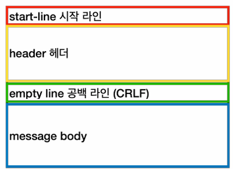
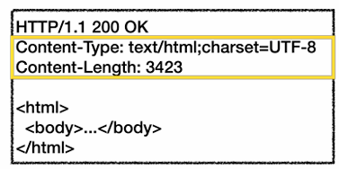

# 04_http


## HTTP 메시지 구조



### 시작 라인 - 요청 메시지 

- HTTP메서드
  - 종류 : GET, POST, PUT, DELETE ...
- 요청 대상
  - absolute-path[?query]
  - absolute path : **"/"**로 시작하는 경로
  - query : **key1=value1&key2=value2** 형식으로 데이터를 전달
- HTTP 버전


### 시작 라인 - 응답 메시지

- HTTP 버전
- HTTP 상태 코드 : 요청 성공, 실패를 나타냄
  - 200 : 성공
  - 400 : 클라이언트 요청 오류, 404 요청 리소즈 없음
  - 500 : 서버

### HTTP 헤더



- HTTP 전송에 필요한 모든 부가정보들
- name : value (필드이름은 대소문자 구분 없음)


### HTTP 메시지 바디

- 실제 전송할 데이터
- HTML문서, 이미지, 영상 등 byte로 표현할 수 있는 모든 데이터는 전송가능


## 메시지 

### GET

- 리소스 조회
- 서버에 전달하고 싶은 데이터는 query(쿼리 파라미터, 쿼리스트링)를 통해서 전달
- 메시지 바디는 사용하지 않음


### POST

- 요청 데이터 처리
- **메시지 바디를 통해** 서버로 요청 데이터 전달
- 서버는 요청 데이터를 처리
  - 메시지 바디를 통해 들어온 데이터를 처리하는 모든 기능을 수행한다.
- 주로 전달된 데이터로 신규 리소스 등록, 프로세스 처리에 사용


## WAS 만들기

```java
private static void process(Socket socket) throws IOException{
        try (socket;
             BufferedReader reader = new BufferedReader(new InputStreamReader(socket.getInputStream(), UTF_8));
             PrintWriter writer = new PrintWriter(socket.getOutputStream(), false, UTF_8);) {

            String requestString = requestToString(reader);
            if (requestString.contains("/favicon.ico")) {
                log("favicon 요청");
                return;
            }

            log("HTTP 요청 정보 출력");
            System.out.println(requestString);

            log("HTTP 응답 생성 중 ...");
            sleep(5000);
            responseToClient(writer);
            log("HTTP 응답 전달 완료");
        }
    }
```


```java
new PrintWriter(socket.getOutputStream(), flase, UTF_8);
```

- false : autoFlush 사용여부
- 이 값을 true로 설정하면 println으로 출력할 때 마다 자동으로 플러시된다.
- false로 설정하면 `flush()`를 직접 호출해줘야한다.
  - 데이터를 모아서 전송하므로 네트워크 전송횟수를 줄일 수 있기 떄문에 false로 설정하고 직접 flush해준다.

`\r\n` : HTTP 공식 스펙에서 다음 라인 `\r\n`이다. 


**Header**

```
GET / HTTP/1.1
Host: localhost:12345
Connection: keep-alive
sec-ch-ua: "Google Chrome";v="135", "Not-A.Brand";v="8", "Chromium";v="135"
sec-ch-ua-mobile: ?0
sec-ch-ua-platform: "Windows"
Upgrade-Insecure-Requests: 1
User-Agent: Mozilla/5.0 (Windows NT 10.0; Win64; x64) AppleWebKit/537.36 (KHTML, like Gecko) Chrome/135.0.0.0 Safari/537.36
Accept: text/html,application/xhtml+xml,application/xml;q=0.9,image/avif,image/webp,image/apng,*/*;q=0.8,application/signed-exchange;v=b3;q=0.7
Sec-Fetch-Site: none
Sec-Fetch-Mode: navigate
Sec-Fetch-User: ?1
Sec-Fetch-Dest: document
Accept-Encoding: gzip, deflate, br, zstd
Accept-Language: en-CA,en;q=0.9,ko-KR;q=0.8,ko;q=0.7,en-GB;q=0.6,en-US;q=0.5
```

- 시작라인

  - GET : 조회

  - / : 요청 경로, 별도의 요청 경로가 없으면 / 를 사용한다. 

  - HTTP/1.1 : 버전

    

- 헤더

  - Host : 접속하는 서버 정보
    - localhost:12345
  - User-Agent: 웹 브라우저의 정보
    - Mozilla/5.0 (Windows NT 10.0; Win64; x64) AppleWebKit/537.36 (KHTML, like Gecko) Chrome/135.0.0.0 Safari/537.36
  - Accept : 웹 브라우저가 전달 받을 수 있는 HTTP 응답 메시지 바디 형태
    - text/html,application/xhtml+xml,application/xml;q=0.9,image/avif,image/webp,image/apng,*/*;q=0.8,application/signed-exchange;v=b3;q=0.7
  - Accept-Encoding : 웹 브라우저가 전달 받을 수 있는 인코딩 형태
    - gzip, deflate, br, zstd
  - Accept-Language : 웹브라우저가 전달 받을 수 있는 언어 형태
    - en-CA,en;q=0.9,ko-KR;q=0.8,ko;q=0.7,en-GB;q=0.6,en-US;q=0.


## URL 인코딩

### http 가 ASCII를 사용하는 이유

- 인터넷이 처음 설계되던 시기에 대부분의 컴퓨터 시스템이 ASCII를 사용했기 때문
- 여전히 많은 시스템이 ASCII를 사용한디.
- HTTP 스펙은 매우 보수적이고 호환성을 가장 수선시한다.

### 한글을 전달하면?

```
query: %EA%B0%80%EB%82%98%EB%8B%A4
decode: 가나다
```

- 퍼센트(%) 인코딩
  - 각각의 바이트 앞에 %를 붙이고 한글이면 3개씩 끊어서 계산을 다시하게 된다.
  - 이렇게 얻은 문자를 16진수 byte로 변경
  - ex
    - 한글을 UTF-8 인코딩으로 표현하면 한 글자에 3byte의 데이터를 사용
    - 가 : `%EA%B0%80`

**% 인코딩, 디코딩 과정**

```java
String decode = URLDecoder.decode("가", UTF_8); //가 => %EA%B0%80
```

- 클라이언트 : 가 전송 희망
- 클라이언트 & 인코딩 :`%EA%B0%80`
  - "가"를 UTF-8로 인코딩
  - 각 byte를 16진수 문자로 표현하고 각각의 앞에 `%`를 붙힘
- 클라이언트 => 서버 전송 : `q=%EA%B0%80`
- 서버 `%EA%B0%80` ASCII 문자를 전달 받음
  - `%` 가 붙은  경우 디코딩해야 하는 문자로 인식
  - `%EA%B0%80`를 3byte로 변환 후 UTF-8로 디코딩 => 문자 "가"를 획득


## WAS

### WAS(Web Application Server)란?

- 웹(HTTP)를 기반으로 작동하는 서버인데, 이 서버를 통해서 프로그램의 코드도 실행할 수 있는 서버
  - Application이 들어간 이유는 웹 서버의 역할을 하면서 추가로 애플리케이션 기능도 수행하기 때문이다.
  - Application은 프로그램 코드도 수행할 수 있는 서버라는 뜻이다.
- Web Server : 일반적으로 정적인 파일, 사진, 영상을 보내는 서버를 보통 web server라고 한다.
- 보통 자바 진영에서 WAS라고 하면 서블릿 기능을 포함한 서버를 뜻한다. 하지만 서블릿 기능을 포함하지 않아도 프로그램 코드를 수행할 수 있다면, WAS라고 할 수 있다. 

### Servlet 표준등장

- 각 servlet 마다 인터페이스가 다르기 때문에 표준이 필요해서 나오게 된다.
- Servlet, ServletRequest, ServletResponse 를 포함한 많은 표준을 제공
- 현재는 `jakarta.servlet` 로 변경
  - 오픈 소스
    - Apache Tomcat
    - Jetty
    - GlassFish
    - Undertow


