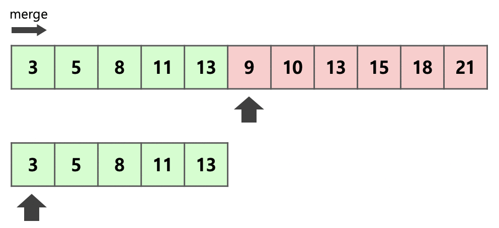

# sort내부동작

- https://d2.naver.com/helloworld/0315536

  

## Timsort

- **삽입 정렬(insertion sort) + 병합정렬(merge sort)**

- 최악의 경우 **O(NlogN)**

  

**insertion sort를 사용한 이유**

- 작은 n에 대해 insertion sort가 빠르기 때문에 사용한다.
- 전체를 작은 덩어리로 잘라 각각의 덩어리를 insertion sort로 정렬한 뒤에 병합하면 더 빠르지 않을까 하는 것이 기본적인 아이디어

- 2**x개씩 잘라 각각 insertion sort로 정렬
- 일반적인 Merge sort보다 덩어리별 x개의 변합 동작이 생략
  - Merge sort 동작 : Cm x nlogn
  - Tim sort  동작    : Cm x n(logn - x) + 알파
  - 알파값을 최대한 줄이기 위해 최적화 기법이 사용된다.

## Tim sort의 최적화 기법

### Run

- 증가하는 부분을 증가로
- 감소하는 부분은 감소로 덩어리를 나누어 정렬시킨다.
- 이렇게 하는 이유는 실생활 데이터는 어느정도 정렬되어 있는 경우가 많기 때문이다.

### Binary Insertion sort

- Binary로 O(n)을 O(logN)으로 시간 절약이 가능하다.

### Merge

- Tim sort에서는 각각의 run의 길이가 제각각이다.

- stack에 담아 효율적으로 병합을 진행한다.

  - run을 stack에 push할때마다 두 조건을 만족해야한다.

    1. C > A + B

    2. B > A

       

  - 조건에 만족하지 않는다면?

    - B는 A와 C중 작은 run과 병합된다.

- 장점

  - stack의 있는 run의 수를 작게 유지할 수 있다. 

    - n이 1억일 때에도 stack의 크기는 40보다 작게 유지된다.

      

  - 비슷한 크기의 덩어리와 병합할 수 있다. 

    - 최소한의 메모리를 이용항 최고의 효율을 내기 위한 방법

### 2 Run Merge

- merge sort의 단점 : 추가메모리를 n 사용한다는 점

- run 2개중 작은 것을 복사한다.
- 이후 각 run의 시작 부분부터 크기 비교를 하여 작은 순서대로 앞을 채우면서 병합을 진행
- 이런식으로 병합을 하면서 추가 메모리를 적게 사용하게 된다.

### Galooping

- run이 3번 연속으로 병합되었으면 Galloping mode 로 전환된다고 한다.
- 이 모드에서는 1,2,4,8과 같이 2의 제곱으로 뛰어 넘으며 대소를 비교한다.
- 그리고 범위를 선택했으면 이분탐색을 진행하여 어느 위치까지 병합할지 결정한다.

