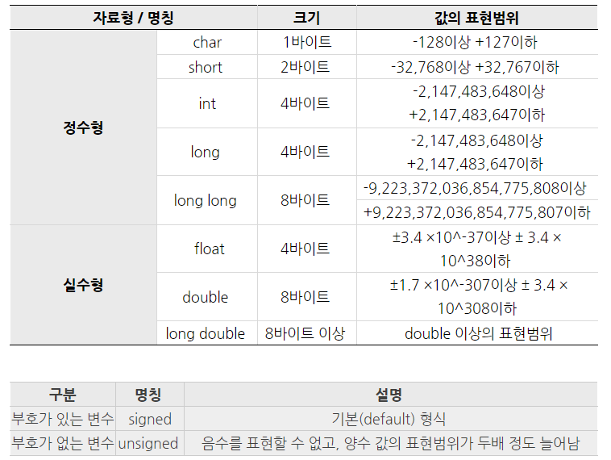
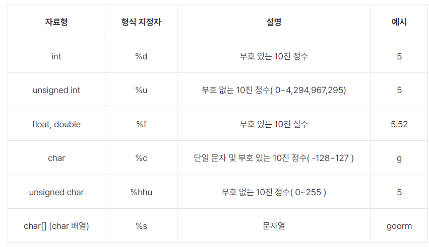
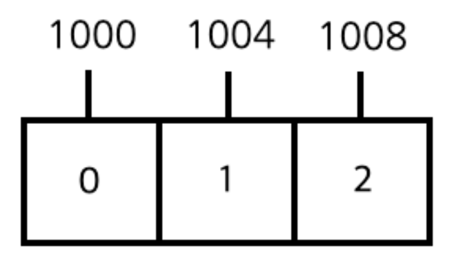

# 01_C_basic


## 01_기본구조

```c
#include <stdio.h>
int main(){
    return 0
}
```

- \# = 전처리기 
  - 컴파일 하기 전에 미리 처리해야하는 명령어
  - include = <>괄호 안에 있는 것을 추가

- stdio.h
  - .h = 헤더
  - stacndard Iput Ouput


## 02_변수

```c
#include <stdio.h>

//선언 후 대입

int main()
{
  int level;
  int hp;
  int damage;
  int defense;

  level = 1;
  hp = 50;
  damage = 5;
  defense = 2;
  
  return 0;
}

// 변수설정 + 초기화 동시에 진행
int main()
{
  int level=1;
  int hp=50;
  int damage=5;
  int defense=2;
  return 0;
}
```




### 정수형 변수 출력



```c
int main()
{
	int a=10;
	int b=20;
	int c=30;
	
	printf("a 는 %d 이고 b 는 %d 이고 c 는 %d 입니다.",a,b,c);
	
	return 0;
}
```


### 실수형 변수 출력

```c
#include <stdio.h>

int main()
{
  int a;
  int b;
  
  printf("정수 a 와 정수 b 입력 : ");
  scanf("%d %d", &a, &b);
  printf("입력받은 a 와 b : %d %d", a, b);
  
  return 0;
}
```

- scanf 는 입력을 받을 때 사용하는 함수
  - 여기서 &변수명 을 사용해줘야한다.
  - &는 주소 값을 가르킬때 사용하는 것 => **즉 &a는 a의 주소를 가르키게 된다.**


### 변경할 수 없는 값 = const

```c
#include <stdio.h>

int main()
{
	const double PI = 3.1415;

	PI = 5;

	return 0;
}
```

- 위와 같이 값을 변경하려 한다면 에러가 뜨게 된다.


## 03_연산자


### 증감 연산자

```c
// 전위
#include <stdio.h>

int main()
{
	int a = 3;

	printf("%d\n", ++a); // a가 1 증가됨 => 4
	printf("%d", a); // 1 증가된 a가 출력 => 4

	return 0;
}

// 후위
#include <stdio.h>

int main()
{
  int a = 3;
  
  printf("%d\n", a++); // a가 출력된 다음에 1 증가 =>3
  printf("%d", a); // 1 증가된 a가 출력 => 4
  
  return 0;
}

```


## 배열의 주소



```c
#include <stdio.h>

int main()
{
	int arr[3];
		
	return 0;
}
```

- 배열은 선언한 크기만큼 **연속적으로 연결**되어 있다.
- 배열 한 원소당 **4바이트(int)** 크기를 가진다.
- char = 1씩
- double = 8씩


## 문자열

**아스키 코드**

- 256개 글자 사용가능

유니 코드

- 256*256 (2byte) = 65536개의 글자를 표현할 수 있다

```c
#include <stdio.h>

int main()
{
  char ch = 'ab';
    
  printf("%d\n", ch); // 98 => 아스키는 1바이트밖에 표현하지 못함 따라서 마지막 b를 출력하게 된다.
  printf("%c\n", ch); // b
  
  return 0;
}

// 따라서 여러문제를 출력하기 위해선
#include <stdio.h>

int main()
{
  char ch[5] = "abcd"; 
    // 이렇게 사용해야한다. 여기서 글자는 4, 배열은 5이다
    // 중간에 0, null, \0 이 넣어져있으면 종료를 하게 된다.
  
  printf("ch 는 %s", ch);
  
  return 0;
}

```


