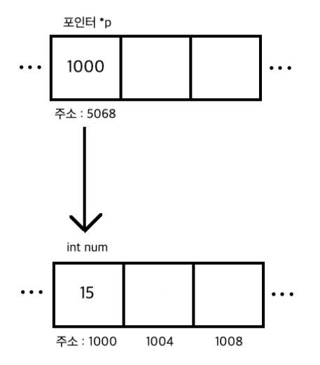

# 02_C_basic2


## 01_2차원 배열

```c
int main(){
    int arr[2][3];
    
    int arr[2][3]  = {
        {1,2,3},
        {4,5,6}
    };
}
```

**이차원 배열 크기 구하기**

```c
#include <stdio.h>

int main()
{
	int tarr[3][4] =
	{
		{1, 2, 3, 4},
		{5, 6, 7, 8},
		{9, 10, 11, 12}
	};
    // 크기
	int y = sizeof(tarr)/sizeof(tarr[0]);
	int x = sizeof(tarr[0])/sizeof(int);
		
	for(int i=0; i<y; i++)
	{
		for (int j=0; j<x; j++)
		{
			printf("%d ", tarr[i][j]);
		}
		printf("\n");
	}
	
	return 0;
}
```


## switch문

- if 문처럼 관계시을 쓰지는 못한다. => **특정한 정수값이나 문자**만 확인가능
  - 실수 값의 경우 오류가 발생

- if 문 처럼 조건을 체크하면서 내려가지 않음  ==> **입려받은 값의 케이스로 바로 이동**
  - 일반적으로 4개 이상의 조건일 때 **switch문을 사용하면 성능이 더 좋다고 한다.**
  - 어셈블리쪽 코드상의 차이라고 한다.

```c
switch(기준값)
{
	case 비교값1:
		기준값과 비교값1이 같을 때 실행
         break
            
	case 비교값2:
    case 비교값3: // 이렇게 진행되면 2~3까지가 가능하다 왜냐하면 break가 없기 때문
		기준값과 비교값2가 같을 때 실행
         break
	
	default:
		기준값과 비교값들이 같지 않을 때 실행
}
```

- 필요한 값만 실행해주기 위해선 break를 걸어주어야한다 


## 두 변수의 값 바꾸기

```c
#include <stdio.h>

int main()
{
	int a = 5;
	int b = 10;

	a = b; // a값 10
	b = a; // b값 10 ==> 따라서 10,10값이 나타난다.
	return 0;
}
```

```c
#include <stdio.h>

int main()
{
	int a = 5;
	int b = 10;
	int temp;

	temp  = a; // 따라서 tmp값을 통해서 값을 저장해준다.
	a = b;
	b = temp;
	return 0;
}
```


## 함수

### 함수의 선언

- c언어는 절차지향언어
  - 즉 위에서 마래로 차례대로 소스코드를 해석한다.
  - 따라서 main() 함수가 가장 아래 있어야 한다는 뜻

```c
#include <stdio.h>

int func1(void); // 이 함수 먼저 정의 => 원형을 먼적 정의해준다.

int main()
{
	func1();
	printf("함수 실행 완료\n");
	return 0;
}

int func1(void)
{
	printf("예시 함수입니다.\n");
	return 0;
}
```


### 전역 변수와 지역변수

- 전역변수의 단점
  - 프로그램이 복잡할 수록 어떤 함수에서 전역변수의 값을 바꾸는지 알기 어려워진다.
  - 지역변수와 전역변수 중에서 같은 변수가 있는 경우
    - **지역변수를 우선적으로 접근**


## 포인터

- 주소를 가르키는 것

```c
#include <stdio.h>

int main()
{
	int *p = NULL;  // int* p == int * p 모두 같음
	int num = 15;

	p = &num;

	printf("int 변수 num의 주소 : %d \n", &num);
	printf("포인터 p의 값 : %d \n", p);
	printf("포인터 p가 가리키는 값 : %d \n", *p);

	return 0;
}
// int 변수 num의 주소   : 1985123123
// 포인터 p의 값         : 1985123123
// 포인터 p가 가리키는 값 : 15
```

- *(참조 연산자) : 선언

- 포인터의 크기는 모두 동일

  - 32비트 = 4byte

  - 32비트 = 8byte

    

- 포인터 초기화 : int *p = NULL(0);

  - **0은 0번지를 가르키는 것이 아니라 아무것도 없다는 뜻**

- 주소값을 넣을 떄 : p = &num



- 포인터에 num을 저장
  - 그럼 주소 값 1000이 저장되게 된다.
  - 주소 값 1000에는 num값이 들어 있다.


### 참조 연산자 *

- \* 연산자가 붙으면 **주소로 찾아간다**로 이해하면 좋음

```c
#include <stdio.h>

int main()
{
	int *p = NULL; 
	int num = 15;

	p = &num;
	printf("포인터 p가 가리키는 값 : %d\n", *p);
	printf("num의 값 : %d\n\n", num);

	(*p)++;
	printf("포인터 p가 가리키는 값 : %d\n", *p); // 16
	printf("num 값 : %d\n\n", num); // 16

	*p++;
	printf("포인터 p가 가리키는 값 : %d\n", *p); // -13213123
	printf("num 값 : %d\n", num); // 16

	return 0;
}
```

- (*p)++; 와 *p++; 의 차이점
  - 증감 연산자가 참조 연산자(*)보다 우선순위가 높다
  - 따라서 주소에 ++가 먼저 되고 포인트를 찍는 것
- **즉 (*p)++ 로 해주어야한다.**


### Call by Value 와  Call by reference

> - 인자를 전달하는 방식 2가지
>   - Call by Value 
>   - Call by reference

**Call by Value **

- **함수에서 값을 복사해서 전달하는 방식** 
  - => 인자로 전달되는 변수를 함수의 매개변수에 복사한다.
    - 즉 함수 int somehign( int a, int b) 에 a,b를 복사한다는 뜻
  - 즉 이렇게 복사되면 인자로 전달한 변수와는 별개의 변수가 되며, 매개변수를 변경해도 원래 변수에는 영향을 미치지 않는다.
  - 원본값을 바꿀 필요가 없는 경우에는 call by value방식을 이용

```c
# include <stdio.h>

void swap(int a, int b){
    int tmp;
    tmp = a;
    a = b;
    b = tmp;
}

int main(){
    int a, b;
   	a = 10;
    b = 20;
    
    printf("스왑 전 %d %d",a,b); // 10, 20
    swap(a, b);
    printf("스왑 전 %d %d",a,b); // 10, 20
}
```

- 즉 원본 값이 바뀌지 않는 것을 볼 수 있다.
  - **이유 swap을 진행해도 매개변수가 바뀌는 것** 


**call by reference**

- 함수에서 값을 전달하는 대신 **주소값을 전달하는 방식**
  - c언어에서는 call by reference를 공식적으로 지원하지 않는다.
  - 하지만 일반적으로 포인터를 이용해 주소값을 넘겨주는 방식을 call by reference라고 설명하는 곳이 많다.
  - 하지만 주소값을 복사해서 넘겨주는 것이기 때문에 call by value , call by address방식이라고 한다.

```c
#include <stdio.h>

void swap(int *a, int *b)
{
	int temp;

	temp = *a;
	*a = *b;
	*b = temp;
}

int main()
{
	int a, b;

	a = 10;
	b = 20;

	printf("swap 전 : %d %d\n", a, b); // 10 20
	swap(&a, &b);
	printf("swap 후 : %d %d\n", a, b); // 20 10

	return 0;
}
```


