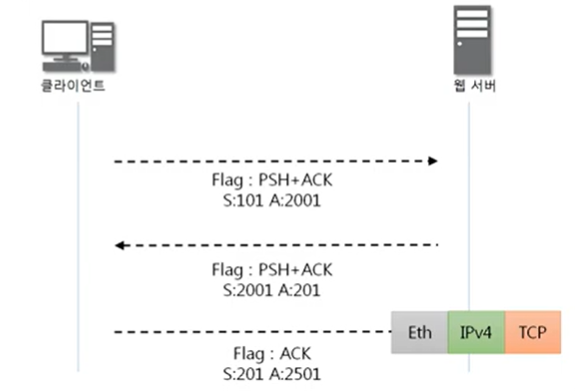
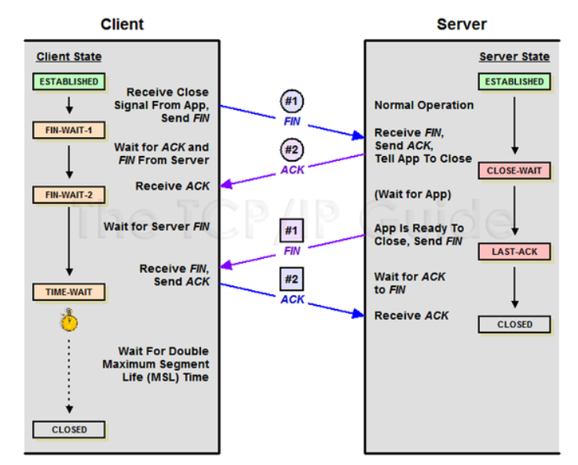

# 02_handshake

- 출처 
  - https://bangu4.tistory.com/74 
  - https://www.youtube.com/watch?v=Ah4-MWISel8

## TCP프로토콜

- Transmission Control Protocol
- 연결 지향성
- 프로그램 통신을 안정적으로, 순서대로, 에러없이 교환할 수 있게 함

## 3way

TCP를 이용한 데이터 통신을 할 때 프로세스와 프로세스를 연결하기 위해 가장 먼저 수행되는 과정

1. 클라이언트가 **서버에게 요청 패킷**을 보내고
   - **SYN_SENT** 상태, **B서버는 Wait for Client** 상태
2. 서버가 클라이언트의 **요청을 받아들이는 패킷**을 보내고
   -  **B서버**는 **SYN_RECEIVED** 상태
3. 클라이언트는 이를 **최종적으로 수락하는 패킷**을 보낸다
   - **B서버 상태가 ESTABLISHED**

## 4way

- 3way는 TCP의 연결을 초기화 할때 사용한다.
- 4way는 session을 종료하기 위해서 수행되는 절차이다.

1. 클라이언트가 종료하겠다는 FIN플래그 전송
   - **A클라이언트는 FIN-WAIT**상태
2. 서버는 확인메시지로 ACK를 보낸다 => 연결을 종료시키려고 대기중
   - **B서버의 CLOSE_WAIT**상태
3. 연결종료 준비완료 => 클라이언트에게 FIN플래스 전송
   - B서버의 상태는 **LAST-ACK**
4. 클라이언트도 연락 받았다는 확인 메시지를 보냄
   - **A클라이언트의 상태가 FIN-WAIT ** => **TIME-WAIT** 으로 변경

그리고 만약 데이터 유실이 된다면?

- 일정시간이 지나면 TIME_WAIT라고 한다.
- 세션을 만료시킴

