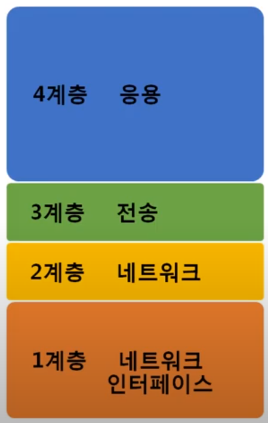
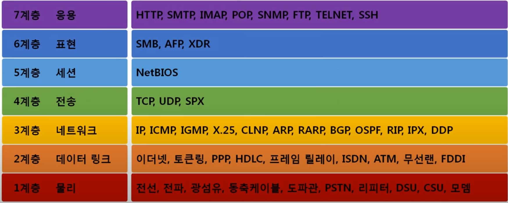
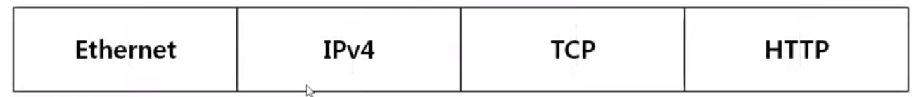
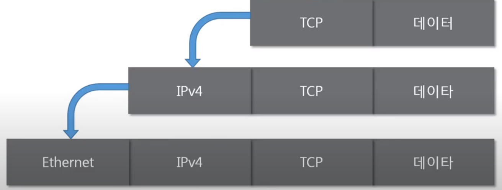
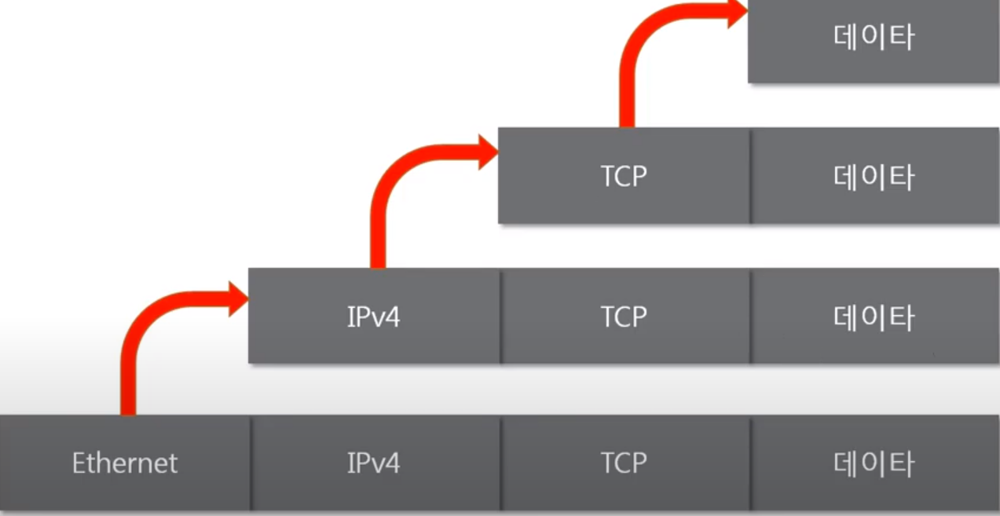
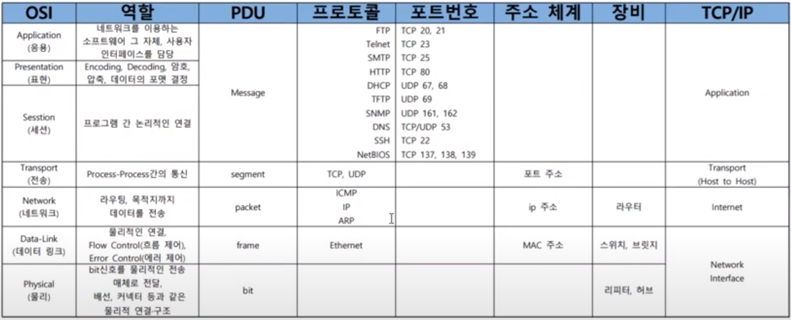

전체영상: [네트워크 기초(개정판)](https://www.youtube.com/playlist?list=PL0d8NnikouEWcF1jJueLdjRIC4HsUlULi)

네트워크란?

네트워크 분류?

통신 방식

네트워크 프로토콜

### [네트워크란?](https://youtu.be/Av9UFzl_wis?list=PL0d8NnikouEWcF1jJueLdjRIC4HsUlULi)

노드 : 네트워크에 속한 컴츄터 또는 통신 장비

의미: 노드들이 데이터를 공유할 수 있게 하는 디지털 전기통신망

### 네트워크의 분류

##### 연결 크기에 따른 분류

- LAN : Local Area Network
  
  - 가까운 지역을 하나로 묶은 네트워크

- WAN : Wide Area Network
  
  - 멀리있는 지역을 한대로 묶은것
  
  - 여러개의 LAN 네트워크를 하나로 묶은 것을 의미한다.

- Metropolitan Area Network

- VLAN,CAN,PAN 등등

##### 연결 형태에 따른 분류

- Star형
  
  - 중앙 장비에 모든 노드가 연결된 형태
    
    - ex) 공유기를 통해 핸드폰 컴퓨터, TV드등이 연결되어 있음
  
  - 특징
    
    - 가까운 지역의 디바이스들을 연결시킬때 사용한다.
  
  - 단점
    
    - 중앙장치가 고장나게 되면 모든 디바이스를 사용할 수 없음

- Mesh형
  
  - 여러 노드들이 서로 그물처럼 연결된 형태
    
    - ex) 나라별로 네트워크 연결을 할 때 사용된다
  
  - 특징
    
    - 멀리 떨어져있는 대역(WAN)을 연결할때 주로 사용하는 형태이다
  
  - 장점
    
    - 하나가 고장나더라도 다른곳으로 우회해서 연결을 시킬 수 있다.

##### 네트워크의 통신방식

네트워크에서 데이터는 어떻게 주고받는가?

- 유니캐스트
  
  - 내가 통신하고 싶은 특정 대상이랑만 통신하는 것

- 멀티캐스트 
  
  - 같은 네트워크 대역에서 1:N(특정한 다수)와 통신하는 것 

- 브로드캐스트
  
  - 네트워크에 있는 모든 대상과 통신하는 것

##### 네트워크 프로토콜

네트워크에서 데이터는 어떻게 주고 받는지

네트워크에 있는 특정한 사용자를 어떻게 찾아내는가????

###### 프로토콜

- 약속, 양식

- 어떤 노드가 어느 노드에게 어떤 데이터를 어떻게 보내는지 작성하기 위한 양식

- 종류
  
  - Ethermet (MAC) : 가까운 곳과 연락할떄
  
  - ICMP,IPv4,ARP (IP주소) : 멀리 있는 곳과 연락할 떄
  
  - TCP, UDP (포트 번호) : 여러가지 프로그램으로 연락할 때

- 사용방법
  
  - 여러가지 프로토콜을 동시에 사용하게 된다.
  
  - 가까운 곳과 연결 후 => 멀리 떨어져 있는 곳 => 프로그램 선택 => 데이터 보냄

### [실습1 (tracert)](https://youtu.be/paJf7JbBWqY?list=PL0d8NnikouEWcF1jJueLdjRIC4HsUlULi)

구글과 나는 어떻게 연결되어있는지 확인하기

- tracert (trace route):
  
  - network route길목을 쫒아가주는 프로그램

- tracert
  
  - tracert 8.8.8.8 : 8.8.8.8구글 

dns.google [8.8.8.8](으)로 가는 경로 추적:

  1     1 ms    11 ms    59 ms  172.30.1.254
  2     6 ms     3 ms     7 ms  121.152.209.1
  3     4 ms     4 ms     4 ms  125.138.108.149
  4     5 ms     2 ms     9 ms  61.78.45.78
  5    17 ms     *       59 ms  112.188.144.65
  6     8 ms    12 ms     8 ms  112.174.8.122
  7    25 ms     7 ms     7 ms  112.174.84.50
  8    28 ms    28 ms    28 ms  142.250.165.78
  9    28 ms    30 ms    28 ms  142.250.229.9
 10    30 ms    27 ms    28 ms  142.251.48.19
 11    33 ms    30 ms    33 ms  dns.google [8.8.8.8]

- IP주소들이 뜨게 된다.

- 의미
  
  - 연결 연결되어이있는 IP주소들이다
  
  - 이렇게 하나씩 연결이 되어서 google까지 거쳐가게 된다.
  
  - 보통 15개 안으로 전세계가 연결된다.
  
  - 172.30.1.254 (맨 위에 있는 IP) 현 위치가 할리스이기 때문에 여기 IP주소를 의미한다.

### [실습2 (Wireshark)](https://youtu.be/vBrQ3yzerMg?list=PL0d8NnikouEWcF1jJueLdjRIC4HsUlULi)

네트워크 프로토콜을 실제로 캡쳐해주는 프로그램

### [네트워크 모델](https://youtu.be/y9nlT52SAcg?list=PL0d8NnikouEWcF1jJueLdjRIC4HsUlULi)

목차

- 네트워크 모델의 종류

- 두 모델 비교

- 네트워크를 통해 전달되는 데이터, 패킷

#### 네트워크 계층모델

TCP/IP

OSI 7계층

TCP/IP vs OSI 7계층

공통점

- 계층적 네트워크 모델

- 계층간 역할 정의

차이점

- 계층의 수 차이

- OSI
  
  - 역할기반
  
  - 통신 전반에 대한 표준

- TCP/IP
  
  - 프로토콜 기반
  
  - 데이터 전송기술 특화

#### 네트워크를 통해 전달되는 데이터, 패킷

###### 패킷

- 네트워크 상에서 전달되는 데이터를 통칭하는 말

- 네트워크에서 전달하는 데이터의 형식화된 블록

- 제어정보와 사용자 데이터로 이루어지며 사용자 데이터는 payload라고 한다.

캡슐화된 패킷

- header

- payload
  
  - 실질적으로 보내고 싶은 데이터

- footer
  
  - footer는 사용을 잘 하지 않는다

- payload : http / header : TCP ==> 하나의 패킷이 되었음

- payload : 위 패킷 / header : IPv4 ==> 하나의 패킷이 되었음

- payload : 위 패킷 / header : Ethernet ==> 하나의 패킷이 되었음
  
  - 즉 박스안에 박스 같은 느낌이라고 볼 수 있음

캡슐화

- 보낼떄

- 여러 프로토콜을 이용해서 최종적으로 보낼때 패킷을 만드는 과정

- 상위 계층에서 하위계층으로 내려가면서 프로토콜을 붙이게 된다.
  
  - 즉 하위계층 앞에 상위계층을 붙일 수 없음 

디캡슐화

- 받을 때

- 패킷을 받았을 때 프로토콜들을 하나씩 확인하면서 데이터를 확인하는 과정

##### 계층별 패킷의 이름

- 4계층 PDU(Protocal Data Unit) = 세그먼트 (끝에 2개 묶여 있는 것)

- 3계층 PDU(Protocal Data Unit) = 패킷 (3)

- 2계층 PDU(Protocal Data Unit) = 프레임 (4)

