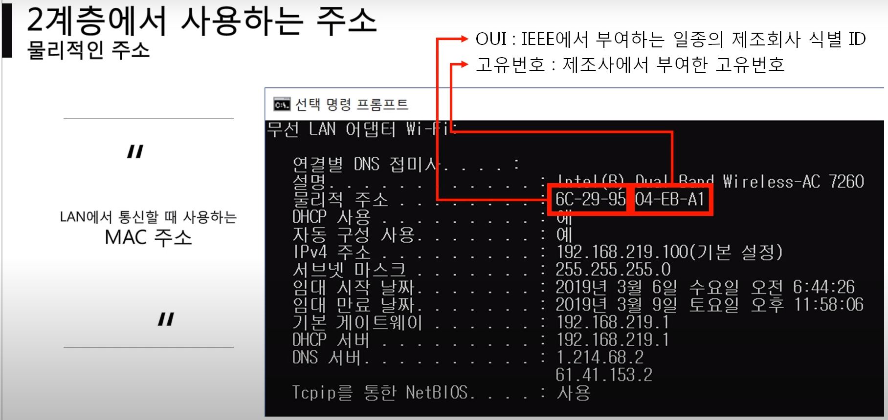

영상: [[따라學IT] 03. 가까이 있는 컴퓨터끼리는 이렇게 데이터를 주고받는다](https://youtu.be/HkiOygWMARs?list=PL0d8NnikouEWcF1jJueLdjRIC4HsUlULi)

### 목차

- 2계층에서 하는일

- 2계층에서 사용하는 주소

- 2계층 프로토콜

### 2계층에서 하는일

- 하나의 네트워크 대역(같은 네트워크 상)에 존재하는 여러 장비들 중에서 어떤 장비가 어떤 장비에게 보내는 데이터를 전달을 하는지

- 내가 보내는 데이터가 오류가 있는지

- 즉, 오류제어, 흐름제어를 한다.

다른 네트워크와 통신 할 때는 항상 3계층의 개입이 필요하다

즉 2계층은 같은 네트워크안에서 데이터를 주고 받는 것

#### 2계층에서 사용하는 주소

###### 물리적인 주소

- MAC주소 : LAN에서 통신할떄 사용한다.
  
  - 16진수로 사용
  
  - 총 12개의 16진수로 사용

- 앞에 번호 : OUI ==> 삼성에서 만들었으면 삼성 ID가 들어간다.

- 뒤에 번호 : 제조사에서 부여한 고유번호

### 2계층(Ethernet) 프로토콜

- Destination Address
  
  - 목적지 주소? ==> MAC주소 (6Byte)

- Source Address
  
  - 출발지 주소 (6Byte)

- Ethernet Type
  
  - 데이터(payload) 안에 상위 프로토콜 내용이 있을 것이다.
  
  - 3계층(상위) 프로토콜을 미리 알려주는 것
  
  - 

- Data
  
  - payload