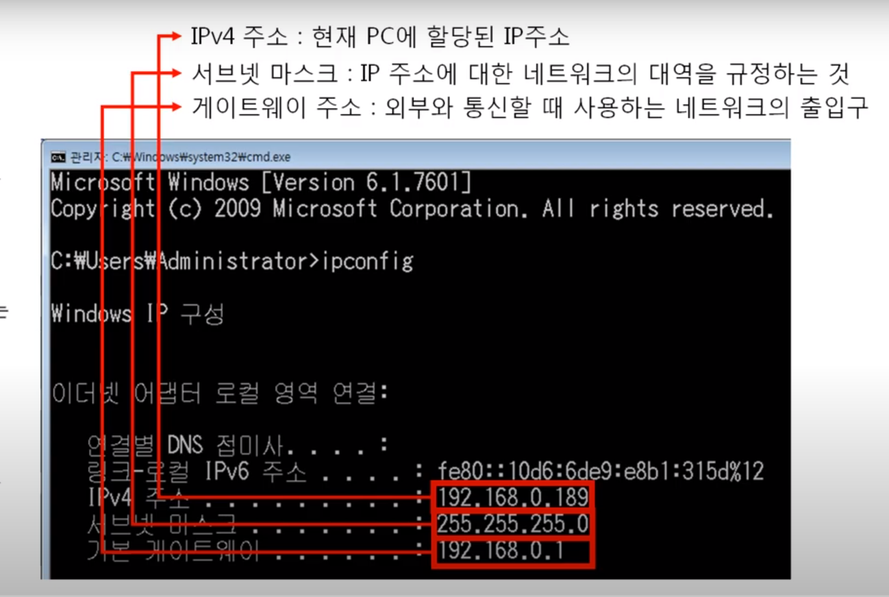
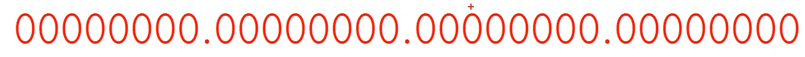
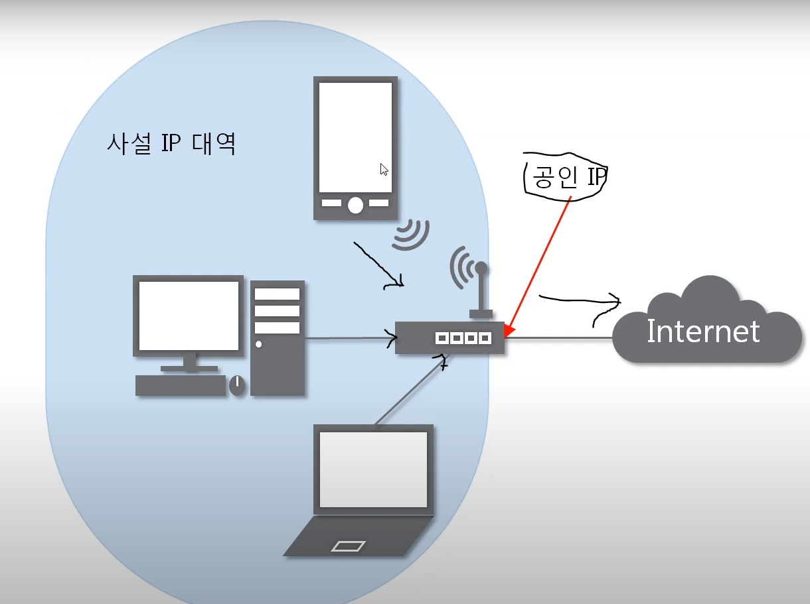
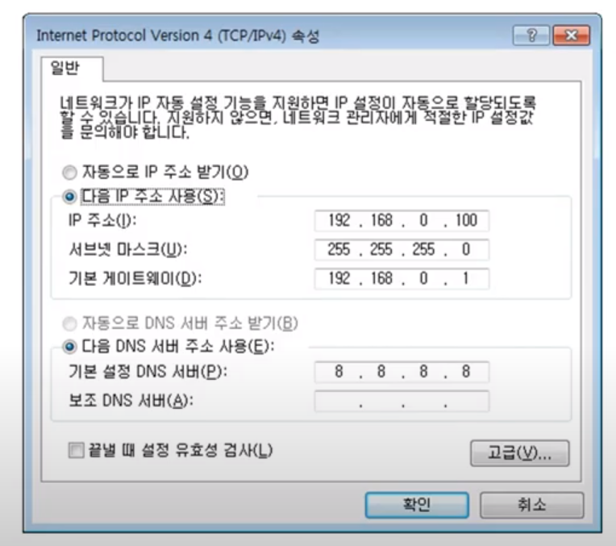

영상: [[따라學IT] 04. 실제로 컴퓨터끼리는 IP주소를 사용해 데이터를 주고받는다](https://youtu.be/s5kIGnaNFvM?list=PL0d8NnikouEWcF1jJueLdjRIC4HsUlULi)

### 목차

- 3계층의 기능

- 일번적인 IP주소

- 특수한 IP주소

### 

### 3계층의 기능

- 다른 네트워크 대역 (멀리 떨어진 곳에 존재하는 네트워크 까지) 어떻게 데이터를 전달할지 제어하는 일을 담당 ==> LAN과 LAN을 연결시켜주기 위한 것

- 즉 멀리있는 곳으로 가기 위해서는 3계층이 필요하다!

3계층에서 쓰는 주소

- IP주소 : WAN에서 통신할 떄 사용하는 주소

###### 멀리있는 것과 통신하기 위한 최소한의 설정

- IPv4

- 서브넷 마스크

- 게이트웨이 주소

###### 3계층 프로토콜

- ARP 프로토콜 : IP주소를 이용해 MAC주소를 알아오는 것

- IPv4 프로토콜 : WAN에서 통실할때 사용

- ICMP프로토콜 : 서로 통신되는지 확인할 때 사용

### 일반적인 IP 주소

IP주소 : 총 4개의 구분으로 되어 있음 ( '.' 으로 나눈게 된다.) 

4바이트, 10진수

2진수 8개로 쓸수 있는 수 :0 ~ 255까지 사용할 수 있음

#### 변화 1

###### classful IP 주소

- 점(.)으로 나눠서 class별로 사용하자

- 클래스별로 꼭 나누다 보니 낭비되는 IP주소들이 많았음

#### 변화 2

###### classless IP 주소

- 하나의 큰 네트워크를 작은 네트워크로 나눠서 쓰자
  
  - 점(.)으로 나누지 말고 그냥 나누고 싶은대로 나눠서 쓰자라는 것
  
  - 자르고 싶은 구간이 어디든 잘라서 쓸 수 있음

###### 서브넷 마스크

- 존재 이유
  
  - 어디까지가 네트워크 대역을 구분하는데 사용하고 어디서부터 호스트를 구분하는데 사용하는지 지정

- 특징
  
  - 2진수로 표기했을때 무조건 1로 시작
  
  - 1과 1사이에는 0이 올 수 없다는 규칙을 가지고 있다 (즉 1연속, 0연속이어야함)
  
  - 
  
  - 즉 1하고 0하고 바뀌는 부분이 네트워크 대역을 구분하는 지점

- 왜 생겨났는지?
  
  - classless한 방법을 사용 => 어디서든 자를 수 있게 되었음 => 네트워크 대역을 어디서 부터 구분을 할지 지정해줘야 함

- IP주소는 항상 서브넷 마스크와 함께 쓴다

#### 변화 3

###### 사설 IP와 공인 IP로 구분

- 공인 IP 1개당 2^32개의 사설 IP

공인 IP

- 인터넷 세상

- 네트워크 통신망이랑 사용하는 IP주소

사설 IP

- 같은 네트워크 대역에서 사용하는 IP주소

어떻게 문제를 해결하였나?

- 사설 IP를 공인 IP로 바꾸고 난뒤에 internet세상으로 보냄

- 즉, 외부에서 볼때는 같은 대역의 IP주소는 하나이다

- 외부 네트워크 대역에서는 사설 IP대역이 보이지 않는다
  
  - 만약 내가 요청보내지 않음 => 그럼 받을 수 없음

- 순서
  
  - PC로 네이버 웹툰을 봄 
  
  - 공유기로 감
  
  - 공유기에서 외부와 통신
  
  - return 값 공유기로 들어감
  
  - 다시 사설 IP값을 토대로 PC로 쏘아준다

NAT

- 특정 IP를 다른 IP로 바꾸는 기술

- 이 기술을 이용해서 IP값을 공인 IP로 바꾸고난뒤에 외부로 보냄

- 이렇게 IP 부족현상을 해결

### 특수한 IP 주소

- 0.0.0.0 :
  
  - 나머지 모든 IP

- 127.0.0.1 :
  
  - 나 자신을 나타내는 주소

- 게이트웨이 주소 :
  
  - 어딘가로 가려면 일단 여기로
  
  - 어디로 나가는 문이 어디인지 알려주는 주소
  
  - 쓸수있는 IP중에 가장 낮거나 가장 높은 것을 쓰게 된다.

DNS서버 설정

- IP주소를 도메인주소로 변경시켜주기 위한 설정