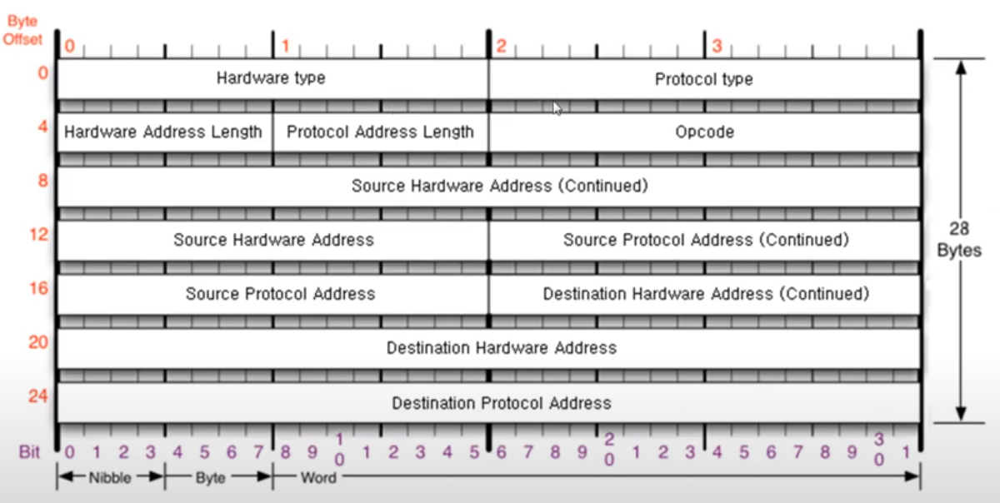
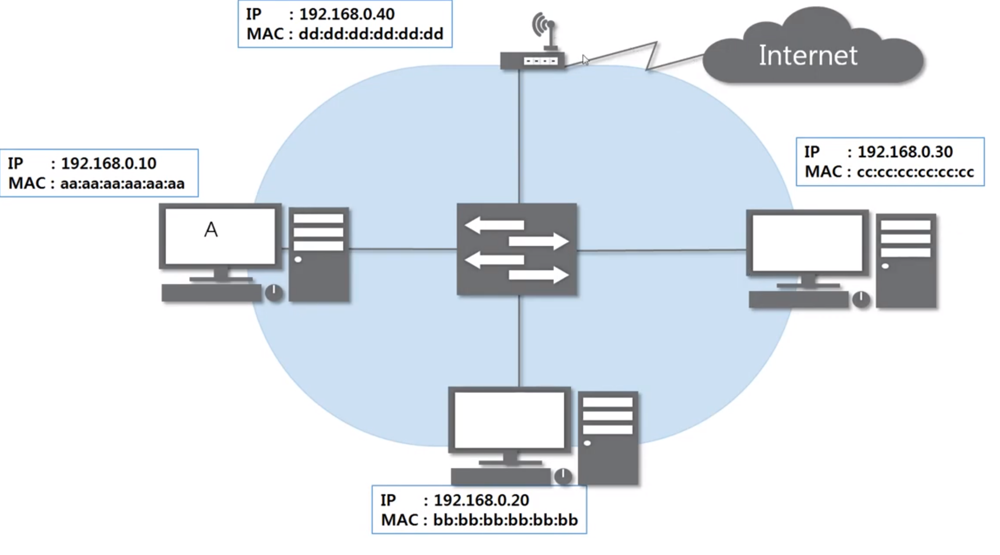

### [ARP 프로토콜](https://youtu.be/LDsp-Xb168E?list=PL0d8NnikouEWcF1jJueLdjRIC4HsUlULi)

- 하는 일
  
  - ARP 프로토콜은 같은 네트워크 대역에서 통신을 하기 위해 필요한 MAC주소를 IP주소를 이용해서 알아오는 프로토콜이다
  
  - IP주소를 이용해 MAC주소를 알아오는 프로토콜

구조

- source hardware address
  
  - 출발지 물리적인 주소 : mac주소

- sourcec protocol address
  
  - IPv4를 의미한다.

- 목적지
  
  - 목적지 mac주소

- 목적지 ip 주소

- hardware type
  
  - 2계층 프로토콜 타입 => 거의 이더넷 프로토콜 ( 0001 )

- protocol type
  
  - 거의 ipv4 (0800)

- 주소길이 
  
  - mac 주소 6바이트
  
  - ip주소 4바이트

- Opcode
  
  - 물어볼때 1
  
  - 대답할때 2

과정

- ARP요청
  
  - 근데 목적지 mac주소 모르는데 우째?
  
  - 일단은 비워둠 => 000000000이런식으로

- Eth로 감싸줌
  
  - 목적지 모르니깐 FFFFFFF 비워둠

- 같은 네트워크대역에 있는 모두에게 요청을 보냄

- 본인 ip주소와 목적지 ip주소가 일치하는지 확인
  
  - 자신 것 ARP응답

- 응답 보내고 디캡슐레이트 해서 mac주소를 알게 됨

### ARP 테이블

통신 했던 컴퓨터들의 주소는 ARP테이블에 남는다

- 시간이 지나면 없어짐