## 멀리 있는 컴퓨끼리 데이터 주고 받기

(https://youtu.be/JaBCIUsFE74?list=PL0d8NnikouEWcF1jJueLdjRIC4HsUlULi)

### 목차

- IPv4  프로토콜

- ICMP 프로토콜

- 라우팅 테이블

- 다른 네트워크와 통신 과정

- IPv4의 조각화

### IPv4 프로토콜 - 3계층

하는일

- 네트워크 상에서 데이터를 교환하기 위한 프로토콜

- 정확하게 전달되는 것을 보장하지 않는다
  
  - 데이터가 잘못될 수 있다

- 데이터의 정확하고 순차적인 전탈은 상위 프로토콜인 TCP에서 보장한다.

구조

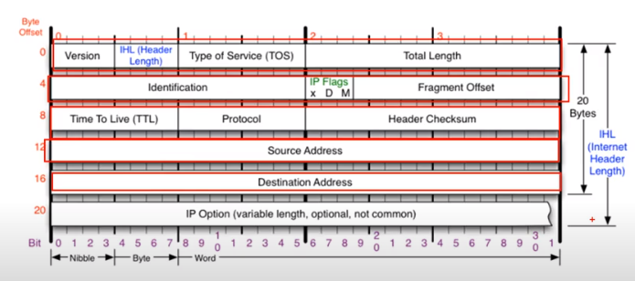

version : 4

IHL :

- header => 20~60까지 올수 있음

- 하지만 4바이트밖에 할당이 안되어 있음

- 따라서 20~60/4로 진행 => 그래서 보통 5가 오게 된다.

TOS : 0(옛날에 쓰던거라 지금은 사용하지 않음)

Total Length : 전체 길이를 뜻함

Identification. IP Flag. Fragment Offset

- 원래는 하나엿다는 것

Source Address : 출발지 IP 4byte

Destination Address : 목적지 주소 IP 4byte

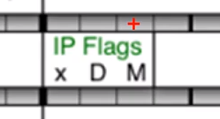

- x : 안씀

- Dont : 데이터를 안쪽에서  : 최대 전송단위보다 클 경우 전송이 되지 않음

- More : 첫번째 패키지 뒤에 더 있다라는 뜻이다 (1,0으로 참/거짓)

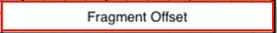

- 13 비트

- 쪼개놓은 데이터 => 순서가 있을 텐데 받는 입장에서 순서가 다르게 올 수가 있음

- 따라서 순서를 알 수 있도록 Offset을 사용함

- Offset : 어느 기준점으로 부터 얼마만큼 떨어져있는지를 가르킨다.
  
  - 기준 첫번쨰
  
  

**TTL**

- time to live

- 패키지가 살아있을 수 있는 시간

- 무한 루프가 돌 때 강제로 죽여줄때 사용한다.

**Protocol**

- 상위 프로토콜이 무엇인지 알려주는 것이다

**Header CHecksum**

- Header에 잘못된것이 있는지 확인하는 것

### ICMP 프로토콜

특정 대상과 내가 통신이 잘 되는지 확인하는 것 

구조

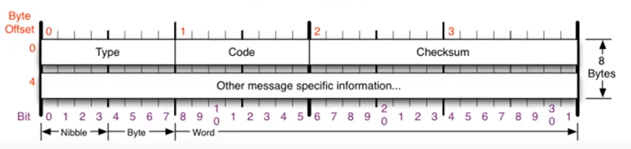

type

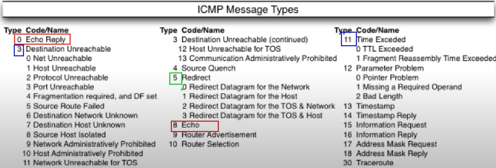

0 : 응답

8 : 요청

3 : Destination Unreachable : 목적지에 도착할 수 없음

- 보낸 사람 잘못

- 중간에 경로 설정 잘못해서 목적지까지 안간경우

11 : Unne Exceded

- 요청이 갔는데 응답이 안 올때

- 상대방이 무언가 문제가 있을때
  
  - ex) 방화벽 걸어놨을떄

5 : Redirect

- routing table을 원격으로 수정하는 것 : 남에 것 수정 가능

### 라우팅 테이블

- 다른 네트워크를 찾아갈때 지도

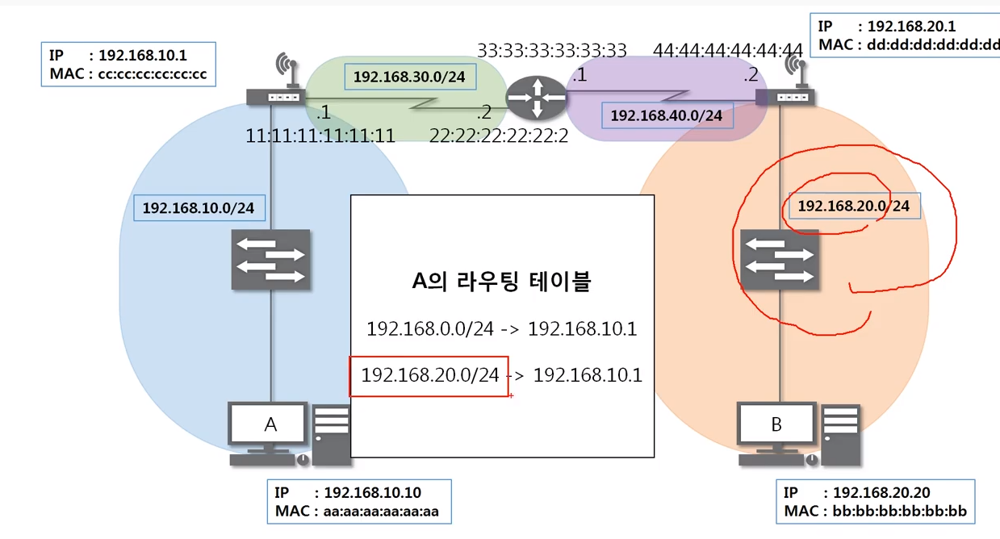

- 상대방의 IP값을 알고 라우팅 테이블에 있어야 보낼 수 있음

요청 프로토콜

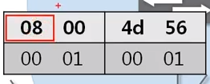

- 요청 : 8

IP 프로토콜 사용 

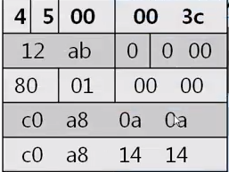

- 버전

- 해더길이 등등 

이더넷

이더넷 mac주소는 어디가 될까??

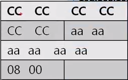

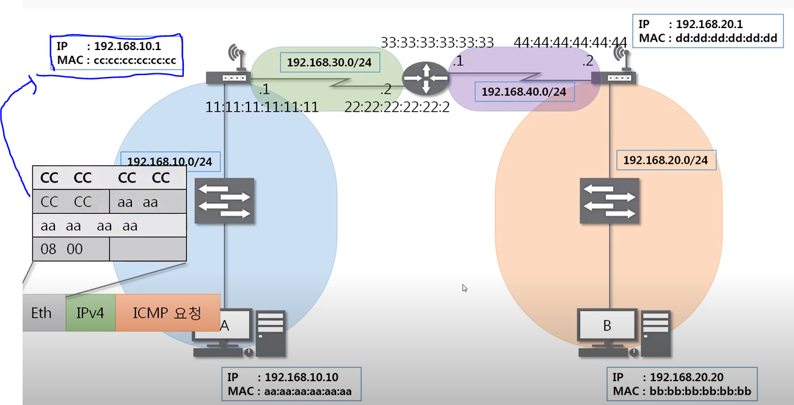

- 이유: 이더넷은 가까운 곳에만 통신을 하는 것이다
  
  - 따라서 바로 앞에 공유기? 그 부분이 이더넷의 목적지이다

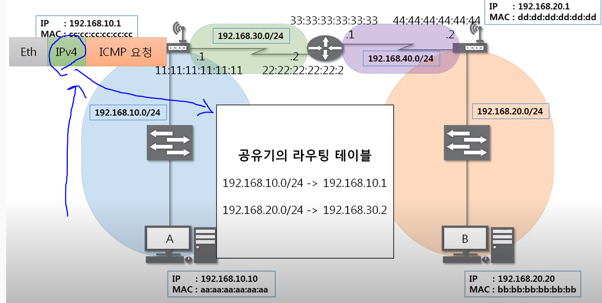

- 본인의 라우팅 테이블을 확인해본다
  
  - 목적지 IP가 있는지 없는지

- 이더넷을 확인 ==> 근처까지 보냄 => 이더넷 다시 작성

즉 => 이더넷은 네트워크 대역이 바뀔때마다 새로 작성되게 된다.

- 

### [라우팅 테이블 확인 실습](https://youtu.be/tVntagSJctc?list=PL0d8NnikouEWcF1jJueLdjRIC4HsUlULi)

- ### [IPv4 조각화 이론](https://youtu.be/_AONcID7Sc8?list=PL0d8NnikouEWcF1jJueLdjRIC4HsUlULi)

- 

### [IPv4 조각화 실습](https://youtu.be/QKEL9aBgHtg?list=PL0d8NnikouEWcF1jJueLdjRIC4HsUlULi)

-