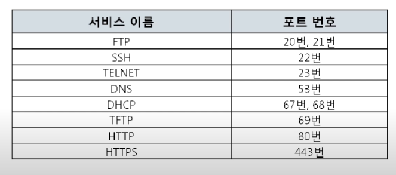
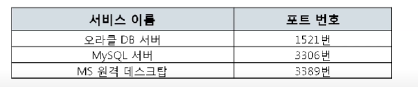
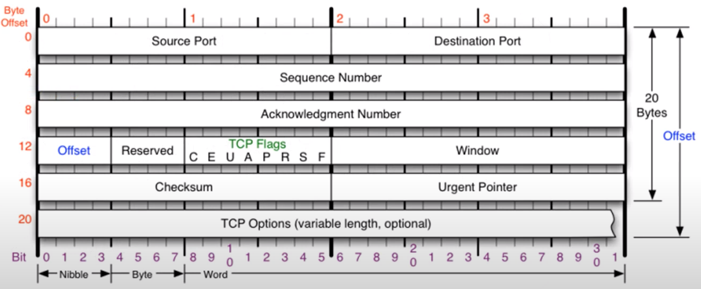
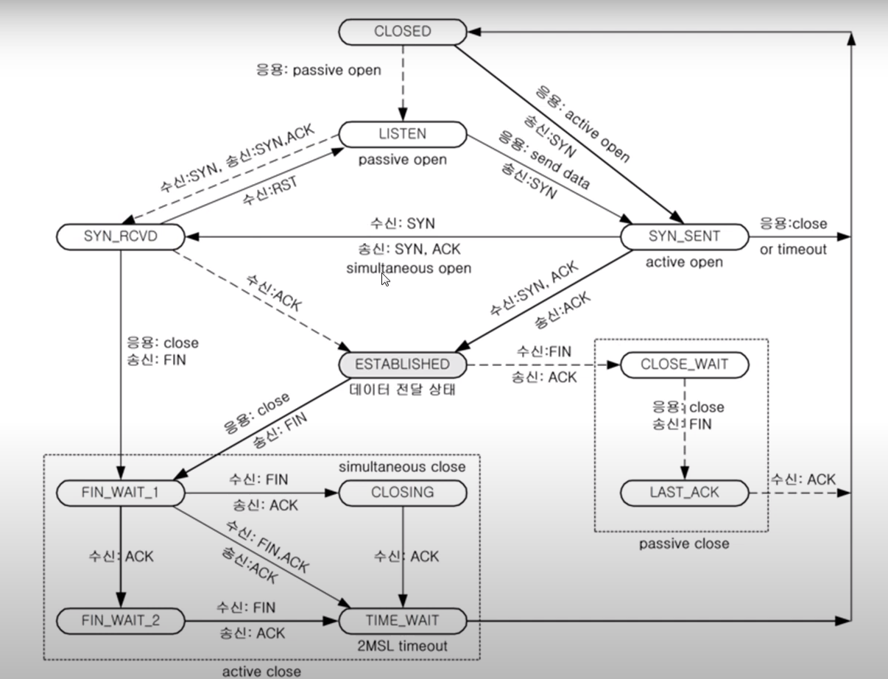

# 7장_4계층

**역할**

- 송신자의 프로세스와 수신자의 프로세스를 연결하는 통신 서비스

**종류**

- TCP : 연결 지향 전송 방식
  - 연결이 되고 난 다음에 데이터를 전송한다.
  - 데이터를 보낸 후에도 잘 받았는지 확인한다.
- UDP : 비연결 지향 전송 방식
  - 안전한 연결을 보장하지 않는다.

## 포트 번호

#### 포트번호의 특징

- 프로그램이 사용하는 주소이다 (컴퓨터가 사용하는 주소가 아니다.)
- **프로그램 하나가 포트번호 하나를 쓸 수 있다.** (내 컴퓨터 기준)

#### 종류

**Well-Known**

- 잘알려진 유명한 포트들
- 

**Registered포트**

- 조금 유명한 포트

**Dynamic포트**

시작 포트 번호 ~ 마지막 포트번호 중 아무거나 사용

시작 : 49152 / 마지막 : 65535

- 일반 사용자들이 사용하는 포트

## UDP프로토콜

> User Datagram Protocol

#### 특징

- 전송방식이 단순하다
- 서비스의 신뢰성이 낮다
- 오류의 검사와 수정이 필요없는 프로그램에서 수행할 것으로 가정한다.

#### 구조

#### 

#### UDP를 사용하는 프로그램들

- DNS서버 : 도메인을 물으면 IP를 알려주는 서버
- tftp서버   :  UDP로 파일을 공유하는 서버
- RIP프로토콜 : 라우팅 정보를 공유하는 프로토콜

## TCP 프로토콜

> Transmission Control Protocol

특징

- **안정적으로 순서대로 에러없이** 교환
- TCP는 UDP보다는 안전하지만 느리다.

#### 구조

**window**

- 얼만큼 데이터를 더 보내도 될지 알려주기 위한 part
- 즉 나의 사용공간이 얼마나 남아있는지 알려주기 위한 

#### **TCP Flags**

- TCP는 연결이 됐는지 등을 확인하는데 그때 어떤 질문을 하는지에 대한 내용이 담겨져 있다
- **U : 긴급 비트**=> 우선순위가 높다는 것을 알려주는 것
- **A : 승인 비트** => 물어본것에 대한 대답 or 승인을 해줄때
- **P : push 비트** 
  - TCP버퍼가 일정크기만큼 쌓여야 패키지 만큼 전송/ 하지만 그냥 데이터를 밀어 넣겠다는 의미
- **R : 초기화 비트** 
  - 상대방과 연결되어 있는 상태에서 문제가 생겼을 때 reset하자고 할때 사용
- **S : 싱크 비트**
  - 상대방과 연결을 시작할 때 사용하는 플래그
  - 연결이 동기화가 시작되는 것
- **F : 종료 비트**
  - 연결을 끊을 때 사용하는 Flag

#### TCP를 이용한 통신과정

**3Way Handhake**

- TCP를 이용할때 가장 먼저 수행되는 과정이다.
  1. 클라이언트가 서버에게 **요청 패킷**을 보낸다. 
  2. 서버가 클라이언트의 **요청을 받아들이는 패킷**을 보낸다.
  3. 클라이언트는 이를 최종적으로 **수락하는 패킷**을 보낸다.

- 데이터 송수신 과정
  1. SEQ번호와 ACK번호가 그대로다
  2. 받는 쪽에서 SEQ번호는 받는 ACK번호가 된다.
  3. 받는 쪽에서 **ACK번호**는 **SEQ번호 + 데이터 크기**이다.

**TCP 상태 전이도**

Listen상태

- 포트 번호를 열어놓은 상태
- 포트번호를 서버쪽에서 사용하고 있는 상태

Established

- 3way Handshake가 진행되고 난 뒤에 상태이다
- 연결이 서로 수립이 된 상
