# 03_HTTP/HTTPS

출처 : 

- https://www.youtube.com/watch?v=H6lpFRpyl14
- https://www.youtube.com/watch?v=MbgaYDSr6R4
- https://myjamong.tistory.com/293
- https://developer.mozilla.org/ko/docs/Web/HTTP/Overview
- https://gmlwjd9405.github.io/2019/01/28/http-header-types.html

## 01_HTTP

> Hyper Text Transfer Protocol

**Hyper text란?**

- **Hyper Link를 나타낼 수 있는 텍스트**
- Hyper Link :
   연결되어 있는 참조고리를 의미 => 이 링크를 통해 사진, 동영상, 파일의 위치를 지정할 수 있음
- HTML : hyper text markup language => 즉 hyper text를 표현할 수 있는 Language

### HTTP : Hyper Text Transfer Protocol

> - OSI 7계층 중 Application 계층에서 사용되는 프로토콜
> - 하이퍼 텍스트를 전송하는 규약을 의미
> - HTML을 주고 받는데 이용이 된다.
>   - 즉 **문서를 이동할 시에 요구되는 규약**

이제 여기서 TCP와 UDP가 더해져서 클라이언트와 서버의 데이터(문서)를 주고받을 수 있다.

### HTTP 흐름

> 클라이언트가 서버와 통신하고자 할 때, 최종 서버가 됐든 중간 프록시가 됐든 다음 단계의 과정을 수행합니다.

1. TCP 연결을 엽니다.
2. **HTTP 메시지**를 전송합니다.
   HTTP/2에서는 캡슐화되어 직접 읽는게 불가능하지만 원칙은 동일합니다.
3. 서버에 의해 **전송된 응답**을 읽어들입니다.
4. 연결을 닫거나 다른 요청들을 위해 재사용합니다.

### HTTP 메시지

> - HTTP/2란?
> - 요청(requests)
> - 응답(responses)

**HTTP/2란?**

- 메시지들은 새로운 이진 구조인 프레임 안으로 임베드되어, 헤더의 압축과 다중화와 같은 최적화를 가능케 합니다.

**요청 (requests)**

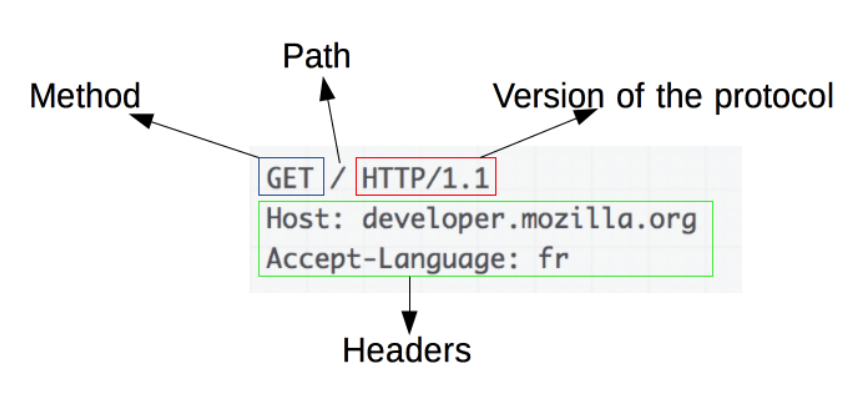

- **Method**
  - GET, POST같은 동사나 OPTIONS나 HEAD와 같은 명사
- **Path**
  -  IP번호(도메인) : 포트번호
- **Version of the protocol**
  - http 버전
- **Headers**
  - 서버에 대한 추가 정보를 전달하는 선택적 헤더들.
  - 해더에 대한 자세한 내용
    - https://developer.mozilla.org/ko/docs/Web/HTTP/Headers

**응답(Response)**

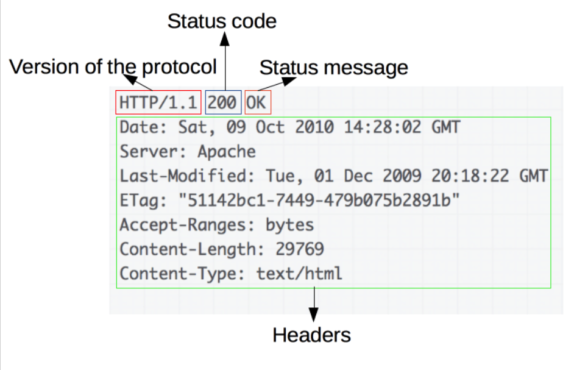

- 버전
- Status code(상태코드)
- Status Message
- Headers

**상태 코드**

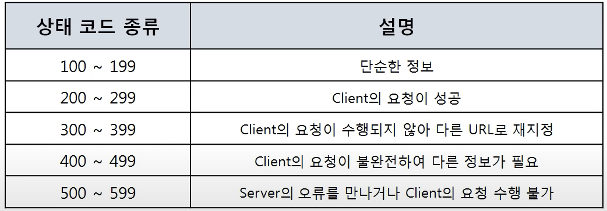

- 403 : Forbidden => Client가 권한 없는 페이지 요청
- 404 : Not Found => Client가 서버에 없는 페이지 요청
- 500 : Server Error => Server의 일부가 멈췄거나 설정 오류가 발생
- 503 : Service Unavailable : 최대 Session수를 초과했을 때

#### Header

> - General header
> - Request header
> - Response header
> - Entity header 

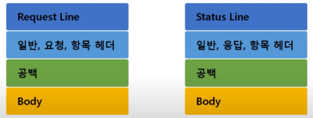

- **일반 Header의 종류**

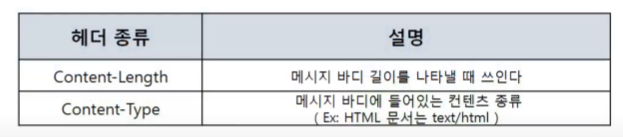

- **요청 Header의 종류**

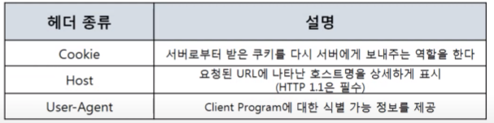

- User Agent
  - 이것을 통해 Mobile로 접속했는지 PC로 접속했는지 확인 할 수 있음
  - OS의 대한 정보 등등

- **응답 Header의 종류**

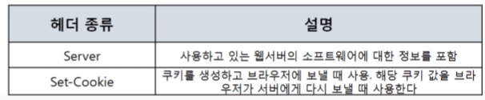

## 02_HTTPS

> HTTP + S
>
> - S : Over Secure Socket Layer의 약자이다.

- **HTTPS를 사용하는 이유**
  1. 내가 사이트에 보내는 정보들을 **제 3자가 못보게 하기 위함**
  2. 접속한 사이트가 **믿을 수 있는 곳인지 확인**하기 위함

## 03_ SSL의 동작 방법

### 대칭키 vs 비대칭키(공개키)

**대칭키**

- 메시지를 보내는 쪽과 메시지를 받는 쪽이 **같은 복호화 방식**을 공유하는 것
- 즉 양쪽에서 **똑같은 해독문**이 있어서 암호화하고 이것을 복호하는 작업을 말한다.
- **문제**
  - 이 작업은 양쪽모두 대칭키를 가지고 있어야한다.
  - 즉 **한번은 대칭키를 보내야함**

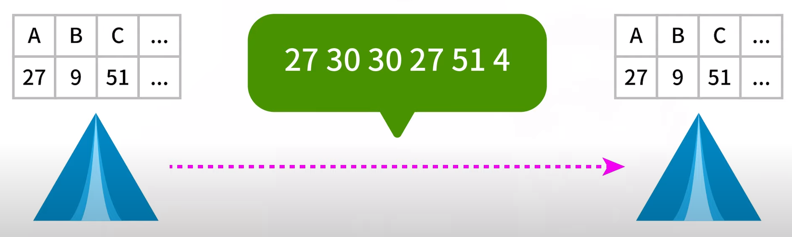

**비 대칭키 (공개키)**

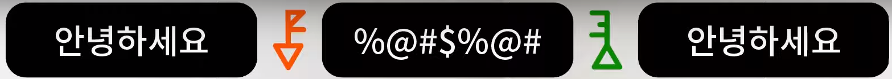

- **A키로 암호화 하면 B키로만 복호화** 할 수 있다.

- 반대로 **B키로 암호화 하면 A키로만 복호화** 할 수 있다.

  

**비대칭키 작동 방식**

**활용1**

- 서버는 2키들중 1개만 비밀로 보관 => **개인키**
- 다른 키는 대중에게 공개해버린다. => **공개키**

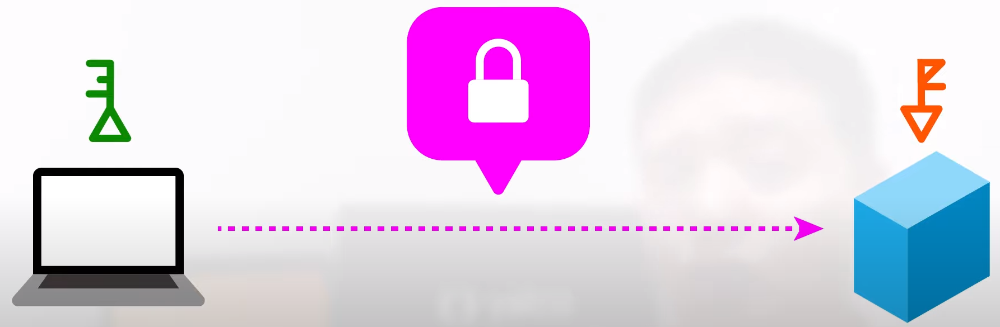

- 사용자들은 **공개키를 이용해서 암호화 => 서버**
  - 누군가 이 정보를 가로챈다고 하더라도 **공개키로는 암호해석을 할 수 없다.**

**활용2**

- 믿을 만한 서버인지 아는 방법

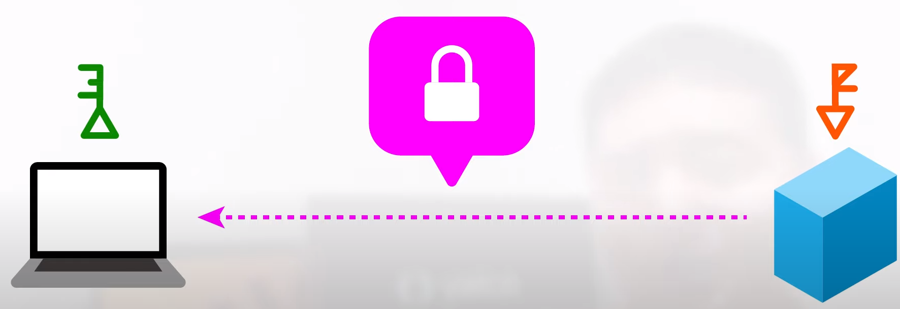

- 서버에서 사용자에게 보내는 정보
  - 정보의 일부가 이 서버의 **개인키로 암호화**되어 있다.
  - 즉 개인키로 암호화된 정보를 **공개키로 복호화**할 수 있음 => **믿을 수 있는 서버인지 확인**
  - ex_ 다른 사칭사이트들은 발각이 되게 될 것이다.

**비 대칭키 알고리즘**

- RSA => 인수분해를 이용해서 만드는 것

 

### SSL의 필요지식

**1) 서버에서 뿌린 공개키가 정품이니?**

- **CA** : Certification Authority ( Root Certificate ) => 인증 기관
  - 클라이언트가 접속한 서버가 정상적인 서버가 맞는지 확인하여 맞다면 인증서를 제공해주는 역할을 합니다. 

handshake

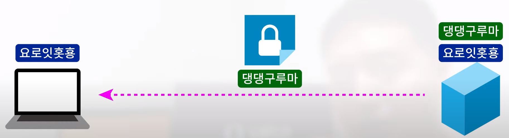

- 클라이언트 : **무작위 데이터 보냄**
- 서버 : **무작위 데이터 + 인성서 보냄**

클라이언트 : **인증서 진짜인지 확인**

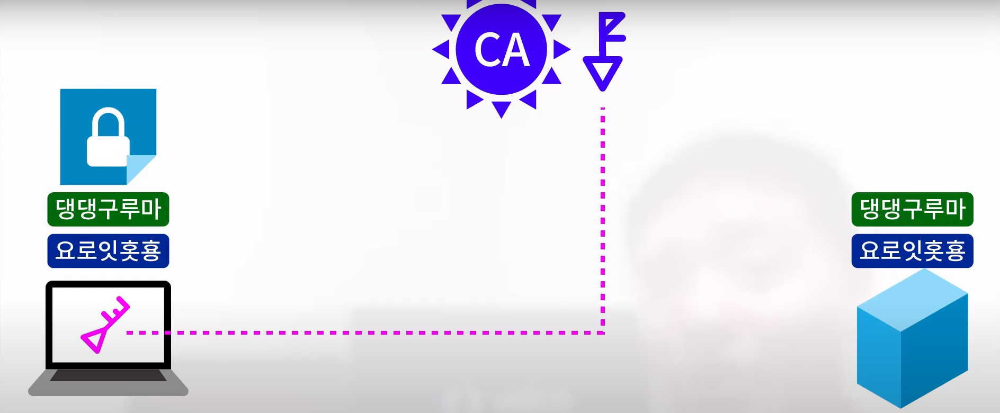

- 브라우저에 내장된 CA들의 정보를 통해 확인 (비대칭키를 사용해서)
- CA의 인증을 받은 **인증서**
  - 해당 **CA의 개인키로 암호화**되어 있음 (개인키 => CA가 가지고 있음)
  - 인증서는 **CA의 공개키로만 복호화** 할 수 있음
    - 이 공개키로 복호화 될 수 있는 인증서를 발급할 수 있는 건 CA뿐일 것이다.
    - **그럼 클라이언트는 CA의 공개키를 어떻게 얻는것임??**
- CA 리스트에서 인증서가 없다면? => 경고

**인증서 복호화 성공**

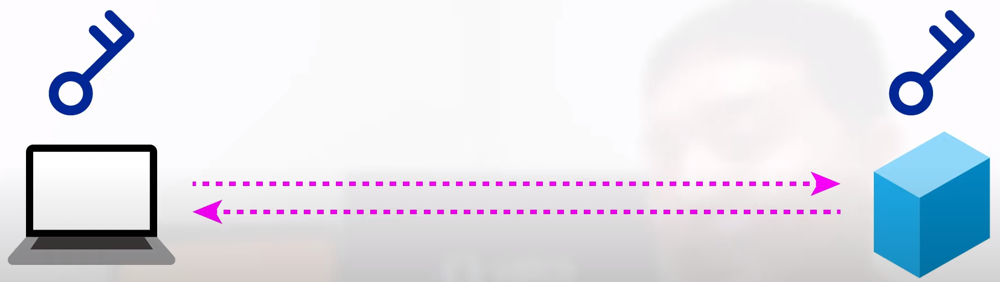

- **서버의 공개키가 존재** 한다.
- 그러고 난뒤에 서로 **대칭키**를 이용하여 데이터를 주고 받게 된다.
- 대칭키? 위험하지 않나?
  - 따라서 이 **대칭키를 공유**할 때 => **비대칭키를 사용**

**대칭키와 비대칭키의 혼합**

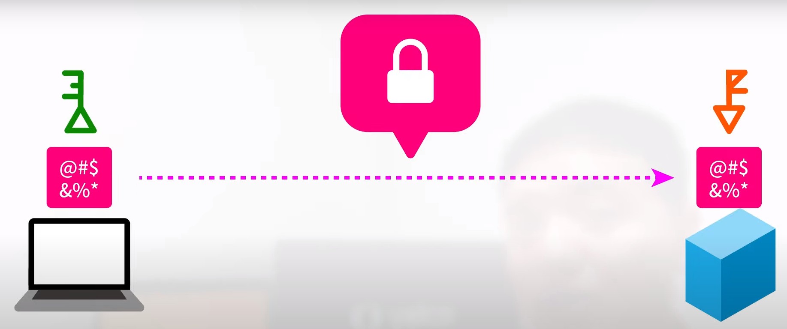

- 서버와 클라이언트는 서로 **무작위 데이터**를 생성한 적이 있다.
- 클라이언트
  - 두개의 무작위 데이터를 혼합하여 **임시키**를 만든다.
  - 인증서에 있던 **서버의 공개키** => **임시키 암호화**
    - 즉 **서버의 개인키**로만 암호를 풀수 있음
- 이후 서로 같은 대칭키가 만들어지게 된다.

## 조금 더 자세한 SSL설명

Key

- 실제 데이터 : 대칭키
- 대칭키의 키 : 공개키

**네트워크 통신 3단계**

1. Handshake 
2. Transfer info 
3. finish session

### 1) handshake

1. **Client Hello** (클라이언트가 서버에 접속 )
   - 클라이언트 측에서 생성한 **랜덤 데이터**전송
   - 클라이언트가 지원하는 암호화 방식들전송
     - 클라이언트와 서버가 지원하는 암호화 방식이 다를 수 있기 때문
   - 세션 ID 전송
     - 이미 SSL handshake를 했을 때 또 handshake를 하지 않기 위해
2. **Server Hello** (서버가 클라이언트에 응답)
   - 클라이언트 측에서 생성한 **랜덤 데이터**전송
   - 서버가 선택한 암호화 방식 전송
     - 이 과정을 통해서 암호화 방식에 대한 협상이 종료된다.
   - 인증서 전송
3. **클라이언트가 서버의 인증서 확인**
   - 인증서가 CA에 의해서 발급된 것인지 확인하기 위해서 클라이언트에 내장된(보통 브라우저에 list가 존재) CA리스트를 확인
   - CA리스트에 (서버에서 보낸) 인증서가 없다? => 경고메시지 출력
     - 그럼 어떻게 CA에 의해 발급된 것인지 알수 있을까?
     - 클라이어트에 내장된 CA의 공개키를 이용 => 인증서 복호화
     - 복호화 성공?
       - 인증서는 CA의 개인키로 암호화된 문서임이 암시적으로 보증 된 것
       - 인증서를 전송한 서버를 믿을 수 있게 된 것
   - **랜덤 데이터**
     - 서버 랜덤 데이터 + 클라이언트 랜덤데이터 => 조합
       - pre master secret이라는 키를 생성
       - 세션 단계에서 데이터를 주고 받을 때 암호화하기 위해 사용
       - 이때 사용할 암호화 기법은 대칭키 => 이 값을 3자에게 노출시키면 안된다.
     - pre master secret를 어떻게 서버에 전송할까?
       - 공개키 방식
       - 서버의 공개키로 pre master secret값을 암호화
       - 서버로 정송
       - 서버는 자신의 비공개키(개인키)로 안전하게 복호화
     - 그럼 서버는 어떻게 공개키를 구할 수 있는가?
       - 서버로 부터 받은 인증서 안에 들어있음
4. 서버는 클라이언트가 전송한 pre master secret값을 자신의 비공개키로 복호화
   - 즉 서버, 클라이언트 둘다 pre master secret값을 공유
   - 그 후 pre master secret => master secret으로 변경
   - master secrete은 session key를 생성
   - 이 값을 이용해서 서버와 클라이언트는 데이터를 대칭키 방식으로 암호화 한 후에 주고 받음
   - 세션키를 클라이언트와 서버가 모두 공유 됨
5. **handshake 단계의 종료를 서로 알림**

### 2)  Session

- 서버와 클라이언트가 **데이터를 주고 받는 단계**
  - 정보를 전송하기 전에 session key값을 이용해서 대칭키 방식으로 암호화 한다
  - 상대 : session key값을 이용해서 복호화
- 대칭키와 공개키를 조합해서 사용하는 이유
  - computing power가 너무 많이 들게 되기 때문에 그냥 공개키를 사용할 수 없음

### 3) Session 종료

- 데이터 전송이 끝나면 SSL 통신이 끝났음을 서로에게 알려줌
- 이때 사용한 대칭키인 세션키를 페기

