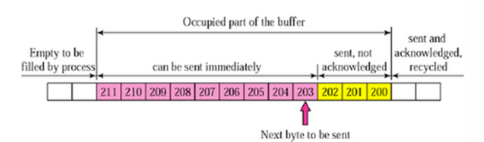
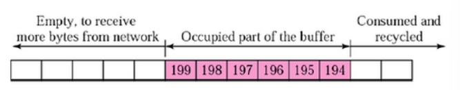
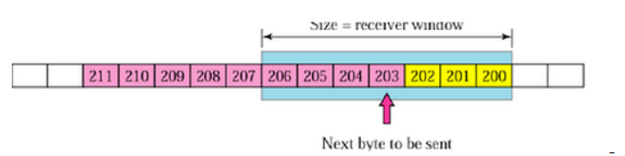
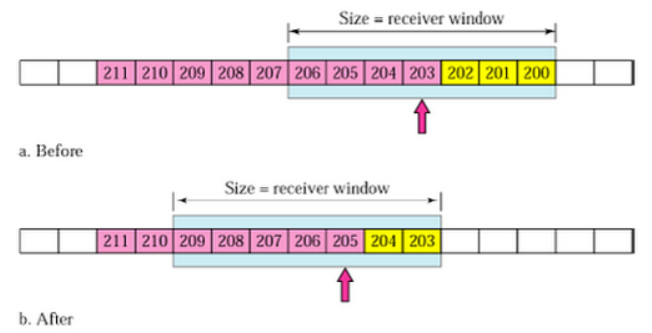
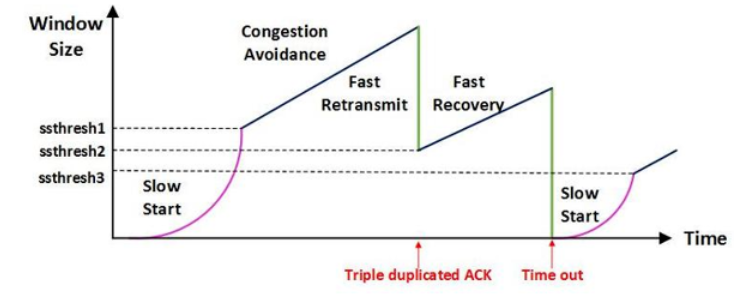

# cs_05\_흐름제어_혼잡제어

**TCP통신이란?**

- 연결 지향적 통신

## 1) Flow  Control

**Flow Control이 필요한 이유**

- receiver가 sender보다 빠르면 문제가 없지만 receiver속도가 빠를 경우 문제가 생긴다.
  - 이유 :
    - sender가 빠르게 되면 receiver에서 데이터가 너무 넘쳐흐르기 때문에
- receiver에서 제한된 저장 용량 제한된 용량초과 => **데이터 손실**
  - 데이터 손실 => **다시 응답 + 데이터 전송**
- 조절을 할 필요가 있음

### **해결 방법**

#### **Stop and Wait**

- 매번 전송한 패킷에 대해 확인 응답을 받을때만 다음 패킷을 전송

#### **Sliding Window**

- receiver에서 윈도우 크기 설정
  - sender에서 확인 응답없이 전송할 수 있음
  - 윈도우 크기만큼 데이터를 전송해주면 되기 때문이다.

**목적**

- 전송은 되었지만, acked를 받지 못한 byte의 숫자를 파악하기 위해 사용
- **LastByteSent - LastByteAcked <= ReceiveWindowAdvertised**
- 마지막에 보내진 바이트 - 마지막에 확인된 바이트 <= 남아있는 공간
- 현재 공중에 떠있는 패킷 수 <= sliding wiindow

**동작 방식**

- sender: 윈도우에 포함되어 있는 모든 패킷 전송
- reveiver : 확인
- sender: 위도우를 옆으로 옮김 => 다음 패킷들 전송

- window
  - send를 위한 window + reveive를 위한 window => 2개의 window
  - 3way handshaking을 통해 receiver host는 receive window size에 자신의 send window size를 맞춘다. 

**1. send buffer**

- ~199 		: 보냄 + 확인
- 200 ~ 202 : 보냄 + 응답 못받음
- 203 ~ 	   : 안 보냄

**2. receive window**

- 199까지 받음

**3. sender**

- next => 200 ~ 206

**4. sender window**

- Before : 
  - 203 ~ 204를 전송하면 수신측에서는 확인 응답 203을 보내고, 송신측은 이를 받아 after 상태와 같이 수신 윈도우를 203 ~ 209 범위로 이동
-  After : 
  - 205 ~ 209가 전송 가능한 상태

## 2) 혼잡 제어(Congestion Control)

**Congestion Control이 필요한 이유**

- 한 라우터에 데이터가 몰릴때, 자신의 데이터를 모두 처리할 수 없게 됨
  - 호스트 => 데이터를 재전송하게 됨 => 더 혼잡해짐(Over flow, lost data)
  - => sender의 전송속도를 줄일 필요가 있음

- **혼잡 이란?**
  - 패킷의 수가 과도하게 증가하는 현상

**해결 방법**

- **AIMD(Adiitive Increase / Multiplicative Decrease)**
  - **작동방식**
    - 처음 패킷을 하나 보냄
      - 문제 없음? => window크기 (단위 시간 내에 보내는 패킷의 수)를 1씩 증가
      - **즉 속도를 점차 증가**	
    - 패킷 전송 실패 or 시간 초과
      - 패킷 전송 **속도 절반으로 줄음**
  - **특징**
    - => 여러 호스트가 한 네트워크를 공유 
    - => 나중에 진입하는 쪽이 처음에는 불리 
    - => 하지만 시간이 흐를 수록 평형상태로 수렴
  - **문제점**
    - 네트워크의 높은 대역폭을 사용하지 못함
    - 네트워크가 혼잡해진 다음 상황을 대처 (대역폭을 줄임)

- **Slow Start**
  - **작동 방식**
    - 패킷 하나 보냄
      - 문제 없음? => ACK 패킷마다 window size를  1씩 늘림
        - 즉 한 주기가 지나면 window size가 2배로 된다.
        - 전송 속도가 지수함수 꼴로 증가
      - 문제가 생김?
        - window size를 1로 떨어뜨림
  - 특징
    - 한번 혼잡 현상 발생
      - 네트워크의 수용량을 어느정도 예상할 수 있음
      - 혼잡 현상 발생 => window사이즈 절반까지는 지수함수 꼴로 증가 => 그 이후 완만하게 1씩 증가

- **Fast Retransmit**
  - **작동 방식**
    - Receiver에서 먼저 도착해야할 패킷이 도착하지 않음
      - 다음 패킷이 먼저도착함 => ACK패킷을 보냄
    - 순서대로 잘 도착
      - 다음 패킷의 순번을 ACK패킷에 실어 보냄
    - 만약 중간에 손실 됐다면?
      - Receiver는 중복된 ACK패킷을 받게 됨 => 왜? 중간에 손실된 것을 계속 보내기 때문
      - 중복된 패킷 3개 받음
      - 재전송
      - 혼잡한 상황이라는 것을 인지 => window size줄임

- **Fast Recovery**
  - 혼잡 => window size반으로 줄임 => 선형적 증가
  - 이렇게 진행되면 AIMD로 동작함

Tahoe : 

- Slow Start를 사용하여 자신의 윈도우 크기를 지수적으로 빠르게 증가시키다가 ssthresh를 만난 이후부터는 AIMD를 사용하여 선형적으로 윈도우 크기를 증가
- ACK Duplicated나 Timeout이 발생하면 네트워크에 혼잡이 발생했다고 판단하고, ssthresh와 자신의 윈도우 크기를 수정

 Reno

- Reno는 3개의 중복 ACK가 발생했을 때, 윈도우 크기를 1로 줄이는 것이 아니라 AIMD처럼 반으로만 줄이고 sshthresh을 줄어든 윈도우 값으로 정하게 된다. 
- Timeout에 의해서 데이터가 손실되면 Tahoe와 마찬가지로 윈도우 크기를 바로 1로 줄여버리고 Slow Start를 진행한다.

