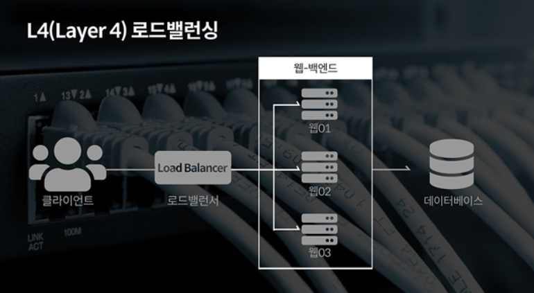
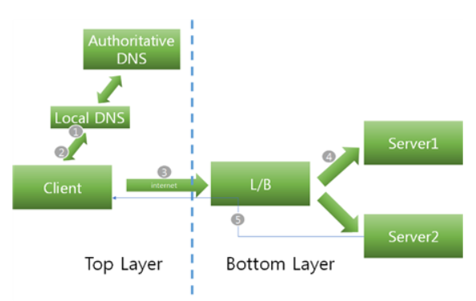
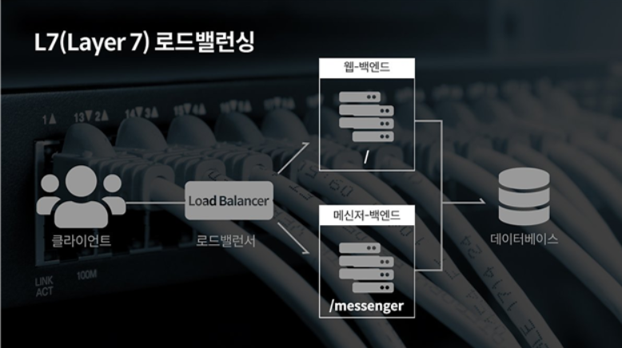
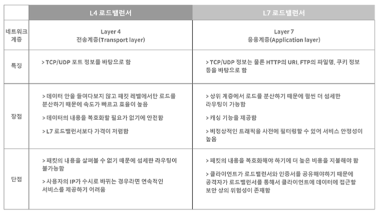

# cs_06_load_balancing

https://steady-coding.tistory.com/535

**로드 밸런싱이 필요한 이유**

- 대규모 트래픽 해결 방법
  - **Scale-up**  : **서버의 성능**을  높이는 방법
  - Scale-out : 분산처리를 위해 **서버의 수**를 늘리는 방법
    - 여러 서버들로 대규모의 네트워크 트래픽을 분산 처리하는 기술 => **load balancing**

## 1) load balancing & load balancer

- **Load balancing**

  - 네트워크 또는 서버에 가해지는 부하를 분산해 주는 기술을 의미

  

- **Load Balancer (LB)**

  - Load balancing을 제공하는 서비스 또는 장치
  - 클라이언트와 네트워크 트래픽이 집중되는 서버들 사이에 위치, VIP(Virtual IP)와 함께 구성
  - 특정 서버에 부하가 집중되지 않도록 트래픽을 다양한 방법으로 분산

-  **VIP(Virtual IP)**
  - 로드 밸런싱의 대상이 되는 여러 서버를 대표하는 가상의 IP
  - 클라이언트들은 서버의 IP로 직접 요청을 하는 것이 아니라 LB가 가지고 있는 VIP를 대상으로 요청한다.

## 2) Load Balancer 의 기능

### 2-1) Heal Check

- 주기적으로 **장애여부 판단**

- **Fail- over 가능**

  - 서버에 이상 발생 시 정상적인 서버로 트래픽을 보냄 

- TCP/UDP분석이 가능 => 방화벽의 역할도 수행

- Layer

  - L3 체크: 

    - ICMP를 이용해 서버의 IP 주소가 통신 가능한 상태인지 확인한다.
    - ICMP => TCP/IP에서 IP 패킷을 처리할 때 발생되는 문제를 알려주는 프로토콜

    

  - L4 체크:

    - TCP의 3-way handshaking을 통해 각 서버의 포트 상태를 확인한다.

    

  - L7 체크: 

    - 애플리케이션 계층에서 체크하는 방법으로 실제 웹 페이지에 통신을 시도해 이상 유무를 파악한다

### 2-2) Tunneling

- 인터넷 상에서 **눈에 보이지 않는 통로**를 만들어 **통신**할 수 있는 개념
  - 테이터를 캡슐화 => **연결된 상호 간에만 캡슐화된 패킷을 구별**
- VIP로 향하는 요구 채킷 
  - => 로드 밸런싱 서버로 전달
  - => 로드 밸런싱 서버에서 패킷의 목적지 주소와 포트를 검사
  - => 가상 서버 정책과 일치할 경우?
  - => 스케줄링에 따라 실제 작업 서버로 전달
- 캡슐 형식으로 감싸서 전달됨

**로드 밸런서의 종류와 로드 밸런싱 방법**

- 계층에 따라서 종류가 나뉘게 된다.
- **상위 계층으로 갈수록 섬세**하나 부하 분산이 가능  But,  **비용 증가**
- L4와 L7이 많이 사용됨
  - L4 :
    -  L4에서 포트 정보를 바탕으로 분산하는 것이 가능하기 때문
    - 한대의 서버에 각각 다른 포트 번호를 부여하여 다수의 서버 프로그램을 운영하는 경우라면 최소 L4이상을 사용해야함

## 3) L4 Load Balancer

### 3-1) L4 Load Balancer란?

- 전송 계층에서 로드를 분산한다.
- IP주소나 포트번호, MAC주소 등에 따라서 트래픽을 나누고 분산처리가 가능하다.
- CLB(Connection Load Balancer), Session Load Balancer라고 불린다.

### 3-2) 동작 방식

1. Client가 도메인 주소(www. ~)를 입력 
   - => local DNS서버로 DNS쿼리 날림 
   - => L4의 VIP를 획득
2. VIP를 client에게 보냄
3. Client는 L4 VIP로 http요청을 보냄
4. Load Balncer(LB)는 최적의 서비스 서버를 내부 알고리즘을 통해 선별 후 요청 전송
   - => 서버 작업 결과를 LB에게 전송
5. 전달 받은 결과를 LB를 통해 Client에게 전송

- 

### 3-3) L4 로드 밸런싱 방법

**라운드 로빈 (Round Robin)**

- 요청이 들어오는 대로 서버에 균등하게 요청을 분배
- **단순히 순서에 따라** 세션을 할당
- 경로 별로 **같은 처리량이 보장되지 않음**

**가중치 및 비율 할당  (Weighted Round Robin Scheduling)**

- 기본적으로 라운드 로빈 방식
-  **서버 가중치**를 사용자가 지정
  - 서버의 가중치에 따라 요청을 더 분배하기도, 덜 분배하기도 한다
- 특정 서버의 **성능이 뛰어나다면 높은 가중치를 부여**

**최소 연결 (Least Connection)**

- **가장 적은 세션을 가진 서버로 트래픽**을 보내는 방식
-  가장 많이 사용되는 방식

**가장 빠른 응답 시간 (Fastest Response Time)**

- 가장 **빠른 응답 시간**을 보내는 서버로 **트래픽을 보내 주는** 방식
- 각 서버들의 가용 가능한 리소스와 성능, 그리고 처리 중인 데이터 등이 다를 경우 적합한 방식

**해시 기반 스케줄링 (Source hash Scheduling)**

- 사용자의 IP를 해싱한 후 그 결과에 따라 서버로 요청을 분배
  - **특정 클라이언트는 특정 서버로만 할당하는 방식**이다.

**대역폭 (Bandwidth) 기반**

- 서버들과의 **대역폭을 고려하여 트래픽을 분산**하는 방식이다.

 

## 4) L7  Load Balancer

-  L4 로드 밸런서의 기능 + 애플리케이션 계층의 정보를 바탕으로도 분산 처리가 가능
  - 즉, HTTP 헤더, 쿠키 등과 같은 **사용자의 요청을 기준으로 특정 서버에 트래픽을 분산**하는 것이 가능

- URL에 따라 부하를 분산
- HTTP 헤더의 쿠키 값에 따라 부하 분산
-  특정한 패턴을 지닌 바이러스를 감지해 네트워크를 보호할 수 있으며, Dos/DDoS와 같은 비정상적인 트래픽을 필터링할 수 있어 네트워크 보안 분야에서도 활용

### 4-1) L7 로드 밸런싱 방법

**URL 스위칭 방식 (URL Switching)**

- **특정 하위 URL**들을 **특정 서버로 처리**하는 방식이다.

- Ex) 

  '.../images' 또는 '.../video'와 같은 URL은 서버가 아닌 별도의 스토리지에 있는 객체 데이터로 바로 연결되도록 구성할 수 있다.

**컨텍스트 스위칭 방식 (Context Switching)**

- 클라이언트가 요청한 **특정 리소스에 따라 특정 서버**로 연결할 수 있다. 

- Ex) 

  이미지 파일에 대해서는 **확장자**를 참조해 **별도로 구성된 이미지 파일이 있는 서버** 또는 스토리지 직접 연결해 줄 수 있다.

**쿠키 지속성 (Persistence with Cookies)**

- 쿠키 정보를 바탕으로 **클라이언트가 연결했었던 서버에 계속 할당**해 주는 방식이다.

## 5) L4 vs L7

**로드 밸런서 주요 성능 지표**

- 초당 연결 수 (Connections per second)

  - 최대 처리 가능한 초당 TCP 세션 개수를 의미한다.

    

- 동시 연결 수 (Concurrent connections)

  - 동시에 유지할 수 있는 최대 세션 개수를 의미한다.

  

- 처리 용량 (Throughput)

  - UDP 프로토콜에 대한 로드 밸런싱 성능 지표
  - FWLB (Firewall Load Balancing)에서 중요
  - 단위는 bps (bit per second) 또는 pps (packet per second) 사용

