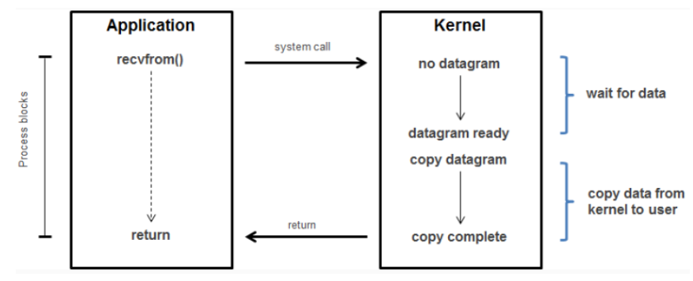
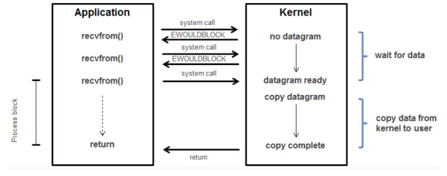
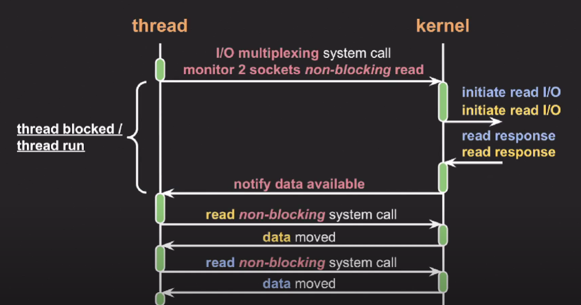
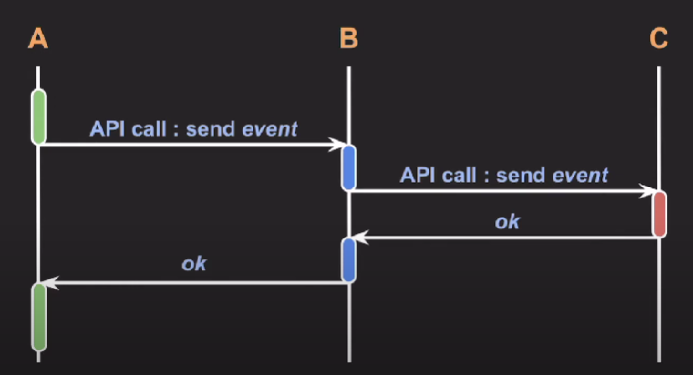
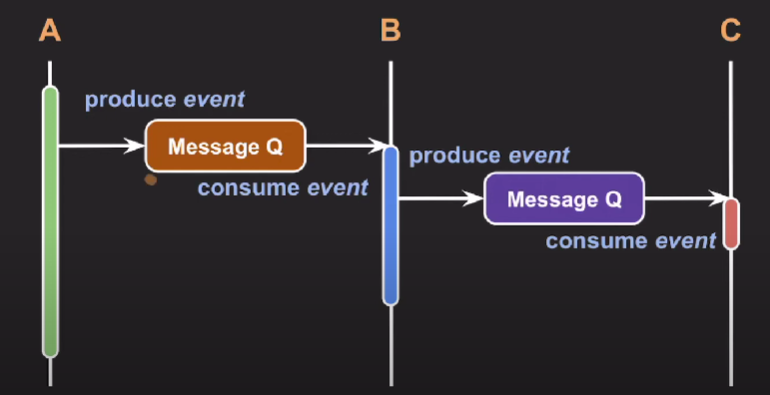

# cs_07_blocking_nonblocking

https://www.youtube.com/watch?v=mb-QHxVfmcs

https://www.youtube.com/watch?v=EJNBLD3X2yg

https://hoyeonkim795.github.io/posts/BLOCKING-AND-NONBLOCKING/

https://jaehoney.tistory.com/242#recentComments

## I/O의 종류

- Network( socket )
- file
- pipe
- device

## Blocking & Non-blocking

- 처리되어야 하는 작업이 전체적이 작업 흐름을 막는 지에 대한 관점

### Blocking

> I/O 작업을 요청한 프로세스/스레드는 요청이 완료될 때까지 block됨

- 자신의 작업을 진행
- 다른 주체의 작업이 시작
- **자신의 작업을 멈추고 해당 작업을 기다림**
- 다시 자신의 작업을 시작한다.

1. 유저는 Kernel에게 read작업 요청
2. application 대기상태로 변경 (block)
   - 리소스가 일을 하지 않고 낭비
3. return을 진행하게 됨 => block이 해제되게 된다.
   - kernel space에서 user space로 옮기는 작업
4. user에서 값을 받고 작업을 이어나가게 된다.

### Non-Blocking

- 프로세스/ 스레드를 block시키지 않고 요청에 대한 현재 상태를 즉시 리턴

1. 유저가 Kernel에게 non-block으로 read작업 요청
2. return이 바로 된다.
   - 데이터 준비가 되어 있지 않은 상태
   - -1 (EAGAIN or EWOULDBLOCK)  상태가 반환되게 된다.
     - 아직 준비가 되어있지 않다는 error를 반환하게 된다.
3. 기다리지 않고 다른 함수들을 먼저 실행한다.
4. 다시 요청
   - 데이터가 준비 되었음
   - 데이터 반환
   - 값을 얻음

- 장점
  - => block되지 않고 즉시 리턴
  - 스레드가 다른 작업을 수행할 수 있다.

- 단점
  - I/O작업 완료를 어떻게 확인할 것인가?

**Non Block이 작업완료했는지 처리하는 방식**

1. **완료가 되었는지 반복적으로 확인한다.**
   - 처리 속도가 느려질 수 있음
     - 이유 => 준비하는지 확인하는 타이밍이 늦을 수 있기 때문에
   - CPU낭비 발생
2. **I/O multiplexing(다중 입출력) 사용**
   - 관심있는 I/O작업들을 동시에 모니터링 => 그 중 완료된 I/O들을 한번에 알려줌
   - 여러 이벤트들을 한번에 처리하는 방법

- 두개 socket을 동시에 요청을 보내게 된다.
- 그 후 response를 동시에 받는 다면?
  - 순차적으로 데이터를 읽어오는 방식도 존재

- I/O multiplexing 종류
  - select
  - poll
  - epoll (리눅스에서 사용)
  - kqueue (Mac OS)
  - IOCP (Window)

## Synchronous & Asynchronous

### Synchronous

>  작업이 끝나는 동시에 시작

### Asynchronous : 

> 다른 작업이 끝나지 않아도 시작

**방법**

- **방법 1**
  - Thread의 개수를 늘려서 I/O를 처리하는 방법
  - **Multi Threads**
    - multi core를 사용하는 장점
    - context switch에 많은 시간을 낭비할 수 있음
    - race condition의 발생을 막아 줘야한다.
- **방법2**
  - Thread하나가 여러 작업을 처리하게 끔 만드는 방법
  - Thread하나에 **Non block**방법을 추가한 것
    - 여러가지 일을 동시에 사용할 수 있음
- **방법3**
  - 방법1 + 방법2

**백앤드 프로그래밍의 추세**

- 스레드를 적게 사용
- **non-block I/O**를 통해 전체 처리량 증가

### 백앤드 아키텍처 관점에서 비동기

하나의 서비스

기능과 역할에 따라 여러개의 마이크로 서비스로 구성된다. 

이들 사이에는 빈번하게 커뮤니케이션이 발생하게 된다.

**Synchronous communication**

- A 에서 api 콜을 진행
- B에서도 C에게 api콜을 진행
- block 상태로 진행을 하게 된다.
- **문제점**
  - 만약에 C에서 불능상태가 되게 된다면 B도 불능 => A도 불능상태에 빠질 수 있게 된다.
  - 따라서 Asynchronous 설계하는 것이 필요하다

**Asynchronous communication**

- Message Q를 만들어서 사용한다.
- Message Q를 B에게 보낸다
  - 그리고 A는 본인의 할 일을 그대로 진행하게 된다.
- 그것을 반복

**장점**

- C가 불능상태에 빠진다고 하더라도 파급이 B와 A에게 까지 빠지지 않게 된다.
- C안에서만 문제가 생기게 된다.

