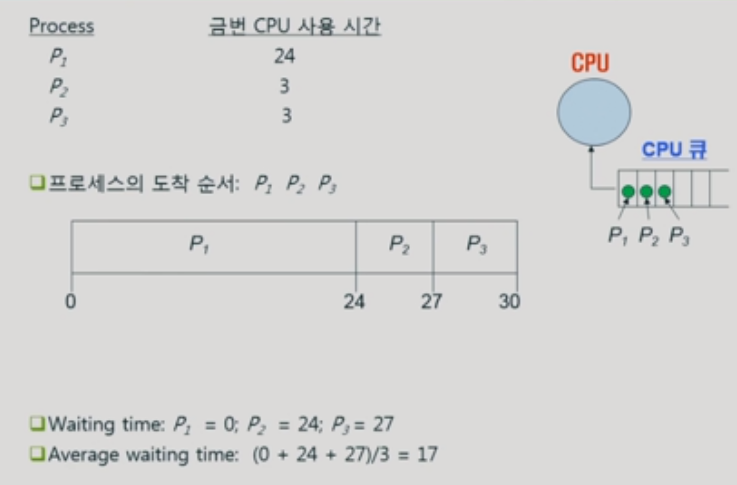
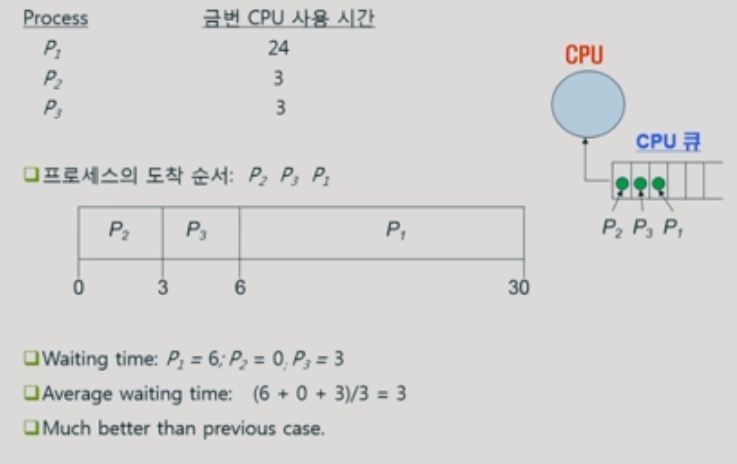
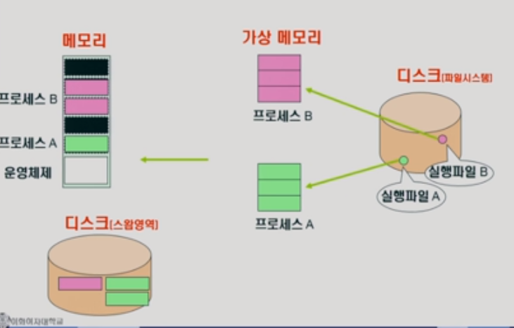
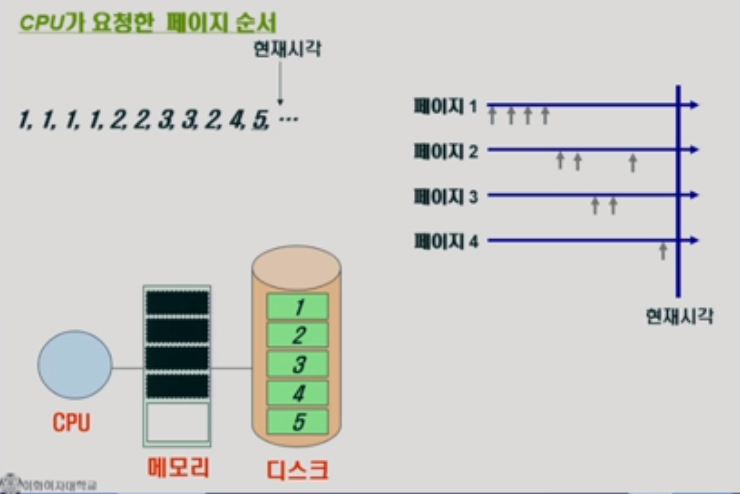

# 01. OS overview

### OS란?

- 컴퓨터 시스템 자원을 관리 ==> 효율을 높임 ==> 서비스를 제공
- 목적
  - 컴퓨터 시스템을 편리하게 사용할 수 있는 환경을 제공
    - 마치 자기 혼자 컴퓨터를 사용하게 끔 환경을 제공
    - 이유: cpu가 굉장히 빠르기 때문에(마치 동시에 처리하는 듯한 느낌을 준다)
    - 음악을 들으면서 웹서핑하면서 동영상보면서 등등을 동시에 할 수 있게끔 만든다.
  - 시스템 자원을 효율적으로 사용(resource)
    - 자원? ==> cpu , 메모리, I/O 장치(입출력 장치) 등 
      			==> 효율성, 형평성(지나친 불이익X for 사용자, 프로그램)
    - 메모리 ==> cpu에 작업 공간
      - 한정된 메모리에 프로그램이 동시에 돌아가게 되면 어떤 프로그램에게 얼만큼 메모리를 할당할 것인가? 라는 문제가 생기게 된다.
      - 얼만큼 올려야 효율적일까??
    - 

### 컴퓨터 구조

- ### 운영체제의 기능
  
  - 항상 실행되는 프로그램이다
  - **운영체제에서 핵심적인 부분 = kernel(메모리에 항상 상주)**
  - 매 클럭마다 메모리에 있는 기계어를 읽고 실행시킨다.
  - IO는 각각을 담당하는 cpu를 가지고 있다 ==> **IO 컨트롤러**
    - 그럼 cpu가 IO 컨트롤러에게 물어보게 된다.
    - 즉 cpu의 작업공간은 메모리 ==> 그래서 cpu가 I/O에 직접 접근을 하지 않는다
  - cpu스케줄링
    - 어디에 할당을 할지
    - 일정시간이 지나면 프로그램에게 권한을 가져온다
  - 디스크 스케줄링
    - 디스크에 들어온 요청을 어떤 순서로 처리할지
  - 인터럽트, 캐싱
    - 캐싱: 메모리와 디스크사이에 속도차이가 난다
      - 똑같은 데이터를 또 불러올때 디스크까지 안가고 메모리에서 해결
    - 인터럽트: 
      - cpu은 IO controler에게 일을 부탁하고 다른 일을 하게 된다.
      - 그리고 나서 IO가 일을 다하면 cpu에게 알려주게 된다.
      - 그럼 하던일 바로 끝내고 interrupt가 있는지 확인하게 된다.
      - 그럼 다음 일이 있더라도 interrupt일을 하게 된다.

#### 프로세스

- **실행중인 프로그램을 프로세스라고 부른다**
- 운영체제는 큐를 만들어서 cpu가 어떤일을 할지 줄세워 놓는다.

### cpu 스케줄링

- FCFS(first come first served) => 먼저 온친구 먼저 처리함 = 큐
- cpu에서 처리하고 IO에게 준다
- 공평해 보이지만 효율적이지 않음
  - 이유: 기다리는 시간이 길다

- How to make it more efficient??
  - SJF (Shortest-Job-First)
  - 프로그램을 짧게 쓰는 것을 먼저 처리한다.
  - 그러면 평균 기다리는 시간이 3초로 줄어들게 된다. ==> 특징: 대기시간 감소
  - 문제점
    - 형평성에 문제가 생긴다. 

#### Round Robin

- 한번에 사용할 시간이 정해져 있다.
- 정해진 시간이 지나게 되면 큐에 맨 뒤로 들어가야한다.

- 이렇게 되면 기다리는 최대시간이 정해져 있음
- 대기 시간이 프로세스의 cpu 사용시간에 비례한다.

### 메모리 관리

#### 가상메모리

- 바로 물리적인 메모리에 들어가지 않고 자신만에 메모리 공간을 만든다.
- 실제로 메모리를 만드는 것이 아니다.
- 가상메모리에서 당장 필요한 부분만 물리적인 메모리에 올려놓게 된다.
- 이유: 
  - 메모리의 낭비를 막기위함
- 물리 메모리가 다 차게 된다면??
  - 스왑영역이라는 곳으로 쫒겨나게 된다.
  - 스왑영역은 메모리의 연장 공간이라고 봐도 된다.
- 그럼 어떤 page를 쫒아내나??
  - 5번을 올려놓으려면 무언가를 쫒아내야한다.
  - 미래를 모르는 상황에서 미래에 사용될 가능성이 높은 것을 살려둬야 한다.
  - 그럼 어떻게? 그 가능성을 판단함?
  - 과거를 살펴본다.
  - LRU(가장 오래전에 참조 페이지 삭제) ==> 1번을 쫒아낸다
  - LFU(참조횟수가 가장 적은 페이지 삭제) ==> 4번을 쫒아낸다.

- 만약 전원이 꺼지면??
  - 메모리는 사라진다
  - 스왑영역은 의미없는 데이터가 남게 된다.
  - 디스크 부분은 저장된다.

#### 디스크 스케줄링

- 디스크를 효율적으로 관리하기 위해서는 헤드를 효율적으로 움직이게 만들어야 한다.
- 디스크 접근 시간
  - 탐색시간 (seek time) ==> 시간이 가장 오래걸림 ==> 이것을 신경써주어야한다
  - 회전지연
  - 전송시간
- FCFS
  - 비효율적이다
- SSTF(Sorthest Seek Time First)
  - 가장 가까운 애들 먼저 처리한다. 
  - 문제: starvation문제
- SCAN
  - 현재 가장 많이 사용한다.
  - 그냥 신경안쓰고 계속움직인다
  - 그리고 요청들어오면 그떄 지나칠때 처리하게 된다.
  - ==> 약간 엘리베이터 느낌

### 캐싱

- 계층도(오래된 자료 ==> 최근자료 찾아볼 것)

- 요즘은 디스크를 백업으로 쓰고 그 위에 flash memory를 쓰고 한다.
- speed, cost, volatility
- 계층화를 시키는 이유
  - 속도차이를 줄이기 위함이다.

- 캐싱?
  - 동일한 데이터를 다시 요청할 때 제일 밑에까지 내려오지 않아도 된다.
  - 즉 복사를 해놓고 다시 요청시 복사본을 주게 된다.
  - 하지만 위로 갈 수록 용량이 작아짐
  - 따라서 누군가를 쫒아내게 된다. ==> 가장 중요한 알고리즘

### Flash memory

- ssd, usb 등등 반도체 장치
- 특징:
  - 휘발성 x
  - 전력소모 적음
  - 물리적인 충격에 강함
  - 작음
  - 가벼움
  - 썻다 지웠다를 반복할수 있는 횟수가 정해져 있다.
  - 데이터가 변질될 위험이 있다. (시간이 지났을 때)
    - 전하의 양으로 0과1을 구분하게 된다.

### 운영체제의 종류

- 서버용, pc용, 스마트디바이스용
- 공개 소프트웨어(Open source Software)
  - Linux, Android
- 왜 공개할까?
  - 소프트웨어가 가지는 특이한 성질 때문이다
  - 독점이 가능하다
  - 원가(?)만 뽑아내고나면 무한정으로 팔수 있다
  - 특정 상품이 시장을 장학하고 나면 2등 3등은 죽는다.
  - 그래서 2등, 3등은 소스코드를 공개한다.
  - 그 뒤에 점유율이 생긴다. 

