# 05_Process_Synchronization

## 1. 데이터 접근

- 연산을 할때는 뭔가를 읽어와서 함
- 그리고 연산 결과를 내보냄
- 이거 자체만으로는 괜찮음

#### os에서의 race condition

- 하지만 E박스(CPU Process)가 여러게 있을 경우에는
- Race Condition의 가능성이 있음
  - 왼쪽은 +을 함
  - 오른쪽은 - 를 함
  - 한번에 읽어가게 된다면
  - +의 결과를 내기전에 -계산을 하게됨.....?
  - 그럼 꼬이게 된다. 

- ##### 문제가 안생긴다 관점

  - 서로 다른 프로세스끼리는 본인 영역(주소)에 있는 데이터만 접근할 수 있다!!

- ##### 문제가 생긴다 관점 ==> Race Condition

  - 운영체제가 끼어들었을때
  - a 프로그램 실행 중 ==> 본인이 할 수 없는 일을 요청 (시스템 콜)
  - 자신의 할당시간 끝남
  - 이제 프로세스 b로 넘어감 ==> 본인이 할수 없는 일을 요청(시스템콜)
  - b의 요청을 받아들임 
  - 어?? 근데 a의 요청으로 받아들인 데이터를 b의 요청으로 또 주게 됨 (즉 a의 결과를 받기전에 b에게 데이터를 주게 됨)
  - 그럼 어쩌다가 위에처럼 똑같은 문제가 생기게 된다 ==> 꼬이게 됨
  - 즉 운영체제 때문에 이런 문제가 생기게 된다!

- 위에 내용을 다른 그림으로 만들어 놓은 것

- 이것을 어떻게 해결??
  - 커널모드에 CPU가 수행중일때는 CPU를 빼앗기 않음
  - 유저모드로 돌아갈 때! 그때 돌려주자!!

#### os에서 race condition (interrupt)

- 이렇게 되면 똑같이 count -의 값이 반영이 안되게 된다
- 어떻게 해결?
  - ++ 건드리기는 동안에는 interrupt를 받기 않겠다고 선언함
  - 즉 ++를 건드리기 전에 interrupt를 diable시킴

#### os에서의 race condition(multiprocessor)

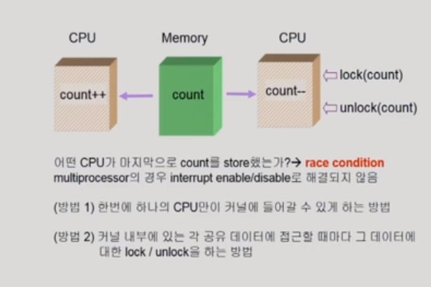

- 이것은 맨처음 이야기 했던 것 ==> 운영체제에 동시에 접근할 수 있음
- 해결방법
  - 한번에 하나의 CPU만이 커널에 들어갈수 있게 만든다
    - (운영체제 전체를 막는다는 뜻)
    - 이렇게 되면 굉장히 비효율적이 상황이 일어나게 된다.
  - 커널 내부에 있는 각 공유데이터에 접근할 때마다 그 데이터에 대한 lock을 걸어버린다
    - 각각을 lock을 건다는 뜻이다.
    - lock을 어떻게 거는지를 배울 것

#### 

## 2. Process Synchronization

- ##### 공유데이터의 동시 접근으로 생기는 문제 ==> inconsistency (한쪽이 반영 안됨!)

- 이것을 해결하기 위해선
  - 실행 순서를 정해주는 메커니즘이 필요하다

- 고급 언어같은 경우 실행을 시킴
- 그럼 여러개의 기계어로 쪼개져서 계산을 하게 된다.
- 이때 위에 race condition과 같은 문제가 발생할 수 있게 된다.
- 즉 위 그림 빨간글씨처럼
  - 프로세스 P1(왼쪽) 수행중에 timer interrupt가 발생함
  - 그럼 context switch가 일어서 P2가 CPU를 잡음
  - 어? 근데 똑같은 공유데이터를 사용하고 싶어함
  - 그리고 다시 P1으로 돌아갔을 때 P2가 반영이 안되는 상태가 일어날 수 있음

####  The Critical-Section Problem

- N개의 프로세스가 공유데이터를 동시에 사용하기 원하는 경우

- 위 그림에서는 노랑색 박스가 Critical Section이라고 할 수 있음

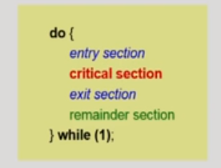

- 해결??
  - P1이 코드에 들어간다?
  - 그럼 CPU에게 뺏기더라도
  - P2가 Critical section코드에 들어가지 못하게 한다
  - 즉 P1이 Critical section코드에 들어가고 나서 CPU에게 뺏기기 전에 lock을 걸어놓는다

### Algorithm 1

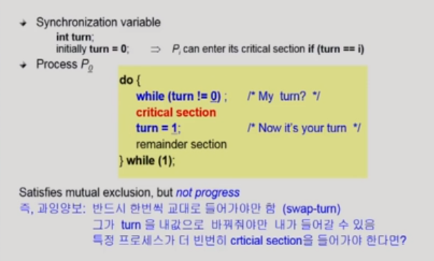

- while ( 나를 가르키는 숫자)
- turn = (상대를 가르치는 숫자)
- critical section에 들어가기 전에 turn을 체크
  - turn은 이번차례는 누구냐?? 를 알려주는 변수이다
  - turn이 0이다 ==> 그럼 위 그림에서는 내 차례
  - 그럼 turn은 누구에 의해서 바뀌냐?
    - 상대방에 의해서 바뀌게 되어 있다
  - 내차례가 아니면 기다림
  - 내차례가 되면 critical  section 수행 후
  - 상대방 turn으로 숫자를 바꿔굼
- 그래서 이게 작동을 함??
  - 동시에 들어가지는 않음
  - 근데 문제가 있음
  - ??
    - 상대방이 내차례를 주기 전까지는 critical section에 들어가지 못한다.
    - 그럼 불공평함
    - 차례를 주면 상대방이 critical에 들어가지 않더라도 내가 못들어갈 수 있음

그래서 조건이 있음

#### 충족 조건

- ##### Mutual Exclusion(상호배제)

  - 동시에 들어가면 안된다는 뜻

- ##### Process

  - 아무도 critical section에 없는데 나는 들어가고 싶음
  - 그럼 들어가게 해준다

- ##### Bounded Waiting

  - 기다리는 시간이 유한해야한다. 
  - starvation을 막아야 한다.

### Algorithm 2

- 모두 각각 깃발을 두게 된다.
- critical section에 들어가고 싶다?
  - 그럼 깃발을 들게 된다. (flag[i]=true)
  - 이제 상대방에 깃발을 들고 있는지 확인을 하게 된다. (while(flag[j]))
    - 상대방에 flag가 있으면 기다린다
  - 상대방의 flag가 내려지면 critical section에 들어가게 된다.
  - 그리고 나올때 flag를 내리게 된다.
- 문제점이 있을까?
  - Mutual Exclusion문제는 해결
  - 하지만 Process 문제 발생
    - 왜?
    - 깃발만 들고 critical section에 안들어 가고 있을 수 있다?
    - 깃발을 들었는데 cpu를 빼앗김
    - 어?? 그럼 아무도 못들어감 ㅋㅋㅋㅋㅋㅋㅋㅋ

### Algorithm 3(Peterson's Algorithm)

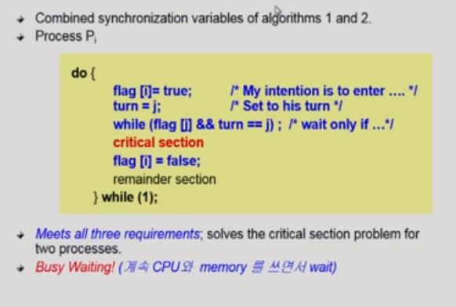

- 깃발을 이용

- 만약 둘이 동시에 깃발을 들었을 때

  - turn을 이용함
  - 즉 깃발을 든 친구들 한해서 turn을 하게 된다.

- ##### 순서(i의 입장)

  - 일단 깃발을 든다
  - turn을 상대방 turn으로 만들어 놓는다
  - 그다음에 상대방이 깃발을 들고 있는지 + 이번 차례가 상대방 차례인지
    - 이때만 기다림
    - 즉 상대방이 깃발을 들고 있지 않거나
    - 차례가 내 차례야?
    - 그럼 들어감
  - 들어감
  - 그리도 나올때 깃발 내림

- ##### 문제점

  - 작동은 제대로함 하지만 비효율적임
  - 뭔가?
  - while문을 계속돌면서 기다리기 때문이다
  - busy waiting(spin lock) ==> CPU와 메모리를 쓰면서 계속 wait

### Synchronization Hardware

- 왜 알고리즘들이 복잡해졌나??
  - 데이터를 읽어가서 연산하고 저장하는 것이 한번에 일어나지 않음
  - 그래서 중간에 뺴앗기기 때문에 이런 문제가 생긴것이다.
  - 도와주는 애들이 없어서
- 그래서 하드웨어적으로 지원이 있으면 이 문제는 쉽게 풀린다. 
  - 하드웨어적으로 test and modify를 atomic(중간에 데이터를 쪼개는 것 없이 반드시 한번에 실행)하게 실행을 하면 문제가 해결된다.

- Test and Set(lock) 이 무엇?
- lock은 0 or 1
  - 0 => false => 아무도 락을 안걸었다
  - 1 => True => 누군가 락을 걸고 그 안에 들어갔다
- 즉! 느낌이 어느 방에 들어가서 문잠그고 모든 일처리를 하고 문을 열고 나온다
- 그럼 atomic하게 해결할 수 있다
- 즉 하드웨어는 혼자 일을 해결하게끔 방을 하나 만들어준것이다.
  - 왜냐하면 어차피  쪼개진 연산들을 한 덩어리로 처리를 해줘야하기 때문이다

### Semaphores

- 추상 자료형

- Semaphore S
  -  ==> S는 방의 갯수느낌이다
  - 정수형
  - P연산 = 자원(방)을 획득하는 과정
  - V연산 = 자원(방)을 반납하는 과정
- 코드
  - p연산
    - 세마포가 0보다 클 때 들어갈수 있고 작으면 기다린다
    - 들어가면 s =-1 해준다

  - v연산
    - 나올때 s+= 1 해준다

- busy waiting문제는 효율적이지 못함
- 어떻게 해결함???
  - s가 0보다 작거나 같으면 굳이 while문이 돌 필요가 없음
  - cpu를 반납하고 block상태에 들어가면 됨

##### block and wakeup방법 ( 더 좋음 )

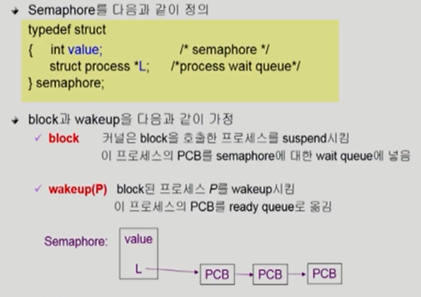

- 프로세스들을 잠재우고(block)을 하고 L(list)에 줄세운다.
- 그리고 본인차례가 되면 wake up을 시키고 작동 시킨다.

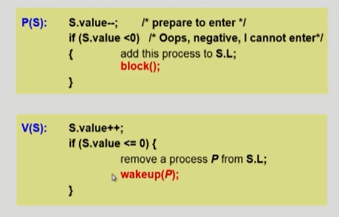

- 코드
  - p연산
    - 세마포 값을 1뺀다
    - 세마포 값이 음수라면 block을 시켜라
  - v연산
    - 자원을 반납함
      - 자원을 반납했는데 0이하 = 누군가가 세모코를 기다리면서 잠들어있다
      - 양수 = 세마코가 남아돈다
    - 그래서  v가 0보다 크더나 같으면 하나 깨워줘서 ready상태로 바꿔준다

#### 뭐가 더 좋음??

- 일반적으로는 block and wakeup가 좋음

- 프로세스 상태를 바꾸는 것 = overhead 

- ##### Critica section의 길이가 긴 경우 (경쟁이 치열할 때)

  - block and wakeuprk가 좋음

- ##### Critica section의 길이가 매우 짧은 경우 (경쟁이 치열하지 않을 때)

  - 오히려 busy wait를 하는 것이 좋을 수 있다

mutex는 세마포가 1로 가진다

### Deadlock and Starvation

##### Deadlock

- 둘 이상의 프로세스가 서로 상대방에 의해 충족될 수 있는 event를 무한히 기다리는 현상

- s, q가 동시에 처리해야한다고 하자

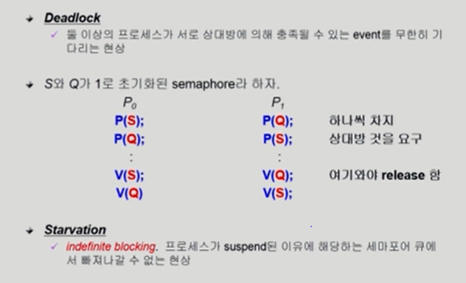

- p0은 s를 획득, p1은 Q를 획득하였다
- 그럼 각각의 프로세스는 두개의 자원을 가지지 못하고 한개의 자원을 가지고 있어서 동시에 처리할 수 없게 된다. 

- 해결
  - 자원을 얻는 순서를 만들어 준다
  - ex) S를 먼저 얻어야만 Q를 얻을 수 있게 해준다.

### Bounded  buffer problem

(producer, consumer) = 두개의 프로세스

생산자(Producer) : 데이터를 만들어서 버퍼에 집어 넣어준다

소비자(consumer) : 데이터를 꺼내가는 역할을 한다.

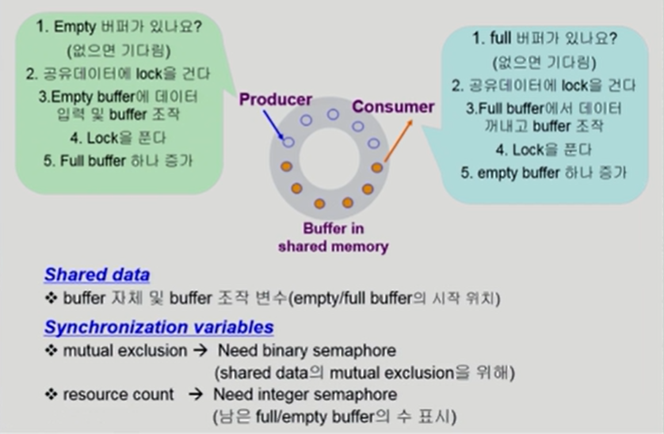

동그라미: 공유 버퍼

- 접근할 때 lock을 걸어서 producer가 데이터를 만든 다음에 lock을 풀어야 한다.
  - 이유
    - 왜냐하면 만들어서 놓으려고 하는데 cpu빼앗김
    - 그리고 다른 프로세서가 거기에다가 데이터 만들어서 놓음
    - 그럼 원래 프로세서는 어다가함??
    - 그래서 lock을 걸고 만들어서 놓고 lock을 품
- consumer도 똑같음

#### 자원

- 생산자 프로세서 입장에서 비어있는 버퍼가 있어야 만들어 집어 넣음
- 생산자가 동시에 도착해서 버퍼에 넣음
- 그리고 버퍼를 꽉채움
- 그리고 생산자 와서 만들어 넣으려고함?
  - 놓을때가 없음

즉!! 생산자 입장

- 지어있는 공간이 생산자의 자원이 되는 것

소비자 입장

- 데이터가 차있는것이 자원이다

##### 자원의 갯수를 세는 것 = Counting semaphore를 이용!!

##### synchronization variables

- mutual exclusion
  - 락을 걸기위한 변수
- resource count
  - 남은 full과 emtpy 버퍼를 세기위한 변수

- Producer
  - 빈거를 봄
  - 락을 검
  - 데이터 처리
  - 락 품
  - full로 만듦
- Consumer
  - 차있는 것을 확인
  - 락을 검
  - 데이터 처리를 함
  - 락을 풀고
  - 비었다고 함

### Readers-Writerproblem

- 읽고 쓰는 것을 DB에 많이 사용함 

- 그래서 여기서 DB를 공유데이터라고 할 것임

- 한 프로세스가 DB에 write중일 때 다른 process가 접근하면 안됨

- ##### read는 DB에 동시에 여럿이 해도 됨

- 해결

- 공유 데이터
  - DB자체
  - readcount
    - 만약 0이라면 다른 readcounter가 접근하지 않다는 것
    - 현재 DB에 접근 중인 Reader의 수이다

- 변수
  - mutex : 
    - readcount를 접근하는 코드의 락을 거는 것
    - 
  - db : 
    - reader와 write가 공유 DB자체를 올바르게 접근하게 하는 역할
    - 즉 DB자체에 락을 거는 변수
    - write가 락을 걸었으면 아무도 못들어옴
    - 하지만 reader가 락을 걸었으면 readcount를 보고 이미 다른 reader가 읽고 있으면 같이 읽을 수 있게 한다

- 코드

- #### writer

  - DB에 락을 걸고
  - 처리하고
  - DB에 락을 푼다

- #### reader

  - P(mutex)readcount를 건들이기 전에 readcount에 대해서 락을 검
  - 그리고 readcount +=1 을 해줌
  - if readcount ==1 ==> 0이었던 것을 1로 바꿨다는 뜻 ==> 내가 DB를 읽으러 최초로 들어왔다는 뜻
  - 그럼 lock을 걸어준다
  - 왜? wirte가 들어올 수도 있기 때문
    - 그럼 1이 아니면 왜 락을 안걸어줌??
    - 이미 그 전에 다른애들이 락을 걸었을테니깐 안걸어줌
    - 그냥 접근만 하면 됨
  - 나왔더니 readcount = 0이다 (뜻: read를 아무도 사용하지 않음)
  - 그럼 db락을 풀어준다
    - 왜??
    - write가 써야하니깐

##### 문제점

- Starvation이 발생할 수 있다
- reader들이 계속 들어와 = 약간 꼬리 물기 같이
- 그럼 write언제 써?? 그래서 문제가 생김

##### 해결방법

- 신호등 같은 것을 만들어 준다.
- 일정시간까지 도착한 reader들만 처리를 하고 늦게 온 애들은 못들어오게 끔 한다. 

 

### Dining-Philosophers Problem

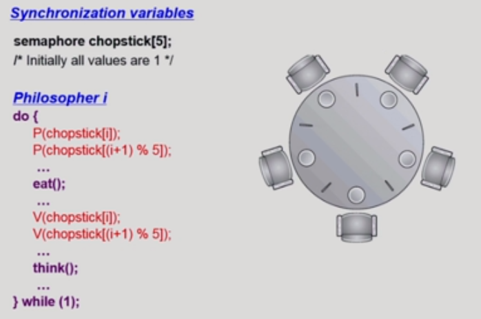

- 철학자가 하는 것
  - 생각하는 것
  - 밥먹는 것

- 배고파지는 주기가 다 다르다
- 젓가락이 공유데이터
- 그니깐 옆에 있는 애가 밥을 먹으면 내가 밥을 못먹음
- 철학자가 굶어죽으면 안됨
- 문제점
  - 모든 철학자가 동시에 왼쪽 젓가락을 잡음
  - 무한루프
  - 즉 데드락이 걸리게 된다.
- 해결
  - 4명의 철학자만 테이블에 앉을 수 있도록 한다. 
  - 젓가락 두개를 모두 잡을 수 있을때만 젓가락을 잡을 수 있게 한다.
  - 짝수 => 왼쪽 먼저
  - 홀수 => 오른쪽 먼저 잡을 수 있게 한다
  - 즉 자원을 얻는 순서를 만들어서 해결

- 젓가락 두개를 모두 잡을 수 있을 떄 ==> 이것의 코드

- 젓가락 두짝이 다 availble한지 확인하는 것
  - semaphore self[5] = 0
  - mutex = 1 ==> 5명의 철학자에 대해서 상태를 만드는 변수를 만들어준다
- 전체 흐름
  - 젓가락 잡고
  - 먹고
  - 놓고
  - 생각
- 젓가락 잡을 때
  - 상태 hungry로 바꿈
  - 젓가락을 잡을 수 있는 상태인지 테스트함
- 테스트
  - 왼쪽과 오른쪽이 모두 available한지 확인해야함
  - if
    - 왼쪽 철학자도 밥을 먹고 있지 않고
    - 오른쪽도 안먹고 있고
    - 그리고 내가 배고플 때
  - 그러면 eating으로 바꿔줌
  - 그럼 V연산을 해서 self값을 1로 바꿔준다
  - 그럼 P연산에서 연산을 할 수 있음
    - 그럼 만약에 못얻었다면??
    - 그럼 self값이 0이기 때문에 P연산을 할 수 없게 된다.
    - 그럼 언제 밥을 먹을 수 있음?
    - 양쪽에 젓가락을 내려놓을때까지 확인을 계속 해준다
    - 내려놓으면 그때 잡게 됨

## Monitor

- Semaphore의 문제점
  - 코딩하기 힘들다
  - 정확성 입증이 힘들다
  - 한번의 실수가 모든 시스템에 치명적인 영향을 끼친다

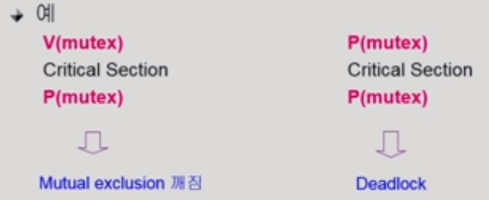

### 모니터란

- 공유데이터를 중심으로 해서 함수들이 정의 되어 있다
  - 공유데이터를 접근 할때는 모니터 안에있는 procedure를 접근할 수 있게 해준다
  - 그럼 공유데이터에 대한 동시접근을 모니터가 책임져주게 된다.
  - 엑티브하게 실행하는 프로세스는 오직 1개로 제한한다.

- 모니터의 구성
  - 공유데이터에 대한  접근을 책임져 준다
  - 오직 모니터 안에있는 공유데이터만 접근 할 수 있게끔 한다.
  - 세마포같은 경우는 책임져주지 않았다

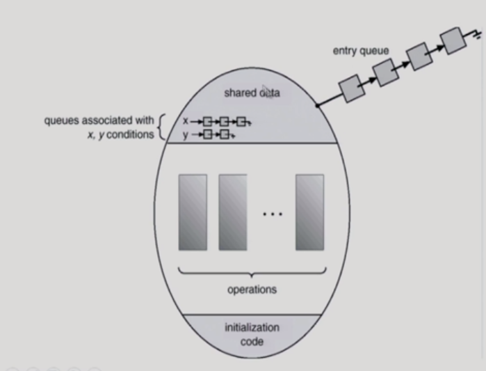

- 모니터는 락을 걸 필요가 없다
- 동기화 문제를 모두 모니터가 담당해준다.

- ##### condition variable

  - 자원의 여분이 있을 때는 그냥 수행
  - 자원의 여분이 없을 때는 block해야한다.(wait)
    - 어느 큐에 줄서서 block을 해야함
    - condition variable이 큐의 역할을 해준다.
  - x.signal( ) => 깨우라는 뜻

### 세마포와 비교

#### Bounded-Budder Problem

- 모니터 안에서 시작을 한다
  - 동시 프로세서가 생길 수 없음
- 공유 버퍼가 모니터 안에서 정의
- produce와 consume이라는 코드가 있다
- 세마포
  - 세마포는 mutex라는 락을 걸고 코드 수행 후 락을 푼다.
- 모니터
  - 락을 걸고 푸는 것이 없다
  - 자원의 개수의 역할을 하지 않는다
- produce
  - 빈 버퍼가 있으면 데이터를 집어 넣어줌
  - 없으면 빈버퍼가 있을때 까지 기다린다
  - 언제 깨어남?? 소비자가 나타나서 빈 버퍼를 만들어줄때 깨어난다

#### Dining Philosophers Example

- 젓가락을 잡기위한 코드가 모두 모니터 안에 있는 코드로 실행된다.

