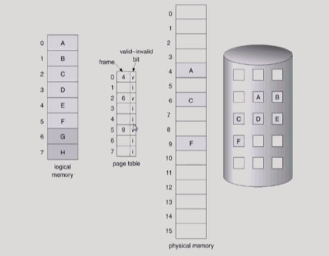
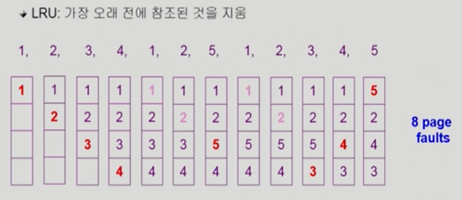
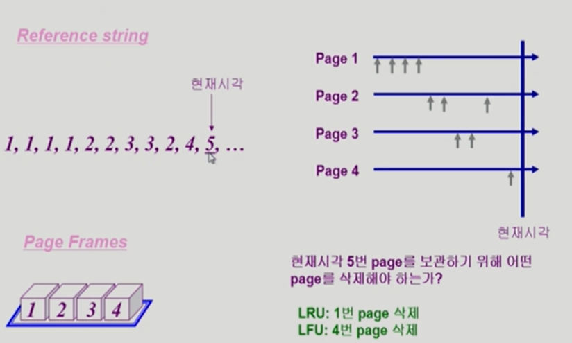
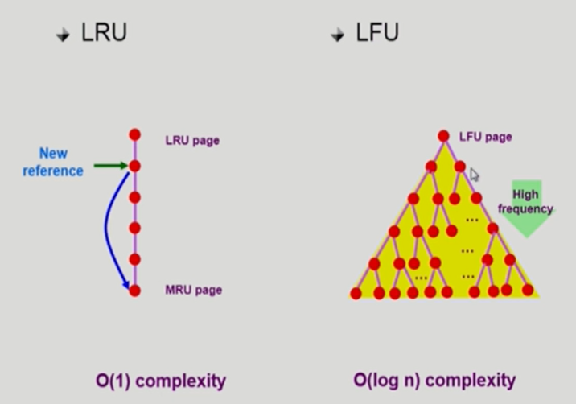
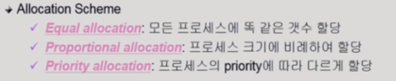
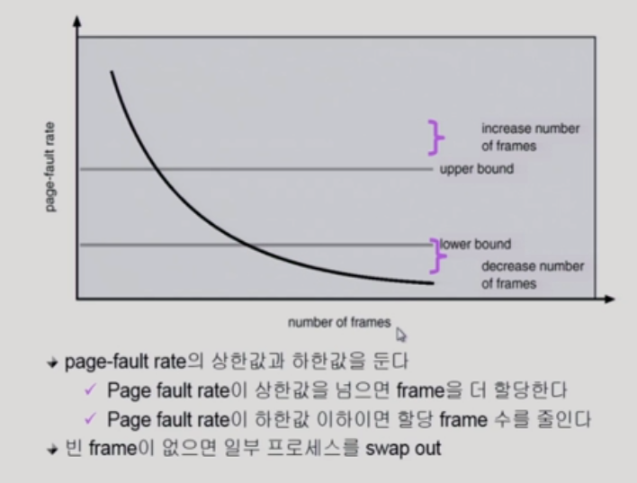

# 08_Virtual_Memory

paging 기법을 사용한다고 가정하고 진행된다(대부분 paging기법을 사용)

## Demand Paging

- 요청이 있으면 그 페이지를 메모리에 올리겠다!
- 장점
  - I/O양의 감소(왜냐하면 필요한것만 메모리에 올리기 때문에)
  - 메모리 사용량 감소
  - 빠른 응답시간
  - 더 많은 사용자 수용(동시에 메모리에 올릴 수 있기 때문에)
- 당장 필요한 부분은 

- ##### valid/ invalid

  - valid:
    -  물리적인 메모리에 올라가 있는 경우
  - invalid의 의미
    - 물리적인 메모리에 없는 경우에
      (D같이 다른 것들은 사용함! 근데 지금 사용한하는 것임)
    - 사용되지 않는 주소영역인 경우
      ( 할당된 주소영역에서 사용하지 않는 주소 영역이 있다 )
      (G,H는 사용하지 않는 영역)
    - 만약에 주소 변환을 하려고 봤는데 invalid임? = page fault
    - 그럼 cpu는 자동적으로 넘어가게 된다.
    - 그리고 백(원형)에서 운영체제가 데리고 온다

### page fault

- page falut trap
  - invalid page에 접근 하면 MMU(주소변환을 해주는 하드웨어)가 trap을 발생시킴
- 그럼 cpu가 운영체제한테 넘어감
- kernel로 들어가서 page flault handler가 실행된다.
  - 처리순서
  - 주소와 접근 권한이 맞는지 아닌지를 확인
  - 빈페이지를 획득 ( 만약 없으면 하나 뻇어온다 )
  - disk에서 memory로 읽어온다 (느리다)
    - 따라서 이 프로세스를 block으로 만들어 줌
    - disk read가 끝나면 page tables entry기록 ( valid로 만들어줌 )
    - 그리고 block풀고 read queue에 넣음
  - 이 프로세스가 cpu잡고 run

- 성능
  - page fault가 얼마나 나는지에 따라서 성능이 좌우 된다.
  - 실제로 0.9몇이 나오게 된다.
  - 대부분에 경우 page fault가 나지 않는다
  - page fault가 한번 나면 시간이 굉장히 오래걸림

### Free fram이 없는 경우( 다 차있는 경우 )

#### Page replacement

- 어떤것을 쫒아낼지를 결정하는 것
- 만약 디스크에서 메모리로 올라온 이후 ==> 내용이 변경 되었다면? (wirte)
  - 쫒아낼때 변경된 내용을 backing store에 써줘야한다.
  - 만약 변경된게 없으면 그냥 없애면 된다. 

#### Replacement Algorithm

##### optimal algirithm

- page fault를 가장 적게 하는 알고리즘이다
  - 미래에 참조되는 것을 미리 안다고 가정한다.
  - 하지만 실제에서는 미래를 모름 ==> 못씀
  - 그래서 offline algorithm이다
- 가장 먼 미래에 참조되는 page를 쫒아낸다

- 순서
  - 위에 검은색 숫자 순서대로 들어 올 것을 알고 있음
  - 1234가 참
  - 5번에서 누구 쫒아내야함
  - 4번이 제일 늦게 쓰이기 때문에 4번 쫒아냄

- 의의:
  - 다른 알고리즘의 성능에 대한 비교대상이 될 수 있음

##### FIFO Algorithm

- 먼저 들어온 것을 먼저 내쫒음

- 특징
  - 메모리 크기를 늘림 ==> 성능이 안좋아짐
  - page faults의 수가 늘어난다.
  - 그것을 FIFO Anomaly라고 불린다.

##### LRU Algorithm

- Least Recently Used

- 가장 오래전에 참조된 것을 지움

- 순서
  - 1234순서대로 참
  - 가장 오래전에 사용된게 3번임 쫒아냄 ==> 그리고 5번 들어옴

##### LFU(Least Frequently used) Algorithm

- 참조 횟수가 가장 적은 페이지를 지움
- 참조횟수가 적은거 중에서 오랜전인 것을 고른다
- 특징
  - 장단점

##### LRU 와 LFU

- 오른쪽 : 시간
- 참조 순서
- 장단점
  - LRU 
    - 1번을 쫒아냄
    - 가장 많이 사용되었기때문에 또 사용될 수도 있잖아?
    - 그래서 문제임
  - LFU
    - 4번을 쫒아냄
    - 4번 이제 막 시작함 ==> 또 작동될 수도 있는거잖아?
    - 그래서 문제

##### LRU 와 LFU 알고리즘 구현

- LRU
  - 줄세우기를 함
  - 들어올때마다 맨 뒤로 보냄
  - 제일 위에 있는 것을 쫒아냄
  - O( 1 )
- LFU 
  - 줄세우기하면 비효율적 = sort해야하기 때문
  - 그래서 힙으로 구현
  - O( logn )

## 캐슁

#### 캐슁

- 빠른 공간 = 메모리가 한정되어 있음
- 느린 공간 = 메모리가 조금 더 많음
- 따라서 빠른 공간에 누구를 쫒아내고 부를지 하는 방법
  - paging sys외에도 cache memory, buffer caching, web caching등 다양한 분야에 사용

- 시간 제약
  - O(1) - O(logN) 정도까지만 허용
- Paging system인 경우
  - 앞에 배웠던 알고리즘 사용 불가....?? (LRU, LFU)
  - 왜? 사용불가?
    - 주소 변환과정 => 운영체제가 관여하지 않음
    - 그 페이지를 언제 사용했는지 OS가 알수가 없음
    - 그럼 즉......LRU, LFU를 사용할 수 없음
    - 즉 운영체제가 줄세우기를 할 수 없음
    - page fault가 생겼을때만 운영체제가 메모리에 접근함 => 정보를 반만 알고 있음 => 불가능 ==> 그럼 Paging system은 뭘 쓰냐?? 밑에 참고

#### Clock Algorithm

- 실제로 Paging system이 사용하는 방법

- 0 ~ 15번이 있음
- 각 페이지 마다의 번호 = reference bit(access bit) => 읽기
  - 1 = 최근에 사용된 페이지
  - 0 = 최근에 사용 안된 페이지
  - 줄세우기를 할 수 없기 때문에
- modified bit
  - 쓰기를 해서 고칠때 바꿔주는 번호
  - 즉 쓰기가 이루어졌는땐 modified와 reference bit 둘다 1로 만들어준다.
  - 수정이 됐으며 쫒아낼때 고치고 쫒아내야하기 때문에 체크를 해주는 것이다.
- 구현
  -  reference bit을 1로 만드는 것은 하드웨어가 한다
  - 주소변환을 할때 1로 만들어 놓는다
  - 쫒아낼때
    - 시곗바늘이 돈다
    - 1을 찍었으면 0으로 바꾸고 다시 돈다
    - 0을 찍었으면 쫒아냄
  - 의미
    - 한바퀴 돌았는데 아직도 1이다??
    - 그럼 한바퀴 도는 동안에 적어도 1번은 사용이 됐다라는 뜻
    - 즉 0인 애들은 한바퀴 돌때 동안 한번도 사용이 안됐다라는 뜻이다

### Page Frame의 Allocation

- 

- ##### 필요성

  - loop를 구성하는 page들은 한꺼번에 allocate되는 것이 유리함
    - 예를들어서 loop함수 5개가 있는데 메모리가 3개 밖에 없음
    - 그럼 loop마다 page fault가 나게 됨
    - 그래서 필요함

### Global vs Local Raplacement

- Global Raplacement
  - 할당을 하지 않음
  - LRU 같은 알고리즘들을 쓴다.
  - 장점
    - 메모리를 많이 쓰는 프로그램에게 많이 쓰이게 된다
    - 즉 필요한 쪽에 많이 사용
  - 단점
    - 독식을 할 우려가 있음
- Local Raplacement
  - 프로세스마다 할당을 해놓는다
  - 쫒아낼떄 자기한테 할당된 영역중에서 빼앗는다
  - 따라서 LRU, LFU같은 알고리즘을 process별로 운영이 가능하다
  - 약간 미국 주끼리의 법이 있는 느낌??

## Thrashing Diagram

- 좌표
  - x = 메모리에 올라가있는 프로그램 갯수
  - y = cpu의 사용량
- cpu를 많이 사용할수록 좋은것
  - cpu가 쓰다가 IO하러 가버린다든지 등등해서 메모리를 적게 쓸때 cpu사용률이 적다
- 그런데 늘어나다가 뚝 떨어진다 왜?
  - Trashing이 일어났다고 한다
  - 너무 많은 프로그램을 동시에 올려놓음
  - 각각의 프로그램이 너무 조금씩 가지고 있기 때문에 cpu를 그 프로그램에 줘봐야 page fault가 나고 계속해서 page fault가 나는 상황
  - 따라서 어느정도 메모리를 확보하고 있어야한다.

- 정리
  - 프로세스의 원활한 수행에 필요한 최소한의 page frame수를 할당 방지 못한 경우 발생한다.

### Trashing을 방지하는 알고리즘

#### -1) working-set Model

- Locality of reference
  - 특정시간동안 일정 장소만 집중적으로 참조하는 것(몰려서 사용되는)
  - 집중적으로 참조되는 해당 page들의 집합을 locality set이라고 한다.
- working-set Model
  - Locality set이랑 똑같은 말
  - 어떤 프로그램이 메모리가 부족할때 
  - 즉 메모리가 더 필요해서 요구함 ==> 근데 메모리 다참
  - 그럼 그냥 메모리 다 반납하고 쫒아냄 ==> 다른 애들 메모리 주기 위해서
  - 이제 메모리가 보장될때 전체가 메모리를 한번에 받게 된다.

- working set의 결정
  - 과거의 delta만큼 시간만큼 사용되었던 애들을 저장시킴
  - 그리고 그애들을 working set이라고 간주하게 된다.
  - 시간이 지나면 working-set이 계속 변하게 된다

- 빈공간이 3개 밖에 없고 나는 5개 필요함
  - 그럼 쫒겨남

#### - 2) PFF(Page-Fault Frequency)

- 프로그램한테 메모리를 많이 주면 page fault가 적게남
  - 하지만 너무 많이 주면 page fault가 줄어드는 양이 작음
  - 그래서 뺴앗아서 적당한 양을 유지하게 만든다
- 프로그램한테 메모리를 적게 주면 page fault가 많이 남

- 적당한 영역(가로선)에 들어오면 메모리를 유지

### Page Size의 결정

- 요즘

  - ##### page수를 증가시키지 않고 Lage page size를 사용하는 추세

- page 사이즈가 작아지면?

  - 잘게 잘라야한다
  - 즉 더 많은 엔트리가 필요하게 된다.
  - 페이지 폴트가 조금 많이 일어날 수 있음
  - 필요한 정보만 메모리에 올라와 메모리 이용은 효율적``
    - 그러나 localiry의 활용 측면에서는 좋지 않음
